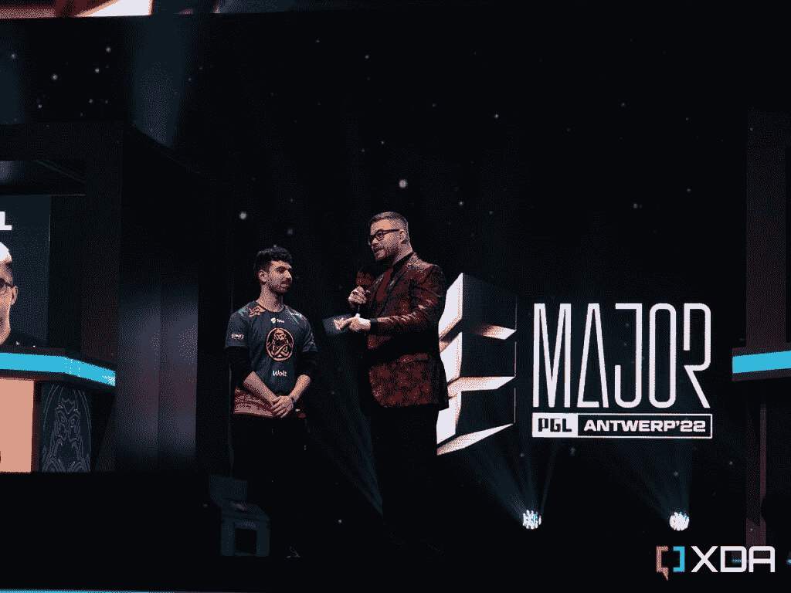
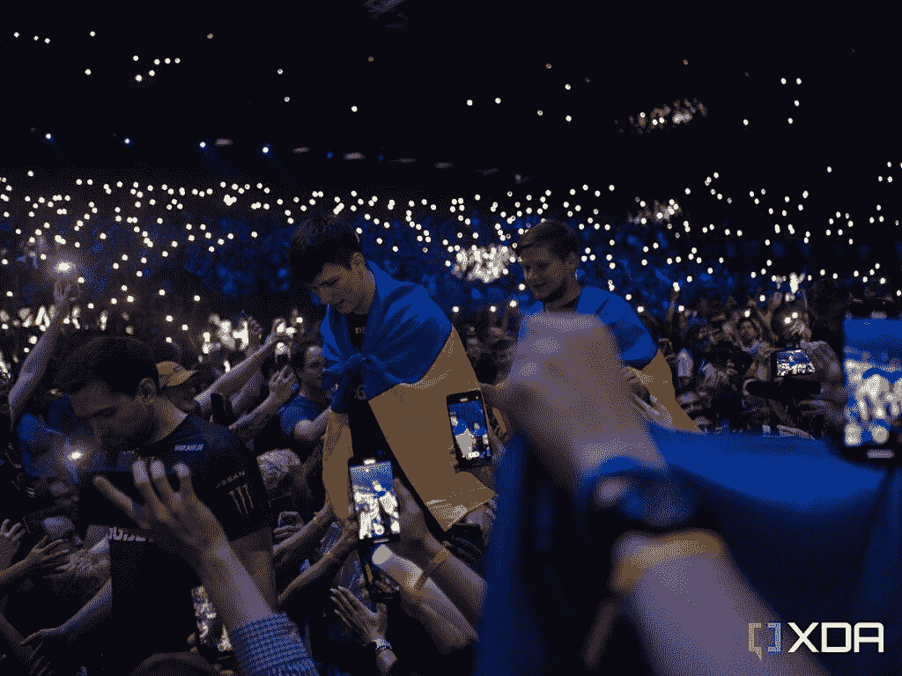
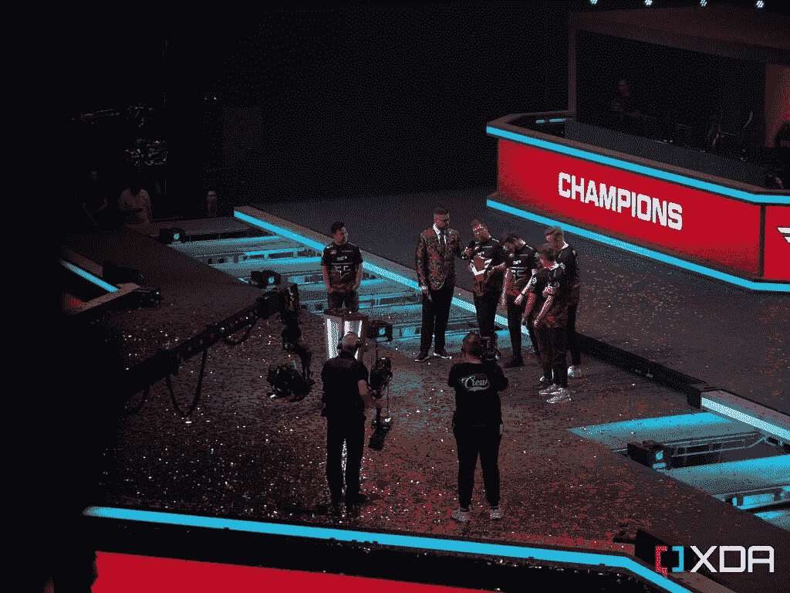

# 我参加了反恐精英 PGL 少校，这太不可思议了

> 原文：<https://www.xda-developers.com/counter-strike-pgl-major-antwerp-recap/>

我们都知道视频游戏，我们大多数人可能都有一个我们已经知道很多年的最喜欢的游戏。无论是《T2》口袋妖怪、*使命召唤*的重复版本，还是仅适用于手机的游戏，在定义“游戏玩家”时都不应该有任何把关。对我来说，那个游戏就是*反恐精英*，在*反恐精英:全球攻势*问世前不久我就开始玩了。周末，我有幸参加了在安特卫普举行的*反恐精英* PGL 少校，这是一个令人难以置信的事件。

举例来说，*反恐精英*是地球上最古老的电子竞技游戏之一。它的最初测试版于 1999 年 6 月发布，是对最初的*半衰期、*的修改，后来它成为了一个独立的游戏。从那时起，Valve 已经发布了该系列的两个主要产品；*反恐精英:来源*2004 年，*反恐精英:全球攻势*2012 年。全球攻势的目标是合并前两个游戏的社区，因为一些玩家认为最初的*反恐精英*比 2004 年发布的版本更好。

随着*全球攻势*的发布，Valve 宣布了将于 2013 年 11 月举行的第一场“主要”锦标赛。主要锦标赛是由 Valve 赞助的赛事，与游戏内直接集成，有官方流可以在游戏内观看，有观看地图的物品掉落，有贴纸胶囊可以支持你最喜欢的球队，等等。这是其他锦标赛无法企及的整合程度，它们被认为是一年中最重要的锦标赛，拥有一些最大的奖金池。安特卫普的 PGL 职业大赛是一系列长期大型锦标赛中的最新一场，能够参加是一次不可思议的经历。

## PGL 主要赛事结构

PGL 大赛于 5 月 9 日开始，分为三个阶段。第一个是“新挑战者”阶段，第二个是“新传奇”阶段，第三个也是最后一个是“新冠军”阶段。前两个阶段发生在工作室的封闭环境中，而“新冠军”阶段发生在竞技场中。

“新冠军”赛段在安特卫普的体育场举行，安特卫普是比利时布鲁塞尔北部的一个城市。Sportpaleis 是一个巨大的场地，能够容纳 15，000 至 18，000 人，周末的门票已经完全售罄。活动现场周围有两圈座位，上层是阳台，下层是座位区。此外，还有地板座位，这些座位一直延伸到舞台的屏障上，环绕着中央讲台，这是面试官和决赛选手的入口。

我出席的第一天是周五，我飞到布鲁塞尔机场，然后坐火车直奔安特卫普。从那里，很容易就能到达比赛现场，我也能看到四分之一决赛的第二天。虽然场地不像周末那么满，但人群已经很大声，很兴奋，玩得很开心。

## 安特卫普的经历

安特卫普，一个我从未去过的城市，感觉像一个熟悉的社区，因为当我四处走动时，我看到了许多熟悉的面孔。我在最随意的地方碰到了朋友；从著名的购物街梅尔到远离竞技场的码头区。这感觉非常像一个反恐精英城市，而不是一个欧洲城市。无论你走到哪里，都有人穿着一些顶级球队的球衣，包括 ENCE、纳图斯·文策尔和法泽队。

至于竞技场，那是我经历过的最超现实的经历之一。粉丝们不停地喊着；即使比赛没有直播，也要欢呼呐喊。人们只是很高兴在那里，我遇到了几个我在网上玩过的人，但以前从未在现实生活中见过面。

金黄蜂队，一个支持团队活力的法国团体，出席了会议，尽管团队活力在活动转移到竞技场之前就被淘汰了。他们是一些声音最大、最激动的粉丝，其中许多人用歌声和鼓声激励着人群。

车迷也可以参加竞技场周围的许多活动，包括由红牛赞助的二对二比赛。PGL 还在比赛期间创造了不同的内容，包括采访球迷，用于决赛前的宣传。这是一种精心制作的故事构建技术，让决赛前的几个小时的等待成为一种愉快的经历。

在*反恐精英*大赛决赛中，赛事组织者在决赛前安排一场表演赛也是惯例。没那么严重，随机组队的球员，有时甚至是解说员被扔在舞台上直播一场 5v5 的比赛。这些比赛往往很短，但对运动员和观众来说都很有趣。

观众对它非常感兴趣，因为每当在表演赛中购买一把“正常”的枪时，观众都会开玩笑地向球员发出嘘声。有很多观众互动，弗兰基·沃德和詹姆斯·班克斯是《T4》反恐精英中最有血统的主持人和采访者，他们担任了两支表演队的教练。

 <picture></picture> 

Jamse Banks interviews Lotan "Spinx" Giladi from ENCE

弗兰基和詹姆斯都在煽动观众，玩得很开心，这是在那天晚些时候决赛开始前让大家开怀大笑的好方法。

## PGL 安特卫普大赛决赛

 <picture></picture> 

Valerii "b1t" Vakhovskyi and Oleksandr "s1mple" Kostyliev, two Ukrainian players for Natus Vincere, walk to the stage

决赛本身就完全混乱了。Natus Vincere (Navi) 分别对阵世界排名第一和第二的[法泽战队](https://fazeclan.com/teams/csgo/)。两队穿过人群走下中央舞台，与球迷击掌庆祝。Natus Vincere 的两名乌克兰球员 Valerii " b1t " Vakhovskyi 和 Oleksandr "s1mple" Kostyliev 被乌克兰国旗包裹着。s1mple 被广泛认为是玩过*反恐精英*任何迭代的最佳玩家，b1t 是目前顶级水平的最佳人才之一。去年，18 岁的他被评为世界上第九好的球员，赢得了他的第一次重大比赛，他的球队没有丢失一张地图。

在竞技场上，对双方的支持完全混杂在一起，在比赛的大部分时间里，双方都在来回呼喊。此外，一大群球迷也从巴西赶来，尽管巴西顶级球队也在锦标赛的前几阶段被淘汰。我问他们中的一个人他们在为谁欢呼，他们说他们只是很高兴能在那里观看世界上最好的球员。这就是每个人在那里的真正目的。

虽然这个系列赛是在两个地图中结束的三场比赛中最好的一场，但这是一场令人难以置信的紧张的比赛，是过去几年中最好的总决赛之一。Faze Clan 是第一支赢得主要锦标赛的完全国际化的球队，球员来自丹麦、爱沙尼亚、加拿大、挪威和拉脱维亚。

 <picture></picture> 

Faze Clan being interviewed after winning the final

决赛结束后，Faze 的球员接受了詹姆斯·班克斯的采访，当球迷们继续欢呼、歌唱和鼓掌时，很难理解他们在说什么。这是一次完全激动人心的经历，球员们和观众一起庆祝，感谢他们的支持。

像这样的赛事展示了电子竞技的意义，这也是我如此热爱《反恐精英》的原因。这部电影的粉丝和制作人员一直都很棒，在爱尔兰，我花了很多时间在这个社区上。我交过的一些最好的朋友都是通过这个游戏认识的，在安特卫普，成千上万的球迷因为这个游戏走到了一起。

## 反恐精英和电子竞技的未来

《反恐精英》和整个电子竞技的未来看起来非常光明。在活动中，锦标赛平台 *FACEIT* 宣布将与奢侈品牌古驰合作，推出一项新计划，旨在发掘、培养和支持崭露头角的球员。随着像古驰这样的大品牌进入这个领域，它使整个场景合法化，并在全球层面上建立起信心。电子竞技有大量的资金和人才，有能力吸引大量的观众和观众，没有理由为什么它不能增长更多。

至于我，我在活动中度过了一段美好的时光。这是我参加过的最好的人群之一，我和新老朋友们度过了一个美妙的周末。由于锦标赛也安排在晚上举行，球迷们有足够的时间在安特卫普四处走走，看看附近的景点。周一，在我飞回家之前，我花了几个小时就去了布鲁塞尔-卢森堡，参观了欧盟议会。许多赛事提供商实际上与他们主办的城市合作，安特卫普市长在最后一天介绍了观众。这不仅是一个球迷可以参加的活动，也是一个城市旅游业的福音。

总而言之，我期待着在未来参加更多的比赛，我迫不及待地想看看电子竞技的未来是什么样的。