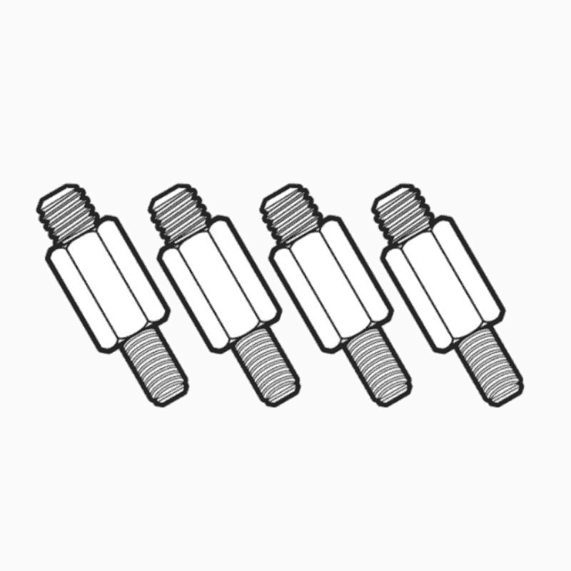
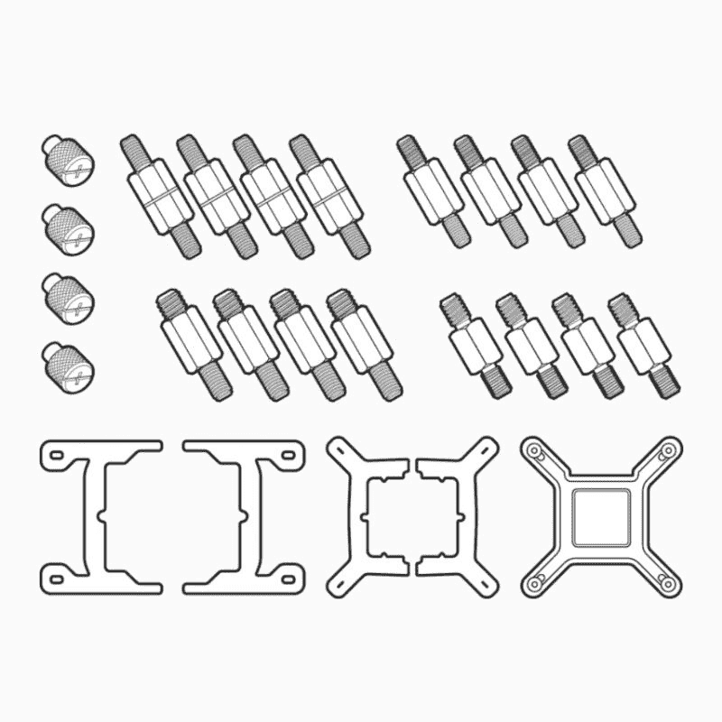
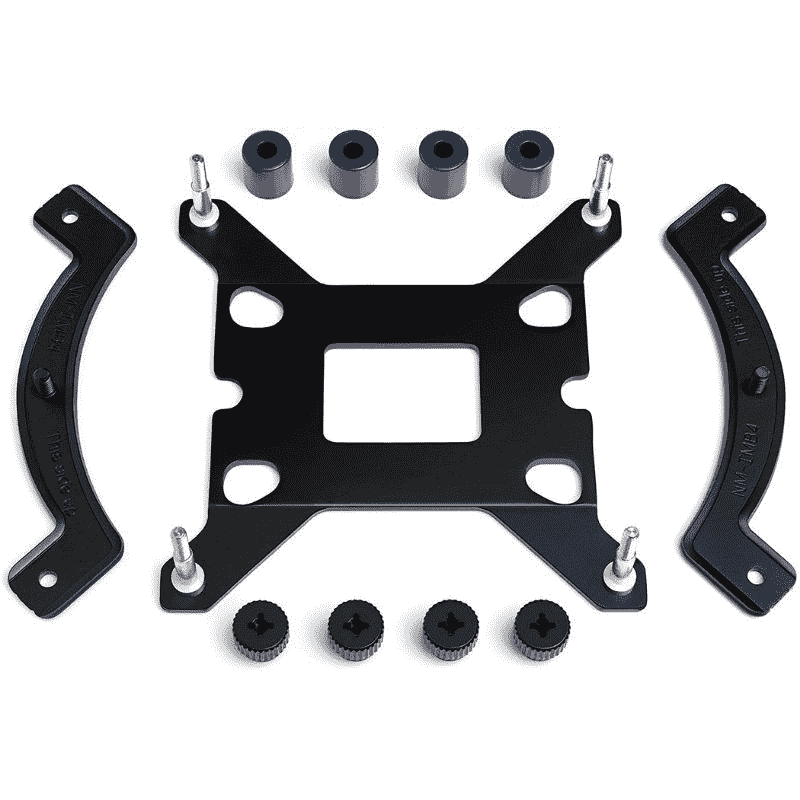
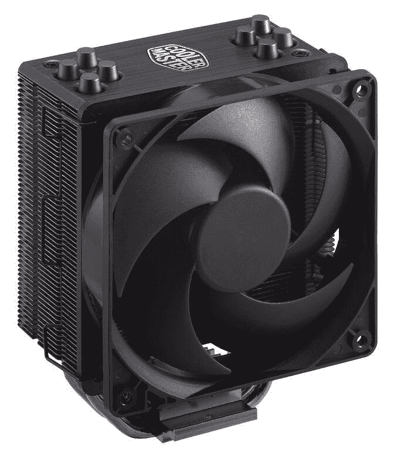
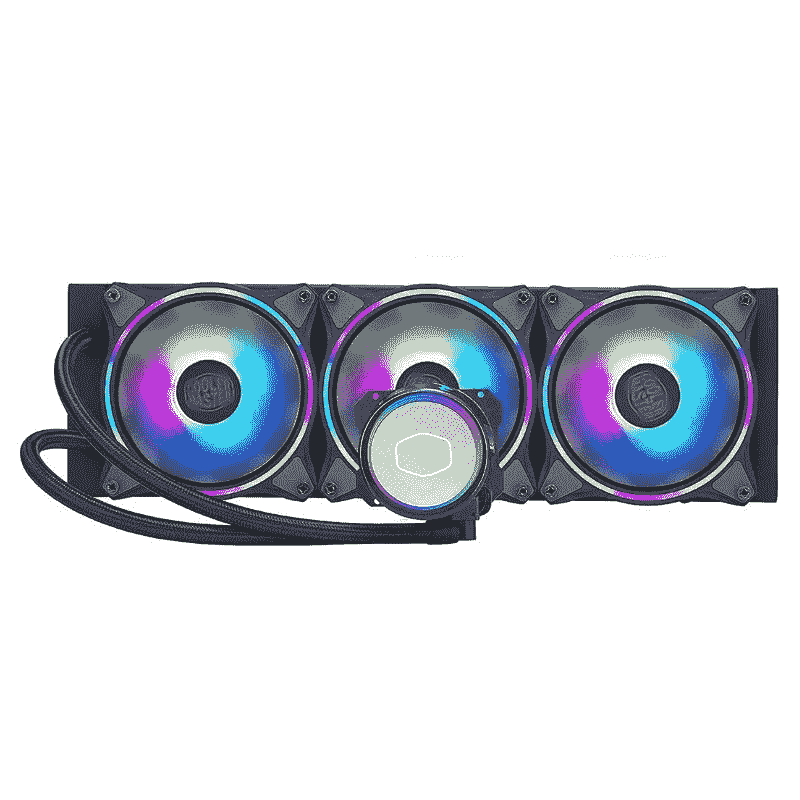

# 英特尔插座 LGA 1700 的 CPU 冷却器:您需要知道的一切

> 原文：<https://www.xda-developers.com/cpu-coolers-socket-lga-1700/>

LGA 1700 插座是专门为英特尔的第 12 代和第 13 代 CPU 制造的，它是你在英特尔 600 和 700 系列主板上看到的插座。当它在 2021 年问世时，它使英特尔稳稳地领先于 AMD，即使锐龙 7000 和 [AM5 插座](https://www.xda-developers.com/best-am5-motherboards/)后来也不相上下，LGA 1700 主板仍然足够领先。如果你想升级到 LGA 1700，你可能不想买一个新的冷却器，但你有一个兼容吗？这里有你需要知道的关于 LGA 1700 冷却器的一切。

## 英特尔 LGA 1700 插座规格

英特尔的 LGA 1700 插座，代号为 15R1，比以前的 LGA 1200 高，后者为旧的火箭湖处理器提供动力。在我们深入了解更多细节之前，先快速浏览一下 LGA 1700 插座的规格:

| 

规格

 | 

英特尔插座 LGA 1700

 |
| --- | --- |
| IHS 到 MB 高度(Z 堆栈，验证范围) | 6.529-7.532 毫米 |
| 插座座平面高度 | 2.7 毫米 |
| 热溶解孔图案 | 78 x 78 毫米 |
| IHS 的最大热解决方案重心高度 | 25.4 毫米 |
| 静态总压缩最小值 | 534 牛(120 磅力)，寿命开始时 356 牛(80 磅力) |
| 最长寿命结束 | 1068 牛(240 磅力) |
| 插座加载 | 80-240 磅 |
| 最大热溶液质量 | 950 克 |
| 动态压缩最大值 | 489.5 牛(110 磅力) |

LGA 1700 插座的尺寸与之前的 LGA 1200 不同，因此 600 和 700 系列主板的冷却器安装孔模式不同。LGA 1700 插座不仅具有不对称设计，而且 z 堆叠高度也较低。这意味着 400 和 500 系列主板的 CPU 冷却器安装支架无法建立适当的安装压力来与 CPU IHS 充分接触，这反过来又意味着冷却不良。你要么需要一个新的冷却器，要么需要一个新的支架，使你现有的冷却器与 LGA 1700 兼容。

## 您需要为英特尔 LGA 1700 配备新的 CPU 冷却器吗？

LGA 1700 插座推出已经一年多了，这意味着为旧主板制造的几个冷却器已经更新了支架，可以用于 LGA 1700 主板。至于还没有得到新支架的冷却器，在这一点上它们也不太可能得到。如果您的冷却器没有 LGA 1700 兼容支架，我们建议您购买新的冷却器，而不是等待新的支架。

最初，当第 12 代 CPU 首次推出时，许多公司免费提供 LGA 1700 支架套件，但这些优惠现在可能已经过期，所以你可能必须购买支架。然而，这仍然比买一个新的冷却器要便宜得多。

## 兼容 LGA 1700 插座的 CPU 冷却器

下面让我们快速浏览一下已经发布的 LGA 1700 插座升级套件。我们还增加了有关市场上现有冷却器的兼容安装套件选项的详细信息。

### 海盗船

海盗船为其精英卡佩里克斯冷却器提供了升级套件。该套件似乎只是新的支架，将 115x/1200 支架用于 LGA 1700 插座。值得指出的是，这将只适用于精英卡佩里克斯冷却器。如果你有其他海盗船一体机，你仍然需要等待更多的升级或购买冷却器。

 <picture></picture> 

LGA1700 Retrofit Kit

##### LGA1700 改装套件

该改装套件允许您将现有的 LGA1200/LGA115x 固定支架和背板用于 Elite Capellix 冷却器和需要插槽 LGA1700 安装套件的新英特尔 Alder Lake 处理器。

或者，您也可以购买整个固定套件，将冷却器安装在各种插座上，包括 AMD 的 AM4。

 <picture></picture> 

Corsair ELITE Series Retention Kit

##### 海盗船精英系列保留套件

这款 Elite 系列固定套件可用于在英特尔 1700、1200、1150、1151、1155、1156、2011、2066 插槽以及 AMD AM4 插槽上安装任何 ELITE CAPELLIX 冷却器。

### 诺克图阿

Noctua 也是极少数确认其安装升级套件可用的制造商之一。少数 Noctua 现有的冷却器支持开箱即用的新 LGA 1700 插座，可以肯定地说，几乎所有 Noctua 多插座 CPU 冷却器型号都将获得升级。Noctua 已经列出了两种不同的安装套件，以及每种套件的兼容性列表。您可以使用下面的链接购买安装套件。此外，Noctua 已经确认，它将包括 LGA 1700 安装硬件与所有的多插座冷却器在其投资组合。

 <picture></picture> 

Noctua NM-i17xx-MP78 mounting kit for LGA 1700

##### Noctua NM-i17xx-MP78 安装套件

该安装升级套件允许将安装间距为 78 毫米的 Noctua CPU 冷却器升级到英特尔最新的 LGA1700 平台。

 <picture></picture> 

Noctua NM-i17xx-MP83 mounting kit for LGA 1700

##### Noctua NM-i17xx-MP78 安装套件

您可以使用此安装套件在带有 LGA 1700 插座的兼容 Z690 主板上安装 83 毫米安装间距的 Noctua CPU 冷却器。

## 安静点！

安静点！曾经免费提供其 LGA 1700 支架，但遗憾的是，这笔交易在某个时候到期了。你现在必须为一个支付 6.38 美元，这实际上并不贵。这个套件让下面安静下来！与 LGA 1700 兼容的冷却器:

*   黑暗摇滚 Pro 4
*   黑暗摇滚 4
*   深色岩石苗条
*   黑暗摇滚 TF 2
*   暗影摇滚 3
*   暗影摇滚 Slim 2
*   影子摇滚唱片公司
*   纯摇滚 2
*   纯摇滚
*   无声循环 2
*   纯循环

另外，请保持安静！自 2022 年年中以来，冷却器已与 LGA 1700 开箱兼容。

## 北极区

像许多其他公司一样，北极公司向其客户提供免费的 LGA 1700 支架升级。[那笔交易似乎仍然存在](https://www.arctic.de/us/support/lga1700-mounting-kits/)，但你的里程数可能会有所不同。北极的 LGA 1700 支架使以下冷却器兼容:

*   所有冰柜 34 型号
*   液体冷冻机 II 系列
*   冷冻室 50
*   冰柜 i13 X 和冰柜 i13 X CO

## 冷却器主机

几乎所有冷却器主冷却器——至少是相当新的和受欢迎的——现在都带有新的安装套件。自从 Cooler Master 承诺为在英特尔 Alder Lake CPU 发布之前购买的冷却器免费发送 LGA 1700 安装套件已经有一段时间了，但如果你有一台早于第 12 代发布的 Cooler Master 冷却器，你还不如向 Cooler 索要一个免费的支架。最坏的情况是，你自己花 5 美元买一个。

 <picture></picture> 

Cooler Master Hyper 212 Black Edition

##### 酷派大师 Hyper 212 黑色版

冷却器大师超 212 黑色版是最好的空气冷却器之一，你可以为你的 CPU 购买。它已经存在了相当长的一段时间了，这几乎是一个令人惊讶的冷却器硕士提供了一个新的安装支架，这个特殊的单位。

 <picture></picture> 

Cooler Master MasterLiquid ML360 Illusion

##### 酷派大师原液 ML360 幻视

冷却器大师 MasterLiquid ML360 幻觉是我们挑选的最好的 AIO 液体冷却器，你现在可以买到。所有的新设备现在都将配备 LGA 1700 安装支架，而现有的使用这种冷却器的客户可以直接从 Cooler Master 获得免费升级。

## NZXT

NZXT 为其北海巨妖系列 AIO 冷却器提供新的安装套件，但自 2021 年底以来，所有北海巨妖产品都有 LGA 1700 支持。看来，没有 LGA 1700 支架的北海巨妖冷却器用户仍然可以获得免费的 LGA 1700 支架套件。你可以按照这里提到的[和](https://support.nzxt.com/hc/en-us/articles/4407896253339-How-to-get-the-LGA-1700-Bracket)的指示来认领你的。此外，这里列出了所有与英特尔的新 LGA 1700 插座兼容的 NZXT CPU 冷却器:

*   NZXT 北海巨妖 Z 系列
*   NZXT 北海巨妖 X 系列
*   NZXT 北海巨妖 120 系列

## 华硕

华硕也有一个精心制作的 AIO CPU 冷却器组合，与新的 LGA 1700 插座兼容。所有合格的模块都将附带 LGA 1700 安装套件，其中包括一个安装支架、一个背板和四个用于新插座的支座螺钉。以下是 LGA 1700 就绪的所有华硕 AIO 液体冷却器的列表:

*   ROG 琉球二世 360/ ROG 琉球二世 240
*   ROG Strix LC II 360/ROG Strix LC II 360 ARGB/ROG Strix LC II 280 ARGB/ROG Strix LC II 240/ROG Strix LC II 240 ARGB/ROG Strix LC II 120 ARGB
*   TUF 博彩 LC 240 ARGB/ TUF 博彩 LC 120 ARGB

## Thermaltake

Thermaltake，就像许多其他制造商一样，已经确认其现有的许多 CPU 冷却器——包括[风扇冷却器](https://www.xda-developers.com/best-fan-coolers/)和[液体 AIO 冷却器](https://www.xda-developers.com/best-liquid-coolers/)——将支持新的 LGA 1700 插座。此外，所有新的 Thermaltake CPU 冷却器都将配备可选的 LGA 1700 安装套件。我们已经列出了一个 Thermaltake AIO 冷却器，现在可以使用，下面是新 CPU 插座的安装套件。

 <picture></picture> 

Thermaltake Floe RC360 AIO liquid cooler

##### Thermaltake Floe RC360 AIO 液体冷却器

Thermaltake Floe RC360 是目前市场上唯一的 AIO 液体冷却器，它还带有一个内存冷却器块，用于保持您的 RAM stick 冷却。对于那些超频 CPU 和内存模块的人来说，这是一个很好的选择。您也可以购买包含 Thermaltake 超频内存模块的套装。

以下是所有与新 LGA 1700 一起工作的 Thermaltake CPU 冷却器的列表，前提是你有一个安装套件。您可以联系 Thermaltake 或当地经销商，为您的第 12 代或第 13 代 CPU 购买一个。

**空气 CPU 冷却器:**

*   TOUGHAIR 系列- TOUGHAIR 510、TOUGHAIR 310 和 TOUGHAIR 110
*   UX 系列- UX210 ARGB 同步、UX200 高气流和 UX100 高气流
*   康泰克系列-康泰克 9 和康泰克静音 12

**AIO 液体 CPU 冷却器:**

*   Ultra 系列- Floe RC Ultra 360 CPU 和内存 AIO、Floe RC Ultra 240 CPU 和内存 AIO、TOUGHLIQUID Ultra 360 和 TOUGHLIQUID Ultra 240
*   TOUGHLIQUID ARGB 系列- TOUGHLIQUID 360 ARGB 同步、TOUGHLIQUID 280 ARGB 同步和 TOUGHLIQUID 240 ARGB 同步
*   Floe RC 系列- Floe RC240 CPU 和内存 AIO 雪花版、Floe RC360 CPU 和内存 AIO 雪花版、Floe RC360 CPU 和内存 AIO 和 Floe RC240 CPU 和内存 AIO
*   TH 系列- TH120 ARGB 同步、TH240 ARGB 同步、TH360 ARGB 同步、TH240 ARGB 同步雪地版和 TH360 ARGB 同步雪地版

## 中规模集成电路（medium-scale integration 的缩写）

MSI 在第 12 代 CPU 问世前后推出了一系列新的 AIO 液体冷却器，它们都支持开箱即用的新 LGA 1700 插座。微星推出了全新的 MAG Coreliquid C 系列和 MAG Coreliquid P 系列。两种液体冷却器都有三种不同尺寸的散热器:240 毫米、280 毫米和 360 毫米。您可以使用下面的链接来查看新的冷却器。

 <picture></picture> 

MSI MAG Series CORELIQUID 360R

##### 微星 MAG 系列 CORELIQUID 360R

微星 MAG 系列 CORELIQUID 360R 是一款 aRGB CPU 液体冷却器，配有 360 毫米散热器和三个 120 毫米 aRGB PWN 风扇。这种特殊的 CPU 冷却器与新的 LGA 1700 插座开箱兼容，这意味着它非常适合您的新奥尔德湖基于 CPU 的建设。

此外，微星还确认，其所有的 AIO 液体冷却器将与 LGA 1700 安装套件开箱。微星的 LGA 1700 插座兼容 AIO 液体冷却器包括:

*   MEG 系列
*   MPG 系列
*   MAG 系列

## 十亿字节

技嘉在其 Aorus 系列下有许多高质量的 AIO 液体 CPU 冷却器。正如我们在 [Aorus Waterforce X360 评论](https://www.xda-developers.com/gigabyte-aorus-waterforce-x360-review/)中所强调的，这也是你建造阿尔德湖(以及，延伸到猛禽湖)所能得到的最好的冷却器之一。同样的冷却器也有 280 毫米和 240 毫米两种型号，这对于功能相对较弱的电脑来说很好。还值得指出的是，所有千兆字节的 Aorus CPU 冷却器都配有一个 LGA 1700 安装套件。

 <picture></picture> 

Gigabyte Aorus Waterforce X360 AIO liquid cooler

##### 技嘉奥鲁斯沃特福德 X360 AIO 液体冷却器

技嘉 Aorus Waterforce X360 为英特尔新的 Alder Lake 芯片提供了出色的冷却性能。当我们用 Core i9-12900K CPU 测试它时，冷却器检查了所有正确的框。

## 猛禽湖是 LGA 1700 的终点

据我们所知，第 13 代 Raptor Lake 芯片是最后一个进入 LGA 1700 插槽的 CPU。英特尔似乎已经证实，新的 [LGA 1851 插座](https://videocardz.com/newz/intel-confirms-meteor-lake-supports-lga1851-socket-and-lpddr5x-7500-memory)将用于第 14 代流星湖芯片，这意味着 LGA 1700 将在 2023 年或 2024 年的某个时候成为旧闻。我们不完全确定这对冷却器兼容性意味着什么，因为目前可用的信息表明，LGA 1700 和 LGA 1851 非常相似，唯一有意义的差异是高度。

也就是说，流星湖至少要几个月，如果不是一年的话，这意味着在这个阶段你真的不需要担心兼容性。如果你有一个旧的冷却器，需要一个 LGA 1700 支架来配合 600 或 700 系列主板，很可能 LGA 1851 将无法使用；冷却器制造商通常限制支持两个插座，尽管三个也不是没有过。