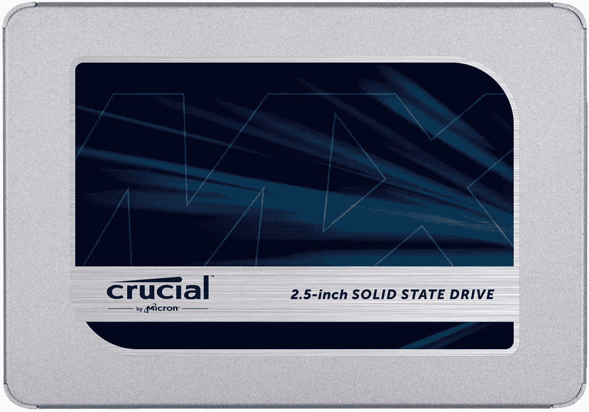

# 在英国，只需 157.99 英镑就能买到 2TB 的关键 MX500 固态硬盘。

> 原文：<https://www.xda-developers.com/crucial-mx500-2tb-157-uk/>

# 在英国，只需 157.99 英镑就能买到 2TB 的关键 MX500 固态硬盘。

至关重要的 MX500 固态硬盘是发烧友推荐的顶级固态硬盘，现在在英国你只需 157.99 英镑就能买到 2TB 的硬盘。

如果你希望以低廉的价格获得大量存储空间，2TB 固态硬盘绝对不会错。获得大量空间也很好，因为当固态硬盘装满时，它们会变得更慢。拥有大量可用空间意味着您的固态硬盘将保持快速运行。如果您想购买更多存储空间，那么至关重要的 MX500 绝对不会错。更重要的是，它通过一个普通的 SATA 端口连接，所以它应该与几乎所有的机器兼容。我个人拥有并使用一个重要的 MX500 500GB，可以证明它的寿命和速度。至关重要的 MX500 2TB 售价 157.99 英镑，或者如果你不需要那么大的空间，只需 79.99 英镑就可以获得 1TB 的驱动器。

 <picture></picture> 

Crucial MX500 SSD

##### 重要的 MX500 固态硬盘

想为您的电脑增加额外的存储空间吗？1TB 或 2TB 的硬盘可能就够了。

有很多理由选择一个备用的 SSD，它并不经常像 2TB 的 157.99 美元这样可靠。至关重要的 MX500 是许多 PC 爱好者(包括我自己)可以推荐的顶级 SSD。它的顺序读取速度高达 560MB/s，顺序写入速度高达 530MB/s，这意味着它应该可以处理几乎所有的东西。它插入计算机上的标准 SATA 端口，并使用与 PC 中任何其他硬盘驱动器相同的电源供电。

固态硬盘非常适合存储需要快速访问的文件，如游戏或大型项目文件。2TB 也是一个很大的空间，如果你选择只为游戏选择一个 2TB 的驱动器，你可以在上面安装很多游戏。您还可以将它用作电影、音乐、电视节目等的快速存储设备。它没有三星 980 Pro 这样的 M.2 SSD 那么快[，但它肯定会以更低的成本完成这项工作。](https://www.xda-developers.com/samsung-980-pro-lowest-price-uk/)