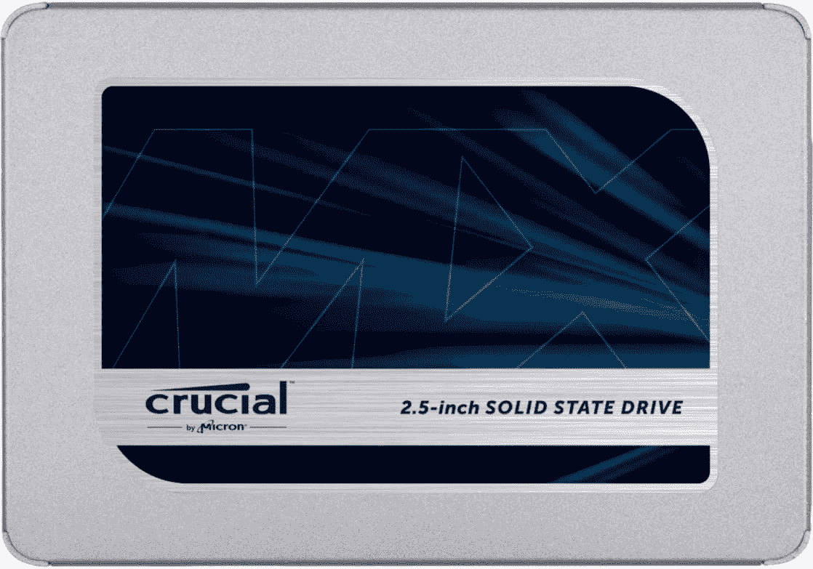
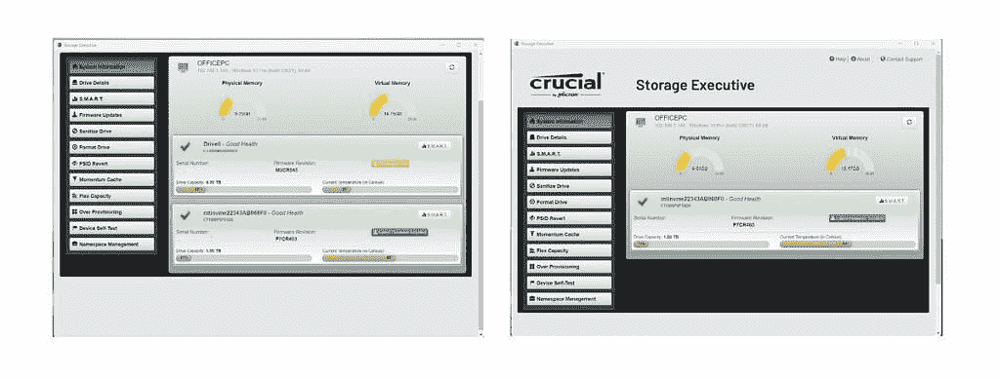

# 至关重要的 MX500 固态硬盘评论:好，但不是伟大的存储你的电脑

> 原文：<https://www.xda-developers.com/crucial-mx500-ssd-review/>

曾几何时，向您的电脑添加大量存储空间需要使用 3.5 英寸硬盘。然而，它们又大又笨重，速度又慢，所以感觉就像你在糖蜜沼泽中拖着你的文件。但是他们完成了任务。

幸运的是，虽然你仍然可以购买机械硬盘，但它们更适合 NAS 之类的东西，而不是台式机或笔记本电脑。这在一定程度上是因为目前[最好的固态硬盘](https://www.xda-developers.com/best-ssds-sata-nvme/)价格适中。存储速度越快，您为更小的容量支付的费用就越多。但是 SATA 固态硬盘仍然是一个非常重要的东西，这就是至关重要的 MX500 固态硬盘发挥作用的地方。我们这里有一个 2.5 英寸的固态硬盘，它运行安静，没有移动部件，容量高达 4TB。也有价格更有吸引力的其他尺寸。

不久前，这样的存储设备还闻所未闻，但现在值得你花时间吗？

 <picture></picture> 

Crucial MX500

##### 关键 MX500

这是一款优质的 SATA 固态硬盘，非常适合大容量存储，尽管其写入速度确实落后于一些竞争对手。

## 关于这篇评论

本次审查使用由 critical 为本次审查提供的 Crucial MX500 4TB 进行。在这篇评论发表之前，没有人在 Crucial 看到过或对它的内容有任何意见。

**浏览此评论:**

## 至关重要的 MX500 固态硬盘价格和可用性

我们这里的 4TB 版本是 MX500 系列中容量最大、价格最高的。现在在亚马逊上可以买到，价格约为 350 美元。对于大多数人来说，2TB 的版本应该是 170 美元左右的价格。

如果你只需要一点额外的存储空间，MX500 可以降到 250GB，500GB 和 1TB 的版本介于两者之间。

## 重要的 MX500 固态硬盘规格

| 

投机

 | 

关键 MX500

 |
| --- | --- |
| 大小 | 2.5 英寸 |
| 连接 | SATA 3.0 |
| 最大读/写速度 | 560 兆字节/秒/ 510 兆字节/秒 |
| 保证 | 5 年 |
| 容量 | 250GB、500GB、1TB、2TB、4TB |

## 性能和软件:不错，但不太好

MX500 是一款相当不起眼的产品。这是一个 SATA 固态硬盘，所以你不是为了最快的性能而购买它。这是新一代大容量存储，比机械硬盘快很多倍，同时更小、更可靠。

在盒子里，除了固态硬盘，你还可以得到一个塑料支架。没什么能告诉你这是干什么用的，但考虑到一边有粘合剂，这看起来像是某种隔离物。将它固定在电脑机箱的一个面板上，它将为固态硬盘提供一个非金属床。

对于性能，您受到 SATA 3.0 规范的限制。绝对最大值大约是 600MB/s，所以理想情况下，您希望尽可能接近这个值。

下图显示了 CrystalDiskMark 8 中基准测试的结果，测试了顺序和随机性能。

就读取速度而言，MX500 与三星 870 EVO 等产品不相上下，可以说是你能买到的最好的 SATA 固态硬盘。不过，写入速度有点令人失望，在我们的测试中比三星低 25MB/s。这没什么大不了的，在日常使用中你不会注意到。但是竞争还是更快。随机读写得分也是如此，两者都轻松落后于三星的表现。

ATTO 盘面基准的情况也大同小异。从任何角度来看，它都不差，但就写入速度而言，在不同文件大小的整个曲线上，它都比不上 870 EVO。读取速度几乎与三星的相同，但写入速度大约慢 30MB/s。

它在 3DMark 存储基准测试中获得 852 分，该测试测试了各种面向游戏的场景。事实上，MX500 4TB 是一个非常棒的游戏大容量存储驱动器，加载速度很快，并提供了一个巨大的储物柜来存储大型 Steam 库。温度方面，它通常在 25 摄氏度(77 华氏度)下运行。

当然，不同容量甚至不同装置之间的性能会有所不同。底线是 MX500 是好的，但它不是最好的。

软件方面是批评的唯一真正原因。所有重要的固态硬盘都有一个配套的应用程序，它运行得很好——或者说它适用于 P5 Plus，我目前正在用它来启动 Windows 11。MX500 似乎没有注册。

 <picture></picture> 

One minute it's there with a firmware issue, the next, it's never to be seen again.

良好的...大多数时候不会。重启电脑似乎会让它出现，但一旦在应用程序中选择了另一个标签，它又会消失。这在大多数情况下并不是一件大事，但这是一种确保 SSD 拥有最新固件的简单方法。安装它的替代方法要糟糕得多。

这包括从 Crucial 的网站下载固件并手动安装。这不一定是一个艰难的问题，但 Crucial 决定以 ISO 的形式提供固件，这意味着要安装它，你必须将 ISO 刻录到可启动的闪存驱动器，重新启动你的 PC 进入 BIOS/UEFI，告诉它从这个 USB 驱动器启动，启动，然后刷新固件。这太复杂了，大多数普通用户不应该去理会。相比较而言，三星有其优秀的魔术师 app。这里的整体体验并不完美。

也许我只是遇到了一些配套应用程序的错误。我希望情况是这样的，而且它会被修理。

## 谁应该购买至关重要的 MX500？

**您应该购买:**

*   你在寻找高质量的大容量存储器
*   您正在升级旧的 PC 或笔记本电脑
*   你有一个很大的游戏库

**如果:**

*   您正在寻找用于启动操作系统的快速存储
*   您想要绝对性能最佳的 SATA 固态硬盘

至关重要的 MX500 是一个非常好的 SATA 固态硬盘。它不会赢得任何与同类最佳产品的速度竞赛，但三星设立了一个高标准。除了配套应用的怪异和安装新固件的可怕手动方式，这是一个大拇指。

这个问题更多的是关于你应该买哪种存储。4TB 很诱人，但也在 350 美元左右，所以你需要有一个相当大的预算。2TB 更容易推荐，价格也更有吸引力。所有容量的性能基本相同，所以根据您的预算和需求选择合适的容量。

当然，4TB 的机械硬盘仍然便宜得多，但速度也慢得多，耗电量也更大。在任何现代 PC 中，如果可以的话，你应该尝试所有的固态硬盘，这是一个非常好的选择。

 <picture></picture> 

Crucial MX500

##### 关键 MX500

至关重要的 MX500 SSD 因其写入速度和软件而有所下降，但总体而言，它是一款出色的 SSD，可以为您的 PC 添加一些重要的存储空间。