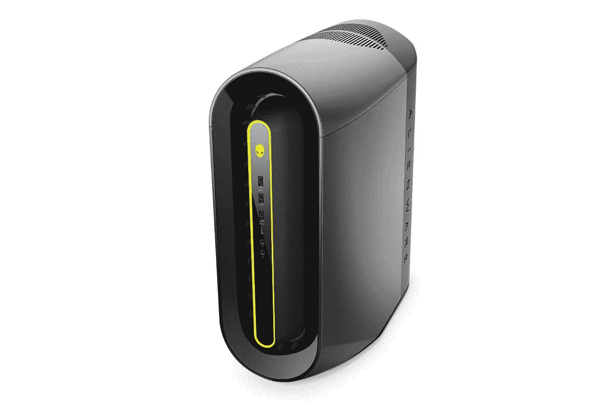
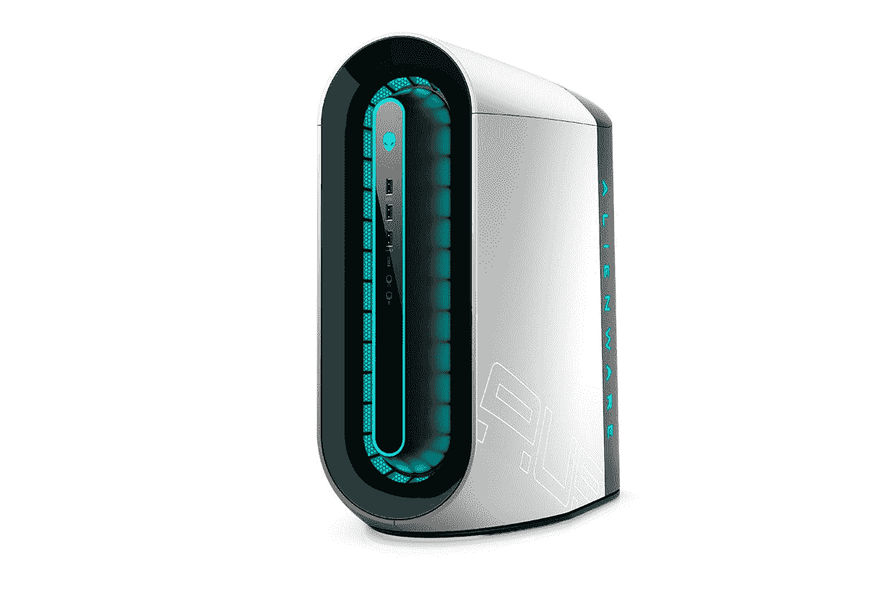

# 戴尔停止在某些美国地区交付 Aurora 游戏台式机

> 原文：<https://www.xda-developers.com/dell-alienware-aurora-desktop-canceled-orders/>

据报道，戴尔已经取消了其在美国某些地区的[外星人极光 R12](https://www.xda-developers.com/dell-xps-alienware-desktops-updated-with-intel-11th-gen/) 和 [R10](https://www.xda-developers.com/dell-alienware-m17-m15-r4-amd-ryzen-aurora-r10-gaming-desktop-launch-ces-2021/) 游戏桌面的订单。显然，如果您尝试配置这两个系统中的任何一个，您将会收到一条警告，指出如果交货地址位于受影响的六个州之一，您的订单将不会被接受。

“由于加利福尼亚州、科罗拉多州、夏威夷州、俄勒冈州、佛蒙特州或华盛顿州采用的电力消耗法规，本产品不能运送到这些州。任何发往这些州的订单都将被取消。 *[PC Gamer](https://www.pcgamer.com/dell-is-cancelling-alienware-gaming-pc-shipments-to-several-us-states/)* 暗示，原因是针对 PC 和显示器的新能效标准的出台。

游戏玩家一直依赖预建的游戏桌面作为构建自己平台的替代方案之一，尤其是在整个 GPU 价格上涨和芯片组短缺的情况下。除了游戏笔记本电脑系列，戴尔还提供外星人极光游戏台式机。最新型号采用第 11 代英特尔 Rocket Lake-S 或 AMD 锐龙 5000 CPUs，搭配 NVIDIA Geforce RTX 30 系列 GPU。但是，加州、科罗拉多州、夏威夷、俄勒冈州、佛蒙特州或华盛顿州的客户将无法使用大多数配置。

据戴尔称，“是的，这是由加州能源委员会(CEC) Tier 2 实施推动的，该实施为电脑(包括台式机、一体机和移动游戏系统)定义了强制性能效标准。这是 2021 年 7 月 1 日开始实施的。外星人 Aurora R10 和 R12 的部分配置是戴尔和外星人唯一受影响的系统。”

2016 年，加州是美国第一个批准个人电脑和显示器能效标准的州。预计这将每年节省 23 亿千瓦时的电力，并显著减少发电厂的碳污染。这只是许多即将出台的法规之一，在这些法规中，系统集成商在向这些州提供某些型号之前必须计算功耗。2021 年 12 月将见证这些法规的扩展，这些法规将影响具有高速网络功能的计算机、多屏笔记本电脑、具有循环行为的笔记本电脑以及具有高刷新率的显示器。

规则似乎非常严格，因为除了入门级配置之外，客户无法获得高端硬件。例如，Aurora R12 共有五种配置，其中只有前两种符合能效标准。基本上，你能得到的只是一个英特尔酷睿 i5-11400F，GeForce GTX 1650 Super，8GB 单通道 DDR4-3200 RAM，以及 256GB 固态硬盘和 1TB 硬盘。同样，对于 R10，你只能在两个最便宜的选项中选择，最高可选择 AMD 锐龙 5 5600X、镭龙 RX 5600、8GB 单通道 DDR4-3200 RAM 和 256GB SSD + 1TB HDD。

如果你期待购买新的外星人 R10 或 R12，各种配置仍然在亚马逊上列出和销售:

 <picture></picture> 

Alienware Aurora R10 ($470 off)

##### 戴尔外星人极光 R10

新的外星人极光 R10 由最新的 AMD 锐龙 5000 系列处理器和最新的英伟达 GeForce RTX GPU 驱动。

 <picture></picture> 

Dell Alienware Aurora R12

##### 戴尔外星人极光 R12

新的外星人极光 R10 由新推出的第 11 代英特尔处理器和最新的英伟达 GeForce RTX GPU 支持。