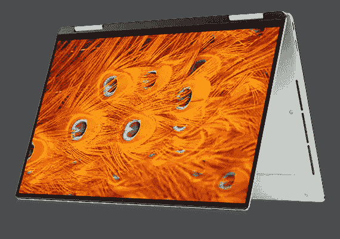
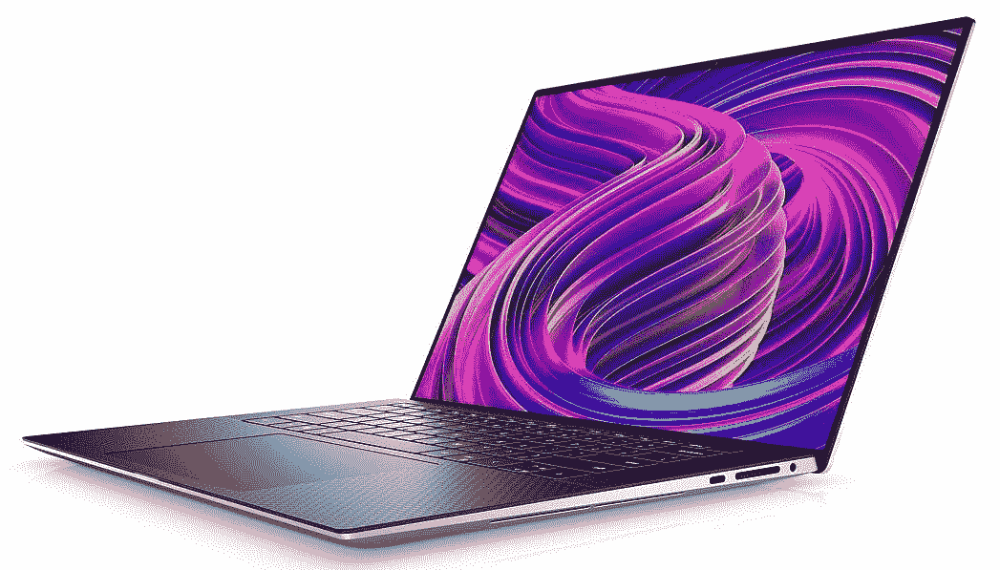
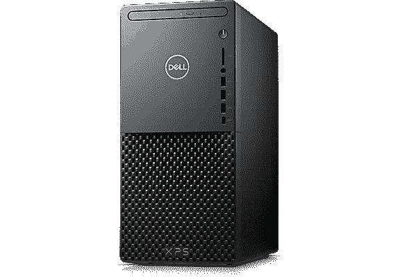
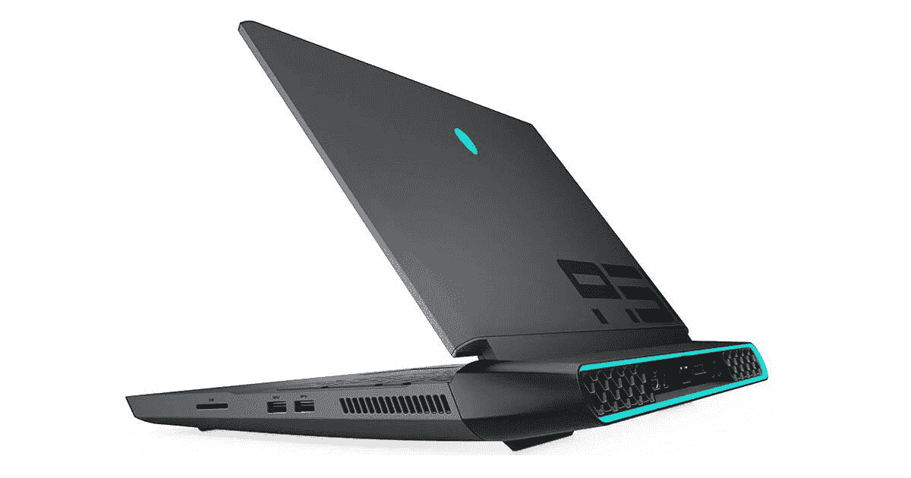
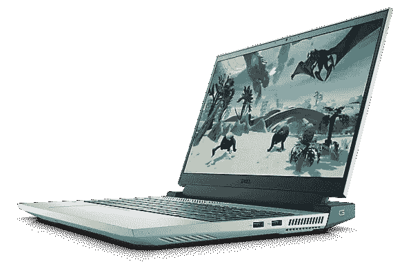
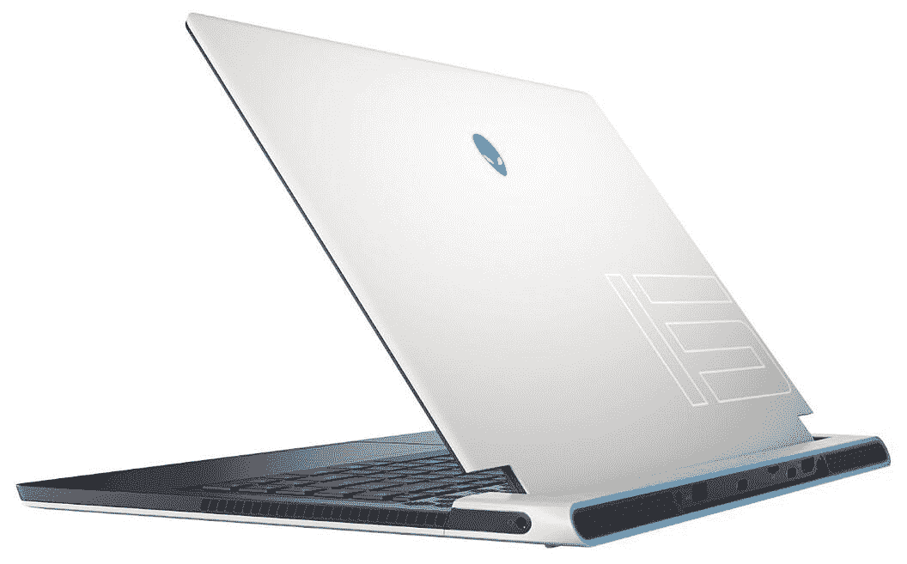
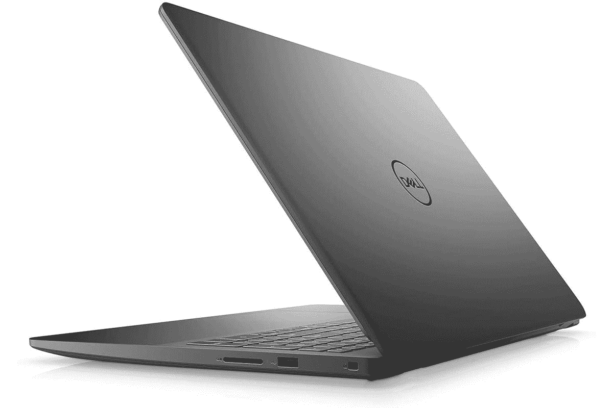

# 戴尔的 XPS 笔记本电脑有很大折扣，黑色星期五还有更多折扣

> 原文：<https://www.xda-developers.com/dell-black-friday-2021-deals/>

今年的黑色星期五交易正在全力进行，戴尔也不例外。该公司正在对其许多最受欢迎的笔记本电脑进行打折，包括优质的戴尔 XPS 系列，这使得这是为自己购买一些市场上最好的 PC 的最佳时间。除了戴尔 XPS 系列，您还可以在该公司的游戏电脑上找到一些优惠。

我们已经收集了你现在能得到的最好的交易，你可以在下面找到它们。

## 戴尔 XPS 黑色星期五销售

首先，戴尔的大多数 XPS 系列都有很大的折扣，正如您可能已经知道的那样，这些是您可以买到的最好的笔记本电脑。有了这些交易，它们变得更加诱人。

### 戴尔 XPS 13 黑色星期五优惠(高达 580 美元折扣)

从戴尔 XPS 13 系列开始，您有三款主要型号打折，它们都采用英特尔酷睿 i5-1135G7 处理器，但也有一些差异。折扣高达 520 美元，这条线的起价只有 650 美元。

 <picture></picture> 

Dell XPS 13

##### 戴尔 XPS 13

这款笔记本电脑采用第 11 代英特尔酷睿 i5 处理器、8GB 内存和 256GB 固态硬盘，外形小巧，令人惊叹。它包括一个宽高比为 16:9 的全高清屏幕。

 <picture></picture> 

Dell XPS 13 (9310)

##### 戴尔 XPS 13

这款笔记本电脑采用第 11 代英特尔酷睿 i5 处理器、8GB 内存和 256GB 固态硬盘，设计紧凑，是一款出色的翻盖式笔记本电脑。它包括一个宽高比为 16:9 的全高清屏幕，现在支持触摸

 <picture></picture> 

Dell XPS 13 2-in-1 ($520 off)

##### 戴尔 XPS 13 二合一设备

这款笔记本电脑采用第 11 代英特尔酷睿 i5 处理器、16GB 内存和 512GB 固态硬盘，设计紧凑，可变形。它包括一个宽高比为 16:10 的全高清触摸屏。

### 戴尔 XPS 15(优惠 800 美元)

如果您想要更大、更强大的产品，戴尔 XPS 15 也会受到一些人的喜爱，这是一件非常重要的事情。你可以以高达 800 美元的价格买到这款配备英特尔酷睿 i9-10885H 处理器、NVIDIA GeForce GTX 1650 Ti 显卡、32GB 内存和 1TB 固态硬盘的笔记本电脑，价格降至 2000 美元。

当然，处理器不是最新的，但它仍然是一个非常强大的机器，可以轻松处理任何事情。这还不是全部。这款 XPS 15 还包括超高清+显示屏，分辨率高达 3820 x 2400，亮度为 500 尼特，支持触摸。这是一台令人惊叹的笔记本电脑，而且以这个价格，这是一个很棒的选择。

 <picture></picture> 

Dell XPS 15 Touch ($800 off)

##### 戴尔 XPS 15

这款戴尔 XPS 15 配备了超高清显示屏、8 核英特尔处理器和 32GB 内存。它可以处理你想在上面做的任何工作。

### 戴尔 XPS 17(优惠 200 美元)

如果您需要更大的工作空间，Dell XPS 17 也将获得可观的折扣。这是最新的型号，它配备了英特尔酷睿 i7-11800H，加上 NVIDIA GeForce RTX 3050 显卡，所以它是我们迄今为止见过的最强大的笔记本电脑。便宜了 200 美元，价格降到了 1900 美元，仍然很划算。

除了强大的处理器和 GPU，您还可以获得 16GB 的 RAM 和 512GB 的 SSD 存储，好消息是这些组件在 XPS 17 上相当容易升级。你总是可以在以后改进它。显示器是全高清+分辨率，不支持触摸，所以它不像这里的其他一些 XPS 型号那样花哨，但对于一台出色的笔记本电脑来说，它仍然是一个很好的屏幕。

 <picture></picture> 

Dell XPS 17 9710

##### 戴尔 XPS 17

戴尔 XPS 17 配备最新的英特尔酷睿 i7-11800H 处理器和 NVIDIA GeForce RTX 3050 显卡，几乎可以在所有任务中提供强大的性能。它还有一个大的全高清+显示屏，非常适合工作。

### 戴尔 XPS 台式机(降价 370 美元)

如果你更喜欢台式机，而不是笔记本电脑，最新型号的戴尔 XPS 台式机在黑色星期五也有很大的折扣。这款电脑由六核英特尔酷睿 i5-11400 和 NVIDIA GeForce RTX 3060 显卡驱动，现在降价 370 美元，仅售 1000 美元。

这款电脑甚至包括一些你现在不常看到的细节。它包括一个蓝光/DVD 播放器，所以如果你还有物理媒体，这是少数几个仍然可以使用它的现代 PC 之一。

 <picture></picture> 

Dell XPS Desktop ($370 off)

##### 戴尔 XPS 台式机

戴尔 XPS 台式机采用英特尔酷睿 i5-11400 处理器和 NVIDIA GeForce RTX 3060 显卡，是一款非常强大的台式机，适合日常使用，甚至可以玩一些游戏。它还包括 8GB 内存和 1TB 硬盘。

这款机器的一个潜在缺点是它只有 8GB 内存和 1TB 硬盘；所以你很可能想要升级，至少在未来。我们重点介绍了一些针对 PC 组件的[黑色星期五优惠，包括 RAM 和存储，因此如果您想立即升级，也可以利用这些优惠。](https://www.xda-developers.com/best-black-friday-pc-gaming-deals/)

## 戴尔黑色星期五游戏优惠

对于游戏玩家来说，戴尔的游戏电脑也有一些很棒的优惠，包括广受欢迎的外星人品牌。这里是你现在能找到的最好的交易。

### 外星人极光 R10(470 美元起)

很容易最值得一提的交易，你现在可以得到令人难以置信的强大的外星人极光 R10 游戏桌面。这款游戏电脑由 AMD 锐龙 9 5900 处理器提供支持，该处理器具有 12 个内核和 24 个线程，它还包括镭龙 RX 6800 XT 显卡和 16GB 的视频内存。您还可以获得 32GB 的内存(以后可以升级)，2TB 的固态硬盘存储，以及 2TB 的硬盘存储。

所有这些都封装在外观时尚的机箱中，具有现代设计和 RGB 照明，此外，您还可以获得数量惊人的 I/O，包括大量 USB 端口、显示器输出和千兆以太网，因此您可以连接任何您想连接的东西。通常，所有这些都需要花费 2900 美元，但现在你可以花 2430 美元买到，这是 470 美元的折扣。

 <picture></picture> 

Alienware Aurora R10 ($470 off)

##### 戴尔外星人极光 R10

外星人极光 R10 是一个令人难以置信的强大的游戏 PC，具有现代的设计和顶级的规格。以这个价格，这是一笔非常诱人的交易。

### 外星人地区-5100 万 R2(1250 美元)

如果你想要一个可以四处移动的台式机，外星人 Area-51m 也有很大的折扣。这款笔记本电脑配备了英特尔酷睿 i7-10700 处理器以及 NVIDIA GeForce 2070 超级显卡。当然，这些可能不是最新的组件，但它们也不是笔记本电脑的组件——这些是你在台式机上找到的 CPU 和 GPU。正因为如此，这仍然是一个非常强大的机器。

最重要的是，你得到了 16GB 的内存，加上 512GB 的固态硬盘和 1TB 的硬盘存储。正如您所料，所有这些都是可升级的。这款笔记本电脑还包括一个 17 英寸的全高清显示屏，刷新率为 144Hz，支持眼球追踪技术。外星人面积为 5100 万平方米的 R2 正式售价为 3150 美元，但现在你可以花 1900 美元买到，比原价低了 1250 美元。

 <picture></picture> 

Alienware Area-51m R2 ($1,250 off)

##### 戴尔外星人地区-51m R2

外星人 Area-51m R2 是一款配备台式机级组件的笔记本电脑，功能强大得令人难以置信。当然，它也因为它而变得很大。

### 戴尔 G15 游戏笔记本电脑(优惠 419 美元)

对于在功耗和预算方面更保守的产品，Dell G15 游戏笔记本电脑可能是更好的选择。它配备了英特尔酷睿 i5-10500H 处理器和 NVIDIA GeForce GTX 1650，这仍然是中端游戏的可靠组合。你还可以得到 8GB 的内存和 256GB 的固态硬盘。这可能无法与我们见过的最强大的笔记本电脑相提并论，但这款笔记本电脑的售价仅为 600 美元，比原价低 419 美元，非常划算。

 <picture></picture> 

Dell G15 ($419 off)

##### 戴尔 G15

Dell G15 游戏笔记本电脑是一款经济实惠的中档游戏笔记本电脑，采用英特尔酷睿 i5-10500H 和 NVIDIA GeForce GTX 1650。

### 外星人 x15(680 美元)

我们已经[报道了这个交易](https://www.xda-developers.com/dell-alienware-x15-black-friday-1900/)，但它现在仍然可用，这是一个了不起的交易。目前，你只需花费 1900 美元就可以买到配备英特尔酷睿 i7-11800H 和英伟达 GeForce RTX 3060 显卡的强大外星人 x15，比原价低 680 美元。

这不仅是一款功能强大的笔记本电脑，配有全高清 360Hz 显示屏，而且厚度不足 16 毫米，令人印象深刻。它还包括 16GB 的 RAM，因此您将获得全面的出色体验。

 <picture></picture> 

Dell Alienware x15 ($680 off)

##### 戴尔外星人 x15

戴尔外星人 x15 是一款功能强大、超薄的游戏笔记本电脑，采用最新的英特尔处理器和 NVIDIA 显卡，性能卓越。

## 戴尔 Inspiron 灵越 15 黑色星期五特惠(优惠 219 美元)

最后，如果您想要一台经济实惠的笔记本电脑，Dell Inspiron 灵越 15 的价格非常实惠，对于只需要一台网络浏览机的人来说，这是一个绝佳的选择。这款机型由最新的英特尔酷睿 i3-1115G4 和 4GB 内存驱动，现在从最初的 519 美元价格降至仅 300 美元。

该处理器为您提供了足够好的性能来进行基本的网络浏览和编写一些文档，此外，您还可以获得 128GB 的快速 SSD 存储来存储文件。不仅如此，你还可以获得全高清显示屏，这在这个价位是非常罕见的。对于预算紧张的人来说，这确实是一笔好交易。

 <picture></picture> 

Dell Iinspiron 15 3000 ($219 off)

##### 戴尔 Iinspiron 15 3000

Dell Inspiron 15 是一款经济实惠的笔记本电脑，具有坚实的规格，可用于基本的网络浏览和撰写文档。不到 300 美元，这是一笔不可思议的交易。

这是一大堆奇妙的交易，但如果你正在寻找智能手机和移动技术的交易，我们有一个庞大的黑色星期五交易列表，你可以现在就查看。