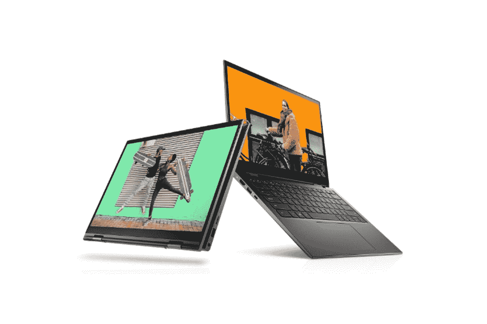

# 戴尔 Inspiron 灵越 14 二合一评测:您会爱上的主流笔记本电脑

> 原文：<https://www.xda-developers.com/dell-inspiron-14-2-in-1-review/>

。bestawarddiv {

浮动:对；

宽度:20%；

边距:1em

边距-顶部:0；

}

戴尔 Inspiron 灵越 14 二合一大多只是一款主流的[敞篷](https://www.xda-developers.com/best-convertible-laptops/)，但不知为什么，我就是喜欢上了它。这种设计让人感觉很自然，键盘也很舒服。总而言之，笔记本电脑是一种难以形容的乐趣。

所以请继续读下去，我会继续尝试描述它。

**浏览此评论:**

### 戴尔 Inspiron 灵越 14 7415 二合一设备规格

| 

中央处理器

 | AMD 锐龙 7 5700U 8 核/16 线程移动处理器，带镭龙显卡 |
| 

身体

 | 321.5 x 211.35 x 16.32-17.95 毫米(12.66 x 8.32 x 0.64-0.71 英寸)，1.56 千克(3.43 磅) |
| 

显示

 | 14 英寸 1，920x1，080 true life 触摸窄边框 WVA 显示屏 |
| 

记忆

 | 16GB，2x8GB，DDR4，3200MHz |
| 

储存；储备

 | 512GB M.2 PCIe NVMe 固态硬盘 |
| 

港口

 | 1 个 HDMI 输出 1.4b 2 USB 3.2 Gen 1 Type-A1 USB 3.2 Gen 1 Type-C，带 PowerDelivery 和视频 1 3.5 毫米耳机/麦克风组合 jackmicroSD 读卡器 |
| 

键盘

 | 防泼溅，背光 |
| 

照相机

 | 带摄像头保护罩的高清(720p)摄像头 |
| 

声音的

 | 带 Waves 的立体声扬声器 MaxxAudio Pro 集成双阵列麦克风 3.5 毫米耳机/麦克风组合插孔 |
| 

连通性

 | 英特尔 Wi-Fi 6 2x2 (Gig+)和蓝牙 5.0 |
| 

电池

 | 4 芯电池，54 瓦时(集成) |
| 

材料

 | 铝和塑料 |
| 

颜色

 | 薄雾蓝 |
| 

操作系统（Operating System）

 | Windows 10 主页 |
| 

价格

 | $1,049 |

这款产品起价 849 美元，配备锐龙 5、8GB 内存和 256GB 存储空间。指南中还列出了一种卵石绿色，但戴尔的产品列表中没有。

## 设计:戴尔 Inspiron 灵越 14 2 合 1 一体机采用独特的设计，并有浅蓝色可选

Dell Inspiron 灵越 14 二合一设备的设计有些独特，这也是它使用起来如此舒适的主要原因之一。它有一种叫雾蓝的颜色，加上铝和塑料底盘，感觉很高级。我马上就喜欢上了柔和的蓝色，因为我总是喜欢[笔记本电脑](https://www.xda-developers.com/best-laptops/)的颜色，而不是普通的银色或灰色。

但是我真正喜欢这个设计的是前后轮的边缘；两边还是平的。它使揭开盖子变得容易，同样，它与市场上的其他产品略有不同。在 MacBook 和 MacBook 克隆产品的世界里，拥有一些感觉不同的东西真的很有帮助。

打开盖子后，你会发现盖子实际上向后移动了一点，以便支撑住笔记本电脑。这在 Dell Inspiron 14 二合一设备的表面和底部之间形成了一个间隙，提供了更好的通风。你可能知道，你越能保持内部凉爽，你的表现就越好，越持久。

Dell Inspiron 灵越 14 二合一设备的精巧设计与此相似，但却独一无二。

遗憾的是，所有的端口都有点过时了。在左侧，有一个 HDMI 1.4b 端口，一个 USB 3.2 Gen 1 Type-A 端口和一个 USB 3.2 Gen 1 Type-C 端口。所有 USB 端口都支持 5Gbps 速度，而不是支持 10Gbps (USB 3.2 Gen 2)、20Gbps (USB 3.2 Gen 2x2)或 40Gbps (USB 4)的新标准。因为这是 AMD 的机器，所以没有雷电。这并不奇怪。只是很奇怪有 HDMI 1.4b 而不是 HDMI 2.0(甚至 2.1)，还有更老的 USB 口。

在右侧，有另一个 USB 3.2 Gen 1 Type-A 端口，一个 3.5 毫米音频插孔和一个 microSD 卡插槽。高端消费者笔记本电脑似乎更常见的是有两个 USB Type-C 端口和一个 Type-A 端口，而不是相反。尽管如此，这很好。USB Type-C 端口支持视频输出和充电，因此您可以将双 USB Type-A 端口用于其他用途，例如鼠标和外部存储。

我非常喜欢戴尔 Inspiron 灵越 14 二合一设备的设计。我喜欢圆形正面和背面的感觉、颜色等等。用起来真的感觉很好。

## 显示屏:14 英寸 FHD 16:9 触摸屏

Dell Inspiron 灵越 14 二合一笔记本电脑配有 14 英寸、1，920x1，080、16:9 的触摸屏。差不多就是这个故事，因为它没有太多其他特别之处。

根据我的测试，它支持 67%的 sRGB，48%的 NTSC，50%的 Adobe RGB 和 50%的 P3，这真的不是很好。我实际上以不同的方式进行了多次测试，然后我测试了我的 MacBook Pro，只是为了看看传感器是否有问题。坦白说，我没想到结果会这么低，很难相信。

亮度最大值为 278.3 尼特，这意味着它在明亮的阳光下不会很好，对比度最大值为 1，120:1。

屏幕上的视角好像是整整 178 度。事实上，如果我用肉眼去看，我会说显示器比测试结果好得多。但是，你还是知道了。如果色彩准确度对您的工作流程至关重要，这一点需要注意。

屏幕正上方是一个带有物理隐私保护装置的网络摄像头，这总是很好的。不幸的是，网络摄像头仍然是 720p，当网络摄像头成为如此重要的组件时，这是一个耻辱。

戴尔确实给我发送了它的 UltraSharp 4K 网络摄像头，这是惊人的。事实上，如果你想在电话上看起来不错，这是网络摄像头。它支持 AI zoom，这意味着如果你四处移动，它会自动放大你。它也支持 HDR 和更多。

## 键盘:戴尔 Inspiron 灵越 14 二合一笔记本电脑拥有更大的按键，手感极佳

我非常喜欢戴尔 Inspiron 灵越 14 二合一笔记本电脑上的键盘。戴尔说它把按键加大了 9%,我能感觉到差别。我从未想过用“宽敞”这个词来形容笔记本电脑的键盘，但现在我们做到了。

我从来没有想过我会用“宽敞”这个词来形容一个键盘，但是我们做到了。

键盘打字很舒服，但需要一点点习惯。按键没有摇晃或任何东西，这种东西会破坏较大按键的体验。这种感觉是好的方面。再说一遍，我很喜欢。

微软 Precision touchpad 没问题。戴尔说它像玻璃，这意味着它不是玻璃，但这没关系。它能完成任务。

在键盘的右上角是一个电源按钮，兼作指纹传感器。同样，当您按下开机按钮时，戴尔不会扫描您的指纹。在它启动后，你仍然必须再次触摸它，这与其他 OEM 厂商生产的电源按钮上有指纹的任何 PC 的行为是矛盾的。

戴尔认为，当你第一次按下按钮时，通过扫描你的指纹自动登录会有安全风险。就我个人而言，我认为用户知道他们自己的笔记本电脑是如何工作的，如果他们知道他们的电脑会自动登录，他们就不会在 5 到 10 秒左右的时间里在公共场所离开电脑。

## 戴尔移动连接是购买戴尔的一个原因

老实说，戴尔移动连接应该得到更多的支持，因为如果你是 iPhone 用户，你真的应该使用戴尔笔记本电脑。该应用程序可以让你从笔记本电脑上发送和接收文本，还可以让你发送和接收文件，镜像你的屏幕，等等。它可以在 Android 和 iOS 上运行。

如果您有 iPhone，戴尔移动连接是您应该使用戴尔 PC 的原因。

最大的不同是有大量的服务可以在 Android 上做到这一点。有了 iOS，就不是这样了。就连微软自己的 Your Phone 应用程序也没有努力让它与 iPhone 兼容。其他解决方案，如惠普的，允许你发送小于 50MB 的文件，但仅此而已。

使用戴尔移动连接，共享文件就像使用隔空投送，但使用的是 Windows PC 而不是 Mac。它是如此之快，如果你没有经历过将你刚刚从 iPhone 上拍摄的 4K 60fps 视频传输到 Windows PC 上的痛苦，那么你就会知道这是一个非常棒的功能。

## 性能和电池寿命:它拥有 AMD 锐龙 5000 处理器

戴尔送给我的 Inspiron 灵越 14 二合一笔记本电脑配有 AMD 锐龙 7 5700U、16GB 内存和 512GB 固态硬盘，价格相当低廉，非常稳定。还有一款型号配备了锐龙 5 5500U、8GB 内存和 256GB 固态硬盘，但我不会考虑那款。高端机型真的没多花多少钱。

这里有好消息和坏消息。锐龙 7 5700U 本质上是 AMD 对英特尔酷睿 i7-1165G7 的回应。这些公司很友好，给他们的同类产品相同的编号。AMD 锐龙 5000 也很不错。假设你购买这款超极本的目的是为了普通的超极本，那么你的情况非常好。

电池寿命相当好，平均约 6 小时，但问题是电池寿命的性能。运行 PCMark 10，连接电源时得分 5320。虽然没有插电，但它的得分却令人失望，只有 4046 分。这两个测试都是在 Windows 设置为最佳性能的情况下进行的。仅仅是断开电源线，性能就下降了近 24%，可悲的是，这对于 AMD 锐龙笔记本电脑来说很典型。

我不想说不接电的时候性能其实很差。你仍然可以像平常一样使用你的笔记本电脑。只是性能有所下降，这一点非常重要，值得一提。

对于基准测试，我使用了 PCMark 10、3DMark、Geekbench 和 Cinebench。所有这些都是与单位插入电源，并设置为最佳性能设置。

|  | 

戴尔 Inspiron 灵越 14 2 合 1Ryzen 7 5700U

 | 

[Surface Laptop Studio](https://www.xda-developers.com/surface-laptop-studio-review/) 酷睿 i7-11370H，夸德罗 RTX 3000

 | 

戴尔 XPS 17 9700 酷睿 i7-10875H，RTX 2060

 |
| --- | --- | --- | --- |
| 

PCMark 10

 | 5,320 | 5,573 | 5,305 |
| 

3DMark:时间间谍

 | 1,256 | 5,075 | 5,582 |
| 

极客工作台

 | 1,151 / 6,099 | 1,546 / 5,826 | 1,303 / 8,265 |
| 

电影院长凳

 | 1,233 / 7,768 | 1,504 / 6,283 |  |

请注意，如果我们比较机器断开电源时的得分，它更多地与英特尔第八代机器进行比较。

但当它插上电源时，你可以看到，总体而言，它可以与 Surface Laptop Studio 和去年的戴尔 XPS 17 等相当强大的笔记本电脑相媲美。尽管他们以不同的方式竞争。从 Time Spy 可以看出，另外两台笔记本电脑做得好得多，因为它们有专用显卡。另一方面，戴尔 Inspiron 灵越 14 二合一笔记本电脑有八个内核，因此在多核测试中比 Surface Laptop Studio 做得更好。

## 结论:应该买戴尔 Inspiron 14 二合一吗？

简单的答案是肯定的，Dell Inspiron 灵越 14 二合一笔记本电脑是一款值得推荐的笔记本电脑。尽管有一些缺点，但它仍能发挥其应有的作用。

如上所述，有几个缺点。屏幕在色域方面有所欠缺，当笔记本电脑没有连接电源时，性能会受到很大影响。当然，网络摄像头仍然是 720p。

尽管如此，我还是爱上了这台机器。这只是一种享受，从键盘的较大按键到熟悉但独特的设计，圆形边缘和微妙的蓝色。一般来说，性能也相当不错，AMD 锐龙处理器往往就是如此。

别忘了，除去所有的费用，它仍然只需要 1049 美元。如果这是你想要达到的价格目标，那么我不知道你还想从笔记本电脑上得到什么。

 <picture></picture> 

Dell Inspiron 14 2-in-1

##### 戴尔 Inspiron 灵越 14 二合一设备

戴尔的 Inspiron 灵越 14 二合一笔记本电脑是一款主流的可转换笔记本电脑，价格低廉，价值不菲。