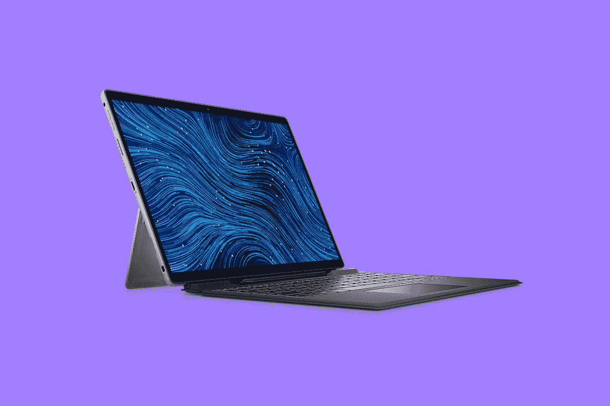

# 戴尔 Latitude 7320 可拆卸评测:Surface Pro 杀手

> 原文：<https://www.xda-developers.com/dell-latitude-7320-detachable-review/>

我发现英特尔 Tiger Lake UP4 处理器的一个有趣之处是，它们不仅非常好，而且还允许外形尺寸缩小到某一点，这在以前只有 ARM 芯片组才能实现。Dell Latitude 7320 disable 是我遇到的第四台使用这些新 CPU 的 PC，它确实做到了。如果你想用简单的术语来说，它就像一个 Surface Pro X，但采用了英特尔处理器。

。bestawarddiv {

浮动:对；

宽度:20%；

边距:1em

边距-顶部:0；

}

我是认真的。它有窄边挡板和更大的顶部挡板，包括一个网络摄像头和一个红外摄像头。它还有一个可连接的键盘，内置一个笔库。这是两个世界的最佳选择，因为与 Surface Pro X 不同，当你获得英特尔机器时，不存在兼容性问题。

我没有在这台机器上安装 [Windows 11](https://www.xda-developers.com/windows-11/) ，尽管 Windows 11 在 [Windows 平板电脑](https://www.xda-developers.com/best-windows-tablets/)上远远优于 Windows 10。就目前的情况而言，我不会在审查硬件时安装测试版操作系统。

**浏览此评论:**

### 戴尔 Latitude 7320 可拆卸规格

| 

中央处理器

 | 英特尔酷睿 i7-1180G7 |
| 

制图法

 | 虹膜 Xe |
| 

身体

 | 288.4 x 207.9 x 8.44 毫米(11.35 x 8.18 x 0.33 英寸)，789 克(1.7 磅)键盘:284.2 x 215.6 x 5.1 毫米(11.18 x 8.48 x 0.2 英寸)，351.4 克(0.77 磅) |
| 

显示

 | 13.0 英寸 3:2 FHD+ (1920 x 1280)触摸屏，500 尼特低功耗和 ComfortView Plus -低蓝光；康宁大猩猩玻璃 DX Touch 活动笔支持 |
| 

记忆

 | 16GB LPDDR4X SDRAM 4266MHz(板载) |
| 

储存；储备

 | 固态硬盘-m . 2-2230-256 GB-PCIe/NVMe 35 级 |
| 

多媒体

 | 通用音频插孔前置 500 万像素 1080 像素@ 30 帧/秒摄像头可选高清红外摄像头，带接近传感器全球前置 800 万像素，30 帧/秒，无 flashWindows Hello 4.0 支持红外摄像头微软 Skype for Business 认证 2 个立体声扬声器，带 MaxxAudio Pro2 个双阵列麦克风 |
| 

港口

 | (2)霹雳 4 |
| 

电池

 | 2 芯 40 WH 聚合物，ExpressCharge 2.0，支持 ExpressCharge Boost 和长寿命 |
| 

投入

 | Dell Latitude 7320 可拆卸单点触控式背光旅行键盘(可选，单独销售)10 指触控式显示屏 mircosoft Precision clickpad Latitude 7320 可拆卸触控笔(可选，单独销售) |
| 

材料

 | 铝金属 |
| 

操作系统（Operating System）

 | Windows 10 专业版 |
| 

价格

 | $2,189 |

## 设计:两全其美

如果你正在考虑购买一台 Windows 平板电脑，毫无疑问你已经体验过微软的 Surface 产品。Surface Pro 7 和 Surface Pro X 都有缺点，但戴尔 Latitude 7320 可拆卸是两全其美。它采用光滑的铝制设计，重量为 1.7 磅(与 Surface Pro 7 或 Surface Pro X 相同)。它也有 Windows 平板电脑上常见的支架，因为这些平板电脑在很大程度上被设计成兼作笔记本电脑。

有一些关键的区别。让我们从港口开始，因为这非常重要。Dell Latitude 7320 可拆卸式有两个 Thunderbolt 4 端口，每侧一个。事实上，这是这里仅有的两个端口，所以像 Surface Pro X 一样有两个 USB Type-C 端口，但没有像 Surface Pro 7 那样的 USB Type-A 端口。

[sc name = " pull-quote-right " quote = " Dell Latitude 7320 disable 集 Surface Pro 7 和 Surface Pro X 的优点于一身"]但有一样东西是你在任何一款 Surface 设备上都找不到的，那就是 Thunderbolt。事实上，这为该设备增加了重要的价值主张。一个 Thunderbolt 4 端口最多可以为两台 4K 显示器或一台 8K 显示器供电。你可以做的另一件事是插入一个外部 GPU，将这个小平板电脑变成一个强大的游戏装备。你不能在表面上这样做。

在顶部的左侧，你会发现音量摇杆，在顶部，有一个电源按钮。

我非常喜欢的一点是拉丝铝设计。它脱颖而出。由于 Surface Pro 几乎是 Windows 平板电脑的标准，也是自 Windows 8 时代以来唯一持续存在的产品线，我们习惯的铂镁可能会变老。联想推出了黑色的 ThinkPad 平板电脑，但这一次，银色的铝制个人电脑脱颖而出。

在这款设备的背面，还有一个指纹传感器。这是一个有趣的选择，因为它可以被放在电源按钮或其他地方，或者它可以被完全省略，以支持内置的红外摄像头。不过没关系。我完全赞成在人们如何使用他们的电脑方面给他们提供选择。

还有一个 8MP 的面向世界的摄像头，真的很酷。对于这样的设备，值得考虑一下用例。这是一台[商用笔记本电脑](https://www.xda-developers.com/best-business-laptops/)，可以在野外使用，工作人员可能需要拍照、扫码等等。

## 显示屏:它有一个 13 英寸的 3:2 显示屏

如果 13 英寸 3:2 显示屏，窄边框和更厚的顶部边框听起来很熟悉，那是因为这正是你在微软的 Surface Pro X 上看到的。另一方面，Surface Pro 7 有一个 12.3 英寸的屏幕，带有又大又厚的边框。这就是为什么我不断回到戴尔 Latitude 7320 可拆卸式是两个世界的最佳选择，并在此基础上添加了 Thunderbolt 来增加它的味道。

屏幕其实挺好的，虽然进来的是 1920x1280 分辨率。并不是我觉得缺少什么。事实上，它的电池续航时间可能比竞争对手的 2，880 x 1，920 屏幕更长，弥补了不使用 ARM 芯片组所损失的效率。当然它也有笔支架，笔藏在键盘里的笔库里。

屏幕支持 100%的 sRGB、80%的 NTSC、84%的 Adobe RGB 和 87%的 P3，所以就像我说的，这相当不错。

在那个更大的顶部挡板中，你会发现一个 500 万像素的前置摄像头，一个红外摄像头和一些其他传感器。首先，和整个 Latitude 7000 阵容一样，网络摄像头录制 1080p 视频，非常牛逼。很奇怪有多少笔记本电脑还在使用 720p 摄像头，戴尔似乎是唯一一家在疫情出现之前就有远见地拥有 FHD 网络摄像头的公司。虽然戴尔在相当多的商用笔记本电脑上安装了 FHD 网络摄像头，但竞争对手惠普和联想只发布了一两款配有像样摄像头的高端机型，而其余机型都安装了高清网络摄像头。

现在这不是一个很好的市场，考虑到有多少人仍然在家工作以及这种情况可能会持续多久，这使戴尔在商业市场处于非常有利的位置。

让我们也来谈谈顶部挡板中的那些附加传感器。戴尔有一个名为戴尔优化器的应用程序，它有几个类似的功能。一个叫做 ExpressSign-in。当你坐在电脑前时，它会进行检测。当你坐下时，它会唤醒电脑。红外摄像头会亮起进行面部识别，设备会让你登录，所有这一切都无需你触摸它。反之亦然。当你离开一段预定的时间后，它可以锁定电脑。这既是一种便利，也是一种安全功能。

对于平板电脑来说，音质相当不错。双波段扬声器位于两侧，非常适合电话会议等场合。如果你是那种喜欢坐在办公桌前听音乐的人，音乐听起来也不错。

## 键盘:可连接的键盘和笔库

到目前为止，我一直将戴尔 Latitude 7320 可拆卸产品与 Surface Pro X 进行比较似乎有点过时，但说真的，这两者在许多方面都是相同的。那也是设计好的。Surface 几乎是参考设计硬件，这就是为什么我们看到它被克隆了这么多次。

正如你所看到的，它拥有 Surface 品牌发明的可连接键盘风格。而且，它有一个更细、更平的笔库。这与我们在以前的产品中看到的笔有很大的不同，在以前的产品中，你必须使用 AAAA 电池来供电。有了这支笔，它在车库里就能充电。

[sc name = " pull-quote-left " quote = "对于平板电脑用户来说，将一支始终充电的笔存放在内部是一种改变游戏规则的方式。"]有两个引脚连接到这支笔，所以它不像 Surface Pro X 的细长笔那样可以无线充电。从上图中可以看出，两侧都有引脚，所以你可以按照你喜欢的方式插入这支笔。磁铁会把笔固定住，所以如果你想把它倒过来，它会翻过来。

除此之外，键盘对于这样的产品来说是相当标准的。这是件好事。自近十年前 Windows 8 时代开始以来，我们看到的所有新外形中，这是起飞的一种。你可以说不适合你，但不能说不适合任何人。

不过，这个车库在设计上是一个伟大创新。电池供电的笔一直是一种痛苦。AAAA 电池并不罕见，但在你当地的药店里也找不到。笔圈碍事，磁性附着笔脱落。对于平板电脑用户来说，内置一支一直充电的笔是一个游戏规则的改变者。

## 性能和电池寿命:它使用英特尔 Tiger Lake UP4

戴尔发给我的 Latitude 7320 可拆卸产品包括英特尔酷睿 i7-1180G7、16GB 内存和 256GB 存储空间。CPU 来自 Tiger Lake UP4 家族，它是我见过的第四台使用该家族 CPU 的机器。前三个是联想的。事实上，我对 Tiger Lake UP4 印象深刻，在我评论了联想 ThinkPad X1 Nano 和 ThinkPad X1 Titanium 等设备后，我就此采访了英特尔和联想，[继续写了 9000 多字关于它的文章](https://www.xda-developers.com/lenovo-thinkpad-x1-titanium-nano-interview/)。这是一个充满激情的项目，因为我对这些 CPU 印象深刻。

原因如下。Tiger Lake UP4 是 Y 系列的继任者，Y 系列最初被称为 Core M。如果你听说过 Y 系列或 Core M，那不是什么好东西。这些处理器是为无风扇设备设计的，坦率地说，它们不是很好。

英特尔第 10 代分为 10 纳米 Ice Lake 和 14 纳米 Amber Lake Refresh。Ice Lake Y 看起来不错，TDP 更高，它终于是四核了，而且它有英特尔新的 Iris Plus 显卡。但它从未在 Windows 个人电脑中发货。老虎湖 UP4 是我们最终得到一个适当的刷新，所以这是一个很大的不同。

酷睿 i7-1180G7 是一款四核 CPU，它配备了英特尔的 Iris Xe 显卡。我已经审查了一些 Y 系列的机器，即使在最新的一代，我也不会梦想尝试使用像 Adobe Photoshop 或 Premiere Pro 这样的东西。现在，随着老虎湖上升 4，你甚至几乎不知道区别。当然，它没有像 Core i7-1185G7 这样的 UP3 处理器那么强大，但对于生产力来说，这是一个非常棒的芯片。结合 16GB RAM，简直是做梦。

就电池寿命而言，我在 50%的亮度下实际使用了大约五个小时，功率滑块比节电模式高出一个档次。鉴于 40 瓦时的电池对于这样的设备来说很常见，我实际上认为这相当不错。如果它是一台配备更大电池的成熟笔记本电脑，它会做得更好。

对于基准测试，我使用了 PCMark 8、PCMark 10、Geekbench 和 Cinebench。

|  | 

Latitude 7320 可拆卸内核 i7-1180G7

 | 

latitude 7320 酷睿 i7-1185G7

 | 

ThinkPad X12 可拆卸芯 i5-1130G7

 | 

惠普 Spectre x360 13Core i7-1065G7

 |
| --- | --- | --- | --- | --- |
| 

PCMark 8:主页

 | 3,710 | 4,478 | 3,967 | 3,243 |
| 

PCMark 8:创意

 | 4,236 | 4,655 | 4,338 | 3,818 |
| 

PCMark 8:工作

 | 3,261 | 4,099 | 3,798 | 3,034 |
| 

PCMark 10

 | 4,470 | 4,743 | 4,286 | 4,147 |
| 

极客工作台

 | 1,488 / 4,939 | 1,540 / 5,181 | 1,299 / 4,446 | 1,227 / 3,502 |
| 

电影院长凳

 | 1,148 / 3,195 | 1,230 / 4,428 | 1,147 / 2,860 | 1,073 / 3,200 |

在上表中，您可以看到与使用 UP3 处理器的 Latitude 7320 翻盖手机相比，该产品的得分有多高。虽然老虎湖 UP3 显然更强大，正如它应该的那样，我们可以看到老虎湖 UP4 仍然比第 10 代“冰湖 U”更强大。

## 结论:您应该购买可拆卸的戴尔 Latitude 7320 吗？

就 Windows 平板电脑而言，我们只能说外形并不适合每个人。但是，虽然我们在过去几年里没有看到很多，但企业需要它们。底线是，如果您确实想要一台视窗平板电脑，戴尔 Latitude 7320 可拆卸式是市场上最好的一款。

[sc name = " pull-quote-right " quote = " Dell Latitude 7320 可拆卸式是市场上最好的 Windows 平板电脑。"]它有三个主要竞争对手——Surface Pro 7+、Surface Pro X 和联想 ThinkPad X12 可拆卸产品。ThinkPad X12 可拆卸键盘更面向主流市场，屏幕更小，只有一个 Thunderbolt 4 端口。正如我在这篇评论中所说的，Latitude 确实融合了微软基于英特尔和 ARM 的 Surface 电脑的精华。它有 13 英寸的屏幕、窄边框和笔式车库，这在 Surface Pro X 上是没问题的，但它也有英特尔处理器。

它还拥有迅雷 4，这让它在微软的产品中处于领先地位。这为产品打开了表面上根本不存在的可能性，比如插入外部 GPU。您可以在野外使用这款平板电脑，回到办公室后将其固定在坞站上，使其具有难以置信的多功能性。

该产品缺少两个关键要素。一个是 5G，公平地说，我列出的三个竞争对手都只提供 4G，比如 Latitude 7320 可拆卸笔记本电脑。然而，联想和惠普现在都将 5G 作为主流商用电脑的优先选择，而戴尔则将其保持在高端 Latitude 9000 系列。另一个关键的遗漏是在 Surface Pro 7+和 Surface Pro X 可移动存储设备上都可以找到的。这对商业电脑来说很好，因为如果机器必须维修，您实际上可以从中提取敏感信息，或者在需要回收设备时将其销毁。

诚然，这些都是微不足道的抱怨。这是很难推销的产品之一。它有一个很好的屏幕，Latitude 7320 可拆卸式中的处理器让我对轻薄笔记本电脑的未来感到兴奋。笔库很聪明，用我们多年来一直带着笔的方式解决了几个难题。

但是就像我上面说的，如果你正在寻找一款 Windows 平板电脑，这款就是你想要的。除非您真的需要可移动存储(政府机构和处理敏感数据的其他机构)，否则戴尔 Latitude 7320 可拆卸式是任何需要的人的最佳平板电脑。

 <picture></picture> 

Dell Latitude 7320 Detachable

##### 戴尔 Latitude 7320

戴尔的 Latitude 7320 可拆卸式是一款搭载英特尔处理器、Iris Xe 显卡和迅雷 4 的 Windows 平板电脑。