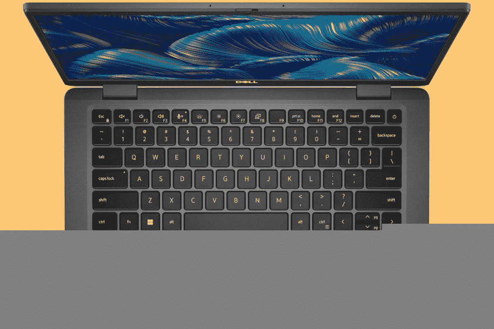

# Dell Latitude 7330 超轻评测:超轻而不妥协

> 原文：<https://www.xda-developers.com/dell-latitude-7330-ultralight-review/>

我真的很喜欢我们看到的超轻电脑。[戴尔](https://www.xda-developers.com/best-dell-laptops/)实际上在 Latitude 7330 的保护伞下提供了一系列产品。这是 Latitude 7330 Ultralight，重量只有 2.13 磅。它非常可爱，封装了英特尔 U 系列处理器、一系列端口和镁结构。

有一些缺点。与大多数现代笔记本电脑不同，它的显示屏为 16:9。此外，奇怪的是，它是唯一一款拥有 720p 摄像头而不是 [1080p 网络摄像头](https://www.xda-developers.com/best-laptops-1080p-webcam)的 Latitude 7330。如果您想要一台稍重一点的碳纤维材质 Latitude 7330 笔记本电脑，这就是您想要的。只是超轻机型没有。

不过，这款笔记本电脑非常棒，只要你不是在寻找绝对最好的网络摄像头。戴尔优化器提供了一些非常棒的功能，如为您、*和*与您通话的其他人降低人工智能噪音。很整洁。如果您正在寻找一台移动办公的笔记本电脑，这是一个非常好的选择。

 <picture></picture> 

Dell Latitude 7330 Ultralight

##### 戴尔 Latitude 7330

Dell Latitude 7330 有多种款式，但超轻型号的重量不到一千克，仍然装有英特尔第 12 代处理器、一系列端口等。

**浏览此评论:**

## Dell Latitude 7330 超轻定价和可用性

*   戴尔 Latitude 7330 超轻笔记本的起价为 1，895.19 美元
*   还有标准的 Latitude 7330 和 2 合 1 设备

如果您想购买戴尔的 Latitude 7330 系列产品，有多种产品可供选择。需要说明的是，我在过去评论过很多，它们几乎都很棒。它们都可以在 Dell.com 上买到，在同一个产品目录下。

我正在评测的是戴尔 Latitude 7330 Ultralight，这是 Latitude 7330 的 2.13 磅版本，起价为 1，895.19 美元，封装了 Core i5-1235U、16GB RAM 和 256GB SSD。该公司发给我的型号包括酷睿 i7-1265U、16GB 内存和 512GB 固态硬盘，目前售价为 2256.79 美元。

就像我说的，有各种各样的其他模型可供选择。有一台戴尔 Latitude 7330 二合一，明显是敞篷的。翻盖 Latitude 7330 也有碳纤维和铝两种型号。你可以认为碳纤维是一个“轻”模型，而不是“超轻”模型。

## 戴尔 Latitude 超轻规格

| 

处理器

 | 英特尔酷睿 i7-1265U |
| 

制图法

 | 英特尔 Iris Xe |
| 

显示

 | 16:9 13.3" FHD (1920 x 1080) WVA 非触控，400 尼特，sRGB 100%，防眩光，超低功耗，ComfortView 加低蓝光 |
| 

身体

 | 12.07 x 7.87 x 0.67 英寸(306.5 x 199.95 x 16.96 毫米)，2.13 磅(0.967 英寸) |
| 

记忆

 | 16GB DDR4，3200 MHz，集成双通道 |
| 

储存；储备

 | 512GB，M.2，PCIe NVMe 固态硬盘 |
|  | 2 个 USB Type-C Thunderbolt 4.0，带供电和显示端口 1.4 1 个 USB 3.2 Gen 1，带电源共享 1 个 HDMI 2.0 1x 个可选外部 uSIM 卡托架(仅限 WWAN 个可选接触式智能卡读卡器 1 个可选触摸指纹识别器，位于电源按钮 1 个通用音频插孔楔形锁插槽中 |
| 

连通性

 | 英特尔 Wi-Fi 6E (6GHz) AX211 2x2 +蓝牙 5.2 |
| 

多媒体

 | 高清摄像头体验:瞬时降噪，摄像头快门可选 FHD 红外摄像头体验:ExpressSign-in，智能隐私，环境光传感器，瞬时降噪，摄像头快门 2 个扬声器，Waves MaxxAudio Pro 2 个降噪麦克风，带神经降噪功能的智能音频通用音频插孔 |
| 

电池

 | 3 芯 41 瓦时聚合物，ExpressCharge 1.0，支持 ExpressCharge Boost 和长寿命 |
| 

操作系统（Operating System）

 | Windows 11 专业版 |
| 

价格

 | $2,282.85 |

## 设计:不到一公斤，但不止于此

*   它重 2.13 磅
*   有一个 USB A 型端口和两个 Thunderbolt 4 端口

正如我上面所说，Latitude 7330 有多种构建材料可供选择。铝是最重的，这是意料之中的。碳纤维更轻，镁最轻。Latitude 7330 超轻重量为 2.13 磅。大多数公司似乎以“不到一公斤”为目标，所以他们在 999 克或 2.22 磅左右着陆，所以这更进一步。

此外，虽然戴尔配置 Latitude 7330 的网站有点混乱，但我真的很喜欢该公司提供的各种设计，所有这些都是为企业设计的。碳纤维是黑色编织风格。这个装置上的镁是一种铜灰色。你有很多选择。

你的电脑包不用那么重。

重量为 2.13 磅，非常适合任何忙碌的人。此外，您可以为它配置蜂窝连接，因此只需将它放入包中，携带到任何地方，并在任何地方工作都非常简单。你的电脑包不用那么重。

就端口而言，两边都有[雷电 4](https://www.xda-developers.com/best-thunderbolt-4-laptops/) 端口。首先，Thunderbolt 已经成为我们认为是好的笔记本电脑的一个主食，但平心而论，大多数人并没有充分利用它。不过，你可以连接你选择的扩展坞进行适当的扩展。我特别喜欢的是两边各有一个。这看起来微不足道，但电缆会碍事，有时将充电端口放在另一边会更容易。

在左侧，只有一个 Thunderbolt 4 端口和一个 3.5 毫米音频插孔。右边是 Thunderbolt 端口、USB 3.2 Gen 1 Type-A 和 HDMI 2.0，因此这里有一个适当的端口阵列，这在您可能使用任何类型外设的商业环境中至关重要。可能是全新的外设，也可能是 2012 年的。

最终，这个设计并不特别性感，也不打算如此。这是一台[商务笔记本电脑](https://www.xda-developers.com/best-business-laptops/)，所以它并不意味着回头率。它应该更加实用，并且在那里完成工作。很轻，这才是关键卖点。

## 显示屏和键盘:这是标准的 FHD 屏幕和 Chiclet 风格的键盘

*   显示是 FHD，但奇怪的是 16:9
*   相机还是 720p

戴尔 Latitude 7330 超轻配备了 16:9 1，920x1，080 400 尼特的显示屏，这很好。奇怪的是，它是 16:9，就像 Latitude 7330 系列的其他产品一样。这在两年前是完全正常的，但市场上的大多数其他人都转向了 16:10 屏幕，以至于我遇到 16:9 的屏幕时会感到不舒服。

这是超轻型号的唯一显示选项。对于传统的翻盖，有 250、300 和 400 尼特的选项，当然，还有触摸和非触摸选项(超轻仅是非触摸)。敞篷车也有两种 300 尼特的选择。

这款显示器支持 100%的 sRGB、77%的 NTSC、82%的 Adobe RGB 和 83%的 P3，这都非常不错，尤其是对于一款商务笔记本电脑来说。这实际上更像是一台生产力机器，而不是一台需要精确色彩工作流程的创造力机器，因此它超出了人们的预期。它也是一个哑光防眩光显示屏，这在这种类型的设备上也很有帮助。

亮度达到 432.1 尼特，考虑到它超出了承诺的多少，这是非常令人敬畏的。对比度最高达到 1，400:1。

边框两侧较窄，顶部为网络摄像头留出了更多空间。可惜摄像头还是 0.9MP 传感器，还是 720p。此时，英特尔正在将 FHD 网络摄像头作为其最新 Evo 规范的一项建议，大多数商用笔记本电脑都包括 FHD 网络摄像头，惠普等公司甚至正在用 500 万像素的摄像头推动这一界限。

令人失望的是，戴尔最初在这方面领先。当在家工作的热潮在 2020 年开始时，花了很长时间才真正让笔记本电脑配备合适的网络摄像头。重新设计需要等待 12-18 个月。但戴尔是第一个，在一系列 Latitude 笔记本电脑中包含 FHD 网络摄像头，因为它已经计划这样做。遗憾的是，Latitude 7330 超轻没有 FHD 选项，这与 7330 系列的其他产品不同。事实上，FHD 网络摄像头是 7330 系列其余产品的标准配置。

公平地说，这是一个相当大的传感器，就 720p 标准而言，它是目前最好的网络摄像头之一。它只是不如其他商用笔记本电脑，考虑到当今的商业环境有多少是围绕着视频通话的，这是一个大问题。

键盘很标准。它使用戴尔 Latitude 中常见的背光 Chiclet 式按键。这是一个很好的键盘，但如果你正在寻找最好的打字体验，它仍然不是来自戴尔。再说一次，这不是说它不好。键盘很棒；只是惠普和联想在商务产品上做得更好而已。

## 性能:英特尔的第 12 代 U 系列确实不错

*   戴尔为该产品选择了英特尔的第 12 代 U 系列处理器，这是正确的选择

借助英特尔的第 12 代产品系列，公司可以为产品做出许多选择。一些公司正在推动新的 28W P 系列，而其他公司则选择更传统的 15W U 系列。我现在已经审查了其中的许多产品，包括一批使用 45W H 系列处理器而没有专用显卡的超极本。凭借对这些设备的丰富经验，我可以很自信地说，15W U 系列是几乎所有人的最佳选择，这也是戴尔选择 Latitude 7330 超轻系列的原因。

如我之前所说，这是一款专为移动办公打造的笔记本电脑。很擅长这个。它的一切都让人感觉快而爽快，这是应该的。这其中大部分包括仅仅通过浏览器工作，因为现在很多人都在工作。但我不得不承认，我最近在出差时带上了这台电脑和 ThinkPad X13s，虽然我的目的是在旅途中使用 ThinkPad，但我最终还是用这台 Latitude 在 Lightroom Classic 和 Photoshop 中进行了大量的照片编辑。

骁龙的个人电脑无法满足我的需求，这要归功于原生 Photoshop 应用程序的糟糕表现和缺乏原生浏览器。不过这不是重点。重点是 Dell Latitude 7330 Ultralight *可以*满足我的需求，虽然戴尔没有在此配置中包括 4G LTE，但它是一个选项，所以所有的好处都在那里。它在照片编辑方面做得很好，就像在生产力方面一样。这台笔记本电脑是救命恩人。

对于基准测试，我使用了 PCMark 10、3DMark: Time Spy、Geekbench 5、Cinebench R23 和 CrossMark。

|  | 

Latitude 7330 超轻酷睿 i7-1265U

 | 

[联想 ThinkPad X1 Carbon Gen 10](https://www.xda-developers.com/lenovo-thinkpad-x1-carbon-gen-10-review/) 酷睿 i7-1260P

 | 

惠普精英蜻蜓 G3 酷睿 i7-1265U

 |
| --- | --- | --- | --- |
| 

PCMark 10

 | 4,991 | 5,178 | 5,094 |
| 

3DMark:时间间谍

 | 1,225 | 1,761 | 1,717 |
| 

Geekbench 5(单/多)

 | 1,754 / 5,991 | 1,622 / 8,207 | 1,713 / 7,284 |
| 

Cinebench R23(单/多)

 | 1,568 / 5,677 | 1,309 / 7,115 | 1,692 / 6,756 |
| 

交叉标记(总体/生产力/创造力/反应能力)

 | 1,488 / 1,489 / 1,576 / 1,253 | 1,547 / 1,436 / 1,771 / 1,292 | 1,559 / 1,484 / 1,744 / 1,288 |

我在上面提到，15W 处理器仍然是这种类型产品的正确选择，如果你认为我已经忘记了，我仍然会告诉你为什么。原因来自于基准。这些机器不是为适应如此高的 TDPs 而设计的，所以功率通常不会保持得足够好，从而实际上获得比 28W 处理器甚至 45W 处理器更高的分数。

Latitude 7330 Ultralight 在同类产品中的基准测试实际上相当低，这还是不错的。[戴尔 Inspiron 灵越 14 二合一](https://www.xda-developers.com/dell-inspiron-14-2-in-1-2022-review/)实际上在 PCMark 10 上获得了 5305 分，这实际上超过了 ThinkPad X1 Carbon Gen 10 中的 28W 处理器获得的分数。当我测试配备 45W 酷睿 i7 的[华硕 Vivobook S 14X](https://www.xda-developers.com/asus-vivobook-s-14x-s5402-review/) 时，得分为 5233。

Latitude 7330 超轻笔记本电脑在这种尺寸和重量下性能最佳。

Latitude 7330 超轻版的电池续航时间相当一般。需要明确的是，这款设备配有 41 毫安时电池，但也有更大的 58 毫安时电池，这在配置价格上增加了大约 19 美元。很可能是值得的。

对于一些数字，我能得到的最好成绩是 5 小时 9 分钟，这并不太好。最差的是 2 小时 42 分钟，太可怕了。不过，平均来说，我发现你看到的是大约四个小时的电池寿命。不可怕，但绝对不好。

明确地说，我用真实世界的性能运行这些测试。我只是工作，然后记录它持续了多长时间。工作意味着使用 Vivaldi 浏览器、编辑照片、Slack、记事本和其他一些生产力应用程序。亮度大部分时间只有 25%左右，因为我发现这样很舒服(我把它设置为最小的舒适亮度)。

### 戴尔优化器

戴尔商用笔记本电脑的一个很酷的地方是，它有一个名为 Optimizer 的应用程序，该程序有许多简洁的功能。这里有一些例子。

首先，你可以调整热量以获得更好的性能，让它保持安静，等等。此外还有“自适应电池性能”，它应该可以在了解您如何使用 PC 的基础上获得更长的电池寿命。

网络类别有一个功能，它可以自动同时使用有线和无线网络，以获得更快的下载速度。您还可以选择五个最常用的应用程序，并针对这些应用程序优化您的电脑。

戴尔优化程序以有意义的方式改善您的会议体验。

可能最有趣的是音频类别。当你在打电话的时候，你可以在那里去除你的背景噪音。一个新的东西是，你实际上可以消除来自*别人的*流的背景噪音。非常棒。

Ultralight 上没有红外摄像头或类似的选项，因此除非您插入戴尔网络摄像头，否则存在检测类别不起作用。它提供了一个名为 ExpressSign-in 的功能，当你坐在电脑前时，它可以唤醒电脑并自动让你登录。但同样，它不适用于这台笔记本电脑。

## 您应该购买戴尔 Latitude 7330 超轻笔记本吗？

现在，是时候问这个问题了。该不该买？

**您应该购买 Dell Latitude 7330 超轻笔记本电脑，如果:**

*   你的工作是与生产力相关的
*   您经常出差，或者随身携带电脑
*   您的笔记本电脑有一个外置网络摄像头

**在以下情况下，您不应购买 Dell Latitude 7330 超轻笔记本电脑:**

*   你用电脑打了很多视频电话
*   你的工作流程包括创造性工作

如果你打很多视频电话，你最好用碳纤维型号，它稍微重一点，但配有 FHD 网络摄像头。

 <picture></picture> 

Dell Latitude 7330 Ultralight

##### 戴尔 Latitude 7330

Dell Latitude 7330 有多种款式，但超轻型号的重量不到一千克，仍然装有英特尔第 12 代处理器、一系列端口等。