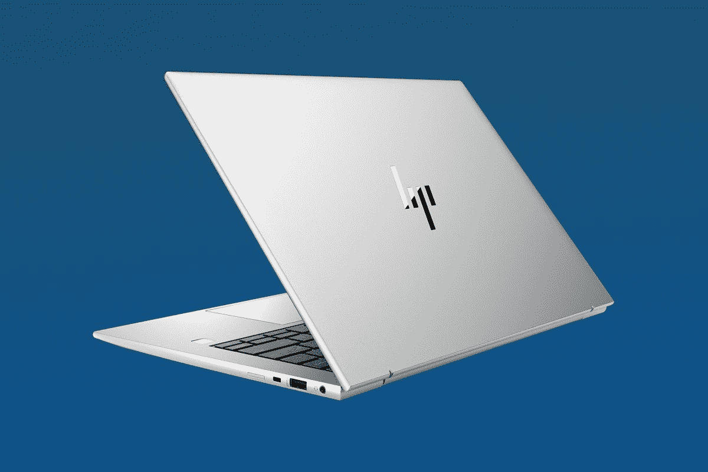
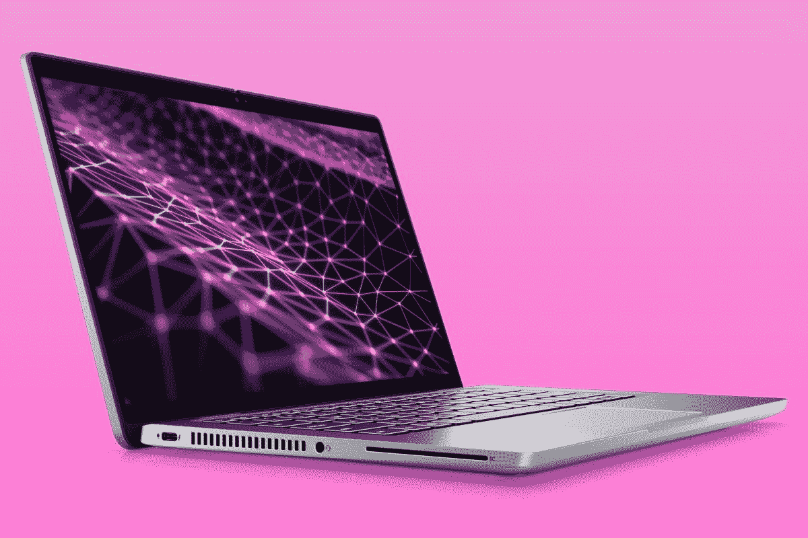

# 戴尔 Latitude 7330 与惠普 EliteBook 840 G9:哪个更好？

> 原文：<https://www.xda-developers.com/dell-latitude-7330-vs-hp-elitebook-840-g9/>

戴尔和惠普制造了一些属于 XPS 和 Spectre 品牌的令人惊叹的笔记本电脑，但不仅仅是消费设备。这两家公司都是 2022 年 T2 最佳商务笔记本电脑 T3 的幕后推手。两个完美的例子是[戴尔 Latitude 7330](https://www.xda-developers.com/dell-latitude-7330-ultralight-review/) 和惠普 EliteBook 840 G9，它们共享相似的第 12 代处理器和研究设计。所以你可能想知道哪个更适合你的现金。

在本指南中，我们将深入探讨这两款笔记本电脑背后的规格。我们将考察性能、显示屏、设计、键盘、触控板，甚至网络摄像头和整体连接性。请随意使用导航链接跳转到文章中的特定点。

**浏览本文:**

## 戴尔 Latitude 7330 与惠普 EliteBook 840 G9 规格对比:

| 

投机

 | 

戴尔 Latitude 7330

 | 

惠普 Elitebook 840 G9

 |
| --- | --- | --- |
| **操作系统** |  | 

*   Windows 11 专业版
*   Windows 11 专业教育版
*   Windows 11 主页
*   Windows 11 家庭单一语言
*   Windows 11 专业版
*   Windows 11 企业版通过批量许可协议提供)
*   Windows 10 专业版(通过 Windows 11 专业版的降级权限提供)
*   FreeDOS

 |
| **处理器** | 

*   第 12 代英特尔酷睿 i5-1235U (10 个内核，12 个线程，最高 4.4GHz，12MB 高速缓存)
*   第 12 代英特尔酷睿 i5-1245U 博锐企业版(10 个内核，12 个线程，最高 4.4GHz，12MB 高速缓存)
*   第 12 代英特尔酷睿 i7-1255U (10 个内核，12 个线程，最高 4.7GHz，12MB 高速缓存)
*   第 12 代英特尔酷睿 i7-1265U 博锐企业版(10 个内核，12 个线程，最高 4.8GHz，12MB 高速缓存)

 | 

*   第 12 代英特尔酷睿 i5-1250 处理器博锐
*   第 12 代英特尔酷睿 i7-1260 处理器
*   第 12 代英特尔酷睿 i7-1270 处理器博锐
*   第 12 代英特尔酷睿 i7-1280 处理器博锐

 |
| **图形** |  |  |
| **闸板** | 

*   高达 16GB DDR4，3200 MHz，集成

 | 

*   64 GB DDR5-4800 MHz RAM，非焊接，双通道支持

 |
| **存储** | 

*   高达 512GB m.2 PCIe NVMe 固态硬盘

 | 

*   256 GB 最高 2 TB PCIe Gen4x4 NVMe M.2 固态硬盘 TLC
*   256 GB 高达 512 GB PCIe Gen4x4 NVMe M.2 SED 固态硬盘 TLC
*   256 GB 高达 512 GB 的 PCIe NVMe 超值 M.2 固态硬盘

 |
| **显示** | 笔记本电脑:

*   超轻:13.3 英寸 16:9 全高清(1920 x 1080)，防眩光，超低功耗，触控，400 尼特，高清摄像头，无线局域网
*   笔记本电脑:13.3 英寸全高清(1920 x 1080)，防眩光，无触摸，250 尼特，高清 RGB 摄像头，碳纤维
*   笔记本电脑:13.3 英寸全高清(1920 x 1080)防眩光，超低功耗，无触摸，舒适视角+，WVA，400 尼特，全高清红外网络摄像头+ IP 无线局域网

2 合 1 设备:

*   13.3 英寸 16:9 全高清(1920 x 1080)，300 尼特，100% sRGB，防反光，防脏，超低功耗，康宁大猩猩玻璃 6 DXC，触摸，笔支持

 | 

*   14 英寸 WUXGA LED UWVA 防眩光(1920x1200) 250 尼特
*   14 英寸 WUXGA LED UWVA 防眩光(1920x1200) 400 尼特
*   14 英寸 WUXGA LED UWVA 防眩光(1920x1200) 250 尼特，触摸
*   14 英寸 WUXGA LED UWVA 防眩光(1920x1200)防眩光隐私屏幕，1000 尼特

 |
| **音频** | 

*   Waves MaxxAudio Pro 的双扬声器设置
*   双降噪麦克风

 | 

*   Bang & Olufsen 音频，双立体声扬声器，双阵列面向世界的麦克风

 |
| **网络摄像头** | 笔记本电脑:

*   带相机快门的高清相机

2 合 1 设备:

*   FHD/红外摄像机，带快速登录+智能隐私、瞬时降噪、摄像机快门

 |  |
| **Windows Hello** | 

*   是的，2 合 1 设备上有网络摄像头，笔记本电脑上有可选的指纹传感器

 | 

*   是的，某些型号上有红外和指纹识别器

 |
| **电池** | 

*   3 芯 41 瓦时电池
*   4 芯 58 瓦时电池
*   高达 90W 的 USB Type-C 电源适配器

 | 

*   长寿命 51 瓦时快速充电 3 芯电池

 |
| **端口** | 

*   2 个 Thunderbolt 4(USB C 型)
*   1 个 USB 3.2 第 1 代 A 型
*   1 个 HDMI 接口
*   3.5 毫米耳机插孔
*   Nano SIM 卡插槽(可选)
*   智能卡读卡器(可选)

 | 

*   2 个带 USB4 Type-C 的雷电 4
*   2 个超高速 USB 型
*   1 个 HDMI 2.0 接口
*   1 交流电源
*   耳机/麦克风组合

 |
| **连通性** | 

*   英特尔无线 6E
*   蓝牙 5.2
*   4G LTE 16 类/9 类

 | 

*   英特尔 AX211Wi-Fi 6E
*   蓝牙 5.3
*   英特尔 XMM 7560 R+LTE-Advanced Pro Cat 16 WWAN 宽带无线
*   英特尔 5000 5G 解决方案 WWAN 宽带无线

 |
| **颜色** |  |  |
| **尺寸** | 笔记本电脑:镁

*   12.07 x 7.87 x 0.67 英寸

笔记本电脑:碳纤维:

*   12.07 x 7.87 x 0.67 英寸

笔记本电脑:铝合金:

*   12.07 x 7.87 x 0.65 英寸

2 合 1 设备:

*   12.07 x 7.87 x 0.65 英寸

 | 

*   12.42 x 8.82 x 0.76 英寸

 |
| **重量** | 笔记本电脑:镁笔记本电脑:碳纤维:笔记本电脑:铝合金:2 合 1 设备: |  |
| **价格** |  |  |

## 性能:这是英特尔 U 系列对英特尔 P 系列

基于你在上面看到的规格，你会看到共同的主题。这两款笔记本电脑都配备了英特尔第 12 代处理器。然而有一点小小的不同。戴尔正在使用英特尔 U 系列芯片，而惠普将采用英特尔 P 系列。不需要太多技术，这些芯片运行在不同的功率，但提供相同类型的性能和效率核心。从长远来看，如果你选择戴尔，你应该最终获得更长的电池寿命(我们在测试中获得了大约四个小时)，因为 U 系列芯片的运行功率为 15 瓦。惠普的英特尔 P 系列芯片运行功率为 28 瓦。对于你的钱来说，这是一种更强大的力量，但你可能不会注意到。

我真的更喜欢笔记本电脑的电源，所以我会选择 P 系列，但电池也很重要。事实上，在我们的评估中，我们发现戴尔的 U 系列芯片性能非常好，尤其是在网页浏览和每项任务方面。您可以在我们在下面的评测中运行的基准测试中看到这一点，我们将它与采用 P 系列芯片的类似设备进行了比较。但请注意，性能会因设备配置的不同而有所差异。结果可能会有所不同，这些只是参考索赔和测试，因为我们还没有审查惠普。

|  | 

Latitude 7330 超轻酷睿 i7-1265U

 | 

[联想 ThinkPad X1 Carbon Gen 10](https://www.xda-developers.com/lenovo-thinkpad-x1-carbon-gen-10-review/) 酷睿 i7-1260P

 | 

惠普精英蜻蜓 G3 酷睿 i7-1265U

 |
| --- | --- | --- | --- |
| 

PCMark 10

 | 4,991 | 5,178 | 5,094 |
| 

3DMark:时间间谍

 | 1,225 | 1,761 | 1,717 |
| 

Geekbench 5(单/多)

 | 1,754 / 5,991 | 1,622 / 8,207 | 1,713 / 7,284 |
| 

Cinebench R23(单/多)

 | 1,568 / 5,677 | 1,309 / 7,115 | 1,692 / 6,756 |
| 

交叉标记(总体/生产力/创造力/反应能力)

 | 1,488 / 1,489 / 1,576 / 1,253 | 1,547 / 1,436 / 1,771 / 1,292 | 1,559 / 1,484 / 1,744 / 1,288 |

在整体性能方面没有太大的区别，但是请记住，基准测试并不总是等同于实际性能。这两款笔记本电脑对于日常事物来说还是相当快的。如果你在做密集的任务，你可能只需要一个非常强大的笔记本电脑。

影响性能的另一个因素是这些设备中的 RAM 容量。更多的内存通常意味着更好的性能。在这方面，惠普更胜一筹，因为您可以添加高达 64GB 的内存。戴尔只允许您使用高达 16GB 的内存。我怀疑普通办公室工作是否需要超过 16GB，除非是要求更高的工作，如轻度视频编辑或运行虚拟机。

## 显示器:惠普更好，它有 16:10

如果你考虑展示，有一件重要的事情要考虑。HP Elitebook 拥有更好、更大的 14 英寸 16:10 宽高比屏幕，并具有更高的 1920 x 1200 分辨率。在 Dell Latitude 上，它是一个标准的 13 英寸 FHD 1920 x 1080 面板，这在像这样的高端笔记本电脑上越来越不常见。我几乎不能再推荐 16:9 的笔记本电脑了。

总的来说，我更喜欢惠普的显示器。16:10 的宽高比允许您在屏幕上显示更多内容。在并排堆叠窗口和多任务处理时尤其如此。16:9 显示器要窄得多，您会在戴尔上注意到这一点，因为它的显示器底部很难看。由于相反的原因，惠普设备的屏幕更大，没有下巴，这使得惠普可以在 13 英寸的机箱中安装 14 英寸的屏幕！即使是 2 合 1 版本的 Dell Latitude 也有 16:9 的屏幕，这是一个遗憾，因为它可以用于许多其他方面。

总的来说，我们评测的时候，显示器支持 100% sRGB，77% NTSC，82% Adobe RGB，83% P3。我认为这对于你屏幕上的任何东西来说都是非常好的，尤其是商用笔记本电脑，惠普也应该推出类似的色域。哦，这两款笔记本电脑都有触摸选项，这通常对我来说是一个巨大的优势，因为你可以触摸屏幕来完成快速任务，如在文件上签名。

## 设计:戴尔 Latitude 还提供 2 合 1 设备

现在让我们进入设计，它考虑了这些设备的尺寸、重量和使用的材料。这里有很多事情需要你去思考。Dell Latitude 有多种设计选项，以及 2 合 1 设备。与此同时，HP EliteBook 只有一个翻盖外形。在这里，我选择戴尔，因为它有各种不同的设计选项。

除了二合一设备之外，您会发现 Dell Latitude 还有几个不同的选项。翻盖式有碳纤维、镁或铝。镁选项被戴尔称为“超轻”，是最薄的版本，只有 2.13 磅。我们看了这个单元，我会选择它。选择碳纤维或铝版本会增加 2.5 或 2.6 磅的重量。总的来说，所有型号的尺寸都相同，约为 0.65 英寸，所以这不是一个问题。

如果你看看惠普，它仍然是一个非常紧凑的笔记本电脑。它没有 16 英寸的设备大，从尺寸上看，它只是稍微大一点，重一点，重量为 2.99 磅，厚度为 0.76 英寸。然而，这并不是每个人都会注意到的。

仅考虑颜色和表面处理，戴尔有两种选择。你可以选择银色或深灰色。惠普的笔记本电脑只有银色。两个都不太令人兴奋，所以我们会让你挑选最适合你的。

## 网络摄像头、端口和连接性:惠普胜出

我们的最后一节将介绍这些笔记本电脑的连接、端口和网络摄像头。在这三个方面，惠普都更胜一筹。我这么说是因为惠普的网络摄像头质量更高。惠普还提供了添加 5G 连接的选项，这是目前越来越多的人正在寻找的。

通常，这两款笔记本电脑都配备了蜂窝连接、Wi-Fi 6E 和蓝牙 5。然而，由于可选的英特尔 5000 5G 解决方案 WWAN 宽带无线，惠普已经为 5G 做好了准备。戴尔的笔记本电脑最大支持 4G 网络，因此您可以在旅途中使用 HP EliteBook 获得更快的互联网速度。

看看端口，这是两款笔记本电脑都很棒的地方。您将能够过上无加密狗的生活。两款笔记本电脑上都有 2 个 Thunderbolt 4 端口，NanoSIM，智能卡，3.5 毫米耳机插孔，以及 HDMI 和 USB-A。如果对您重要，惠普还有一个 USB-A 端口。同样，这是很棒的东西，让你在旅途中也能轻松连接你最喜欢的配件。

我将以网络摄像头作为结束，惠普在这方面遥遥领先。他们的笔记本电脑有一个 5MP 传感器。戴尔的要么停留在高清，要么停留在 FHD。有软件可以帮助输出的图像在戴尔上看起来更好，但没有什么可以打败更大更好的传感器。从长远来看，您在惠普电脑上的通话效果会比在戴尔电脑上更好。红外摄像头在两台笔记本电脑上都是可选的，所以如果你想用你的脸登录你的电脑，你可以添加这个。

## 最终想法:购买惠普

在这两款笔记本电脑之间，选择惠普 Elitebook 840 G9 是一个公平的决定。这些设备的性能可能接近，但从其他方面来说，戴尔的 Latitude 很难让人信服。惠普在它的设备上安装了更好的网络摄像头，更好的连接，甚至更好的显示屏。如果您想购买 Dell Latitude 7330 或 HP Elitebook 840 G9，您可以通过下面的链接查看这两款产品。如果你决定不喜欢这些笔记本电脑，那么不要担心。你也可以看看其他几个更主流的型号，我们有一个收藏。

 <picture></picture> 

HP EliteBook 840 G9

##### 惠普 EliteBook 840 G9

HP EliteBook 840 G9 是一款高端商务笔记本电脑，具有高端规格和简洁的设计，非常适合办公使用。它还支持 5G 或 LTE，因此您可以在任何地方工作。

 <picture></picture> 

Dell Latitude 7330

##### 戴尔 Latitude 7330

Dell Latitude 7330 是一款优质、轻便的商用笔记本电脑，有翻盖式和折叠式两种外形。