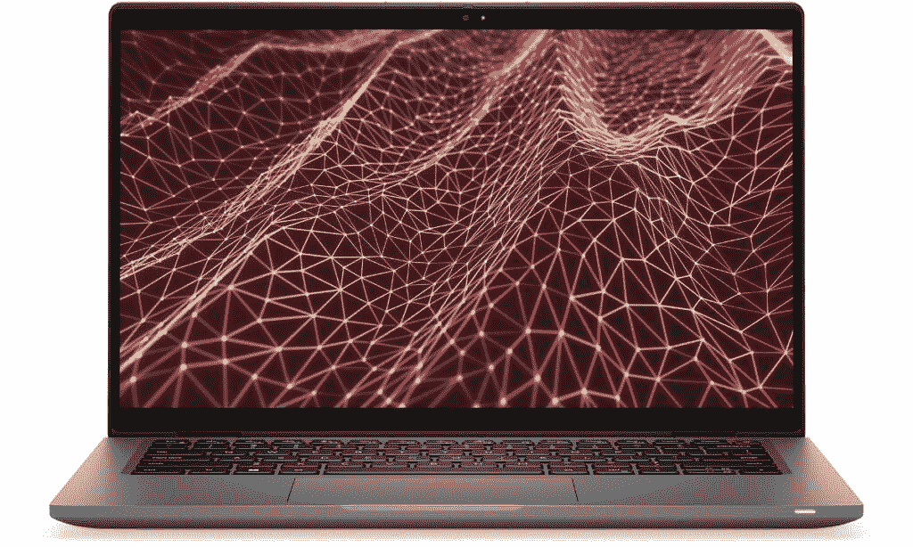
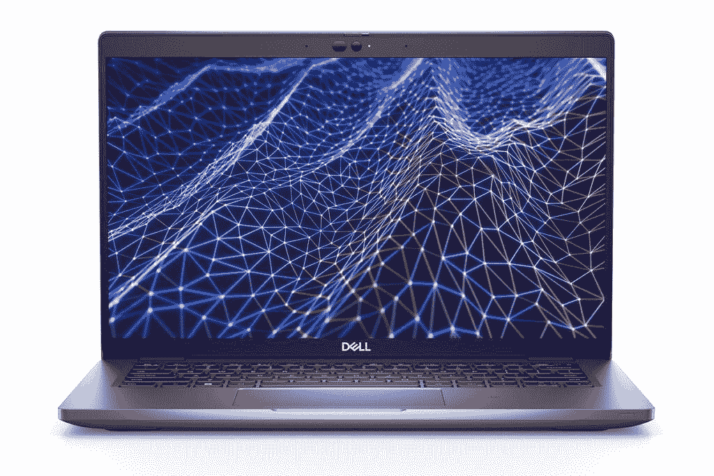

# 戴尔 Latitude 7430 与 Latitude 5430:哪一款适合您？

> 原文：<https://www.xda-developers.com/dell-latitude-7430-vs-latitude-5430/>

Dell Latitude 系列包括一些最好、最受欢迎的商用笔记本电脑，这里有适合每个人的东西。即使是在戴尔的产品中，也有非常不同的笔记本电脑可供选择，因此找到适合您的笔记本电脑非常重要。我们将在这方面提供帮助，在本文中，我们将对[戴尔 Latitude 7430](https://www.xda-developers.com/dell-latitude-7430/) 和 [Latitude 5430](https://www.xda-developers.com/dell-latitude-5430/) 进行比较，以帮助您选择其中一款。

马上，这些是针对略有不同的人群。与 7000 系列的其他产品一样，Dell Latitude 7430 更像是一款高端产品(尽管不如 9000 系列高端)，而 Latitude 5430 则更面向主流。这意味着设计上的一些差异可能会让你左右为难。让我们仔细看看。

**浏览本文:**

## 戴尔 Latitude 7430 与戴尔 Latitude 5430:规格

|  | 

戴尔 Latitude 7430

 | 

戴尔 Latitude 5430

 |
| --- | --- | --- |
| **操作系统** | 

*   Windows 11
*   Ubuntu(仅限笔记本电脑)

 |  |
| **CPU** | 

*   第 12 代英特尔酷睿 P 系列
    *   英特尔酷睿 i5-1240P (12 个内核，16 个线程，最高 4.4GHz，12MB 高速缓存)
    *   英特尔酷睿 i5-1250 博锐处理器(12 个内核，16 个线程，最高 4.4GHz，12MB 高速缓存)
    *   英特尔酷睿 i7-1270 博锐处理器(12 个内核，16 个线程，最高 4.8GHz，18MB 高速缓存)
*   第 12 代英特尔酷睿 U 系列(15W)
    *   英特尔酷睿 i5-1235U (10 个内核，12 个线程，最高 4.4GHz，12MB 高速缓存)
    *   英特尔酷睿 i5-1245U 博锐处理器(10 个内核，12 个线程，最高 4.4GHz，12MB 高速缓存)
    *   英特尔酷睿 i7-1255U (10 个内核，12 个线程，最高 4.7GHz，12MB 高速缓存)
    *   英特尔酷睿 i7-1265U 博锐处理器(10 个内核，12 个线程，最高 4.8GHz，12MB 高速缓存)

 | 

*   第 12 代英特尔酷睿 i3-1215U (6 个内核，8 个线程，最高 4.4GHz，10MB 高速缓存)
*   第 12 代英特尔酷睿 i5-1235U 博锐处理器(10 个内核，12 个线程，最高 4.4GHz，12MB 高速缓存)
*   第 12 代英特尔酷睿 i5-1245U 博锐企业版(10 个内核，12 个线程，最高 4.4GHz，12MB 高速缓存)
*   第 12 代英特尔酷睿 i7-1255U 博锐处理器(10 个内核，12 个线程，最高 4.7GHz，12MB 高速缓存)
*   第 12 代英特尔酷睿 i7-1265U 博锐企业版(10 个内核，12 个线程，最高 4.8GHz，12MB 高速缓存)
*   第 11 代英特尔酷睿 i5-1145G7 博锐处理器(4 个内核，8 个线程，最高 4.4GHz，8MB 高速缓存)

 |
| **图形** |  | 

*   英特尔 UHD 显卡(酷睿 i3)
*   英特尔 Iris Xe(酷睿 i5/i7)

 |
| **显示** | 

*   **笔记本电脑/翻盖**二合一
    *   14 英寸 16:9 FHD (1920 x 1080)，防眩光，250 尼特，45% NTSC
    *   14 英寸 16:9 FHD (1920 x 1080)，防眩光，300 尼特，72% NTSC
    *   14 英寸 16:9 FHD (1920 x 1080)，防眩光，300 尼特，72% NTSC，安全屏幕
    *   14 英寸 16:9 FHD (1920 x 1080)，防眩光，400 尼特，100% sRGB，超低功耗，低蓝光，ComfortView Plus
    *   14 英寸 16:9 UHD (3840 x 2160)，防眩光，400 尼特，100% sRGB，超低功耗，低蓝光，ComfortView Plus
    *   14 英寸 16:9 FHD+ (1920 x 1080)，防反光，防脏，300 尼特，100% sRGB，超低功耗，康宁大猩猩玻璃 6 DX，支持触摸和笔

 | 

*   14 英寸 16:9 高清(1366 x 768)，防眩光，220 尼特，45% NTSC
*   14 英寸 16:9 FHD (1920 x 1080)，防眩光，250 尼特，45% NTSC
*   14 英寸 16:9 FHD (1920 x 1080)，防眩光，300 尼特，100% NTSC，触摸
*   14 英寸 16:9 FHD (1920 x 1080)，防反光，防污染，400 尼特，100% sRGB，超低功耗
*   14 英寸 16:9 FHD (1920 x 1080)，防眩光，300 尼特，100% sRGB，安全屏幕(隐私屏幕)，触摸

 |
| **存储** | 

*   256GB PCIe NVMe 固态硬盘(35 级)
*   512GB PCIe NVMe 固态硬盘(35 级)
*   512GB 自加密 PCIe NVMe 固态硬盘(40 级)
*   1TB PCIe NVMe 固态硬盘(40 级)

 | 

*   256GB PCIe NVMe 固态硬盘(35 级)
*   512GB PCIe NVMe 固态硬盘(35 级)
*   512GB 自加密 PCIe NVMe 固态硬盘(40 级)
*   1TB PCIe NVMe 固态硬盘(40 级)
*   2TB PCIe NVMe 固态硬盘(40 级)

 |
| **公羊** | 

*   **英特尔 P 系列:**
    *   16GB LPDDR5 4800MHz RAM(焊接)
*   **英特尔 U 系列:**
    *   8GB DDR4 3200MHz RAM(焊接)
    *   16GB DDR4 3200MHz RAM(焊接)
    *   32GB DDR4 3200MHz RAM(焊接)

 | 

*   8GB (1 个 8GB) DDR4，3200MHz(带插槽)
*   8GB (2 个 4GB) DDR4，3200MHz(带插槽)
*   16GB (2 个 8GB) DDR4，3200MHz(带插槽)
*   32GB (2 个 16GB) DDR4，3200MHz(带插槽)
*   64GB (2 个 32GB) DDR4，3200MHz(带插槽)

 |
| **电池** | 

*   3 芯 41 瓦时电池
*   4 芯 58 瓦时电池
    *   高达 90W 的 USB Type-C 电源适配器

 | 

*   3 芯 41 瓦时电池
*   4 芯 58 瓦时电池
    *   高达 90W 的 USB Type-C 电源适配器

 |
| **端口** | 

*   2 个 Thunderbolt 4(USB C 型)
*   1 个 USB 3.2 第 1 代 A 型
*   1 个 HDMI 2.0 接口
*   3.5 毫米耳机插孔
*   microSD 读卡器
*   可选:微型 SIM 卡插槽
*   可选项:智能卡读卡器(已联系)

 | 

*   2 个 Thunderbolt 4(USB C 型)
*   2 个 USB 3.2 第 1 代 A 型
*   1 个 HDMI 2.0 接口
*   RJ45 以太网
*   3.5 毫米耳机插孔
*   microSD 读卡器
*   可选:微型 SIM 卡插槽
*   可选项:智能卡读卡器

 |
| **音频** | 

*   带 Waves MaxxAudio Pro 的双扬声器
*   双降噪麦克风

 | 

*   双高品质扬声器，Waves MaxxAudio Pro
*   双噪音消除麦克风

 |
| **摄像机** | 

*   带相机快门的 720p 高清网络摄像头
*   1080p 全高清+红外摄像头，带戴尔快速登录、智能隐私、环境光传感器和摄像头快门

 | 

*   带快门的 720p 高清网络摄像头
*   带快门的 1080p 全高清+红外摄像头，戴尔快速登录
*   1080p 全高清+红外摄像头，带快门戴尔快速登录，智能隐私，环境光传感器

 |
| **Windows Hello** | 

*   红外网络摄像头(可选)
*   电源按钮中的指纹识别器(可选)

 | 

*   红外网络摄像头(可选)
*   电源按钮中的指纹识别器(可选)

 |
| **连通性** | 

*   英特尔无线 6E
*   蓝牙 5.2
*   蜂窝选项:
    *   5G 低于 6GHz(高通骁龙 X55)
    *   4G LTE 第 16 类/第 9 类(高通骁龙 X20)

 | 

*   Wi-Fi 6E
*   蓝牙 5.2
*   可选:4G LTE Cat9(英特尔 XMM 7360)

 |
| **颜色** | 

*   泰坦灰(铝制车型)
*   黑色(碳纤维型号)

 |  |
| **尺寸(WxDxH)** | 

*   321.35 x 208.69 x 17.27 毫米(12.65 x 8.22 x 0.68 英寸)

 | 

*   321.35 x 212 x 19.3 毫米(12.65 x 8.35 x 0.76 英寸)

 |
| **重量** | 

*   笔记本电脑:起始重量为 1.22 千克(2.69 磅)
*   2 合 1 设备:起始重量为 1.35 千克(2.97 磅)

 | 

*   起始重量为 1.36 千克(3.01 磅)

 |
| **价格** | 起价 1，969 美元(MSRP) | 起价 1，419 美元(MSRP) |

关于这些配置，需要注意的一点是，有些配置只能通过戴尔网站上的正常购买页面获得，而有些配置只能通过访问高级配置页面获得。你可能不会马上看到它们。

## 性能:Dell Latitude 7430 有可选的 P 系列处理器

查看上面的规格表，您可以看到这两款笔记本电脑共享许多相同的 CPU 配置，但是，Dell Latitude 7430 确实有一些 Latitude 5430 没有的选项。具体来说，您可以选择配备英特尔 P 系列处理器的 Latitude 7430，该处理器具有更高的 TDP，以及更多的内核和线程，从而实现更快的性能。例如，在 Geekbench 5 基准测试中，英特尔酷睿 i7-1270P 与酷睿 i7-1265U 的对比如下:

|  | 

戴尔 Latitude 7430 英特尔酷睿 i7-1270P ( [参见测试](https://browser.geekbench.com/v5/cpu/15730928))

 | 

戴尔 Latitude 5430 英特尔酷睿 i7-1265U ( [参见测试](https://browser.geekbench.com/v5/cpu/15746126))

 |
| --- | --- | --- |
| Geekbench 5(单核/多核) | 1,726 / 9,163 | 1,778 / 7,462 |

不过，基准测试并不是性能的最终目标，实际性能可能会有所不同，因为您还必须考虑热量等因素。我们在 2022 年看到的一个趋势是，许多过去配备 U 系列处理器(15W TDP)的笔记本电脑现在都配备了 P 系列处理器，而没有对设计进行大的更改以适应更好的冷却需求，因此性能可能会在重负载下下降。

另一个要考虑的是电池寿命。p 系列处理器比 U 系列处理器耗电更多，这意味着它们消耗电池的速度更快。Dell Latitude 7430 和 5430 都有高达 58 瓦时的电池，但如果你选择前者的 P 系列处理器，它的续航时间不会像 U 系列处理器那样长。幸运的是，您可以选择，所以这不一定是 Latitude 5430 的优势-只是对于 U 系列处理器而言。

Dell Latitude 5430 使用插槽 RAM，这意味着您可以升级它。

Dell Latitude 5430 的一个明显优势是 RAM 的可升级性。Latitude 7430 配有焊接 RAM，因此无论您开箱选择何种配置，它都是您的不二之选。如果你使用 U 系列处理器，你可以选择 8GB、16GB 或 32GB，但 P 系列型号仅限于 16GB，所以你失去了一些自由。同时，Latitude 5430 可以配置高达 64GB 的 RAM，并且该 RAM 使用 SODIMM 插槽。这意味着你可以通过现在购买更便宜的配置来节省一些钱，如果你想要更多，以后再升级 RAM。这两款笔记本电脑都配有 DDR4 RAM，尽管 Latitude 7430 的 P 系列型号实际上使用 LPDDR5，这是一个潜在的优势。

至于存储，两款笔记本电脑都有 M.2 SSD 存储，配置也差不多。最大的区别在于，您可以为 Latitude 5430 配置高达 2TB 的容量，而 7430 的容量上限为 1TB。

## 展示:两者都是比较基础的

说到显示器，这两款笔记本电脑肯定有一些值得注意的差异，但它们都不太特别。Dell Latitude 7430 绝对有优势，从基本配置中的全高清(1920 x 1080)显示屏开始，对于一般办公室使用来说应该绰绰有余。如果你有钱花，戴尔还提供了超高清(3840 x 2160)选项，对于这种尺寸来说非常清晰，看起来应该很棒。

 <picture></picture> 

Dell Latitude 7430

戴尔 Latitude 5430 在这方面就没那么令人印象深刻了。首先，基本配置的分辨率只有区区 1366 x 768，这对于 2022 年的昂贵笔记本电脑来说实在不理想。您可以升级到全高清，获得与 Dell Latitude 7430 类似的体验，但这是您所能做到的最大限度。没有超高清甚至四高清选项，因此如果您想要一个超清晰的屏幕，Dell Latitude 7430 就是您的选择。

两款笔记本电脑都提供触摸屏作为可选升级，但有一点需要注意的是，Dell Latitude 7430 也可以作为 2 合 1 笔记本电脑提供，因此它不仅支持触摸屏，实际上还可以作为平板电脑使用。

 <picture></picture> 

Dell Latitude 5430

在采用更好的网络摄像头方面，戴尔是速度较慢的公司之一，所以在这两款笔记本电脑中，我们都在考虑采用 720p 摄像头的基本配置。幸运的是，你可以升级到 1080p 相机，获得更好的图像质量。大多数全高清网络摄像头配置还包括用于 Windows Hello 面部识别的红外摄像头，这使得解锁您的 PC 更加方便。在这一点上，如果你喜欢的话，这两款笔记本电脑都有可选的指纹识别器。

至于声音，每台笔记本电脑都有两个由 Waves MaxxAudio 驱动的扬声器，以及用于通话和会议的双阵列麦克风。这些应该提供足够可靠的体验，但扬声器不会是最身临其境的。

## 设计:戴尔 Latitude 7430 更薄更轻

作为更高端的笔记本电脑，意味着 Dell Latitude 7430 更加注重设计，这需要一些东西。首先，它更紧凑，厚度为 17.27 毫米，重量为 2.69 磅。即使是 2 合 1 机型也只有 2.97 磅重，仍然比 Latitude 5430 略轻。

事实上，该型号的起始重量为 3.01 磅，厚度也明显更厚，为 19.3 毫米。不过，这是与更便宜的笔记本电脑的预期交换，在这种情况下，你会得到一些回报。机箱中的额外空间意味着 RAM 是可升级的，正如我们已经提到的，另外您还可以获得一些额外的端口。

Latitude 7430 有铝制和碳纤维两种型号。

至于外观，不可否认的是它更具启发性，我们仍然会给 Dell Latitude 7430 加分，因为它给了您更多的选择。你可以选择铝模型，它有泰坦灰(也就是说银色)，或者碳纤维模型，它有一个近乎黑色的配色。与此同时，Latitude 5430 仅提供铝色，并有暗银色调。

## 端口和连接性:商用笔记本电脑功能多样

最后，让我们谈谈端口，这是商用笔记本电脑通常擅长的。Dell Latitude 7430 和 5430 都有很好的端口供应，但作为更大的笔记本电脑，Latitude 5430 实际上在这方面有优势。Dell latitude 7430 配有两个 Thunderbolt 4 (USB-C)端口、一个 USB Type-A 端口、HDMI 2.0、一个耳机插孔和一个 microSD 读卡器。您还可以获得一个可选的内置智能卡读卡器。

Dell Latitude 5430 具有几乎相同的设置，但有两个额外的端口-另一个 USB Type-A 端口和 RJ45 以太网。如果你依赖有线互联网连接，这是一个相当大的问题，因为你不需要任何适配器来获得更可靠的互联网。

除了物理端口之外，还有无线连接，在这方面，Dell Latitude 7430 遥遥领先。正如您所料，这两款笔记本电脑都支持 Wi-Fi 6E 和蓝牙 5.2，但 Latitude 7430 有更好的蜂窝选项。如果你想更适应未来，你可以选择 4G LTE 或 5G 支持，两者都由高通调制解调器驱动。同时，Latitude 5430 仅提供 4G LTE，由英特尔 XMM 7360 调制解调器提供支持。然而，5G 支持在速度上并不是一个巨大的优势，所以这根本不是一个必要的升级。

## 戴尔 Latitude 7430 与 Latitude 5430:最终想法

与任何事情一样，在这两者之间做出选择取决于你个人的优先考虑，但是它们都有明显的优点和缺点。如果您看重 2 合 1 外形，Dell Latitude 7430 是您的不二之选。这意味着你可以将它用作笔记本电脑或平板电脑，或者以几种不同的模式用于媒体消费和浏览网页，因此你肯定会获得更多的多功能性。

由于采用了 P 系列处理器，Dell Latitude 7430 还具有性能更快的配置、可选的 4K 显示屏，以及可选的 5G 支持(如果您想走在前沿)。这也是一款更紧凑的笔记本电脑，它有两种颜色可供选择，如果你想选择一种更符合你风格的外观，这是很好的选择。

另一方面，您可能会喜欢 Dell Latitude 5430，因为它提供可升级的 RAM，这意味着您现在可以省钱，以后在预算允许的情况下可以升级。您还可以配置更多现成的存储空间。这个也有更多的端口，包括以太网，所以可能会更方便一点。

最后要考虑的是价格，特别是因为 Dell Latitude 5430 的起价比 7430 低得多。如今，这两款笔记本电脑都有一些折扣，但在撰写本文时，Latitude 5430 的起价约为 1400 美元，而 Latitude 7430 的起价约为 1679 美元。你可以用更便宜的型号获得更多的升级空间。

不管你的选择是什么，你都可以通过下面的链接购买任何一款笔记本电脑。否则，考虑看看最好的戴尔笔记本电脑，看看其他一些不是以业务为导向的选项。如果您想看看戴尔以外的产品，我们还有一份最佳笔记本电脑列表。

 <picture></picture> 

Dell Latitude 7430

##### 戴尔 Latitude 7430

Dell latitude 7430 配备第 12 代英特尔酷睿处理器和其他顶级规格，适合企业用户。

 <picture></picture> 

Dell Latitude 5430

##### 戴尔 Latitude 5430

Dell Latitude 5430 是一款高度可配置的商用笔记本电脑，采用第 12 代英特尔处理器和高端设计。