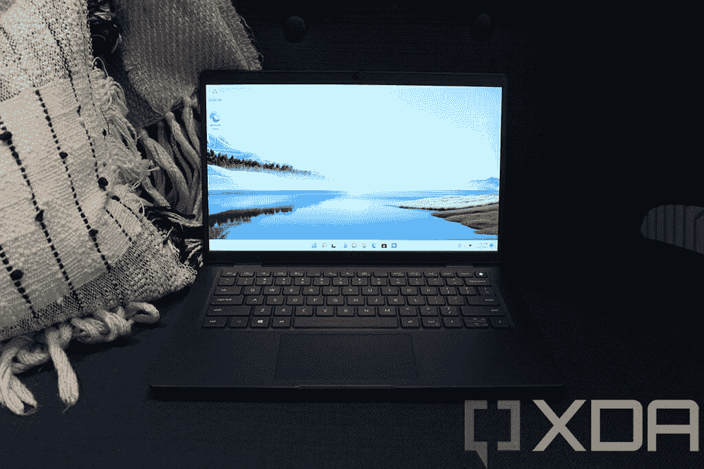
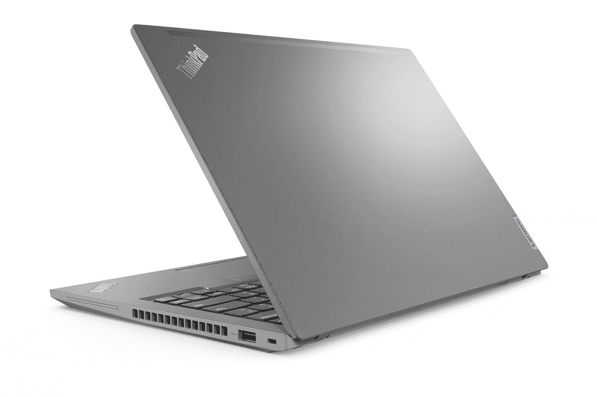

# 戴尔 Latitude 7430 与联想 ThinkPad T14 Gen 3:你应该买哪个？

> 原文：<https://www.xda-developers.com/dell-latitude-7430-vs-lenovo-thinkpad-t14-gen-3/>

随着英特尔的第 12 代 Alder Lake 处理器开始推出，我们看到越来越多的笔记本电脑采用了新的 CPU。目前，似乎大多数新的笔记本电脑都是[商务笔记本电脑](https://www.xda-developers.com/best-business-laptops/)，这意味着许多新的选择正在涌现。如果你在选择上有困难，我们会帮助你。在本文中，我们将对新款[戴尔 Latitude 7430](https://www.xda-developers.com/dell-latitude-7430/) 和[联想 ThinkPad T14 Gen 3](https://www.xda-developers.com/lenovo-thinkpad-t14-gen-3/) 进行比较，这两款主流商务笔记本电脑都提供了很多功能。

与戴尔的许多商用笔记本电脑一样，Latitude 7430 有翻盖式和二合一两种版本，而 ThinkPad T14 只是一款翻盖式笔记本电脑。即使不进行更多的技术比较，这也能让你马上做出决定。尽管如此，比较这两者来看看哪一个对你来说是更好的选择还是值得的。

**浏览本文:**

## 戴尔 Latitude 7430 与联想 ThinkPad T14 Gen 3:规格

|  | 

戴尔 Latitude 7430

 | 

联想 ThinkPad T14 Gen 3

 |
| --- | --- | --- |
| **操作系统** | 

*   Windows 11
*   Ubuntu(仅限笔记本电脑)

 |  |
| **CPU** | 

*   第 12 代英特尔酷睿 P 系列
    *   英特尔酷睿 i5-1240P (12 个内核，16 个线程，最高 4.4GHz，12MB 高速缓存)
    *   英特尔酷睿 i5-1250 博锐处理器(12 个内核，16 个线程，最高 4.4GHz，12MB 高速缓存)
*   第 12 代英特尔酷睿 U 系列(15W)
    *   英特尔酷睿 i5-1235U (10 个内核，12 个线程，最高 4.4GHz，12MB 高速缓存)
    *   英特尔酷睿 i5-1245U 博锐处理器(10 个内核，12 个线程，最高 4.4GHz，12MB 高速缓存)
    *   英特尔酷睿 i7-1255U (10 个内核，12 个线程，最高 4.7GHz，12MB 高速缓存)

 | 

*   **英特尔**
    *   最高可配第 12 代英特尔酷睿 i7 博锐 P 系列和 U 系列处理器
*   **AMD**
    *   最高可配 AMD 锐龙 6000 PRO 处理器(20W)

 |
| **图形** | 

*   英特尔 Iris Xe(集成)

 | 

*   **英特尔:**
    *   **综合**
        *   英特尔 UHD 显卡(酷睿 i3)
        *   英特尔 Iris Xe(酷睿 i5/酷睿 i7)
    *   **离散**(可选)
        *   NVIDIA GeForce MX550
        *   英伟达 GeForce RTX 2050
*   **AMD**
    *   AMD 镭龙显卡 600M(集成)

 |
| **显示** | 

*   **笔记本电脑/翻盖**二合一
    *   14 英寸 16:9 FHD+ (1920 x 1080)，防眩光，250 尼特，45% NTSC
    *   14 英寸 16:9 FHD+ (1920 x 1080)，防眩光，300 尼特，72% NTSC
    *   14 英寸 16:9 FHD+ (1920 x 1080)，防眩光，300 尼特，72% NTSC，安全屏幕
    *   14 英寸 16:9 FHD+ (1920 x 1080)，防眩光，400 尼特，100% sRGB，超低功耗，低蓝光，ComfortView Plus
    *   14 英寸 16:9 FHD+ (1920 x 1080)，防反光，防脏，300 尼特，100% sRGB，超低功耗，康宁大猩猩玻璃 6 DX，支持触摸和笔

 | 

*   14 英寸 16:10 全高清+ (1920 x 1200) IPS，防眩光，300 尼特
*   14 英寸 16:10 全高清+ (1920 x 1200) IPS，防眩光，300 尼特，触控
*   14 英寸 16:10 全高清+ (1920 x 1200) IPS，低功耗，防眩光，400 尼特，100% sRGB
*   14 英寸 16:10 全高清+ (1920 x 1200) IPS，隐私保护，防眩光，500 尼特，100% sRGB
*   14 英寸 16:10 2.2K (2240×1400) IPS，防眩光，300 尼特
*   14 英寸 16:10 超高清+ (3840 x 2400) IPS，防眩光，防反射，防污迹，500 尼特，100% DCI-P3，HDR 400，杜比视觉，触摸(AOFT)

 |
| **存储** | 

*   256GB PCIe NVMe 固态硬盘(35 级)
*   512GB PCIe NVMe 固态硬盘(35 级)
*   512GB 自加密 PCIe NVMe 固态硬盘(40 级)
*   1TB PCIe NVMe 固态硬盘(40 级)

 |  |
| **公羊** | 

*   **英特尔 P 系列:**
    *   16GB LPDDR5 4800MHz RAM(焊接)
*   **英特尔 U 系列:**
    *   8GB DDR4 3200MHz RAM(焊接)
    *   16GB DDR4 3200MHz RAM(焊接)
    *   32GB DDR4 3200MHz RAM(焊接)

 | 

*   **英特尔:**
    *   最高 48GB DDR4 双通道(最高 16GB 焊接+最高 32GB SODIMM)
*   **AMD:**
    *   高达 32GB LPDDR5 6400MHz 双通道(焊接)

 |
| **电池** | 

*   3 芯 41 瓦时电池
*   4 芯 58 瓦时电池
    *   高达 90W 的 USB Type-C 电源适配器

 | 

*   39.3 瓦时电池(仅限集成显卡)
*   52.5 瓦时电池

 |
| **端口** | 

*   2 个 Thunderbolt 4(USB C 型)
*   1 个 USB 3.2 第 1 代 A 型
*   1 个 HDMI 2.0 接口
*   3.5 毫米耳机插孔
*   microSD 读卡器
*   可选:Nano SIM 卡插槽
*   可选项:智能卡读卡器(已联系)

 | 

*   **英特尔:** 2 个迅雷 4 / USB Type-C
*   **AMD:** 2 个 USB 3.2 Gen 2 Type-C
*   2 个 USB 类型 A (USB 3.2 第 1 代)
*   1 个 HDMI 2.0b 接口
*   1 个 RJ45 以太网
*   3.5 毫米组合耳机插孔
*   SIM 卡插槽

 |
| **音频** | 

*   带 Waves MaxxAudio Pro 的双扬声器
*   双降噪麦克风

 | 

*   带有杜比语音的杜比音频扬声器系统
*   双麦克风

 |
| **摄像机** | 

*   带相机快门的 720p 高清网络摄像头
*   1080p 全高清+红外摄像头，带戴尔快速登录、智能隐私、环境光传感器和摄像头快门

 | 

*   720p 高清摄像头
*   1080p 全高清摄像头
*   1080p 全高清摄像头+红外摄像头

 |
| **Windows 你好** | 

*   红外网络摄像头(可选)
*   指纹传感器(可选)

 | 

*   红外网络摄像头(可选)
*   电源按钮中的指纹识别器

 |
| **连通性** | 

*   英特尔无线 6E
*   蓝牙 5.2
*   蜂窝选项:
    *   5G 子 6
    *   4G LTE 16 类/9 类

 | 

*   英特尔无线 6E
*   蓝牙 5.2
*   蜂窝选项:

 |
| **颜色** | 

*   银色(铝制型号)
*   黑色(碳纤维型号)

 | 

*   风暴灰色
*   雷霆黑(**英特尔:**可选抗菌表面处理)

 |
| **尺寸(WxDxH)** | 

*   321.35 x 208.69 x 17.27 毫米(12.65 x 8.22 x 0.68 英寸)

 | 

*   317.7 x 226.9 x 17.9 毫米(12.51 x 8.93 x 0.70 英寸)

 |
| **重量** | 

*   笔记本电脑:起始重量为 1.22 千克(2.69 磅)
*   2 合 1 设备:起始重量为 1.35 千克(2.97 磅)

 | 

*   起始重量为 1.21 千克(2.65 磅)

 |
| **价格** | 起价 1969 美元 | 起价 1，299 美元(AMD) /(英特尔) |

## 性能:ThinkPad T14 拥有更好的 GPU 选项

让我们先来看看性能，就 CPU 而言，这两款设备之间应该不会有太大差异。Dell Latitude 7430 和联想 ThinkPad T14 Gen 3 都配备了英特尔的第 12 代处理器，并且都包括 U15 或 P 系列处理器，因此可以预计它们处于相同的水平。ThinkPad T14 也为您提供了 AMD 锐龙 Pro 6000 系列处理器的选项，这可能就是一些差异所在。

根据 Geekbench 5 基准测试分数(仍为时尚早)，AMD 的锐龙处理器性能可能介于英特尔的 U15 系列和 28W P 系列之间，尽管更接近于前者。同样，这些仍然是早期的结果，还没有足够的测试来了解每个处理器的平均性能，但我们可以知道它看起来像什么。此外，请记住，Geekbench 5 只测试 CPU 性能，因此还有其他因素可能会影响整体的实际性能。

|  | 

英特尔酷睿 i7-1280P( [参见测试](https://browser.geekbench.com/v5/cpu/13331030))

 | 

英特尔酷睿 i7-1265U( [参见测试](https://browser.geekbench.com/v5/cpu/12860339))

 | 

AMD 锐龙 7 Pro 6850U( [见测试](https://browser.geekbench.com/v5/cpu/12901659))

 |
| --- | --- | --- | --- |
| Geekbench 5(单核/多核) | 1,790 / 9,312 | 1,253 / 6,643 | 1,530 / 7,520 |

值得注意的一点是，联想 ThinkPad T14 可能会从较低的配置开始。戴尔的 Latitude 7000 系列笔记本电脑通常会配备酷睿 i5 CPU，但联想 ThinkPad T14 似乎会配备酷睿 i3 或 AMD 锐龙 3 处理器。这也是起拍价差异如此之大的原因之一。

然而，这两款笔记本电脑最大的不同在于 GPU。Dell Latitude 7430 仅提供集成的 Iris Xe 显卡，但联想 ThinkPad T14 Gen 3 为您提供了英特尔型号的独立显卡选项，特别是 NVIDIA GeForce MX550 或 GeForce RTX 2050。如果你想使用需要 3D 渲染的应用，包括一些休闲游戏，这是一个很大的性能提升。此外，AMD 型号配备了新的集成显卡，AMD 声称它甚至比 NVIDIA GeForce MX450 更快。

值得注意的是，虽然上面的比较使用的是上一代酷睿 i7-1165G7，但英特尔第 12 代处理器中的集成显卡几乎没有变化。您仍然可以从 AMD 处理器获得更好的 GPU 性能。总的来说，如果你想要一个相当强大的 GPU，联想 ThinkPad T14 Gen 3 绝对是更好的选择。

除此之外，ThinkPad T14 Gen 3 的内存更大，最高可达 48GB，但仅限于基于英特尔的版本。除此之外，这两款笔记本电脑的最大容量都是 32GB，尽管 AMD 版本的 ThinkPad 也支持更快的 LPDDR5 RAM，速度高达 6400MHz。对于存储，您可以为联想笔记本电脑配置高达 2TB 的固态硬盘，而 Latitude 7430 的固态硬盘容量为 1TB。当然，这将带来价格的大幅上涨，但至少你有选择权。

Latitude 7430 的电池略大。

Latitude 7430 可能领先的一个方面是电池寿命。这两款笔记本电脑都提供了两种配置，但在这两种情况下，Latitude 7430 都胜出了，低端为 41 瓦时，高端为 39.3 瓦时，高端为 58 瓦时，高端为 52.5 瓦时。此外，由于 ThinkPad T14 在更高层集成了显卡，它会更快地耗尽电池。

## 显示屏:联想的笔记本电脑屏幕更高(更清晰)

联想 ThinkPad T14 Gen 3 相对于戴尔 Latitude 7430 的另一个优势在于显示屏。ThinkPad T14 配备了 14 英寸的显示屏，长宽比为 16:10，比典型的笔记本电脑显示屏高。众所周知，这些较高的屏幕极大地提高了工作效率，因为它们提供了更大的工作表面积。例如，使用更高的屏幕，您可以在不滚动的情况下在网页上看到更多文本，或者在编辑视频时在时间线上看到更多轨道。

最重要的是，您可以为 ThinkPad T14 配置全高清+ (1920 x 1200)、2.2K (2240 x 1400)或超高清+ (2840 x 2400)面板，让您可以选择更清晰的显示屏。当然，也有像触摸支持或隐私屏幕这样的选项。

同时，Dell Latitude 7430 配备了 14 英寸显示屏，但采用了更传统的 16:9 宽高比，因此您无法获得更高屏幕的优势。此外，每种配置都采用全高清(1920 x 1080)分辨率。明确地说，这还不错，但你可以选择用 ThinkPad 走得更远。

 <picture></picture> 

Dell Latitude 7330 (overall design is identical to the 7430)

Dell Latitude 的一个好处是，您可以获得 2 合 1 型号，这意味着它支持触摸、有源笔，并且覆盖有康宁大猩猩玻璃，因此感觉更高端。另外，当然，如果你愿意，你可以把它当作平板电脑来使用。

至于声音，这两款笔记本电脑都有双扬声器系统，戴尔利用了其与 Waves MaxxAudio 的常见合作关系，而联想声称 ThinkPad T14 支持杜比音频。这两款笔记本电脑也有双麦克风，联想还宣传杜比语音支持，以获得更清晰的语音拾取和背景噪音降低。

这两款笔记本电脑都为您提供了全高清网络摄像头选项。

在显示屏上方，这两款笔记本电脑让您可以选择高清或全高清网络摄像头，很高兴看到这种摄像头变得越来越普遍。网络摄像头变得越来越重要，它们往往很糟糕，因此拥有全高清选项非常受欢迎。如果你想更方便地登录，这两款笔记本电脑都提供了 Windows Hello 面部识别选项。

## 设计:戴尔 Latitude 7430 感觉更现代一些

到目前为止，比较主要倾向于联想的笔记本电脑，但这是戴尔可能拥有优势的一个领域，这取决于你的口味。Latitude 7430 与您预期的商用笔记本电脑一样低调，但它看起来确实相当现代。它有一个全金属底盘，你可以选择银色铝模型或黑色碳纤维变体。设计干净利落，即使对于比较休闲的用户来说有点枯燥。

与此同时，联想 ThinkPad T14 Gen 3 吸引了 ThinkPad 的长期粉丝，而且主要是他们。它有两种颜色，雷霆黑或风暴灰，但无论哪种，它都非常像 ThinkPad。你得到了标志性的红色口音和功能，如触摸板上的红色跟踪点和重复的鼠标按钮，感觉就像很久以前的遗物。这些东西是迎合一个非常具体的观众，如果你不是其中的一部分，你可能不会喜欢这个设计。

从更实际的角度来说，这两款笔记本电脑是相似的。起始重量大致相同，不过 ThinkPad T14 的厚度为 17.9 毫米，略厚于 Latitude 的 17.27 毫米。由于显示器的长宽比，戴尔 Latitude 7430 更宽，但联想 ThinkPad T14 更高。

## 端口和连接:一个有以太网，另一个有 5G

除了连接和端口，这两款笔记本电脑有一些共同点，但也有一些主要差异。让我们从端口开始。Dell Latitude 7430 有两个 Thunderbolt 4 端口、一个 USB Type-A 端口、HDMI、一个耳机插孔和一个 microSD 读卡器。您还可以添加可选的智能卡读卡器和 nano-SIM 卡插槽，以支持蜂窝电话。

同时，联想 ThinkPad T14 Gen 3 在英特尔型号上有两个 Thunderbolt 4 端口(在 AMD 版本上有 USB 3.2 Gen 2 Type-C)，两个 USB Type-A 端口，HDMI，RJ45 以太网，一个耳机插孔和一个可选的 SIM 卡插槽。作为 Latitude 上智能卡读卡器选项的交换，如果您需要有线互联网连接，您可以获得一个额外的 USB Type-A 端口和 RJ45 以太网。智能卡读卡器是一个非常特殊的需求，我们会说你更可能想要额外的 USB 和以太网，但这取决于你。

Dell Latitude 7430 具有 5G 功能，因此您可以获得更快的移动数据传输速度。

在无线连接方面，两款笔记本电脑都支持 Wi-Fi 6E、蓝牙 5.2 和可选的蜂窝连接。然而，这是另一个显著的不同之处。除了 4G LTE(ThinkPad 也支持)，Dell Latitude 还为您提供了添加 5G 支持的选项。5G 是一种更新的蜂窝网络，承诺提供更大的带宽和更高的速度。它仍处于早期阶段，但随着时间的推移，5G 的好处将变得更加明显，你将通过 5G 调制解调器更加适应未来。当然，4G LTE 还将存在几年，所以如果你计划在几年后再次升级，你现在不需要在 5G 上花费额外的费用。

## 戴尔 Latitude 7430 与联想 ThinkPad T14 Gen 3:最终想法

考虑到所有这些差异，您应该选择哪一款笔记本电脑呢？虽然这最终取决于您的需求，但有几个原因可以解释为什么您可能更喜欢其中一个。

如果你想要更高的图形处理能力、更大的内存(尽管只有英特尔型号才有这种优势)或更大的存储空间，你可能需要联想 ThinkPad T14 Gen 3。它还有一个更好的显示器，一个额外的 USB Type-A 端口和 RJ45 以太网，如果你依赖有线互联网接入，这可能会派上用场。当然，也有可能你是经典 ThinkPad 设计的粉丝，在这种情况下，这也是一个优势。

另一方面，Dell Latitude 7430 具有 2 合 1 外形的优势。如果你像我一样，这可能是一件大事-我个人不会购买不是二合一的笔记本电脑。它还应该有略好的电池寿命，它给你 5G 连接的选项，你可以得到一个智能卡读卡器，这可能对一些企业非常重要。与 ThinkPad T14 更老派的外观相比，你可能更喜欢更现代的设计。

最后要考虑的是这些笔记本电脑的价格。联想 ThinkPad T14 的 AMD 版本起价为 1199 美元，英特尔版本起价为 1299 美元。这远远低于 Dell Latitude 7430 的 1969 美元的起价，尽管公平地说，我们还不知道这两款机型的基本规格。

这也是因为它们都还不能买到。你可以在联想的网站上查看一下联想 ThinkPad T14，但是现在还买不到(应该是 6 月份上市)。Latitude 7430 预计将于 4 月推出，但在撰写本文时您还找不到它。如果你现在想买一台新的笔记本电脑，看看我们列出的[最佳 ThinkPad](https://www.xda-developers.com/best-thinkpads/)或[最佳戴尔笔记本电脑](https://www.xda-developers.com/best-dell-laptops/)，看看每家公司能提供什么。

 <picture></picture> 

Lenovo ThinkPad T14 Gen 3 (Intel)

##### 联想 ThinkPad T14 Gen 3

联想 ThinkPad T14 配备了最新的英特尔或 AMD 处理器，此外它还拥有高达超高清+分辨率的 16:10 显示屏。

 <picture></picture> 

Dell Latitude 7430

##### 戴尔 Latitude 7430

Dell Latitude 7430 配备第 12 代英特尔酷睿处理器和其他顶级规格，适合企业用户。