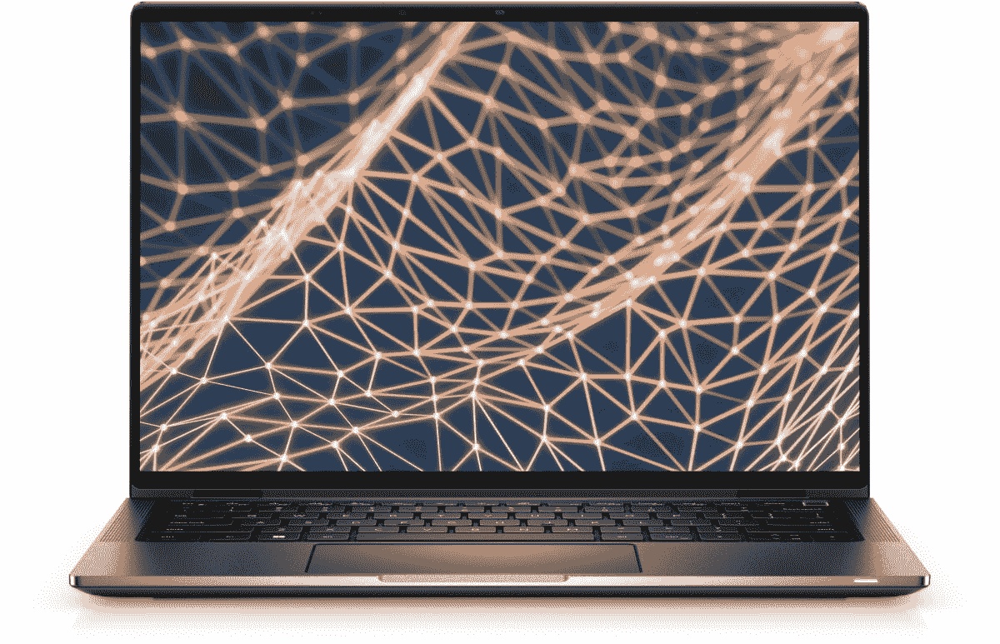

# 高级 Dell Latitude 9330 现已上市，起价 2109 美元

> 原文：<https://www.xda-developers.com/dell-latitude-9330-now-available/>

戴尔宣布其高端商务 2 合 1 笔记本电脑 Latitude 9330 现已上市。Latitude 9000 系列中的第一款 13 英寸笔记本电脑[于 4 月](https://www.xda-developers.com/dell-13-inch-business-laptop-the-latitude-9330/)发布，它具备顶级笔记本电脑的所有要素，包括价格标签——起价 2109 美元。

在内部，Dell latitude 9330 采用英特尔酷睿 U 系列处理器，特别是 U9 系列处理器，这意味着默认 TDP 为 9W(尽管我们已经看到戴尔在 XPS 13 等型号上将 TDP 提高到 12W)。您可以选择英特尔酷睿 i7-1260U 处理器，此外，您还可以获得高达 32GB 的 5200 MHz lpddr 5 RAM，存储容量最高可配置为 1TB。

这里的一个亮点是显示屏，这是一个 13.3 英寸的面板，长宽比为 16:10，非常适合工作效率。它采用 Quad HD+ (2560 x 1600)分辨率，这是全面的标准，因此您将始终获得出色的体验。既然它支持触摸，你自然也可以期待触摸支持。

在显示屏上方，有一个用于视频通话的全高清网络摄像头，和一个用于 Windows Hello 面部识别的红外传感器。网络摄像头还支持戴尔的智能隐私功能，可以在您移开视线时将屏幕变暗，或者在笔记本电脑检测到有人站在您身后时模糊内容。

Dell Latitude 9330 的重点是协作，它配备了戴尔所谓的“协作触摸板”。本质上，它可以让你快速控制麦克风静音、关闭摄像头或共享屏幕。还有一个“内置扬声器”，包括顶部和底部的扬声器，加上四个麦克风来拾取你的声音，确保你在通话中听得清楚。

由于尺寸较小，Dell Latitude 9330 上的几乎所有端口都是 USB-C。如果您选择添加蜂窝支持，您将获得两个 Thunderbolt 4 端口和一个标准 USB Type-C 端口，以及一个耳机插孔和一个 SIM 卡插槽。它提供 4G 或 5G 连接，因此您可以选择最符合您需求的连接。

如果所有这些对您来说都很有吸引力，您可以在戴尔网站上查看 Latitude 9330。

 <picture></picture> 

Dell Latitude 9330

##### 戴尔 Latitude 9330

Dell latitude 9330 是一款专注于协作的高级商务敞篷车。它采用第 12 代英特尔处理器和 16:10 显示屏。