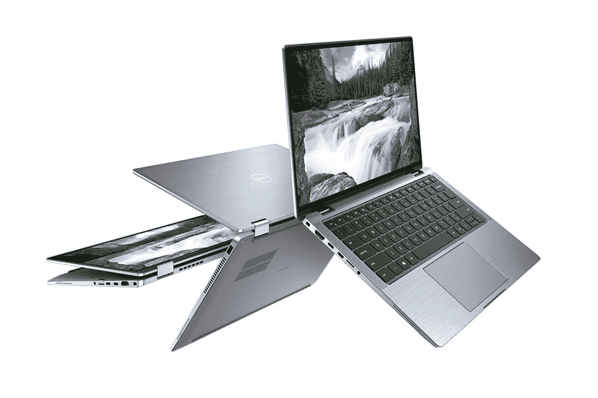

# Dell Latitude 9420 二合一回顾:高端戴尔商用笔记本电脑难以交付

> 原文：<https://www.xda-developers.com/dell-latitude-9420-2-in-1-review/>

戴尔的 Latitude 9000 系列[商用笔记本电脑](https://www.xda-developers.com/best-business-laptops/)是该公司提供的最佳产品。除了英特尔第 11 代处理器，Dell Latitude 9420 二合一设备还配备了 QHD+屏幕标准，并具有有趣的功能，如摄像头上的自动隐私保护。

它还配备了戴尔优化器，这是一套旨在让您的电脑更加智能的工具。它包括像 ExpressSign-in 这样的东西，当你在附近时，它会自动唤醒你的电脑，甚至可以在你离开时锁定它。它还包括 ExpressConnect、ExpressCharge、ExpressResponse 和智能音频。

**浏览此评论:**

### 戴尔 Latitude 9420 二合一设备规格

| 

处理器

 | 最高可配 i7 博锐的第 11 代英特尔酷睿处理器 |
| 

制图法

 | 英特尔 Iris Xe 显卡 |
| 

显示

 | 14 英寸 16:10 QHD+ (2560 x 1600) WVA 触摸，防反射和防污染，康宁大猩猩玻璃 6 DX，超低功耗，500 尼特，100% sRGB，舒适视图加上低蓝光，有源笔支持 |
| 

身体

 | 宽:310.59 毫米/ 12.22 英寸高:8.42 毫米/0.33 英寸(正面)/13.91 毫米/0.54 英寸(背面)深:215.18 毫米/ 8.47 英寸起始重量:3.2 磅/1.4 千克(2 合 1) |
| 

记忆

 | 高达 32GB LPDDR4x SDRAM 4266MHz(板载) |
| 

储存；储备

 | 固态硬盘 m . 2 2230 PCIe/NVMe 35 级最高 1tb 固态硬盘 m . 2 2230 PCIe/NVMe 35 级 256GB |
| 

多媒体

 | SafeShutter(机电相机快门)红外相机(面向用户的固定焦距)低光+ TNR +功能+IPU6 +接近传感器(ExpressSign-in 1.0)或红外相机(面向用户的固定焦距)低光功能+TNR+IPU 6+接近传感器+英特尔相机感应技术(ExpressSign-in 2.0 )2 个顶部发射高级扬声器、2 个底部发射高级扬声器、Waves MaxxAudio Pro、SmartAmplifier4 个降噪麦克风通用音频插孔 |
| 

电池

 | 2 芯、40 瓦时 6 聚合物、ExpressCharge 2.0、ExpressCharge Boost 和长生命周期功能 3 芯、60 瓦时 6 聚合物、ExpressCharge 2.0、ExpressCharge Boost 和长生命周期功能 |
| 

连通性

 | 无线局域网选项:英特尔 Wi-Fi 6E (6GHz) AX210 2x2 +蓝牙 5.2 移动宽带选项:8，10 高通骁龙 X20 LTE-A (DW5821e)(支持 eSIM)，全球不包括中国、土耳其和美国高通骁龙 X20 LTE-A (DW5821e)全球高通骁龙 X20 LTE-A (DW5821e)适用于美国电话电报公司、威瑞森和美国 Sprint。高通骁龙 X55 全球 5G 调制解调器(DW5930e) (2 合 1)(支持 eSIM)，全球不包括中国，土耳其，美国高通骁龙 X55 全球 5G 调制解调器(DW5930e) (2 合 1)，全球高通骁龙 X55 全球 5G 调制解调器(DW5930e) (2 合 1)，sprint 高通骁龙 X55 全球 5G 调制解调器(DW5930e) (2 合 1)，威瑞森美国电话电报公司 |
| 

港口

 | 1 个 USB 3.2 Gen 1(带 PowerShare、USB Type-A)2 个 Thunderbolt 4，带电源传输和显示端口(USB Type-C)1 个 HDMI 2.01x 外部 uSIM 卡托盘选项(仅限 WWAN 个 uSD 4.0 存储卡读卡器 1 个可选触摸指纹识别器，位于 PowerButtonWedge 楔形锁插槽中 |
| 

投入

 | 10 指触控显示屏玻璃 Microsoft Precision click pad 单点防泼溅背光键盘戴尔高级活动笔 PN579X(可选，单独销售) |
| 

传感器

 | 陀螺仪、e compass/磁力计、加速计、GPS(仅通过 WWAN 卡)、环境光传感器、自适应热性能(通过陀螺仪/加速计)、戴尔 ExpressSign-In 1.0(通过近程传感器)、戴尔 ExpressSign-in 2.0(通过英特尔摄像头感应技术)、打开盖子唤醒/开机 |
| 

价格

 | 起价 2059 美元 |

戴尔发给我的型号包括英特尔酷睿 i7-1185G7、16GB 内存、无蜂窝和 512GB 固态硬盘。然而，他们实际上说该设备将有 256GB 的存储空间，因此该设备的 2739 美元的定价是假设该数量，而不是我实际得到的 512GB。

## 设计:Dell Latitude 9420 二合一设备专为商务人士设计

当我说 Dell Latitude 9420 2 合 1 一体机专为商用而设计时，我指的是它由金属制成，并采用银色。老实说，我会说这个设计平淡无奇，有拉丝铝盖子。它只是没有戴尔 XPS 或[惠普 Spectre x360](https://www.xda-developers.com/best-hp-laptops/) 性感。不过话说回来，就像惠普 EliteBook 一样，它没有任何其他颜色。这是商务笔记本电脑的所有标准，除非该产品是由碳纤维制成的，就像有些人一样。

它的重量也是 3.2 磅，这是较重的一面，是的，这是由较重的材料带来的。如果你想要更轻的东西，我强烈建议看看碳纤维 Latitude 7320。

然而，值得记住的是，我们必须将它与什么进行比较。这只是 Latitude 9400 的第二代产品；在此之前，9000 系列根本不存在。戴尔创造了一个新的溢价水平。正因为如此，我非常期待像这样的敞篷车能够与联想 ThinkPad X1 Yoga 或惠普 EliteBook x360 1040 正面交锋。这两种设备的重量都不超过 3 磅。

它具有您期望从商用笔记本电脑中获得的那种端口选择。在左侧，有两个 Thunderbolt 4 端口，因此您可以使用它们进行任何事情，从充电到连接双 4K 显示器。你还会发现一个 microSD 卡插槽，一个 HDMI 2.0 端口和一个 3.5 毫米音频插孔。

在右侧，只有一个 USB 3.2 Gen 1 Type-A 端口。虽然 USB Type-A 显然正在消失，但有充分的理由，我认为商用电脑上应该有两个。不过没关系。事实上，戴尔是为数不多的在其 XPS 消费者笔记本电脑中放弃 USB Type-A 的 PC OEMs 厂商之一。

总的来说，Dell Latitude 9420 二合一设备的设计很好。没有什么特别令人兴奋的，或者根本不令人兴奋的。但这就是商务笔记本电脑的意义所在。都是生意。

## 显示屏:它有窄边框，但为网络摄像头腾出了空间

正如型号的第二位数字所示，Dell Latitude 9420 二合一设备拥有 14 英寸屏幕。这一次是 16:10，意味着它更高更大。事实上，因为屏幕是对角测量的，你越接近正方形，它就变得越大。

显示器的质量真的很好，支持 100% sRGB，80% NTSC，84% Adobe RGB，87% P3 色域。但同样，因为这是 9000 系列，一个真正打破溢价壁垒的系列，我会对它很严格。毕竟，如果不与市场上的其他公司进行比较，你就不可能获得超高的价格，而我要与之进行比较的是制造个人电脑的公司...是戴尔。

戴尔 XPS 17 在所有四个方面都接近完美，包括 100% sRGB、99% NTSC、100% Adobe RGB 和 98% P3。我从未见过这样的事。戴尔 XPS 15 的有机发光二极管版本分别获得了 100%、94%、96%和 100%，这是我见过的第二好的成绩。

显然，戴尔拥有比 Latitude 更好的显示器，尽管 Latitude 的显示器非常好。只是这应该是一个不妥协的机器；否则，它为什么会存在？

亮度最大值为 427.5 尼特，低于承诺的 500 尼特，尽管我在测试中没有注意到。它似乎在户外做得很好。对比度最大到 1610:1，很扎实。

关于屏幕本身，我想指出的另一件事是，我喜欢它默认的 QHD+分辨率。事实上，根据规格表，甚至没有任何选项。奇怪的是，翻盖式型号是 FHD，但更高的分辨率确实很好看。

四周的边框都很窄，这总是能带来更身临其境的体验。顶部挡板装有一个带自动隐私快门的网络摄像头。当你不使用它时，你会看到一个红色的物理保护罩在相机上，当你去使用它时，它会自动打开。这很酷，尽管我很想看看人们对此的反应。根据我的经验，人们不喜欢他们无法明确控制的隐私功能，但我们会看到的。

坏消息是它覆盖的网络摄像头是 720p。看到这一点，我真的很惊讶，因为我以为戴尔今年已经将其整个 Latitude 系列移动到 1080p，但显然不是。我认为这与小的顶部挡板有关，它限制了网络摄像头模块的空间。这很遗憾，尽管公平地说，惠普和联想都没有将他们的 14 英寸商务敞篷车升级到 1080p。

顶部挡板还包括一个接近传感器，可与 ExpressSign-in 配合使用。它会检测您是否在电脑前，并将其唤醒。一旦发生这种情况，红外摄像头就会亮起，让你无需触摸就能登录。当您离开时，也可以打开接近传感器来锁定电脑。起床后，您可以将计时器设置为最多 120 秒。

音频质量相当不错，键盘两侧是双扬声器。戴尔还有一项称为智能音频的功能，您可以在其中获得听起来非常清晰的 3D 音频体验。您还可以更改设置，以便在安静的房间、嘈杂的办公室、有多种声音或在录音棚中进行调整。

甚至还有自动静音功能，可以消除通话中没有说话时产生的噪音。事实上，除了 720p 网络摄像头之外，这是一款非常适合在家工作的笔记本电脑。戴尔确实送来了它的 UltraSharp HDR 4K 网络摄像头，所以这确实弥补了它。

## 键盘:Dell Latitude 9420 二合一设备拥有更大的触摸板

Dell Latitude 9420 二合一设备的键盘相当标准。它有背光，有 Chiclet 风格的按键，足够舒适。无论如何，这都不会是一个痛点；事实上，它非常准确。只是在上面打字的感觉不如惠普 EliteBook x360 好。我确实认为这里有一些改进，很高兴看到戴尔努力做得更好。

在键盘下方，有一个玻璃精密触摸板，它充分利用了大部分可用空间。事实上，当一家公司没有留下额外的空间来放置更大的触摸板时，我真的很感激。挺好看的。

它还在电源按钮上配备了指纹传感器，以防你不喜欢红外相机。不幸的是，戴尔仍然是唯一一家让你在电脑启动后扫描手指的公司，而不是在你第一次按下按钮的时候。

## 性能:它配备了英特尔第 11 代处理器

戴尔送我进行评估的型号包括英特尔酷睿 i7-1185G7 和 16GB RAM，就评估单元而言，这是一个非常标准的配置。我真的无法告诉你我见过多少台配备酷睿 i7-1185G7 和 16GB 内存的电脑，但这一台有点不同，因为我遇到了*很多*性能问题。

目前，我的设置包括 Thunderbolt 坞站、4K 显示器、FHD 显示器和戴尔 UltraSharp 4K 网络摄像头。顺便说一下，这是市场上最好的网络摄像头。我以前使用罗技布里奥，但我会采取戴尔任何一天。无论如何，该公司将它与 Latitude 一起发送过来，它非常适合在家工作。是的，尽管有 720 像素的网络摄像头，这是一家*真正*关心在家工作体验的公司，可能比任何人都关心。

我遇到的性能问题是 Latitude 9420 二合一设备连接到坞站和两台显示器时出现的。无论是电池供电还是有线供电，我都没有遇到任何问题。不过，这款集成了 Iris Xe 显卡的 CPU 应该可以轻松处理这两款显示器。就像我说的，我以前用很多机器做过。

当连接到 dock 时，它没有很好地处理多任务。一旦我参加了 Google Meet 会议，从 Apple Music web 应用程序上下载了一些音乐，或者通过网飞或其他网站下载了一些电影或电视节目，事情就真的开始停滞了。我不是说同时做这三件事。我说的是做那些事情中的一件，然后试着做一些常规的任务，比如网页浏览或写作。我的会议因视频断断续续而破裂，然后视频被完全关闭。就是不靠谱。

对于基准测试，我使用了 PCMark 8、PCMark 10、3DMark、Geekbench 和 Cinebench。

|  | 

戴尔 Latitude 9420 二合一酷睿 i7-1185G7

 | 

华为 MateBook X ProCore i7-1165G7

 | 

惠普 Envy x360 13Ryzen 5 4500U

 | 

联想 ThinkPad X1 泰坦酷睿 i7-1160G7

 |
| --- | --- | --- | --- | --- |
| 

PCMark 8:主页

 | 3,882 | 3,839 | 4,087 | 3,851 |
| --- | --- | --- | --- | --- |
| 

PCMark 8:创意

 | 4,566 | 4,598 | 4,247 | 4,264 |
| --- | --- | --- | --- | --- |
| 

PCMark 8:工作

 | 3,811 | 3,541 | 3,687 | 3,686 |
| --- | --- | --- | --- | --- |
| 

PCMark 10

 | 4,689 | 4,692 | 4,679 | 4,488 |
| --- | --- | --- | --- | --- |
| 

3DMark:时间间谍

 | 1,467 |  |  | 1,334 |
| --- | --- | --- | --- | --- |
| 

极客工作台

 | 1,486 / 4,922 | 1,518 / 4,929 |  | 1,333 / 4,055 |
| --- | --- | --- | --- | --- |
| 

电影院长凳

 | 1,359 / 3,993 | 1,361 / 4,119 |  | 1,127 / 2,597 |
| --- | --- | --- | --- | --- |

当我在基准测试电子表格中查找分数时，我发现 Latitude 9420 二合一设备接近我的第 11 代基准测试的低端。它就放在你上面看到的机器周围，其中一台装有较低层的第 11 代 UP3 Core i7，在它下面，有一台锐龙 4000 笔记本电脑和一台 UP4(以前称为 Y 系列)笔记本电脑。

电池续航时间大多在 4 到 5 小时之间，这真是一个惊喜。当戴尔推出 Latitude 9000 系列时，有两样东西真正受到了吹捧: [5G](https://www.xda-developers.com/best-5g-laptops/) 和电池寿命。奇怪的是，我评测过的 Latitude 9000 系列笔记本电脑都没有 5G，但之前的 15 英寸型号确实获得了可靠的电池续航时间。和往常一样，我的测试只是像往常一样工作，看看电池需要多长时间才会没电。显示器设置为中等亮度，电源设置为推荐。

## 结论:您应该购买 Dell Latitude 9420 二合一设备吗？

我总觉得 Latitude 9000 系列最大的弱点就在于它的存在。直到几年前，它一直使用 7000 系列。当时，戴尔说不行，7000 不够高端，我们需要一个全新的层来满足我们的高端需求。所以现在，唯一的方法就是将其与商用笔记本电脑巨头进行比较，如联想 ThinkPad X1 Yoga 和惠普 EliteBook x360 1040。

让我们公平一点。Dell Latitude 9420 二合一设备拥有出色的 16:10 显示屏、实心键盘和窄边框。它还具有许多出色的商业功能，如 ExpressSign-in，它可以唤醒您的电脑并让您登录，而无需您触摸它。

它也有很多缺陷。很难与惠普和联想的产品竞争，它们的键盘更好，重量更轻。虽然这三台机器都没有一个，但我仍然会批评缺少 1080p 摄像头，特别是因为戴尔在其 Latitude 7000 系列中使用了 FHD 摄像头。

我的真实想法是，如果您正在寻找戴尔 Latitude 方向，您应该看看 Latitude 7000 系列，它非常棒。更轻便，感觉更成熟的产品。唯一的权衡是，你只能获得 4G LTE 选项而不是 5G，尽管不会有太大的差异，因为低于 6 5G 通常与 4G LTE 没有任何区别。

 <picture></picture> 

Dell Latitude 9420 2-in-1

##### 戴尔 Latitude 9420 二合一设备

Dell Latitude 9420 二合一设备是该公司最高端的 14 英寸商用敞篷车。