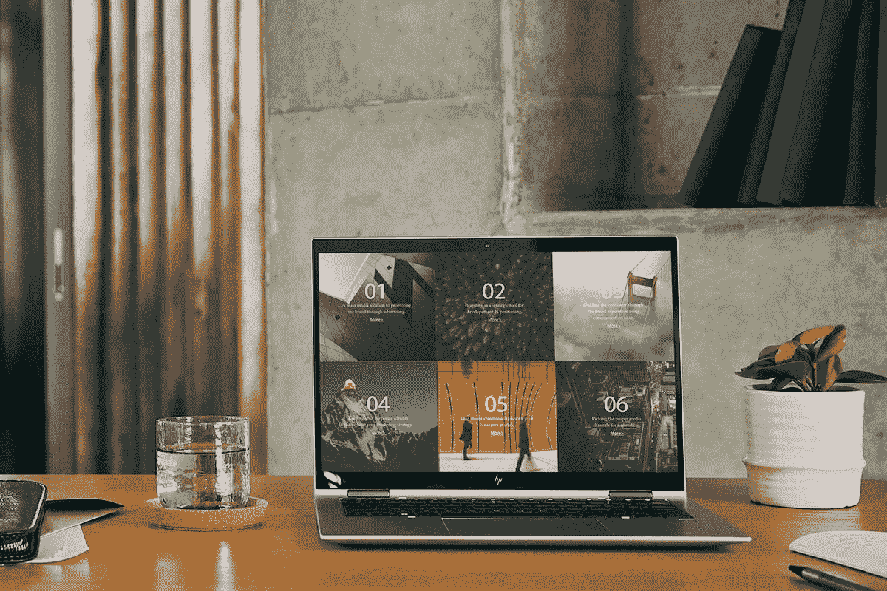

# 戴尔 Latitude 9430 与惠普 EliteBook 1040 G9:哪个更好？

> 原文：<https://www.xda-developers.com/dell-latitude-9430-vs-hp-elitebook-1040-g9/>

戴尔最近宣布了其 Latitude 系列商用笔记本电脑的一系列更新型号。新型号现在采用英特尔全新第 12 代 Alder Lake 移动核心处理器、高级设计等。Dell Latitude 9430 是目前 Latitude 系列中最高端的产品之一，具有高端规格和现代设计。在本文中，我们将对 Dell Latitude 9430 和 HP EliteBook 1040 G9 进行比较，找出哪一款是 2022 年更值得购买的高端商务笔记本电脑。

**浏览这篇文章:**

## Dell Latitude 9430 与 HP EliteBook 1040 G9:规格

在我们开始比较之前，让我们快速浏览一下每款笔记本电脑的规格，看看它们带来了什么:

| 

规格

 | 

**戴尔 Latitude 9430**

 | 

**惠普 EliteBook 1040 G9**

 |
| --- | --- | --- |
| **CPU** | 

*   最高可配第 12 代英特尔酷睿 i7 U 系列博锐处理器

 | 

*   第 12 代英特尔博锐处理器技术(具体产品型号待定)

 |
| **图形** | 

*   英特尔 Iris Xe 显卡(集成)

 |  |
| **闸板** | 

*   最高 32GB LPDDR5 5200MHz

 | 

*   高达 64GB DDR5 内存(用户可升级)

 |
| **存储** |  | 

*   高达 2 TB 的 M.2 PCIe NVMe 固态硬盘(用户可升级)

 |
| **显示** | 

*   14 英寸 16:10 FHD+ (1920 x 1200)，防眩光，超低功耗，500 尼特，100% sRGB，智能隐私二合一
*   14 英寸 16:10 QHD+ (2560 x 1600)，防反光，防脏，超低功耗，500 尼特，100% sRGB，智能隐私，触摸和笔支持

 | 

*   14 英寸对角线 16:10 WUXGA (1920x1200) IPS，250 尼特，触控
*   14 英寸对角线 16:10 WUXGA (1920x1200) IPS 低功耗，400 尼特，惠普视觉舒适，非触摸
*   14 英寸对角线 16:10 WUXGA (1920x1200) IPS，1000 尼特，带 HP Sure View Reflect 和 HP Eye Ease，非触摸

 |
| **电池** | 

*   2 芯 40 瓦时电池
*   3 芯 60 瓦时电池
*   高达 90W 的 USB Type-C 电源适配器

 | 

*   快速充电时 38 瓦时或 51 瓦时

 |
| **港口** | 

*   2 个 Thunderbolt 4(USB C 型)
*   1 个 USB 3.2 第 1 代 A 型
*   1 个 HDMI 2.0 接口
*   3.5 毫米耳机插孔
*   microSD 读卡器
*   Nano SIM 卡插槽

 | 

*   2 个 USB-A 3.1(1 个充电端口，1 个/侧)
*   2 个 USB-C (Thunderbolt 4)
*   1s HDMI 2.0
*   Nano SIM 卡插槽
*   组合耳机/麦克风

 |
| **音频** | 

*   带 Waves MaxxAudio 的四声道立体声扬声器(两个顶部发射，两个底部发射)
*   四通道降噪麦克风

 | 

*   4 个扬声器，由 Bang & Olufsen 调谐

 |
| **网络摄像头** | 

*   1080p 全高清+红外摄像头，带戴尔快速登录和安全快门

 |  |
| **安全** | 

*   红外网络摄像头
*   指纹传感器(可选)

 | 

*   Windows Hello IR
*   指纹传感器(可选)

 |
| **连通性** | 

*   Wi-Fi 6E
*   蓝牙 5.2
*   蜂窝选项:

 | 

*   Wi-Fi 6E
*   蓝牙 5.2
*   可选:4G LTE、5G、磁贴就绪

 |
| **尺寸(WxDxH)** | 

*   310.59 x 215.18 x 13.91 毫米(12.2 x 8.47 x 0.54 英寸)

 | 

*   315x 225 x 17.95/19.2 毫米(12.40 x 8.86 x 0.71 英寸)

 |
| **重量** | 

*   笔记本电脑:起始重量 1.27 千克(2.8 磅)2 合 1 设备:起始重量 1.4 千克(3.2 磅)

 | 

*   起始重量 1.18 千克(2.60 磅)

 |
| **价格** |  |  |

## Dell Latitude 9430 与 HP EliteBook 1040 G9:性能

Dell Latitude 9430 和 HP EliteBook 1040 G9 笔记本电脑均采用英特尔全新第 12 代酷睿博锐处理器。Dell Latitude 9430 最高可配置酷睿 i7 处理器 U 系列处理器，这意味着戴尔使用的是低功耗芯片，而不是 28W P 系列处理器。惠普没有提到确切的处理器型号，但我们预计它也将采用 P 系列或 U 系列处理器。我们将在这篇文章中更新每款笔记本的确切 SKU 信息，因此请务必关注此空间以获取更多信息。

全新第 12 代英特尔酷睿 Alder Lake 处理器的 TDP 为 28W，而此前我们通常在超极本中看到的 TDP 为 15W。这些新的 P 系列芯片也更强大，因为您可以获得 14 个内核(6P + 8E)和 20 个线程。U 系列 Alder Lake 芯片为顶级芯片(即酷睿 i7-1265U)提供多达 10 个内核(2P + 8E)和 12 个线程。我们建议您看一下我们的 [Alder Lake P 系列与 U 系列处理器比较](https://www.xda-developers.com/intel-12th-gen-p-vs-u-series/)，以更好地了解您期望从这些新芯片中看到的性能。

Alder Lake P 系列和 U 系列处理器还支持 DDR5/LPDDR5 内存。Dell Latitude 9430 配备了高达 32GB 的 LPDDR5 内存，速度高达 5200MHz。另一方面，惠普在双通道中使用 DDR5 模块。我们不知道芯片的频率，但你可以获得高达 64GB 的内存。就存储而言，Dell Latitude 9430 最高可配 1TB PCIe NVMe 固态硬盘，HP EliteBook G9 最高可配 2TB 固态硬盘。关于 HP EliteBook 1040 G9 有一点值得指出的是，它的内存和存储可以由用户在购买后进行升级，这非常棒。

谈到电池，Dell Latitude 9430 配备 40 瓦时或 60 瓦时电池，具体取决于您选择的型号。另一方面，HP EliteBook 1040 G9 配备了 38 瓦时或 51 瓦时的电池。虽然新的 Latitude 9430 的电池容量略大，但由于新的 Alder Lake 芯片的混合核心架构，我们预计这两款笔记本电脑都将拥有不错的电池续航时间。由 U 系列芯片驱动的变体肯定会有更好的寿命，尽管我们必须等到完整的规格表可用才能看到是否会是这样。

## 显示

这两款笔记本电脑都配有 14 英寸 16:10 宽高比显示屏，但您可以购买配备高分辨率 QHD+ (2560 x 1600)显示屏的 Dell Latitude 9430。HP EliteBook 1040 G9 的 WUXGA 显示屏最高分辨率为 1920x1200。过去曾有过这种笔记本电脑的更高分辨率面板的变体，但现在似乎不再是这样了。然而，惠普正在提供一种包装 1000 尼特亮度的变体，这很好。Dell Latitude 9430 和 HP EliteBook 1040 G9 有触摸和非触摸两种型号，因此没有区别。

关于这两款笔记本电脑，另一个值得强调的有趣的事情是，它们的显示屏具有改进的隐私和安全功能。Latitude 9430 可以在检测到有人越过您的肩膀看时模糊屏幕。还有一个移开视线检测功能，当你移开视线时，它会将屏幕变暗以节省电池并保护你的数据。这些功能是 Dell Optimiser 3.0 的一部分，它还包括 Dell ComfortView+等功能。

HP EliteBook 1040 G9 还具有一些专注于隐私的功能。您可以通过 HP Sure View Reflect 获得其中一种变体，它使用专有技术来减少高达 95%的可见光，当从某个角度观看时会遮挡屏幕。所有这些隐私功能在商务笔记本上都非常受欢迎，很高兴看到所有 OEM 厂商都考虑到了这些功能，至少在企业领域是这样。

 <picture></picture> 

HP EliteBook x360 1040 G9

Dell Latitude 9430 和 HP EliteBook 1040 G9 的显示屏顶部都有一个网络摄像头。Latitude 9430 笔记本电脑的网络摄像头有了显著改进。在远程和混合工作的时代，考虑到一个好的网络摄像头的重要性，这是非常好的。Latitude 9430 默认配备了新的全高清(1080p)网络摄像头，取代了 Latitude 9420 的 720p 摄像头。Latitude 9430 上的网络摄像头还包括一个机电安全快门，可在不使用时盖住摄像头。它还是一个红外摄像头，这意味着它可以用于 Windows Hello 身份验证。

再来看看 HP EliteBook 1040 G9 笔记本电脑，它有一个 500 万像素的网络摄像头，我们已经在 Elite 蜻蜓和 Elite 蜻蜓 Chromebook 上看到过。这款特殊的网络摄像头可以录制 1080p 视频，您还可以获得惠普自动取景框等功能，当您在取景框内移动时，相机会自动尝试聚焦您。虽然我们现在不能在图像质量方面选出一个彻底的赢家，但我们很高兴看到这方面的一些改进。现在是制造商开始追赶高质量相机的时候了。

## 设计和端口

戴尔 Latitude 9430 有翻盖式和二合一两种配置，据戴尔称，它是目前 Latitude 系列中最高端的笔记本电脑。这款特别的笔记本现在有了一种叫做“金属石墨”的新配色，我们认为它比以前型号的标准银色更好看。新的配色是一种暗银色，将标准银边。它提供了一种全新的双色调外观，多年来我们已经在许多设备上喜欢上了这种外观。

作为 EliteBook 1000 系列的一部分，HP EliteBook 1040 G9 也是一款高端商务笔记本电脑。您可以选择标准翻盖式或可变式 EliteBook x360 1040 G9 型号。正如我们在上面的显示部分提到的那样，它们都配备了 14 英寸的面板。EliteBook 1040 G9 比戴尔 Latitude 9430 更厚，但没有它重。Dell Latitude 的起始重量为 1.27 千克，而 EliteBook 1040 G9 的起始重量为 1.18 千克。如果您查看上面规格表中的整体尺寸，您还会注意到 Latitude 笔记本的整体外形相对较小。

至于端口，除了一些变化外，这两款笔记本电脑都提供了几乎相同的端口。Dell Latitude 9430 配有两个 Thunderbolt 4 (USB Type-C)端口和一个 USB 3.2 Gen 1 Type-A 端口。你还可以获得一个 HDMI 2.0 端口，一个 microSD 读卡器，一个 3.5 毫米耳机插孔和一个 nano-SIM 卡插槽。另一方面，HP EliteBook 1040 G9 配备了两个 USB-A 3.1 端口、两个 USB Type-C Thunderbolt 4 端口、一个 HDMI 2.0 端口、一个 3.5 毫米耳机插孔和一个 nano-SIM 插槽。

HP EliteBook 1040 G9 缺少 SD 读卡器，但它也有两个 USB Type-A 端口，而 Latitude 9430 只有一个。两款笔记本电脑的连接选项都支持 WiFi 6E 和蓝牙 5.2，以及 LTE 和 5G 支持。

## 应该买哪个？

纵观目前所有可用的信息，我们认为可以有把握地说，这两款笔记本电脑在规格上是不相上下的。HP EliteBook 1040 G9 确实比 Dell Latitude 9430 稍有优势，内存和存储容量更大。事实上，它是用户可升级的，这使得它更好。虽然 Dell Latitude 9430 配备了可选的 QHD+显示器，但我们对惠普提供的产品也没有任何抱怨。您仍然可以获得 14 英寸 16:10 宽高比的面板，具有触摸屏支持、HP Sure View 等功能。

虽然 Dell Latitude 9430 似乎比 EliteBook 整体略小，但在外形方面也没有太大差异。在这种特殊的比较中很难得出最终的结论，主要是因为我们仍然不知道每台笔记本电脑的一些事情，包括正在使用的确切处理器。我们也在等待惠普宣布 EliteBook 1040 G9 的定价和可用性细节，敬请关注。

同时，请务必查看我们收集的[最佳商务笔记本电脑](https://www.xda-developers.com/best-business-laptops/)，寻找市场上的其他选择。或者，如果你想从每个制造商那里寻找一些具体的东西，你也可以看看我们收集的[最佳惠普笔记本电脑](https://www.xda-developers.com/best-hp-laptops/)和[最佳戴尔笔记本电脑](https://www.xda-developers.com/best-dell-laptops/)。