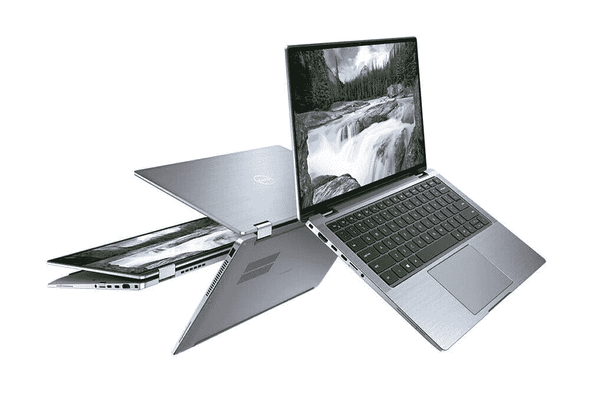
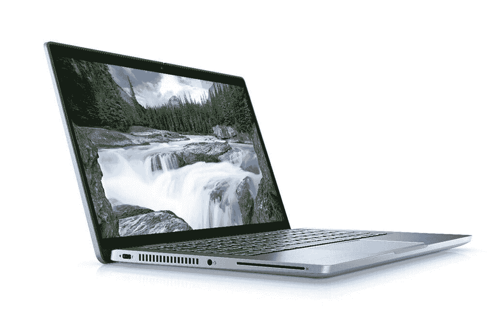
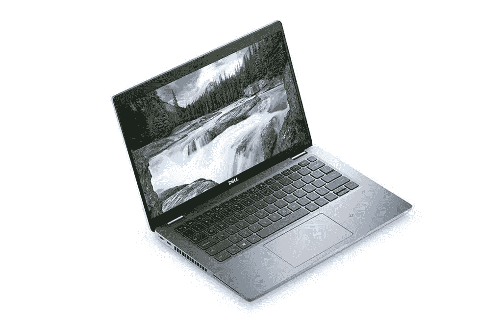
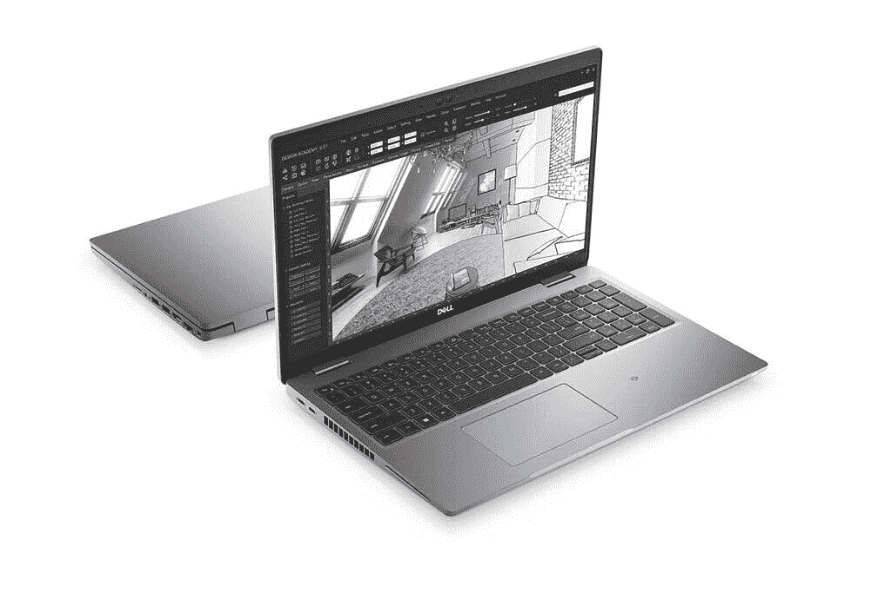
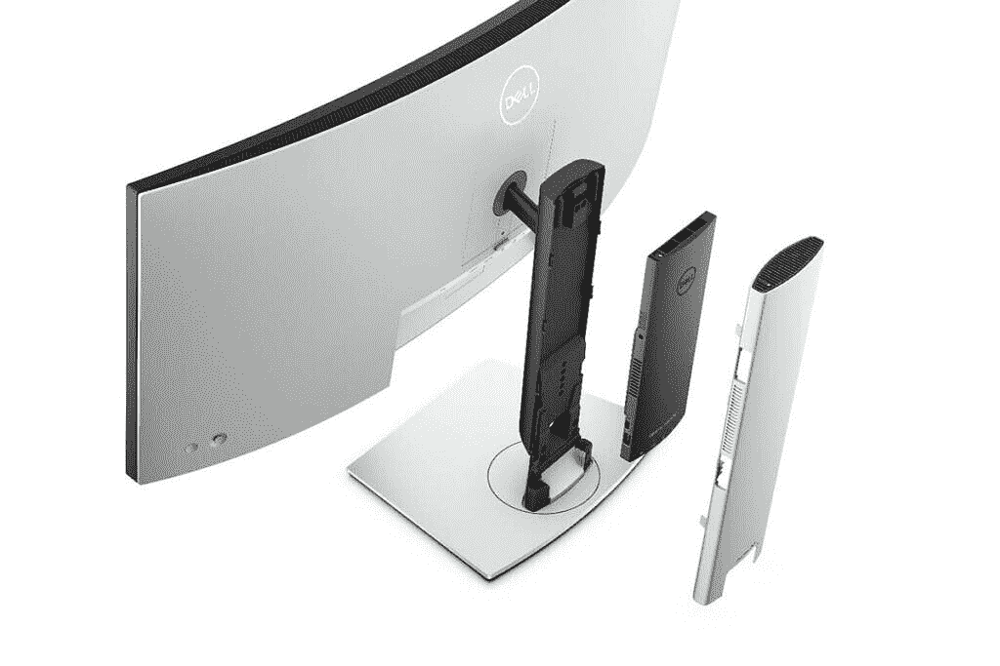

# 戴尔带来了新的 Latitude、Precision 笔记本电脑和 OptiPlex 台式机

> 原文：<https://www.xda-developers.com/dell-launches-new-latitude-precision-laptops-optiplex-desktops/>

戴尔宣布了 2021 年新的企业产品组合，包括新的 Latitude 5000、Latitude 7000 和 Latitude 9000 系列笔记本电脑。该公司还宣布了新的 OptiPlex 7090 Ultra 和 OptiPlex 3090 台式机以及 Precision 3560 笔记本电脑。此外，戴尔还发布了新的家用和商用显示器系列，以及一系列新的附件。新系列配备了新的[第 11 代英特尔处理器](https://www.xda-developers.com/intel-tiger-lake-11th-gen-core-i3-i5-i7-xe/)选项，戴尔将根据客户需求为其提供 Windows 10 或 Ubuntu。

首先，我们来看一下新的 Latitude 系列，包括 Latitude 9420、Latitude 7520 和 Latitude 5420。戴尔还宣布了 Latitude 5320、Latitude 5520、Latitude 7320、Latitude 7420 和 Latitude 9520，尽管这些产品将在稍后阶段上市。

## 戴尔 Latitude 9420、9520

 <picture></picture> 

Dell Latitude 9420 2-in-1

位于产品线顶端的是 Latitude 9420，它采用 2 合 1 外形，配有 14 英寸触摸屏，将提供高达 QHD+ (2，560 x 1，600 像素)的分辨率。用户还可以使用单独出售的可选有源手写笔。这款新笔记本电脑采用最新的第 11 代英特尔酷睿 i7 博锐处理器，配有高达 32GB 的 LPDDR4x SDRAM 和高达 1TB 的 SSD M.2 PCIe NVMe 存储。该笔记本电脑获得了英特尔的 Evo 认证，并配备了 Wi-Fi 6E 和 5G 或 4G LTE 以及 eSIM 连接选项等功能。客户可以选择更大的 3 芯 60 瓦时电池或 2 芯 60 瓦时电池，这两种电池都支持 ExpressCharge 2.0，使用 60 瓦或 65 瓦基于 USB Type-C 的充电器。这款笔记本还配备了 Windows Hello 人脸识别功能，以及嵌入电源按钮的可选指纹读取器。

戴尔在笔记本电脑上添加了内置扬声器以及一些摄像头优化，以提高视频通话的质量。该笔记本电脑还包括戴尔新的 SafeShutter 技术，该技术可以自动控制网络摄像头以增强隐私，而预装的戴尔优化软件通过利用人工智能(AI)提供个性化的用户体验。在端口方面，该笔记本电脑配有一个带 PowerShare 的 USB 3.2 Type-A Gen 1 端口，两个带 Power Delivery & DisplayPort 的 Thunderbolt 4 端口，一个 HDMI 2.01x 端口，外部 uSIM 卡托盘选项，以及一个存储卡读卡器。Latitude 9420 的起价为 1，949 美元，将于 2021 年春季与 Latitude 9520 一起上市。Latitude 9520 的产品详细信息和价格将在临近发布日期时公布。Latitude 9520 的发布是为了表明它确实存在，并且即将问世。

## 戴尔 Latitude 7320、7420、7520

 <picture></picture> 

Dell Latitude 7320 2-in-1

关于 Latitude 7000 系列，戴尔已经宣布了三种型号，包括 Latitude 7320、7420 和 7520。这三款产品的规格完全相同，主要区别在于 7320 和 7420 都采用 2 合 1 外形，分别配备 13.3 英寸和 14 英寸显示屏。另一方面，7520 配备了标准的 15.6 英寸显示屏。7320 将提供 FHD (1，920 x 1，080 像素)分辨率触摸或非触摸显示屏，而 7420 和 7520 将提供最高 UHD (3，840 x 2，160 像素)分辨率触摸和非触摸显示屏选项。

所有这三种版本都将采用最高支持 i7 博锐的最新第 11 代英特尔酷睿处理器，并提供 Windows 10 Home、Windows 10 Pro 或 Ubuntu 选项。存储选项包括高达 1TB 的 M.2 PCIe 第三代 NVMe 固态硬盘，高达 32GB 的 LPDDR4 SDRAM，主频为 4266MHz，以及可选的 42 瓦时或 63 瓦时电池，分别带有 65 瓦和 90 瓦的 USB Type-C 充电器。对于连接，有 Wi-Fi 6、蓝牙 5.1 以及可选的 LTE 移动宽带选项。其余端口和连接功能包括两个带电源传输和显示端口的 USB Type-C Thunderbolt 4.0 端口、一个带电源共享的 USB 3.2 Gen 1 端口、一个 HDMI 2.0、外部 uSIM 卡托盘(可选)、存储卡读卡器以及可选的接触式智能卡读卡器和嵌入在电源按钮中的可选指纹读取器。Latitude 7520 将于 2021 年 1 月 12 日起在指定市场上市，起价为 1，649 美元。Latitude 7320 和 7420 将在稍后推出。

* * *

## 戴尔 Latitude 5320、5420、5520

 <picture></picture> 

Dell Latitude 5240

说到 Latitude 5000 系列，它还提供三种型号- Latitude 5320、Latitude 5420 和 Latitude 5520。就像 7000 系列一样，该系列将提供三种尺寸，5320 上的 13.3 英寸，5420 上的 14 英寸和 5520 上的 15.6 英寸。但是，只有 5320 具有 2 合 1 外形，并提供高达 FHD (1，920 x 1，080 像素)分辨率的触摸或非触摸显示屏选项。Latitude 5420 提供高达(1，920 x 1，080 像素)分辨率的触摸或非触摸显示屏，而 Latitude 5520 将提供(1，920 x 1，080 像素)分辨率的触摸或非触摸显示屏或 UHD (3，840 x 2，160 像素)分辨率的非触摸显示屏选项。值得注意的是，这三款产品都可以配置最新的第 11 代英特尔酷睿 i7 博锐处理器、高达 64GB 的 lpddr 4 SDRAM 3200 MHz RAM(Latitude 5320 上为 32GB)，以及高达 2TB 的 PCIe 第三代 NVMe 固态硬盘或高达 1TB 的 PCIe 第四代 NVME 固态硬盘。

电池选项包括带 ExpressCharge 的 42 瓦时或 63 瓦时选项，以及包含 3 年有限硬件保修的 42 瓦时和 63 瓦时长寿命电池。根据您选择的电池，您可以选择 65W 适配器、90W 或 60W 基于 USB Type-C 的小型充电器。至于连接，这些笔记本电脑将提供 Wi-Fi 6、蓝牙 5.0 以及可选的 LTE 连接。在端口部门，您可以获得两个带电源传输和显示端口的 USB Type-C Thunderbolt 4.0 端口、两个 USB 3.2 Gen 端口，其中一个将提供电源共享)、一个 HDMI 2.01x、外部 uSIM 卡托盘(可选)、一个存储卡读卡器以及可选的接触式智能卡读卡器和嵌入在电源按钮中的指纹读取器。Latitude 5420 和 Latitude 5520 还具有用于有线以太网连接的 RJ45 端口。截至目前，戴尔已经宣布 Latitude 5420 将于 2021 年 1 月 12 日上市，起价 1049 美元。其他两种型号的定价和可用性将在稍后分享。

* * *

## 戴尔 Precision 3560

 <picture></picture> 

Dell Precision 15 3560

戴尔还宣布了其新的 Precision 3560 移动工作站。这是一款满载的 15.6 英寸笔记本电脑，采用碳纤维和生物塑料制成的新设计。该笔记本电脑将提供最高 FHD (1，920 x 1080 像素)分辨率的触摸选项，并可配置最高第 11 代英特尔酷睿 i7-1185G7 四核处理器、英特尔 Iris Xe 显卡以及 2GB GDDR6 内存的 NVIDIA Quadro T500 选项。内存和存储选项包括高达 64GB 的 3200 MHz DDR 4 内存和高达 2TB 的 PCIe 第三代 NVMe 固态硬盘或 2TB 的 PCIe 第四代 NVMe 固态硬盘，这些硬盘只能作为双存储配置中的第二个 SDD 提供。在连接部门，有 Wi-Fi 6、蓝牙 5.1 以及可选的全球 LTE-advanced WWAN。在端口部门，您可以获得两个 Thunderbolt 4 端口、两个 USB 3.2 Gen 2 Type-A 端口，其中一个提供电源共享、HDMI 2.0、RJ-45、读卡器以及可选的智能卡和指纹读取器。戴尔还提供可选的集成高清视频网络摄像头和可选的红外摄像头。电池选项包括带 ExpressCharge 的 42 瓦时或 63 瓦时选项，以及包含 3 年有限硬件保修的 42 瓦时和 63 瓦时长寿命电池。根据您选择的电池，您可以选择基于 USB Type-C 的 65W 适配器、90W 或 130W 充电器。Precision 3560 将于 2021 年 1 月 12 日起以 1，189 美元的起价上市。

* * *

## Dell OptiPlex 7090 超高、3070 超高

 <picture></picture> 

Dell OptiPlex 7090 Ultra

最后，戴尔还推出了新的 OptiPlex 系列台式机，该系列台式机采用了新的模块化设计，用户可以将其安装在显示器的背面。这些紧凑型台式机没有配备显示器，但与戴尔的一系列专业、UltraSharp、协作和 E 系列显示器兼容。OptiPlex 7090 Ultra 最高可配置第 11 代英特尔酷睿 i7-1185G7 博锐处理器，最高可配 64GB 3200 MHz DDR 4 RAM 和 2TB m . 2 PCIe x4 NVMe 固态硬盘。台式机在酷睿 i3 型号上配备了英特尔 UHD 显卡，在酷睿 i5 和酷睿 i7 型号上配备了英特尔 Iris Xe 显卡选项。戴尔表示，这款微型台式机可以同时连接多达四台 4K 显示器。机器上有 Wi-Fi 6 和蓝牙 5.1 以及各种端口，包括 Thunderbolt 4、标准 USB 3.2 Gen 2 Type-A 端口、RJ45 和 DisplayPort 1.4。OptiPlex 3070 Ultra 提供了与 7090 Ultra 几乎相同的外形和功能，尽管您只能为其配置最高第 11 代英特尔酷睿 i5-1145G7，并且它还跳过了 Thunderbolt 4 和 DisplayPort 1.4 端口。OptiPlex 3090 Ultra 和 OptiPlex 7090 Ultra 将于 2021 年 1 月 28 日开始在指定市场上市，价格分别为 659 美元和 769 美元。

* * *

## 定价和可用性

|  | 

模型

 | 

价格

 | 

有效性

 |
| --- | --- | --- | --- |
|  | **Latitude 9000 系列** |  |  |
| 1.1. | 戴尔 Latitude 9420 | 起价 1949 美元 | 2021 年 1 月 12 日 |
| 1.2. | 戴尔 Latitude 9520 | 待安排 | 待安排 |
|  |  |  |  |
|  | **Latitude 7000 系列** |  |  |
| 2.1. | 戴尔 Latitude 7320 | 待安排 | 待安排 |
| 2.2. | 戴尔 Latitude 7420 | 待安排 | 待安排 |
| 2.3. | 戴尔 Latitude 7520 | 起价 1649 美元 | 2021 年 1 月 12 日 |
|  |  |  |  |
|  | **Latitude 5000 系列** |  |  |
| 3.1. | 戴尔 Latitude 5320 | 待安排 | 待安排 |
| 3.2. | 戴尔 Latitude 5420 | 起价 1049 美元 | 2021 年 1 月 12 日 |
| 3.3. | 戴尔 Latitude 5520 | 待安排 | 待安排 |
|  |  |  |  |
|  | **Precision 3000 系列** |  |  |
| 4. | 戴尔 Precision 3560 | 起价 1189 美元 | 2021 年 1 月 12 日 |
|  |  |  |  |
|  | **OptiPlex 系列** |  |  |
| 5.1. | Dell OptiPlex 7090 Ultra | 起价 769 美元 | 2021 年 1 月 28 日 |
| 5.2. | 戴尔 OptiPlex 2090 Ultra | 起价 659 美元 | 2021 年 1 月 28 日 |