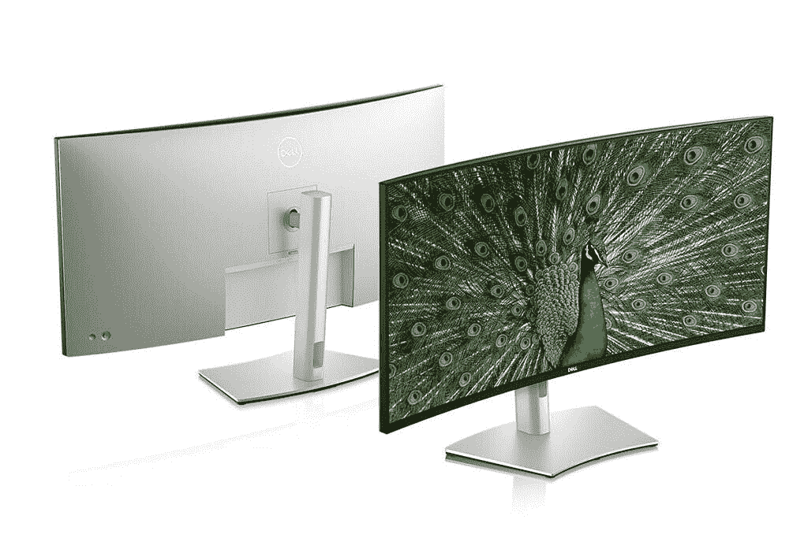
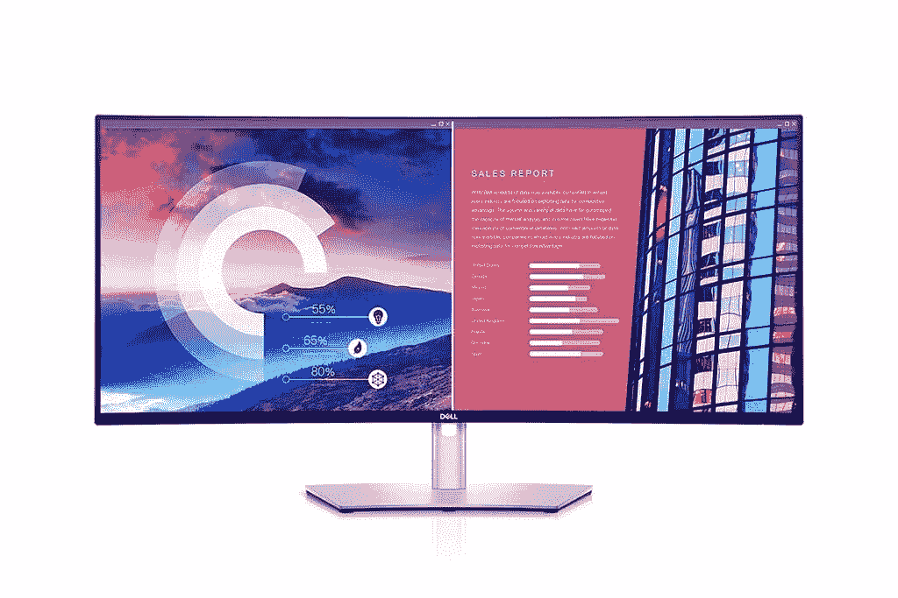
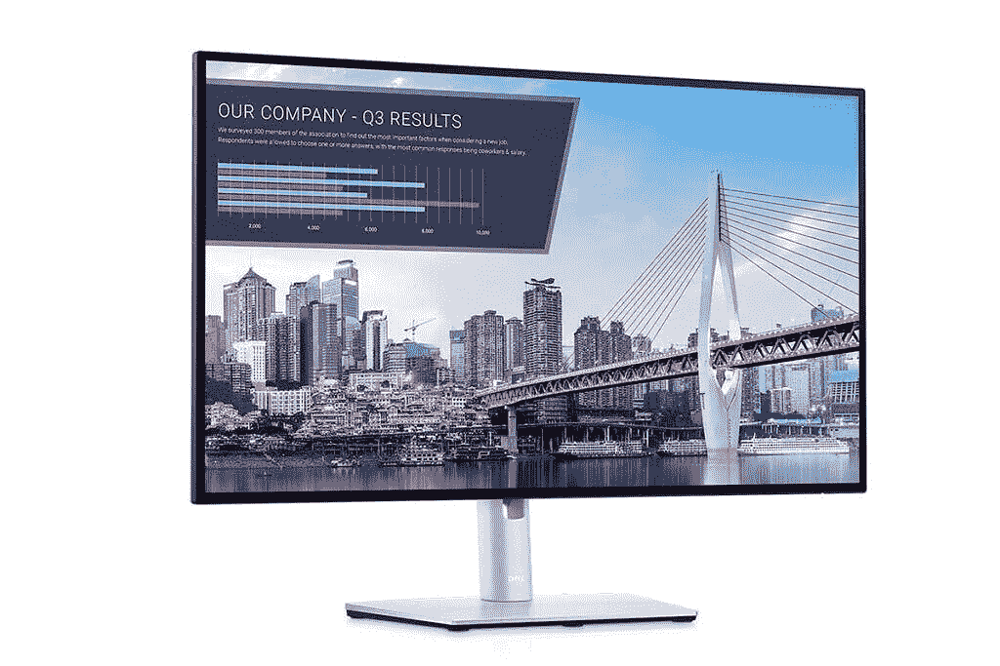
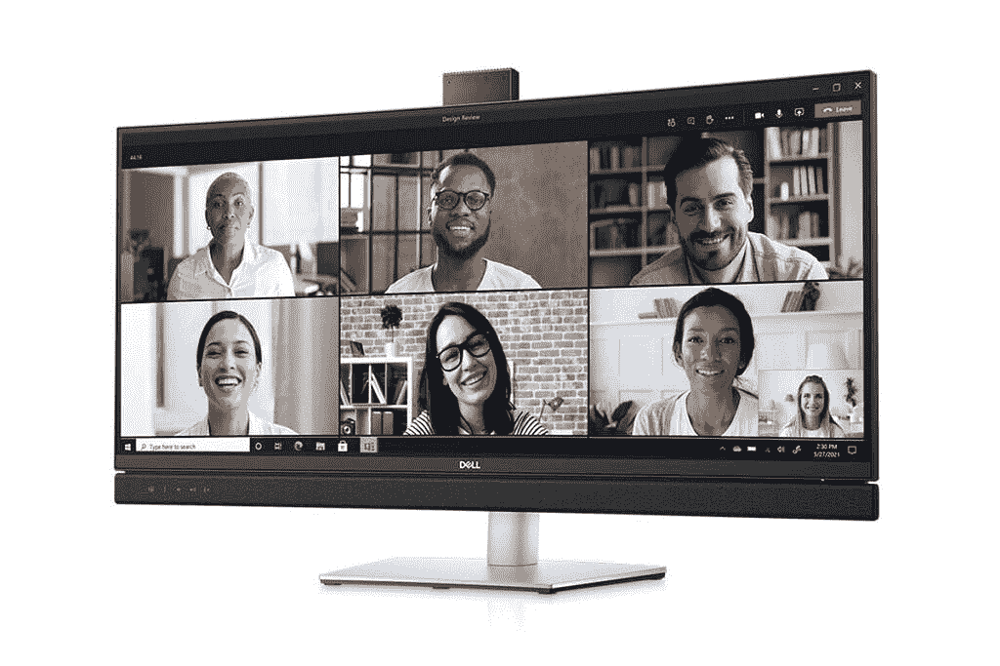
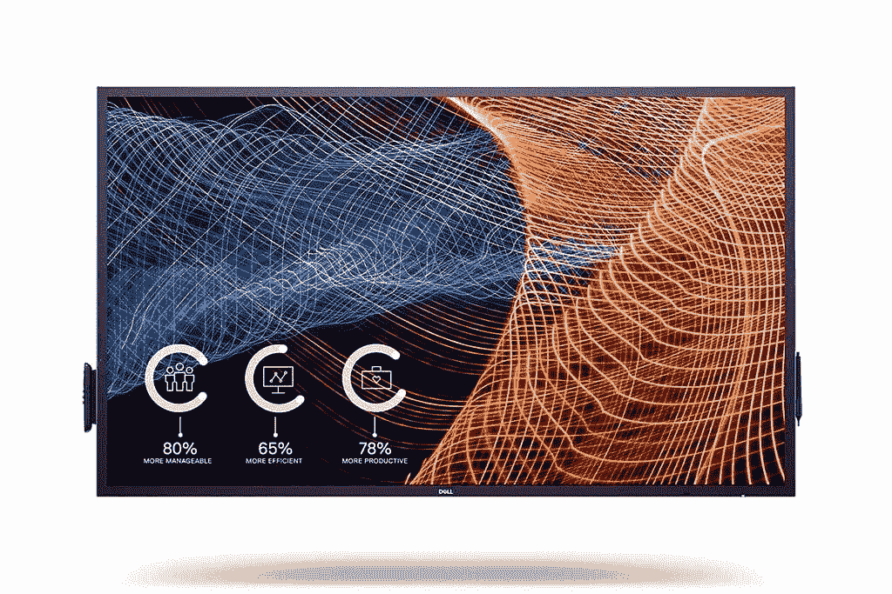

# 戴尔发布新显示器，包括其首款 40 英寸 5K 显示器

> 原文：<https://www.xda-developers.com/dell-launches-new-monitor-range-first-40-inch-curved-5k-display/>

戴尔在消费电子展(CES)前推出了多种显示器。该公司备受好评的 UltraSharp 系列更新了世界上第一款 40 英寸曲面 WUHD 显示器，并升级到 24 英寸和 27 英寸 USB-C Hub 显示器。该公司还宣布了三种新的显示器，专注于视频会议和大尺寸互动触摸显示器的组合。戴尔还推出了各种新的企业 PC 产品，包括 Latitude、Precision 和 OptiPlex 系列下的升级型号。

## UltraSharp 系列

### UltraSharp 40 曲面显示器

 <picture></picture> 

Dell UltraSharp 40 Curved Monitor

来自[戴尔](https://www.anrdoezrs.net/links/100122946/type/dlg/sid/UUxdaUeUpU31321/https://www.dell.com/en-in/work/shop/monitors-monitor-accessories/ar/4009)的新旗舰产品，据称是世界上第一款分辨率为 5K2K (5120 x 2160 像素)的 40 英寸超宽曲面显示器。显示器采用 IPS 面板，提供 100% sRGB 和 100% Rec。709 和 98%的 DCI-P3。该面板已通过德国莱茵 TV 认证，因此包括内置低蓝光屏幕的 ComfortView Plus。该显示器还具有一组可靠的端口，包括 DisplayPort 1.4、两个 HDMI 2.0、一个 Windows 和 Mac 认证的雷电 3 端口(也可提供高达 90W 的功率)、一个 USB Type-B 上游端口、一个 USB Type-C USB 3.2 Gen 2 下游端口(充电能力为 15W)、四个 USB Type-A 10Gbps (USB 3.2 Gen 2)端口、音频输出端口(3.5 毫米插孔)和一个 RJ45 端口。最后，该显示器配有两个 9W 扬声器，当然还有一个带 VESA 安装支架的可调支架。

### UltraSharp 38 曲面 USB-C 集线器显示器

 <picture></picture> 

Dell UltraSharp 38 Curved USB-C Hub Monitor

这是 40 英寸型号的一个略小且低调的版本。它的分辨率较低，为 3840 x 1600 像素，色域覆盖范围包括 100% sRGB、100% Rec 709 和 95% DCI-P3。这一款还提供了广泛的连接端口，但错过了 Thunderbolt 端口。虽然，有一个类似的 USB Type-C 端口提供了大多数功能，人们需要一个干净的单线设置以及电源传输。

### UltraSharp 27 和 24 英寸显示器

 <picture></picture> 

Dell UltraSharp 27 USB-C Hub Monitor

升级到戴尔现有的 24 英寸和 27 英寸 UltraSharp 显示器，新型号现在有带 USB-C 集线器和不带 USB-C 集线器两种。这实质上意味着您可以获得 FHD (1920 x 1080 像素)24 英寸型号或 27 英寸 QHD (2560 x 1440 像素)型号，具有更广泛的端口和 90W 功率输出，或者放弃集线器，获得一组标准端口。27 英寸型号(带和不带集线器)采用 100% sRGB 和 95% DCI-P3，德国莱茵 TV 认证的内置低蓝光屏幕，而 24 英寸型号提供 100% sRGB 和 85% DCI-P3 以及类似的德国莱茵 TV 认证。

* * *

## 戴尔视频会议显示器

 <picture></picture> 

Dell 34 Curved Video Conferencing Monitor

该公司还推出了据称是世界上第一款经微软团队认证的视频会议显示器。根据适合自己的尺寸，有三种型号可供选择。有戴尔 24 英寸视频会议显示器(C2422HE)、戴尔 27 英寸视频会议显示器(C2722DE)和戴尔 34 英寸曲面视频会议显示器(C3422WE)。这三款都有不同的分辨率——24 英寸的配备 FHD，27 英寸的配备 QHD，34 英寸的配备 WQHD IPS 面板。这些显示器配有一个从顶部弹出的 500 万像素红外摄像头，以及两个 5W 集成扬声器和一个降噪麦克风。人们只需按下专用的微软团队按钮，并使用 Windows Hello 的面部识别登录和 Cortana 的免提命令登录，就可以加入会议。这些显示器还具有 ComfortView Plus，这是该公司内置的低蓝光解决方案，可以减少蓝光排放，并具有很高的颜色准确性。为了方便起见，这些显示器还带有 RJ45 和 USB Type-C 等连接选项

* * *

## 戴尔交互式触摸显示器

 <picture></picture> 

Dell 65 4K Interactive Touch Monitor

出于协作目的，戴尔推出了新的大屏幕交互式触摸显示器。这些显示器有 65 英寸(C6522QT)和 55 英寸(C5522QT)两种屏幕尺寸，分辨率为 4K，采用 20 点无触点触控技术，支持多点触控。这些显示器的目的是让一个组织中的多个参与者能够无延迟地同时实时书写或绘图。这些触摸屏显示器还具有手掌拒绝功能新的手掌拒绝功能，因此用户可以休息他们的手掌，而不必担心意外触摸。与此同时，这些显示器还包括双 20W 扬声器和戴尔的 Screen Drop，这是一种辅助功能，用户只需使用面板侧面的专用按钮，即可将显示的图像降低到 3 种不同的高度设置，这样就触手可及了。

* * *

## 定价和可用性

以下是所有新上市显示器的价格和供货情况:

|  | 

模型

 | 

价格

 | 

有效性

 |
| --- | --- | --- | --- |
|  | **UltraSharp 系列** |  |  |
| 1.1 | UltraSharp 40 曲面显示器 U4021QW | $2,099.99 | 2021 年 1 月 28 日 |
| 1.2 | UltraSharp 38 曲面 USB-C 集线器显示器 U3821DW | $1,499.99 | 2021 年 1 月 28 日 |
| 1.3 | UltraSharp 27 USB-C 集线器显示器 U2722DE | $679.99 | 2021 年 3 月 30 日 |
| 1.4 | UltraSharp 24 USB-C 集线器显示器 U2422HE | $459.99 | 2021 年 3 月 30 日 |
| 1.5 | UltraSharp 27 显示器 U2722D | $579.99 | 2021 年 3 月 30 日 |
| 1.6 | UltraSharp 24 显示器 U2422H | $359.99 | 2021 年 3 月 30 日 |
|  | **视频会议监视器** |  |  |
| 1.1 | 戴尔 34 英寸曲面视频会议显示器 C3422WE | $1,149.99 | 2021 年 2 月 16 日 |
| 1.2 | 戴尔 27 小时视频会议显示器 C2722DE | $719.99 | 2021 年 2 月 16 日 |
| 1.3 | 戴尔 24 小时视频会议显示器 C2422HE | $519.99 | 2021 年 2 月 16 日 |
|  | **交互式触摸显示器** |  |  |
| 1.1 | 戴尔 65 4K 交互式触摸显示器 C6522QT | 待安排 | 2021 年 3 月 30 日 |
| 1.2 | 戴尔 55 4K 交互式触摸显示器 C5522QT | 待安排 | 2021 年 3 月 30 日 |