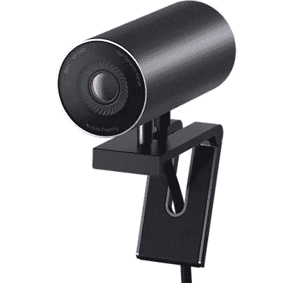

# 戴尔 UltraSharp 网络摄像头是一款新的 4K 网络摄像头，具有多种功能

> 原文：<https://www.xda-developers.com/dell-ultrasharp-webcam/>

# 戴尔新奇的网络摄像头在 4K 记录并支持 Windows Hello

全新的 Dell UltraSharp 网络摄像头比几乎所有其他网络摄像头提供更高的图像质量，但它的价格为 200 美元。

多年来，PC 网络摄像头领域几乎没有竞争，罗技是唯一一家发布新型号的公司，甚至罗技也只是在现有产品上做了一些小改动。新冠肺炎疫情期间在家工作的增加最终让科技公司相信，许多人对高质量的网络摄像头感兴趣，现在戴尔发布了自己的模型，带有高质量的 4K 传感器和其他有用的功能。

戴尔 UltraSharp 网络摄像头的价格为 199.99 美元，与 T2 的罗技布里奥的价格相同。就像罗技的网络摄像头一样，Dell UltraSharp 的最高分辨率为 4K，并支持 Windows Hello(因此您可以通过面部扫描登录 Windows)。这款相机还有一个磁性底座，一个 4K 索尼 Starvis CMOS 检查员，用于提高图像质量，三个视野设置，一个可拆卸的隐私快门，自动取景和一个 USB Type-C 端口。

设计也是戴尔的一个重要因素。“这款戴尔 UltraSharp 网络摄像头，”该公司表示，“提供了时尚的设计和优质的全铝圆柱形机身。虽然大多数传统网络摄像头都是矩形的，但 UltraSharp 网络摄像头精心设计的圆形外形和纤薄的显示器支架可确保最大限度地减少屏幕前的干扰，让您可以专注于演示，而不是设备。”

网络摄像头的早期评论似乎大多是积极的。 [*PCMag* 将其评为 3.5/5 颗星](https://www.pcmag.com/reviews/dell-ultrasharp-webcam)，并指出视频质量非常好，但曝光可能会很棘手，而且没有内置麦克风。*短路*(归 *LinusTechTips* 所有)[也喜欢戴尔 UltraSharp](https://www.youtube.com/watch?v=OIatX_cNVc0) 。尽管如此，200 美元对于一个网络摄像头来说还是太多了，尤其是当大多数视频聊天平台的压缩是图像质量的限制因素，而不是硬件的时候。

 <picture></picture> 

Dell UltraSharp Webcam

##### 戴尔 UltraSharp 4K 网络摄像头

戴尔的新 UltraSharp 网络摄像头是目前最好的 PC 摄像头之一，尽管 199.99 美元的价格有点高。