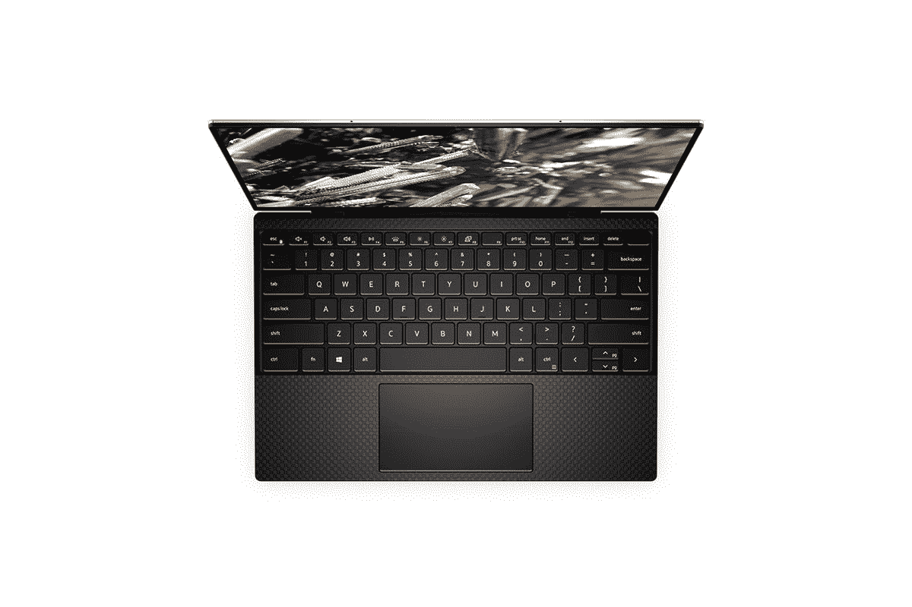

# 搭载英特尔第 11 代 Tiger Lake CPU 的戴尔 XPS 13 9310 在印度发布

> 原文：<https://www.xda-developers.com/dell-xps-13-11th-gen-intel-core-processors-launched-india/>

戴尔终于在印度正式推出了配备第 11 代英特尔“虎虎湖”处理器的 XPS 13。这款新机型已经在美国和其他国家销售，是今年早些时候推出的 XPS 13 9300 的更新版。新型号通过了英特尔 Evo 认证，这意味着英特尔保证了卓越的性能、卓越的连接性和超过 9 小时的电池续航时间。

## 戴尔 XPS 13 9310:规格

| 

规格

 | 

戴尔 XPS 13

 |
| --- | --- |
| **尺寸&重量** | 

*   295.7 x 198.7 x 14.8 毫米
*   1.2 千克

 |
| **显示** | 

*   13.4 英寸 FHD+(1920 x 1200)无限尺寸非触控/ UHD+ (3840 x 2400)无限尺寸触控
*   500 尼特亮度

 |
| **处理器** | 

*   英特尔酷睿 i5-1135G7 处理器(2.4GHz / 4.2GHz)
*   英特尔酷睿 i7-1185G7 处理器(3.0GHz / 4.8GHz)

 |
| **GPU** |  |
| **闸板&存放** | 

*   4267MHz 时 8GB/16GB LPDDR4x
*   512GB/1TB NVMe 固态硬盘

 |
| **电池&充电器** |  |
| **输入/输出** | 

*   2 个 USB Type-C，带 Thunderbolt 4
*   3.5 毫米耳机/麦克风组合插孔
*   MicroSD 卡插槽

 |
| **连通性** | 

*   黑仔 AX1650 双频 Wi-Fi
*   蓝牙 5.1

 |
| **操作系统** |  |
| **其他特征** | 

*   Windows Hello 指纹识别
*   背光键盘
*   英特尔 Evo 认证

 |

总体而言，新款 XPS 13 的设计类似于 2020 年初的型号。你会得到一个 CNC 加工的铝制机箱，周围都是优质材料，包括碳纤维灵感键盘面板和康宁大猩猩玻璃 6 保护显示器。它仍然是市场上最薄、最紧凑的 13 英寸笔记本电脑之一。

该笔记本还配备了与前代型号相同的 52Wh 电池，据称 FHD+型号可提供长达 14 小时的视频流，4K+型号可提供长达 8 小时的视频流。在连接方面，你有几个支持 Thunderbolt 4 的 USB Type-C 端口，一个 microSD 卡插槽和一个耳机插孔。电源按钮中还嵌入了指纹传感器，Wi-Fi 6 由黑仔 AX1650 模块提供，英特尔的 Iris Xe 显卡具有共享图形内存，并有两种颜色可供选择——铂金银配黑色碳纤维掌托和冰霜配北极白编织玻璃纤维掌托。

## 戴尔 XPS 13 9310:定价和可用性

这款笔记本电脑的基本款售价为₹150990 英镑(2050 美元)，配备英特尔酷睿 i5-1135G7 处理器，8 GB 4267 MHz lpddr 4x 内存和 512GB M.2 PCIe NVMe SSD。这款机型配备了 13.4 英寸的 FHD+ (1920 x 1200) InfinityEdge 显示屏，亮度为 500 尼特。这在所有戴尔零售店都有售(价格较高)，在亚马逊印度也有售(价格较低)。

 <picture></picture> 

Dell XPS 13

##### 戴尔 XPS 13 9310

新的 2020 年末戴尔 XPS 13 配备了最新的第 11 代英特尔 Tiger Lake 处理器，并且通过了英特尔 Evo 认证。

更贵的型号在戴尔网站上的价格为~₹2,15,498(2926 美元)，配备了英特尔酷睿 i7-1185G7，16GB 4267MHz LPDDR4x RAM 和 1TB M.2 PCIe NVMe SSD。当然，这款机型采用了 13.4 英寸 UHD+ (3840 x 2400) InfinityEdge 触摸屏，亮度同样为 500 尼特。这款车型将于 2021 年 1 月开始在印度上市。