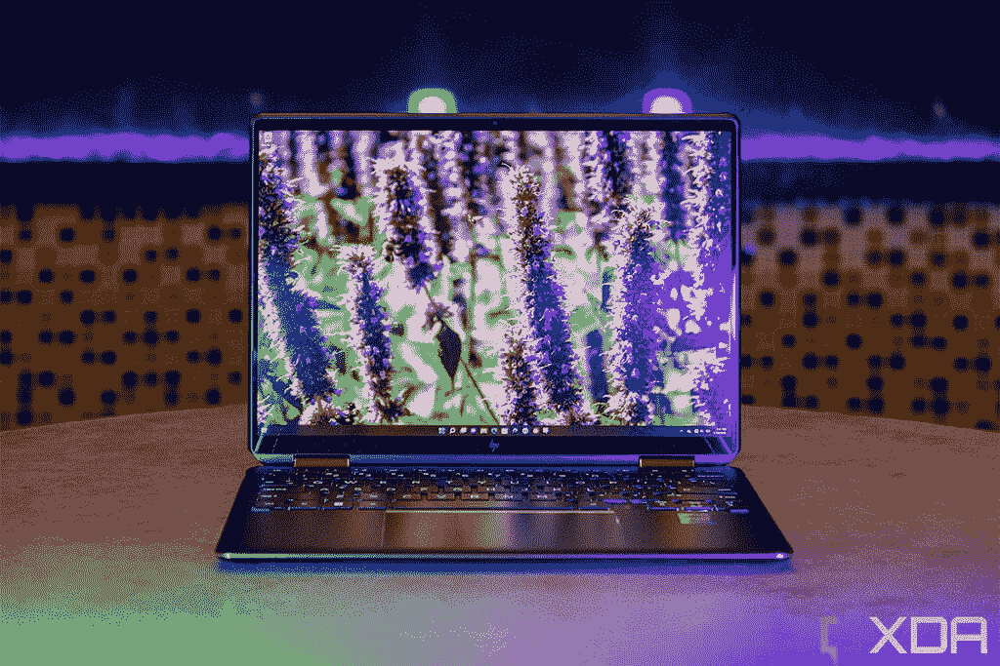
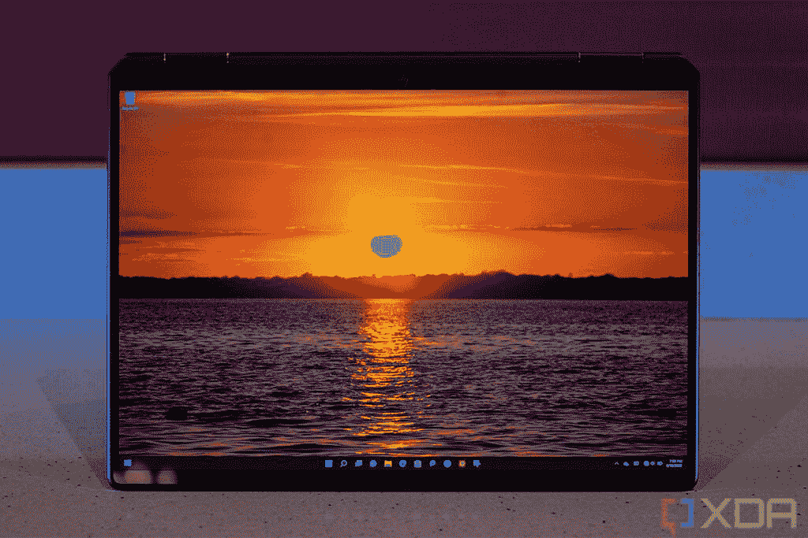

# 戴尔 XPS 13 二合一设备(2022 年)与惠普 Spectre x360 13.5 (2022 年)

> 原文：<https://www.xda-developers.com/dell-xps-13-2-in-1-2022-vs-hp-spectre-x360-13-5-2022/>

如果你和我一样，当你考虑买一台笔记本电脑时，重要的是它是一台可转换的，也称为 2 合 1 笔记本电脑。既可用作平板电脑又可用作标准笔记本电脑的笔记本电脑为您提供了更多的灵活性，并且能够在您想要的时候以您想要的方式使用它是非常棒的。2022 年[可变形笔记本电脑](https://www.xda-developers.com/best-convertible-laptops/)的两个主要例子是[惠普 Spectre x360 13.5](https://www.xda-developers.com/hp-spectre-x360-2022/) 和[戴尔 XPS 13 二合一](https://www.xda-developers.com/dell-xps-13-2-in-1-2022/)，那么你如何在它们之间做出选择呢？我们是来帮忙的。

首先，外形上有一个非常明显的区别。一款是带 360 度铰链的敞篷车，另一款是带可选键盘的平板电脑，可以变成笔记本电脑。仅此一项就能解决你的争端。但是，让我们仔细看看这些笔记本电脑的独特之处，以便您选择最符合您需求的产品。

**浏览本文:**

## 戴尔 XPS 13 二合一设备与惠普 Spectre x360 13.5:规格

|  | 

戴尔 XPS 13 二合一设备

 | 

惠普 Spectre x360 13.5

 |
| --- | --- | --- |
| **CPU** | 

*   第 12 代英特尔酷睿 i5-1230U (9W，10 核，12 线程，最高 4.4 GHz，12MB 高速缓存)
*   第 12 代英特尔酷睿 i7-1250 u(9 瓦、10 核、12 线程、最高 4.7 GHz、12MB 高速缓存)

 | 

*   第 12 代英特尔酷睿 i5-1235U (15W，10 个内核，12 个线程，最高 4.4GHz，12MB 高速缓存)
*   第 12 代英特尔酷睿 i7-1255 u(15 瓦，10 个内核，12 个线程，最高 4.7GHz，12MB 高速缓存)

 |
| **图形** |  |  |
| **显示** | 

*   13 英寸 3:2 3K (2880 x 1920)，500 尼特，DisplayHDR 400，防反光，防污迹，康宁大猩猩玻璃 7，杜比视觉，触摸和笔支持

 | 

*   13.5 英寸 IPS，全高清+ (1920 x 1280)，触控，400 尼特，100% sRGB，防反射
*   13.5 英寸 IPS，全高清+ (1920 x 1280)，HP Sure View Reflect，触控，1000 尼特，100% sRGB
*   13.5 英寸有机发光二极管，3K2K (3000 x 2000)，触摸，500 尼特(HDR)，100% DCI-P3，防反射

 |
| **存储** | 

*   256GB PCIe 4 固态硬盘
*   512GB PCIe 4 固态硬盘
*   1TB PCIe 4 固态硬盘

 | 

*   512GB PCIe 第四代固态硬盘
*   1TB PCIe 第四代固态硬盘
*   2TB PCIe 第四代固态硬盘

 |
| **闸板** | 

*   8GB 双通道 LPDDR4x 4266MHz
*   16GB 双通道 LPDDR4x 4266MHz

 | 

*   8GB LPDDR4x 4266MHz(焊接)
*   16GB LPDDR4x 4266MHz(焊接)
*   32GB LPDDR4x 4266MHz(焊接)

 |
| **电池** |  | 

*   4 芯 66 瓦时电池
    *   高达 65W 的 USB Type-C 电源适配器

 |
| **端口** | 

*   2 个 Thunderbolt 4(USB C 类)端口
    *   含 USB 型至 A 型适配器
    *   包含 USB Type-C 至 3.5 毫米适配器

 | 

*   2 个 Thunderbolt 4(USB C 型)
*   1x USB 3.2 第 1 代 A 型
*   3.5 毫米耳机插孔
*   microSD 读卡器

 |
| **音频** | 

*   双立体声扬声器，带 Waves MaxxAudio Pro 和 Waves Nx 3D 音频
*   双阵列麦克风

 | 

*   Bang & Olufsen 的四声道扬声器
*   双阵列数字麦克风

 |
| **摄像机** | 

*   500 万像素/1080 像素前置网络摄像头
*   1100 万像素/4K 面向世界的相机

 | 

*   惠普 True Vision 5MP 万像素红外摄像头，带摄像头快门和瞬时降噪功能

 |
| **生物认证** | 

*   红外照相机
*   XPS 对开键盘中的指纹识别器

 | 

*   红外网络摄像头
*   指纹传感器

 |
| **连通性** | 

*   英特尔无线网络 6E AX211
*   蓝牙 5.2
*   **可选(仅在 Slate 型号中):** 5G(英特尔 5000)

 | 

*   英特尔无线网络 6E AX211
*   蓝牙 5.2
*   **可选:** 5G

 |
| **颜色** |  | 

*   夜幕下的黑色，带着淡淡的黄铜色
*   天蓝色调的夜曲蓝
*   天然银

 |
| **尺寸(WxDxH)** | 

*   **天空(仅限 Wi-Fi):**292.5×201.2×7.4 毫米(11.5 × 7.9 ×0.29 英寸)
*   **石板(5G)****:**292.5 x 201.2 x 7.8 毫米(11.5 x 7.9 x 0.31 英寸)

 | 

*   297.94 x 220.47 x 17.02 毫米(11.73 x 8.68 x 0.67 英寸)

 |
| **尺寸** | 

*   **天空(仅 Wi-Fi):**起价 736 克(1.6 磅)
*   **石板(5 克):**起始重量为 811 克(1.8 磅)

 | 

*   起始重量为 1.37 千克(3.01 磅)

 |
| **价格** | 1，099.99 美元(包括 XPS 对开本) | 起价 1249 美元 |

## 性能:两种味道的英特尔桤木湖

乍一看，戴尔 XPS 13 二合一和惠普 Spectre x360 13.5 的内部规格非常相似，但实际上有一些很大的差异。虽然它们都采用了[第 12 代英特尔处理器](https://www.xda-developers.com/intel-12th-gen-alder-lake/)，但 XPS 13 二合一设备使用的是 U9 系列 CPU(具有 9W TDP)，而 Spectre 使用的是 15W 型号。它们可能拥有相同的内核数量和更高的时钟速度，但 15W 处理器应该能够在更长时间内保持最佳性能(当然，前提是有足够的冷却)。对于网页浏览或撰写文档等工作，您可能不会感觉到巨大的差异，但如果您正在做一些要求更高的工作，9W 处理器肯定会慢一点。

HP Spectre x360 的内存和存储容量是原来的两倍。

此外，虽然 CPU 时钟相似，但 9W 和 15W 处理器之间的集成英特尔 Iris Xe 显卡实际上有很大不同。在英特尔酷睿 i7-1250U 上，集成的 GPU 最高可运行 950MHz，而同等的酷睿 i7-1255U 最高可提升至 1.25GHz，这意味着速度快了 30%以上。这两款都不是游戏笔记本电脑，但 Spectre x360 可以更好地处理一些轻型 GPU 工作负载。

相反，更高的 TDP 意味着使用更多的功率，这在理论上意味着 HP Spectre x360 会更快地耗尽电池。但是，与内置 49.5 瓦时电池的 Dell XPS 13 2 合 1 相比，它的电池体积更大(66 瓦时)。在我们对这些设备进行实际测试之前，很难说它们会如何进行比较，但在过去，9W 处理器在电池寿命方面并不一定比 15W 型号更好。此外，还有其他因素需要考虑，比如显示器。

 <picture></picture> 

HP Spectre x360 13.5

最后，就内存和存储而言，配置更有利于惠普的笔记本电脑。这是一款更大的设备，因此它可以高达 32GB 的 RAM 和 2TB 的 SSD 存储，此外，与 Dell XPS 13 二合一设备的 256GB 相比，它在基本配置(512GB)中拥有更多存储。Dell XPS 13 二合一设备的最大内存和最大存储分别为 16GB 和 1TB。不可否认，它也不完全意味着处理相同类型的工作负载。

## 显示和声音:HP Spectre x360 为您提供了多种选择

谈到显示器，这两款设备都很不错，但在 HP Spectre x360 的情况下，它确实取决于您选择的配置。它配备了 13.5 英寸的面板，长宽比为 3:2，这主要是因为微软的 Surface 设备而变得流行。这种更高的屏幕是生产力的理想选择，基本型号从全高清+ (1920 x 1280)分辨率开始，非常清晰。如果您需要在公共场所工作时隐藏敏感信息，或者如果您想要最佳的观看体验，您可以添加 HP Sure View Reflect privacy 屏幕，您可以升级到 3K2K (3000 x 2000) OLED 面板。除了更清晰之外，这个面板还能给你有机发光二极管通常的好处，比如真正的黑色和更鲜艳的颜色。

 <picture></picture> 

HP Spectre x360 13.5

另一方面，Dell XPS 13 二合一设备只有一种配置，但值得称赞的是，这是一种非常好的配置。这是一个 13 英寸的面板，长宽比为 3:2，在这种情况下，它具有戴尔所说的 3K 分辨率(2880 x 1920)。这基本上就是你在 Surface Pro X 上能找到的东西，这一点也不坏——就其尺寸而言，这是一个非常清晰的屏幕。这是一个 IPS 面板，所以它不会给你与有机发光二极管相同的真实黑色和对比度，但戴尔通常在笔记本电脑上使用非常好的 IPS 显示器，所以这里的观看体验应该很棒。另一方面，这个面板是默认的，这意味着它可能也会使用更多的电力，而 HP Spectre x360 为您提供了较低分辨率的选项，如果您想优先考虑电池寿命的话。

HP Spectre x360 13.5 更大的机箱也为更强大的扬声器系统让路，该系统由四个扬声器组成，应该会带来非常好的媒体体验。戴尔仅在 Dell XPS 13 二合一设备上安装了两个扬声器，尽管公平地说，它们安装在侧面，因此，与 Spectre x360 的底部发射扬声器相比，声音更接近用户。

 <picture></picture> 

Dell XPS 13 2-in-1 (2022)

最后，在网络摄像头方面，两款笔记本电脑都配备了 500 万像素的前置摄像头，能够录制 1080p 视频，并且都支持 Windows Hello 面部识别。这是每个型号之前迭代的一次重大升级，如果你想在视频通话中保持最佳状态，这些都可以做得很好，不过，由于其外形的性质，XPS 13 2 合 1 不能调整到每个可能的角度，除非你把它拿在手中。然而，戴尔 XPS 13 二合一设备有一个优势，那就是后置摄像头。因为它是一台平板电脑，所以您可能想在必要时用它来拍照，戴尔为您提供了一台能够录制 4K 视频的 11MP 摄像头，因此您当然有这方面的选择。

## 设计:戴尔 XPS 13 二合一设备更注重便携性

正如我们在开始时所说的，虽然从某种意义上来说，这两款电脑都是二合一笔记本电脑，但它们的使用方法非常不同。Dell XPS 13 2 合 1 比以往任何时候都更加注重便携性，这就是为什么您会获得这款厚度仅为 7.4 毫米(如果您获得 5G 型号，则厚度为 7.8 毫米)的平板电脑。它的重量仅为 1.6 磅(最重 1.8 磅)，非常便于携带。然而，它也只是一个平板电脑，如果你想要一个键盘，你必须单独购买 XPS Folio，或者选择第三方解决方案。XPS Folio 键盘盖也增加了 1.23 磅的重量，因此很快就变成了与 Spectre x360 大约相同的重量。

最重要的是，作为一款平板电脑，戴尔 XPS 13 二合一设备没有支架。它依靠 XPS Folio 外壳来支撑，即使这样，你也只能获得三个角度，所以它不能无限调整到你喜欢的位置。至于外观，戴尔 XPS 13 2 合 1 有天空(Wi-Fi 机型)和平板(5G 版本)两种选择。这些都是圆滑和柔和的颜色选择，他们看起来很好。

至于惠普 Spectre x360 13.5，它基本上遵循了与其前辈相同的脚步。这是一个可转换的，但它使用了 360 度铰链，所以你可以旋转显示器，并将其用作平板电脑。这意味着默认情况下，您总是可以使用键盘和触摸板，并且您还可以在任何您喜欢的位置调整显示屏的角度，以获得最大的舒适度。

当然，这是以便携性为代价的，Spectre x360 13.5 厚 17 毫米，开箱重 3.01 磅。不过，你一出门就有了一台功能齐全的电脑，这可能证明了你的与众不同。这也是一款漂亮的笔记本电脑，有醒目的双色，要么是夜幕黑，要么是夜曲蓝，还有更柔和的自然银选项。

## 端口和连接性:轻薄是有代价的

我们在上文中讨论了 Dell XPS 13 2 合 1 设备的便携性，但是拥有厚度仅为 7.4 毫米的设备不可避免地会有所牺牲。戴尔 XPS 13 二合一设备有两个 Thunderbolt 4 端口，而*只有*两个 Thunderbolt 4 端口。没有耳机插孔，USB Type-A，或任何其他内置的东西。如果您需要，戴尔会提供一些适配器来为您提供这些端口，但这不是最方便的解决方案。

惠普 Spectre x360 有一个耳机插孔和一个 USB Type-A 端口。

另一方面，HP Spectre x360 13.5 的更大尺寸为更合适的设置腾出了空间。你还得到了两个 Thunderbolt 4 端口，但除此之外，一个 USB Type-A 端口，一个耳机插孔和一个 microSD 读卡器为你提供了更多的外围设备或移动文件的选择。如今，并不是每个人都需要这些端口，而 [Thunderbolt 坞站](https://www.xda-developers.com/best-thunderbolt-docks/)可以为您提供您想要的所有连接，但如果您想要的是开箱即用、没有任何麻烦的东西，Spectre x360 显然是最佳选择。

在无线连接方面，两款笔记本电脑相似，支持 Wi-Fi 6E 和蓝牙 5.2。这两款笔记本电脑也宣布了支持 5G 的型号，但它们都还没有上市。

## 戴尔 XPS 13 2 合 1 设备与惠普 Spectre x360 13.5 设备:最终想法

挑选笔记本电脑是一个非常个人化的选择，几乎完全取决于你的需求和喜好。如果您希望便携性高于一切，或者您计划更多地将设备用作平板电脑而不是标准笔记本电脑，那么 Dell XPS 13 2 合 1 设备可能是您的最佳选择。它更薄、更轻(至少没有 XPS Folio 键盘)，而且它有一个后置网络摄像头，这有时可能会派上用场。此外，默认情况下，你会得到一个更清晰更好的屏幕(尽管你可以在 Spectre x360 上购买一个更好的选项)。

另一方面，如果您想要更真实的笔记本电脑，HP Spectre x360 会更好，它具有随时可用的标准键盘和触摸板，以及 360 度转轴可以提供的灵活性。此外，它有更强大的规格，总的来说，它提供了更多的选择。你可以选择分辨率更高的显示器，或者更省电的显示器，或者在公共场合保护你隐私的显示器。

作为一台更重的笔记本电脑，这确实是有代价的，但如果你在 XPS 13 二合一设备上添加 XPS Folio 键盘，事情就会平衡得多。价格也是如此 Spectre x360 的基本配置要贵 150 美元，但它确实包括键盘、触摸板和笔。如果您需要，Dell XPS 13 二合一设备会强迫您单独购买这些东西。

就个人而言，我更喜欢惠普 Spectre x360 13.5，因为它感觉是一个更多功能的选择，尤其是戴尔 XPS 13 二合一设备没有完全可调的支架。此外，Spectre x360 中更快的处理器肯定会受到欢迎。不管怎样，这都是个人喜好的问题。无论您喜欢哪一款，都可以使用以下链接购买 Dell XPS 13 二合一设备或 HP Spectre x360 13.5。否则，如果您认为您不需要可转换的外形，您可以查看今天可以购买的[最佳笔记本电脑](https://www.xda-developers.com/best-laptops/)。

 <picture></picture> 

Dell XPS 13 2-in-1 (2022)

##### 戴尔 XPS 13 二合一设备(2022 年)

Dell XPS 13 2 合 1 是一款时尚的平板电脑，配备第 12 代英特尔处理器和 13 英寸高清显示屏。它可以与 XPS Folio 键盘搭配使用，带来更传统的笔记本电脑体验。

 <picture></picture> 

HP Spectre x360 13.5

##### 惠普 Spectre x360 13.5

HP Spectre x360 13.5 是一款可转换的笔记本电脑，采用高级设计，看起来很漂亮，而且它具有强大的规格，并有多种配置选项。