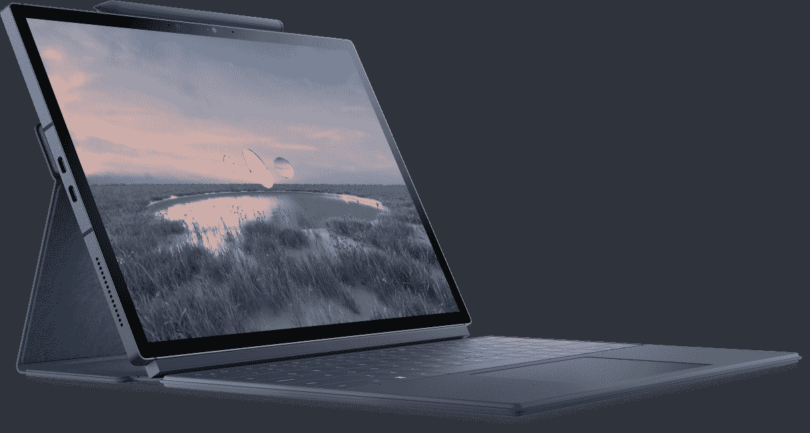
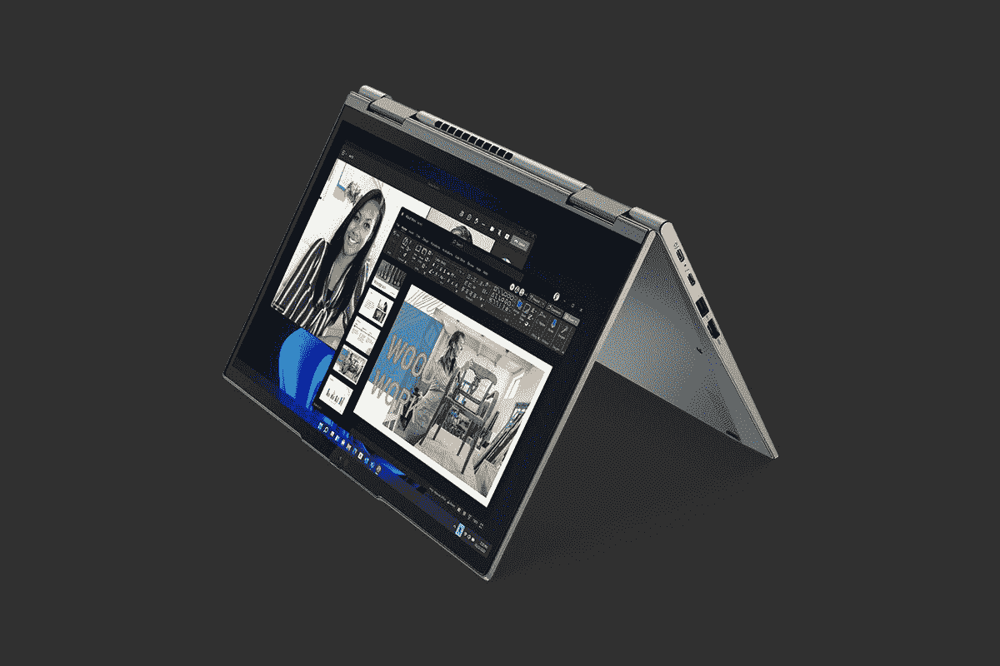

# 戴尔 XPS 13 二合一(2022)与联想 ThinkPad X1 Yoga Gen 7

> 原文：<https://www.xda-developers.com/dell-xps-13-2-in-1-2022-vs-lenovo-thinkpad-x1-yoga-gen-7/>

长期以来，戴尔 XPS 系列一直是每年最受关注的 Windows 笔记本电脑之一，XPS 13 2 合 1 通常是市场上最好的可变形笔记本电脑之一。但对于 2022 年，戴尔决定彻底改造它，今年的戴尔 XPS 13 2 合 1 具有不同的外形规格、调整的规格和其他变化，您可能喜欢也可能不喜欢。所以，如果你现在购买一台 2 合 1 笔记本电脑，你应该选择[戴尔 XPS 13 2 合 1](https://www.xda-developers.com/dell-xps-13-2-in-1-2022/) 还是更传统的，比如[联想 ThinkPad X1 Yoga](https://www.xda-developers.com/lenovo-thinkpad-x1-yoga-gen-7/) ？

没错，我们在本文中通过各种标准来比较这两款笔记本电脑，以决定哪一款适合您。这两款笔记本电脑有很多不同之处，可以说，它们也针对不同的人口统计数据，XPS 13 二合一设备更像是一款消费设备，而 ThinkPad X1 Yoga 无疑是一款[商务笔记本电脑](https://www.xda-developers.com/best-business-laptops/)。尽管如此，让我们来看看是什么让它们都独一无二，这样你就可以自己做决定了。

**浏览本文:**

## 戴尔 XPS 13 二合一(2022)与联想 ThinkPad X1 Yoga Gen 7:规格

|  | 

戴尔 XPS 13 二合一设备

 | 

联想 ThinkPad X1 Yoga Gen 7

 |
| --- | --- | --- |
| **操作系统** |  |  |
| **CPU** | 

*   第 12 代英特尔酷睿 i5-1230U (9W，10 核，12 线程，最高 4.4 GHz，12MB 高速缓存)
*   第 12 代英特尔酷睿 i7-1250 u(9 瓦、10 核、12 线程、最高 4.7 GHz、12MB 高速缓存)

 | 

*   第 12 代英特尔酷睿 i5-1240P (12 个内核，16 个线程，最高 4.4GHz，12MB 高速缓存)
*   第 12 代英特尔酷睿 i5-1250P (12 个内核，16 个线程，最高 4.4GHz，12MB 高速缓存)
*   第 12 代英特尔酷睿 i7-1260P (12 个内核，16 个线程，最高 4.7GHz，18MB 高速缓存)
*   第 12 代英特尔酷睿 i7-1270P (12 个内核，16 个线程，最高 4.8GHz，18MB 高速缓存)
*   第 12 代英特尔酷睿 i7-1280P (14 个内核，20 个线程，最高 4.8GHz，24MB 高速缓存)

 |
| **图形** |  |  |
| **显示** | 

*   13 英寸 3:2 3K (2880 x 1920)，500 尼特，DisplayHDR 400，防反光，防污迹，康宁大猩猩玻璃 7，杜比视觉，触摸和笔支持

 | 

*   14 英寸 WUXGA 16:10 (1920 x 1200) IPS 低功耗、触摸、防眩光、400 尼特、100% sRGB
*   14 英寸 WUXGA 16:10 (1920 x 1200) IPS 低功耗、触摸、防反光、防污染、400 尼特、100% sRGB
*   14 英寸 WUXGA 16:10 (1920 x 1200) IPS 低功耗、触摸、防眩光、隐私保护、500 尼特、100% sRGB
*   14 英寸 WQUXGA 16:10 (3840 x 2400)有机发光二极管低功耗、触摸、防反光、防污染、500 尼特、100% DCI-P3、杜比视界

 |
| **存储** | 

*   256GB PCIe 4 固态硬盘
*   512GB PCIe 4 固态硬盘
*   1TB PCIe 4 固态硬盘

 | 

*   256GB PCIe 第四代固态硬盘
*   512GB PCIe 第四代固态硬盘
*   1TB PCIe 第四代固态硬盘
*   2TB PCIe 第四代固态硬盘

 |
| **公羊** | 

*   8GB 双通道 LPDDR4x 4266MHz
*   16GB 双通道 LPDDR4x 4266MHz

 | 

*   8GB LPDDR5 5200MHz(焊接)
*   16GB LPDDR5 5200MHz(焊接)
*   32GB LPDDR5 5200MHz(焊接)

 |
| **电池** |  | 

*   57 瓦时电池
    *   高达 65W 的 USB Type-C 电源适配器

 |
| **端口** | 

*   2 个 Thunderbolt 4(USB C 类)端口
    *   含 USB 型至 A 型适配器
    *   包含 USB Type-C 至 3.5 毫米适配器

 | 

*   2 个 Thunderbolt 4(USB C 型)
*   2 个 USB 3.2 第 1 代 A 型
*   1 个 HDMI 2.0b 接口
*   3.5 毫米耳机插孔
*   Nano SIM 卡插槽

 |
| **音频** | 

*   双立体声扬声器，带 Waves MaxxAudio Pro 和 Waves Nx 3D 音频
*   双阵列麦克风

 | 

*   带杜比全景声的四声道立体声扬声器(2 个 2W 低音扬声器，2 个 0.8 瓦高音扬声器)
*   带杜比语音的四声道远场麦克风

 |
| **摄像机** | 

*   500 万像素/1080 像素前置网络摄像头
*   1100 万像素/4K 面向世界的相机

 | 

*   1080p 全高清 RGB 网络摄像头
*   1080p 全高清 RGB +红外网络摄像头
*   具有计算机视觉功能的 1080p 全高清 MIPI RGB +红外网络摄像头

 |
| **生物认证** | 

*   红外照相机
*   XPS 对开键盘中的指纹识别器

 | 

*   红外网络摄像头(可选)
*   指纹传感器

 |
| **连通性** | 

*   英特尔无线网络 6E AX211
*   蓝牙 5.2
*   **可选(仅在 Slate 型号中):** 5G(英特尔 5000)

 | 

*   英特尔无线 6E
*   蓝牙 5.2
*   蜂窝选项:
    *   5G sub-6 Cat2o
    *   4G LTE Cat16

 |
| **颜色** |  |  |
| **尺寸(WxDxH)** | 

*   **天空(仅 Wi-Fi):**292.5×201.2×7.4 毫米(11.5 × 7.9 ×0.29 英寸)
*   **石板(5G)****:**292.5 x 201.2 x 7.8 毫米(11.5 x 7.9 x 0.31 英寸)

 | 

*   314.4 x 222.3 x 15.53 毫米(12.38 x 8.75 x 0.61 英寸)

 |
| **尺寸** | 

*   **Sky(仅限 Wi-Fi):**起始重量为 736 克(1.6 磅)
*   **石板(5 克):**起始重量为 811 克(1.8 磅)

 |  |
| **价格** | 1，099.99 美元(包括 XPS 对开本) | 起价 1749 美元 |

## 性能:ThinkPad X1 Yoga 速度更快，但代价是什么？

这两款笔记本电脑的第一大区别是性能，尽管它们都采用了第 12 代英特尔酷睿处理器。这是因为 Dell XPS 13 二合一设备采用 U9 系列处理器，默认 TDP 为 9W，因此它有 10 个内核和 12 个线程，无法长时间以最高性能运行。另一方面，ThinkPad X1 Yoga 配备了 28W TDP 的 P 系列处理器。这些处理器有多达 14 个内核和 20 个线程，如果有足够的冷却，它们通常可以运行得更快更久。ThinkPad X1 Yoga 实际上有抑制其 CPU 的趋势，但它应该仍然比 9W 处理器快。

ThinkPad X1 Yoga 的处理器速度更快，但耗电量更大。

这也适用于这些处理器中的集成 GPU。U9 和 P 系列处理器都集成了 Iris Xe 显卡，但在 U9 系列机型上，GPU 的最高运行频率仅为 950MHz，而在 P 系列处理器上，最高可达 1.45GHz，大约快了 50%。当然，不仅仅是时钟速度，GPU 在大多数其他方面都很相似，但这仍然是一个很大的差异。

当然，这也有不好的一面。ThinkPad X1 Yoga 的性能提升是以功耗增加为代价的，P 系列处理器的功耗(默认情况下)高出近三倍。这意味着联想 ThinkPad X1 Yoga 的电池消耗速度将比戴尔 XPS 13 二合一设备快得多，尽管它的电池体积更大(57 瓦时比 49.5 瓦时)，但这并不足以改变结果。XPS 13 二合一设备的电池续航时间可能会长得多，但你还必须考虑显示器等其他因素。

最后，还有内存和存储，ThinkPad X1 Yoga 可以配置高达 32GB 的 LPDDR5 内存和 2TB 的 SSD，而戴尔 XPS 13 二合一设备最多可以配置 16GB 的 LPDDR4x 内存和 1TB 的 SSD 存储。当然，你将为这些升级付费，而且 ThinkPad 已经有了更高的起价，所以这是需要考虑的。

## 显示屏和声音:默认情况下，Dell XPS 13 2 合 1 设备拥有出色的屏幕

Dell XPS 13 2 合 1 显示器是其最出色的方面之一，特别是因为它具有单一配置，默认情况下非常棒。这是一个 13 英寸的面板，长宽比为 3:2，灵感来自微软的 Surface Pro 系列。其实连分辨率都一样，2880 x 1920。这是一个非常清晰的 IPS 面板，戴尔通常有非常好的 IPS 屏幕，因此您可以指望获得出色的整体体验。

另一方面，联想 ThinkPad X1 Yoga 拥有 14 英寸的显示屏，长宽比为 16:10。这仍然高于典型的 16:9 屏幕，但不像 3:2 面板那样方，你可能喜欢或不喜欢。就像 XPS 13-in-1(和大多数变形本)支持触摸和笔输入一样，但 ThinkPad X1 Yoga 实际上包括一支笔，它甚至直接存储在笔记本电脑内部。基本配置并不令人印象深刻，是一个全高清+ (1920 x 1200)面板，但它为您提供了一个潜在的重要选项，可以添加隐私保护过滤器，防止周围的人窥探您的屏幕。

如果你只是想要最好的图像质量，那么有一个超高清+ (3840 x 2400) OLED 面板，它不仅非常清晰，而且还能给你带来真正的黑色和高对比度等好处，因此它可以带来令人惊叹的视觉体验。当然，这是在已经很贵的笔记本电脑上的昂贵升级，但它确实给了你比戴尔提供的更好的选择。

戴尔 XPS 13 有一个 500 万像素的前置摄像头和一个 110 万像素的后置摄像头。

在声音方面，这两款笔记本电脑都应该提供相当可靠的体验，尽管你可能会从 ThinkPad X1 Yoga 及其四扬声器设置中获得更好的音频。笔记本电脑也有顶部发射扬声器，所以你应该能清楚地听到它。与此同时，Dell XPS 13 二合一设备配有双立体声扬声器，因此可能没有那么身临其境。

网络摄像头是 Dell XPS 13 二合一设备领先的一个领域，毫无疑问，因为它是一款平板电脑，更注重拍照和视频。它有一个前置的 500 万像素网络摄像头，能够录制 1080p 视频，此外甚至还有一个后置摄像头，带有 1100 万像素传感器和 4K 视频支持。与此同时，联想 ThinkPad X1 Yoga 拥有 1080p 前置网络摄像头，正如你对 2022 年笔记本电脑的预期。对于视频通话来说，两者都应该很好，但 XPS 13 二合一设备可能会更好。两者都支持 Windows Hello 面部识别，但在 ThinkPad 上这是一个可选的升级，而 XPS 13 二合一设备默认包含它。

## 设计:XPS 13 二合一设备更加便携

谈到设计，显而易见的是，戴尔 XPS 13 二合一设备和 ThinkPad X1 Yoga 面向不同的受众，原因如下。首先，戴尔 XPS 13 二合一设备完全是为了便携性，它非常轻薄，Wi-Fi 型号的尺寸为 7.4 毫米，重量为 1.6 磅(5G 版本为 7.8 毫米和 1.8 磅)。当然，其中很大一部分是因为它是一款平板电脑，所以大小和重量不包括 XPS Folio 键盘。这是一个你可以随身携带的设备，只是为了娱乐，而不总是为了工作。它也有两种颜色，天空和石板，都很柔和，但不会太无聊。

与此同时，从外观上看，联想 ThinkPad X1 Yoga 显然是一款工作机。它有风暴灰色，看起来像你想要的那样商务，包括 ThinkPad 系列的经典红色，以及键盘下方的 TrackPoint 和重复鼠标按钮等功能。当然，这也是一款经典的敞篷车，总是附带键盘和触摸板，因此它随时可以帮助您完成工作。

这也反映在尺寸上。ThinkPad X1 Yoga 厚度为 15.53 毫米，起始重量为 3 磅，因此它的便携性确实不如 XPS 13 二合一设备。平心而论，还是比较好携带的，只是更大了。

## 端口和连接:平板电脑没有很多

最后，还有端口，这是 Dell XPS 13 2 合 1 由于其紧凑的外形而真正受到影响的一个方面。你得到的只是两个 Thunderbolt 4 端口，甚至连耳机插孔这样的东西都没有内置在平板电脑中，戴尔确实为耳机插孔和 USB Type-A 端口提供了适配器，但这意味着你必须一直随身携带它们。如果你有一个复杂的桌面系统，你将需要一个 [Thunderbolt dock](https://www.xda-developers.com/best-thunderbolt-docks/) 来让这些外围设备工作。

相反，联想 ThinkPad X1 Yoga 是一款商务笔记本电脑，它们以出色的端口供应而闻名。这意味着你有两个 Thunderbolt 4 端口，两个 USB Type-A 端口，HDMI 和一个内置的耳机插孔。这为您提供了大量连接外设的选项，虽然您仍然可以使用 Thunderbolt docks，但您不必这样做。

至于无线连接，正如你所料，这两款笔记本电脑都支持 Wi-Fi 6E 和蓝牙 5.2。至于蜂窝网络，XPS 13 二合一设备将在 2022 年晚些时候推出 5G 版本，但目前还不可用。同时，ThinkPad X1 Yoga 为您提供了 4G LTE 或 5G 连接选项，这两种选项现在都可用。

## 戴尔 XPS 13 二合一设备与联想 ThinkPad X1 Yoga Gen 7:最终想法

归根结底，在任意两台笔记本电脑之间进行选择是一个非常个人化的选择，但正如我们刚刚看到的那样，根据您的需求，任何一方都有明显的优势。戴尔 XPS 13 2 合 1 非常专注于成为一款便携式机器，因此它非常轻薄，低功耗处理器应该可以延长电池寿命。最重要的是，默认情况下它有一个很棒的显示屏，而且它也有更好的相机设置，如果你打算大量使用的话。最后，虽然这是主观的，但 XPS 13 2 合 1 具有更吸引人的外观，整体上更现代。

另一方面，联想 ThinkPad X1 Yoga 将通过英特尔的 P 系列处理器为您提供更高的性能(以电池寿命为代价)，并且键盘和触摸板随时可用，随时准备工作。此外，它有一个令人惊叹的有机发光二极管显示选项或更适合一些用户的隐私屏幕，更多的端口，更多的配置选项，更多的存储和 RAM 可用。这里连网络摄像头都挺好的，就算 XPS 13 二合一有更好的。

根据您对笔记本电脑的需求，这两款电脑都可能是您的正确选择。也有可能两者都不是。如果你想买其中任何一款，你可以使用下面的链接，但如果不是，你可以随时查看[最佳戴尔笔记本电脑](https://www.xda-developers.com/best-dell-laptops/)或[最佳 ThinkPad](https://www.xda-developers.com/best-thinkpads/)来看看目前其他一些不错的设备。

 <picture></picture> 

Dell XPS 13 2-in-1

##### 戴尔 XPS 13 二合一设备

Dell XPS 13 2 合 1 是一款时尚的 WIndows 平板电脑，配有清晰的 3:2 显示屏、两个出色的摄像头和第 12 代英特尔处理器

 <picture></picture> 

Lenovo ThinkPad X1 Yoga Gen 7

##### 联想 ThinkPad X1 Yoga Gen 7

联想 ThinkPad X1 Yoga Gen 7 是一款功能强大的商务变形本，采用第 12 代英特尔处理器，最高可配超高清+有机发光二极管显示屏。它还有许多端口和配置选项。