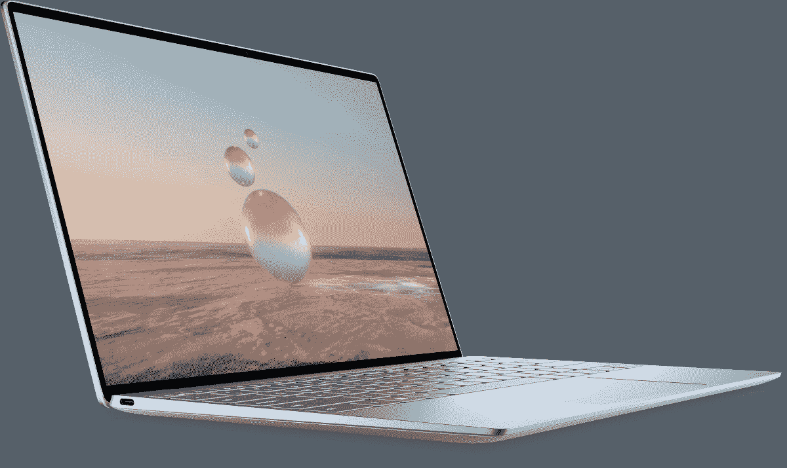

# 戴尔 XPS 13 (2022) vs 联想 Yoga 9i:最好的超极本是什么？

> 原文：<https://www.xda-developers.com/dell-xps-13-2022-vs-lenovo-yoga-9i-2022/>

在 2022 年买一台新的笔记本电脑意味着你被宠坏了。今年发布了一些非常棒的笔记本电脑，迎合了不同类型的用户。但最受欢迎的笔记本电脑类型之一是超极本——小巧轻便的笔记本电脑，设计用于旅行、上学或工作时的日常使用。今年的两个首选是[戴尔 XPS 13](https://www.xda-developers.com/dell-xps-13-2022/) 和[联想 Yoga 9i](https://www.xda-developers.com/lenovo-yoga-9i-2022-review/) ，但它们彼此之间有很大的不同。

最值得注意的是，戴尔 XPS 13 (2022)是一款标准的翻盖式笔记本电脑，而联想 Yoga 9i 是一款可变形笔记本电脑，因此这可能是选择其中一款的一个很好的理由。但是里面和外面有很多不同，所以让我们仔细看看，这样你就可以自己决定哪一个更适合你。

**浏览本文:**

## 戴尔 XPS 13 (2022)与联想 Yoga 9i:规格

|  | 

戴尔 XPS 13 (2022)

 | 

联想 Yoga 9i

 |
| --- | --- | --- |
| **操作系统** | 

*   Windows 11
*   Ubuntu 20.04

 |  |
| **CPU** | 

*   第 12 代英特尔酷睿 i5-1230U (12W，10 核，12 线程，最高 4.4 GHz，12MB 高速缓存)
*   第 12 代英特尔酷睿 i7-1250U (12W、10 核、12 线程、最高 4.7 GHz、12MB 高速缓存)

 | 

*   英特尔酷睿 i5-1240P (28W，12 核，16 线程，最高 4.4 GHz，12MB 高速缓存)
*   英特尔酷睿 i7-1260 处理器(28W，12 核，16 线程，最高 4.7 GHz，18MB 高速缓存)
*   英特尔酷睿 i7-1280 处理器(28W，14 核，20 线程，最高 4.8 GHz，24MB 高速缓存)

 |
| **图形** | 

*   英特尔 Iris Xe 显卡(最高 96 个欧洲单位)

 | 

*   英特尔 Iris Xe 显卡(最高 96 个欧洲单位)

 |
| **显示** | 

*   13.4 英寸 FHD+ (1920 x 1200) InfinityEdge 非触摸，500 尼特，防反光
*   13.4 英寸 FHD+(1920 x 1200)infinity edge touch，500 尼特，防反光
*   13.4 英寸 UHD+(3840 x 2400)infinity edge touch，500 尼特，防反光

 | 

*   14 英寸 FHD+ (1920 x 1200) IPS，触控，400 尼特，100% sRGB，60 赫兹刷新率
*   14 英寸 2.8K (2880 x 1800)有机发光二极管，触摸，400 尼特，100% DCI-P3，90Hz 刷新率
*   14 英寸 UHD+ (3840 x 2400)有机发光二极管，触摸，400 尼特，100% DCI-P3，60 赫兹刷新率

 |
| **存储** | 

*   256GB PCIe 4 固态硬盘
*   512GB PCIe 4 固态硬盘
*   1TB PCIe 4 固态硬盘

 | 

*   256GB PCIe 4 固态硬盘
*   512GB PCIe 4 固态硬盘
*   1TB PCIe 4 固态硬盘

 |
| **闸板** | 

*   8GB 双通道 DDR5 5200MHz
*   16GB 双通道 DDR5 5200MHz
*   32GB 双通道 DDR5 5200MHz

 | 

*   8GB LPDDR5 5200MHz
*   16GB LPDDR5 5200MHz

 |
| **电池** |  |  |
| **端口** | 

*   2 个 Thunderbolt 4(USB C 类)端口
    *   含 USB 型至 A 型适配器
    *   USB Type-C 至 3.5 毫米适配器可选

 | 

*   2 个 Thunderbolt 4(USB C 型)
*   1 个 USB 3.2 第二代
*   1 个 USB-C 3.2 第二代
*   3.5 毫米耳机插孔

 |
| **音频** | 

*   双立体声扬声器(4W 总输出)
*   双阵列麦克风

 | 

*   Bowers & Wilkins 的四声道立体声扬声器(2 个 3W 低音扬声器，2 个 2W 高音扬声器)，杜比全景声
*   双阵列麦克风

 |
| **摄像机** |  | 

*   带红外线的全高清 1080p 网络摄像头

 |
| **生物认证** | 

*   指纹读取器
*   红外照相机

 | 

*   指纹读取器
*   红外照相机

 |
| **连通性** | 

*   英特尔 Wi-Fi 6E 1675 AX211 (2x2)
*   蓝牙 5.2

 | 

*   Wi-Fi 6E (2×2)
*   蓝牙 5.2

 |
| **颜色** |  |  |
| **尺寸(WxDxH)** | 

*   11.63 × 7.85 × 0.55 英寸(295.4 × 199.4 × 13.99 毫米)

 | 

*   12.52 × 9.06 × 0.6 英寸(318×230×15.25 毫米)

 |
| **尺寸** | 

*   起始重量为 1.17 千克(2.59 磅)

 | 

*   **IPS 屏幕:**起始重量为 1.5 千克(3.31 磅)
*   **有机发光二极管屏幕:**起始重量 1.4 千克(3.09 磅)

 |
| **价格** | 起价 999 美元 | 起价 1079.99 美元 |

## 性能:12W 或 28W 英特尔处理器

正如你可能预期的那样，2022 年的戴尔 XSP 13 和联想 Yoga 9i 都配备了最新的英特尔处理器，即第 12 代 Alder Lake 家族。但这并不意味着它们完全一样。戴尔 XPS 13 使用英特尔的 U9 系列处理器-默认 TDP 为 9W-并略微提高到 12W。与此同时，联想使用新的 P 系列处理器，具有更高的 28W TDP。更高的 TDP 通常意味着更高的性能，您可以看到 P 系列处理器比 U9 系列型号拥有更多的内核和线程。以下是两款笔记本电脑中酷睿 i5 型号的对比。不幸的是，现在很难找到 Core i7 型号的分数，但这应该会让您对差异有所了解。

|  | 

戴尔 XPS 13 (2022)英特尔酷睿 i5-1230U

 | 

联想 Yoga 9i (2022)英特尔酷睿 i5-1240P

 |
| --- | --- | --- |
| Geekbench 5(单核/多核) | 1,463 / 5,940 | 1,650 / 9,933 |

这是一个相当大的优势，在 GPU 方面也应该如此。根据英特尔的规格表，英特尔 Iris Xe 集成 GPU 在 U9 系列处理器上只能提升到 950MHz，而 P 系列处理器可以达到 1.45GHz，因此联想 Yoga 9i 的性能应该会明显更好。

戴尔 XPS 13 的 CPU 更加节能。

当然，这样做的代价是电池寿命，根据我们对英特尔 P 系列处理器的测试，它并不是很好。联想 Yoga 9i 在充电后的工作时间略超过四个小时，但在视频播放时性能要好得多。尽管如此，Dell XPS 13 二合一设备中的 12W 处理器可能会为您带来更长的电池续航时间。Dell XPS 13 二合一设备的电池更小，但续航时间可能更长。

除此之外，戴尔 XPS 13 可以配置高达 32GB 的内存，是联想 Yoga 9i 的两倍，因此如果您的工作负载需要大量内存，这可能是值得的。在存储方面，这两款笔记本电脑的固态硬盘最大存储容量为 1TB，因此在这方面它们并驾齐驱。

说到显示器，这两款笔记本电脑本身都很棒。Dell XPS 13 配有 13.4 英寸显示屏，具有 16:10 的宽高比，这有助于提高工作效率，因为您无需滚动屏幕就可以一次看到更多内容。基本型号是全高清+ (1920 x 1200)面板，不支持触摸，但您可以添加触摸屏或升级到超高清+ (3840 x 2400)型号，以获得最佳质量的图像。这些都是 IPS 面板，但戴尔使用了非常好的显示器，所以它们看起来很棒。尽管如此，今年的模型没有我们去年看到的 3.5K 有机发光二极管，这是一个令人失望的。

与此同时，联想 Yoga 9i 的显示屏略大，为 14 英寸，长宽比为 16:10。基本配置也类似，是一个全高清+显示器，但因为它是一个可转换的，触摸和笔支持是标准功能。另外，升级才是真正有趣的地方。你可以选择 2.8K (2880 x 1800) OLED 面板，其刷新率为 90Hz，体验更流畅，或者你可以选择 60Hz 刷新率的超高清+ (3840 x 2400) OLED 面板。这两个都是很棒的展示，你可以选择最适合你预算和需求的。与有机发光二极管，你可以指望真正的黑色，生动的色彩，和非常高的对比度。

联想 Yoga 9i 拥有 1080p 网络摄像头。

但联想 Yoga 9i 在媒体体验方面真正领先的地方是声音。戴尔 XPS 13 (2022)有一组双立体声扬声器，效果很好，但不会给人过多的印象。这是一个紧凑的笔记本电脑，所以这是有道理的。然而，联想 Yoga 9i 有一个四扬声器设置——两个 3W 低音扬声器和两个 2W 高音扬声器。此外，它还有一个“音棒铰链”，其中放置了两个扬声器，因此它们总是向你的方向发出声音。如果你想看电影或其他内容，联想 Yoga 9i 是最好的选择。

联想笔记本电脑的另一个重要胜利是在显示屏之上。2022 年，像联想这样的制造商已经抓住了对更高质量网络摄像头的需求，特别是因为过去两年促使许多人远程工作。联想 Yoga 9i 有一个 1080p 网络摄像头，但戴尔在 XPS 13 中坚持使用 720p 传感器，因此前者应该有助于你在视频通话和会议中看起来更好。

## 设计:戴尔 XPS 13 超便携

谈到设计，Dell XPS 13 显示了其作为移动性笔记本电脑的优势。戴尔完全重新设计了这款笔记本电脑，这也是它采用 12W 处理器而不是我们过去看到的 15W 处理器的部分原因。这款笔记本电脑现在只有 13.99 毫米薄，宽度和高度都非常紧凑。此外，它的重量仅为 2.59 磅，因此您可以轻松将它带到任何地方。

最新款还推出了几种新颜色，这使它成为一款相当独特的设备。颜色是天蓝色(浅蓝色)和棕色(深酒红色)，这在高端笔记本电脑中并不常见，因此戴尔也值得一提。

另一方面，联想 Yoga 9i 是一款明显更大的笔记本电脑，尽管它远不笨重。它的厚度为 15.25 毫米，每个维度都更大(毕竟它的显示屏也更大)。有机发光二极管型号的起始重量为 3.09 磅，IPS 型号的起始重量为 3.31 磅，因此它更重，但这不会使它成为一款难以随身携带的笔记本电脑。

但联想也成功地将这款笔记本电脑做得很漂亮，这是以前的 Yoga 9i 型号很难做到的。现在，整个机箱与平坦的表面和均匀的厚度保持平衡，这些表面在笔记本电脑周围形成美丽闪亮的弯曲边缘。它看起来很棒，两种颜色选择-风暴灰和燕麦色-与这种设计语言完美契合。

正如我们在顶部提到的，还有外形因素。联想 Yoga 9i 是一款敞篷车，因此您可以随时将其用作笔记本电脑或平板电脑。它具有 XPS 13 所不具备的多功能性。

## 端口和连接性:紧凑需要一些牺牲

最后说一下端口。根据您的需求，这可能是 Dell XPS 13 的损失。戴尔一直试图尽可能保持笔记本电脑的紧凑，在最新的迭代中，XPS 13 只有两个电源。没错，你得到了两个 Thunderbolt 4 端口，其他什么都没有——连一个耳机插孔都没有。戴尔确实为笔记本电脑配备了几个适配器，但你必须记住随身携带它们，不要丢失它们，所以这就有些麻烦了。你也可以使用一个 [Thunderbolt dock](https://www.xda-developers.com/best-thunderbolt-docks/) 来添加更多端口。

联想 Yoga 9i 利用了它更大的机箱，所以除了两个 Thunderbolt 4 端口，你还可以获得一个常规的 USB Type-C 端口，一个 USB Type-A 端口和一个耳机插孔。这是一个更完整的设置，虽然有些人可能希望看到 HDMI 端口，但在这种尺寸的高端笔记本电脑中省略它已经变得非常普遍。这仍然是你在这个细分市场能得到的最好的设置之一。

就无线连接而言，这两款笔记本电脑非常相似。两者都支持 Wi-Fi 6E 和蓝牙 5.2，所以你不应该期待有任何巨大的差异。两者都没有手机支持，这是主流笔记本电脑的典型特征。支持该功能的通常是面向业务的设备。

## 戴尔 XPS 13 与联想 Yoga 9i:最终想法

通常情况下，哪种笔记本电脑更好很大程度上取决于您的需求和偏好，但是我们可以根据上面的内容来说一下。如果您想要极其便携的设备，戴尔 XPS 13 是理想之选。它小巧、轻薄，而且处理器效率明显更高，这意味着您可以在远离插座的地方使用它更长时间。如果你是一个长时间远离插座的人，比如说，在学校或工作，那就是你想要的笔记本电脑。是的，你错过了一些港口，但如果你经常旅行，你可能不会随身携带大量的配件。

另一方面，联想 Yoga 9i 是媒体消费的非凡笔记本电脑。它有令人惊叹的显示选项和出色的音响系统，最重要的是，非常快的处理器和出色的网络摄像头。如果你不经常活动，这是一款更好的笔记本电脑，但是当你需要随身携带时，它仍然相当轻薄。通过更多端口，您可以连接更多外围设备，而无需适配器。此外，虽然这是主观的，它有一个绝对美丽的设计。

还有外形因素，如果你像我一样，这可能是决定性因素。我总是绝对倾向于购买敞篷车，所以联想 Yoga 9i 是我在这次比较中的唯一选择。当然，每个人都是不同的，所以你可能有不同的优先级。如果你知道你属于上面的哪一组，那么你就已经知道该买哪台笔记本电脑了。如果你想这样做，你可以使用下面的链接。

或者，如果这些都没有完全说服你，还有其他选择。如果你喜欢这种外形，你可以看看[最佳可折叠笔记本电脑](https://www.xda-developers.com/best-convertible-laptops/)，或者如果你对便携性更感兴趣，你可以看看[最佳轻便笔记本电脑](https://www.xda-developers.com/best-lightweight-laptops/)。

 <picture></picture> 

Dell XPS 13 (2022)

##### 戴尔 XPS 13 (2022)

Dell XPS 13 是一款超紧凑的笔记本电脑，采用第 12 代英特尔处理器和轻量级设计。

 <picture></picture> 

Lenovo Yoga 9i

##### 联想 Yoga 9i

联想 Yoga 9i 是一款高级敞篷车，拥有漂亮的设计和强大的英特尔 P 系列处理器，以及用于媒体消费的出色音响系统。