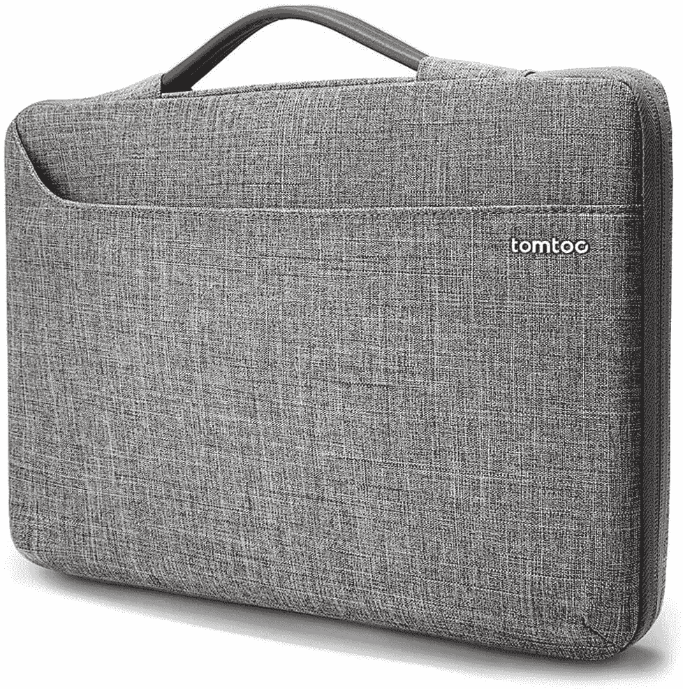

# 戴尔 XPS 13 Plus 的最佳案例

> 原文：<https://www.xda-developers.com/dell-xps-13-plus-cases/>

# 戴尔 XPS 13 Plus 的最佳案例

如果您想让您崭新的 Dell XPS 13 Plus 安然无恙，电脑包可以提供宝贵的保护。这是我们找到的最好的。

戴尔 XPS 13 Plus 有望成为 2022 年 T2 最佳笔记本电脑之一。这是我们很久以来见过的最具未来感的设计之一，它看起来非常干净和简约。例如，这台笔记本电脑上没有触控板，至少看不见。如此酷的设计理应受到保护，尤其是当笔记本电脑可能相当昂贵的时候。为了帮助实现这一点，我们收集了一些您可以为 Dell XPS 13 Plus 购买的最佳案例。

当然，当我们说笔记本电脑的“外壳”时，它更像是一个袋子，而不是连接到笔记本电脑的外壳。我们很少看到笔记本电脑有合适的卡扣式外壳，主要是因为你不会在使用它时到处移动它(如果你会，也许不要这样做)。尽管如此，这些允许你在旅途中安全地携带你的笔记本电脑。即使你把它装进一个更大的包里，包也可以保护你的笔记本电脑不被包里的其他东西划伤。事不宜迟，让我们来看看我们能找到的最好的 Dell XPS 13 Plus 机箱。

*   <picture></picture>

    Londo 真皮手包

    ##### Londo 真皮手包

    Londo 真皮手包是为 MacBooks 设计的，但也非常适合戴尔 XPS 13 Plus。它使用皮革和编织图案的美丽组合，让您的笔记本电脑具有独特的外观和高级感。

*   <picture></picture>

    Tomtoc 360 保护套

    ##### Tomtoc 360 保护型笔记本电脑单肩包

    Tomtoc 360 包是一款外观现代的包，提供的保护比您想象的还要多。它加固了边角，内部有许多缓冲垫，可以保护您的笔记本电脑免受跌落和碰撞。另外，它看起来很棒。

*   <picture></picture>

    Kinmac 360 笔记本电脑保护套

    ##### Kinmac 360 保护套

    想要合适自己的保护套吗？这款 Kinmac 袖套有多种款式(有些只有大码的)，你可以买到刚好符合你风格的。它也有足够的保护。

*   <picture></picture>

    戴尔专业袖套 13

    ##### 戴尔专业袖套 13

    这款戴尔袖套看起来很专业，除了笔记本电脑之外，还为您提供了一些额外的口袋空间。如果您需要为您的 Dell XPS 13 Plus 配备充电器和其他外围设备，它是理想的选择，而且易于携带。

*   <picture></picture>

    Nillkin 笔记本电脑套

    ##### Nillkin 笔记本电脑套带支架

    这个 Nillkin 套很有趣，因为它不仅可以提供保护，还可以作为一个支架来举起你的笔记本电脑。此外，磁性翻盖还可以兼作鼠标垫。它什么都有，而且有五种颜色。

*   <picture></picture>

    Ytonet 笔记本电脑套

    ##### Ytonet 笔记本电脑套

    这款 Ytonet 笔记本电脑套为您的笔记本电脑提供了基本的保护，具有防水层和减震材料，可承受跌落和碰撞。它有几种颜色可供选择，所以你可以买到适合你的。

*   <picture></picture>

    Inateck 笔记本电脑保护套

    ##### Inateck 笔记本电脑保护套

    如果你想要一个便宜的保护套给你的戴尔 XPS 13 Plus，这是一个很棒的选择。它使用防水和防震材料，并有几种专业外观的颜色，所以你可以带着这个包去任何地方。

*   <picture></picture>

    都市护甲套

    ##### UAG 中号笔记本套

    如果你需要比大多数更坚韧一点的东西，这款 UAG 套可能就是你需要的。这款 UAG 电脑包设计紧凑，符合军用耐用性标准，确保您的笔记本电脑不会跌落和磨损。

* * *

这些是您可以购买的保护您的 Dell XPS 13 Plus 免受日常跌落和碰撞的最佳保护套。对于不同类型的用户来说，这些都是很好的选择，无论你想要更柔和还是更华丽的东西。我个人会选择像 Tomtoc 360 套筒这样简单有效的东西，因为它提供了很好的保护，不会在公共场合引起太多的注意。

如果您对戴尔 PS 13 Plus 感兴趣，可以使用以下链接购买。虽然它不是一款完美的设备，但考虑到它是一款如此有趣的设备，它肯定是你今天能买到的最好的戴尔笔记本电脑之一。

 <picture></picture> 

Dell XPS 13 Plus

##### 戴尔 XPS 13 Plus

Dell XPS 13 Plus 是一款功能强大的现代笔记本电脑，配备 28W 英特尔处理器。