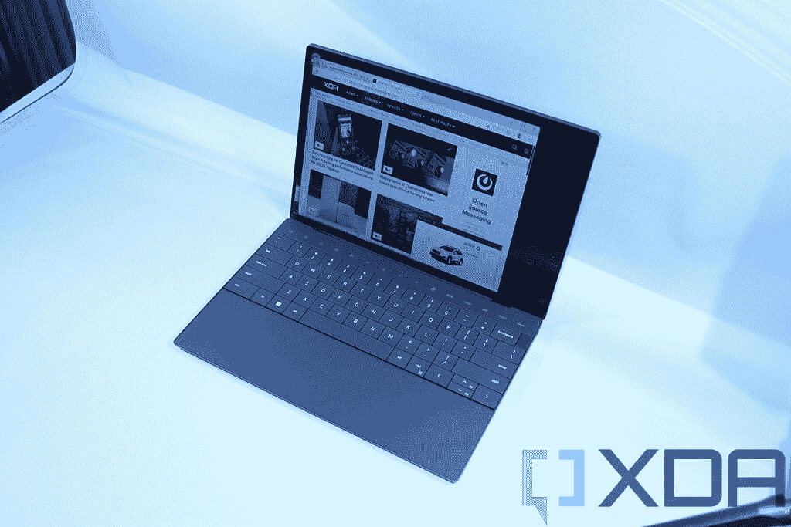
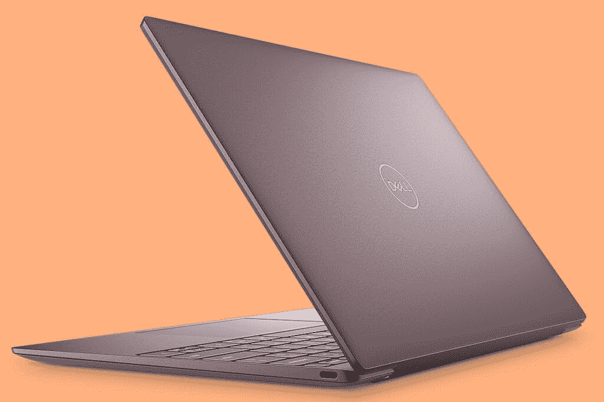

# 戴尔 XPS 13 Plus vs 戴尔 XPS 13 (2022):哪款笔记本电脑适合你？

> 原文：<https://www.xda-developers.com/dell-xps-13-plus-vs-dell-xps-13-2022/>

戴尔的 XPS 笔记本电脑系列在 2022 年受到了相当大的调整。这一年以全新的[戴尔 XPS 13 Plus](https://www.xda-developers.com/dell-xps-13-plus/) 开始，这似乎是标准 XPS 13 的替代品，但事实并非如此。几个月后，2022 年的常规[戴尔 XPS 13 推出，多年来首次带来一些重大设计变化。所以，现在这两款新笔记本电脑都上市了，问题是:哪一款适合你？](https://www.xda-developers.com/dell-xps-13-2022/)

这些笔记本电脑有一些共同点，但它们在其他方面也有明显的不同。您可能注意到的第一件事是性能，但还有更多，包括设计和一些显示选项。当然，另一个很大的区别是起步价，XPS 13 Plus 的起步价明显更高。在本文中，我们将进一步了解戴尔 XPS 13 Plus 和 XPS 13，找出哪一款更适合您。

**浏览这篇文章:**

## 戴尔 XPS 13 Plus 与戴尔 XPS 13 (2022 年):规格

|  | 

戴尔 XPS 13 Plus 9320

 | 

戴尔 XPS 13 9315 (2022)

 |
| --- | --- | --- |
| **CPU** | 

*   第 12 代英特尔酷睿 i5-1240P (12 核，16 线程，最高 4.4 GHz，12MB 高速缓存)
*   第 12 代英特尔酷睿 i7-1260 处理器(12 核、16 线程、最高 4.7 GHz、18MB 高速缓存)
*   第 12 代英特尔酷睿 i7-1270P (12 核，16 线程，最高 4.8 GHz，18MB 高速缓存)
*   第 12 代英特尔酷睿 i7-1280 处理器(14 核、20 线程、最高 4.8 GHz、24MB 高速缓存)

 | 

*   第 12 代英特尔酷睿 i5-1230U (12W，10 核，12 线程，最高 4.4 GHz，12MB 高速缓存)
*   第 12 代英特尔酷睿 i7-1250U (12W、10 核、12 线程、最高 4.7 GHz、12MB 高速缓存)

 |
| **图形** |  |  |
| **存储** | 

*   256GB PCIe 4 固态硬盘
*   512GB PCIe 4 固态硬盘
*   1TB PCIe 4 固态硬盘
*   2TB PCIe 4 固态硬盘

 | 

*   256GB PCIe 4 固态硬盘
*   512GB PCIe 4 固态硬盘
*   1TB PCIe 4 固态硬盘

 |
| **闸板** | 

*   8GB LPDDR5 5200MHz
*   16GB LPDDR5 5200MHz
*   32GB LPDDR5 5200MHz

 | 

*   8GB LPDDR5 5200MHz
*   16GB LPDDR5 5200MHz
*   32GB LPDDR5 5200MHz

 |
| **显示** | 

*   13.4 英寸 FHD+ (1920 x 1200) InfinityEdge 非触摸，500 尼特，防反光
*   13.4 英寸 FHD+(1920 x 1200)infinity edge touch，500 尼特，防反光
*   13.4 英寸 UHD+(3840 x 2400)infinity edge touch，500 尼特，防反光
*   13.4 英寸 3.5K (3456 x 2160) InfinityEdge 有机发光二极管触摸屏，DisplayHDR 500，400 尼特，100% DCI-P3 色域，防反射，康宁大猩猩玻璃 Victus

 | 

*   13.4 英寸 FHD+ (1920 x 1200) InfinityEdge 非触摸，500 尼特，防反光
*   13.4 英寸 FHD+(1920 x 1200)infinity edge touch，500 尼特，防反光
*   13.4 英寸 UHD+(3840 x 2400)infinity edge touch，500 尼特，防反光

 |
| **端口** | 

*   2 个 Thunderbolt 4(USB C 类)端口
    *   含 USB 型至 A 型适配器
    *   包含 USB Type-C 至 3.5 毫米耳机插孔适配器

 | 

*   2 个 Thunderbolt 4(USB C 类)端口
    *   含 USB 型至 A 型适配器
    *   包含 USB Type-C 至 3.5 毫米耳机插孔适配器

 |
| **电池** | 

*   55Wh 锂离子聚合物
    *   60W USB Type-C 电源适配器

 | 

*   3 芯 51 瓦时电池
    *   45W USB Type-C 电源适配器

 |
| **音频** | 

*   四声道立体声扬声器(8W 总输出)
*   Waves MaxxAudio Pro 和 Waves Nx 3D 音频

 | 

*   立体声扬声器(2W x 2 = 4W 峰)
*   Waves MaxxAudio Pro

 |
| **相机** |  |  |
| **Windows Hello** | 

*   红外网络摄像头
*   指纹传感器(在电源按钮中)

 | 

*   红外网络摄像头
*   指纹传感器(在电源按钮中)

 |
| **连通性** | 

*   英特尔 Wi-Fi 6E 1675 AX211 (2×2)
*   蓝牙 5.2

 | 

*   英特尔 Wi-Fi 6E 1675 AX211 (2 x 2)
*   蓝牙 5.2

 |
| **颜色** |  |  |
| **尺寸(宽 x 深 x 高)** | 

*   295.3 × 199.04 × 15.28 毫米(11.63 × 7.84 × 0.6 英寸)

 | 

*   295.4 × 199.4 × 13.99 毫米(11.63 × 7.85 × 0.55 英寸)

 |
| **重量** | 

*   起始重量为 1.24 千克(2.73 磅)

 |  |
| **价格** |  |  |

## 性能:28 瓦或 12 瓦英特尔处理器

当您查看上面的规格表时，可能会发现第一个显著的差异是处理器。这两款笔记本电脑都采用了第 12 代英特尔处理器，但这并不意味着它们在性能方面相差无几。Dell XPS 13 Plus 是性能的一大飞跃，是首批使用英特尔全新 P 系列处理器的笔记本电脑之一，该处理器具有更高的 28W TDP。与此同时，普通的 XPS 13 实际上降低了 12W CPUs，而不是以前型号中的 15W 处理器。

 <picture></picture> 

Dell XPS 13 Plus

TDP 的这种差异意味着性能将会非常不同。首先，英特尔的 P 系列 CPU 有更多的内核，其中酷睿 i7-1280P 最多有 14 个内核和 20 个线程。相比之下，普通 XPS 13 中的处理器只有 10 个内核和 12 个线程。还值得一提的是，这些处理器来自英特尔的 U9 系列，这意味着默认实际上是 9W TDP。戴尔只是将其提高到 12W 以提高性能。

U9 系列处理器的公开基准测试分数并不多，尤其是 TDP 增加的这些版本。然而，无论你如何分割，28W 型号都将提供更好的性能。不过，公平地说，这两种模式应该都适合日常使用，比如网络浏览和编写文档。如果您正在处理更复杂的工作负载，如内容创建，您会注意到更多的不同。

 <picture></picture> 

Dell XPS 13 (2022)

这也是因为这两种型号中集成的 GPU 明显不同。它们都有多达 96 个执行单元，但酷睿 i7-1250U 显卡只能提升到 950MHz，而 P 系列处理器可以提升到 1.4GHz。对于游戏和其他与 GPU 相关的工作负载，你会看到性能的巨大差异。

Dell XPS 13 Plus 中的 28W 处理器提供了更好的性能，但会延长电池寿命。

另一方面是电池寿命，或者至少应该如此。是的，更高的 TDP 意味着更高的性能，但这是以功耗为代价的，这意味着 Dell XPS 13 Plus 不会有最好的电池寿命，即使它有更大的电池。同时，普通 XPS 13 内部的 12W 处理器应该有助于它在充电后持续更长时间，使其成为便携性的更好选择。

除此之外，这些笔记本电脑都很相似。两者都配备了高达 32GB 的主频为 52000MHz 的 LPDDR5 RAM，但在存储方面，戴尔 XPS 13 Plus 配备了高达 2TB 的 SSD，而普通 XPS 13 仅高达 1TB。与以前的型号相比，XPS 13 实际上是一个降级。

## 显示器和声音:戴尔 XPS 13 Plus 有一个有机发光二极管选项

再来看展示，这两款笔记本电脑几乎一模一样，与去年的型号也几乎相同。它们都配备了 16:10 宽高比的 13.4 英寸面板，非常适合生产力和创造性工作。它们都采用全高清+ (1920 x 1200)配置，触控支持是一个可选的附加功能。此外，最大配置是超高清+ (3840 x 2400)面板，这也适用于两种型号。至少，规格表上是这么说的，尽管这种高端配置似乎还不适用于标准的 XPS 13。

那么有什么大的区别呢？与之前的型号相比，普通的戴尔 XPS 13 今年实际上失去了一个选项-3.5K(3456 x 2160)OLED 面板。现在，该选项仅在 XPS 13 Plus 中提供。OLED 面板具有自发光像素，这意味着每个像素都有自己的光源。这意味着它可以提供真正的黑色，更鲜艳的颜色和非常高的对比度。如果你想要最好的视觉体验，这可能是你想要的，但它是 XPS 13 Plus 的专属。

Plus 型号在音响部门也是赢家。它配备了四声道立体声扬声器系统 XPS 13 系列的第一个-它可以提供高达 8W 的总音频输出。这可能是你在任何 13 英寸笔记本电脑上获得的最佳音频体验之一。标准的 XPS 13 (2022)坚持使用典型的双扬声器设置，这仍然很好，但没有沉浸感。

最后，还有网络摄像头，这两款笔记本电脑在这方面非常相似。他们都还有一个 720p 的摄像头，很不幸。2022 年，大多数高端笔记本电脑都升级到了 1080p 传感器，但戴尔仍坚持使用 720p 摄像头。从好的方面来看，这款相机现在为 Windows Hello 配备了一个单独的红外传感器，而不是内置在同一个相机中，这提高了图像质量。在这一点上，这两款笔记本电脑也有一个 Windows Hello 的指纹识别器，所以你可以选择你喜欢的方法来解锁你的电脑。

## 设计和端口:XPS 13 Plus 看起来前卫而简洁

设计是这些笔记本电脑的另一个不同之处。凭借 XPS 13 Plus，戴尔全力打造现代和未来感十足的外观。对于新手来说，这个型号的触摸板是不可见的。它完全融入了底盘的其他部分，所以你看不到它在哪里，但它看起来非常干净。键盘有助于这一点，这要归功于零晶格边到边的设计，这意味着键盘的边缘几乎没有空间，每个键之间也没有空间。最后，XPS 13 Plus 还将功能行替换为基于触摸的数字键，可以在经典功能键和媒体控制之间切换。

所有这些都使 Dell XPS 13 Plus 成为周围看起来最酷的笔记本电脑之一，颜色选项是基本的，但它们非常适合像这样的简洁设计。它有铂金或石墨两种材质，这两种材质看起来都很适合这种设计。

标准的戴尔 XPS 13 总体上坚持更经典的设计。你会得到一个更传统的触摸板和键盘，所以在这个意义上它不是那么独特，但它看起来仍然非常干净。让这个模型更独特的是颜色选项，这一次是真正的颜色。戴尔 XPS 13 (2022)有天空色(一种非常淡的蓝色)或棕色(一种暗酒红色)两种颜色可供选择。这确实有助于这款笔记本电脑更具个性，与以前的型号相比，这是一个很大的变化。

除了外观，这两款笔记本电脑都相当便携，但戴尔 XPS 13 更便携。由于功耗更低的 CPU，它不需要强大的冷却系统，所以它更薄更轻。事实上，13.99 毫米的厚度是迄今为止最薄的 XPS 笔记本电脑，重量为 2.59 磅，对于铝制笔记本电脑来说非常轻。不过，戴尔 XPS 13 Plus 仍然非常便携，厚度为 15.28 毫米，重量为 2.73 磅。这两个都不太重。

两款笔记本电脑都有两个 Thunderbolt 4 端口，其他什么都没有。

这两款笔记本电脑的一个相同之处是端口选择，这不一定是件好事。它们都有两个 Thunderbolt 4 端口，仅此而已。它们确实配有 USB Type-A 端口或 3.5 毫米耳机插孔的适配器，但这不是最方便的方法，如果你需要同时使用它们，你就不会有充电端口。如果你需要更多的端口，你会想要一个 [Thunderbolt dock](https://www.xda-developers.com/best-thunderbolt-docks/) 给你更多的选择。

## 最后的想法

在 Dell XPS 13 Plus 和 XPS 13 之间进行选择主要取决于您的需求，尤其是在性能方面。这就是最大的差异所在 XPS 13 Plus 会给你更好的性能和更差的电池寿命，而 XPS 13 则相反。这是一个选择你最优先考虑的事情的问题。当然，还有设计，在这方面，你可以选择 XPS 13 Plus 极其干净和未来主义的外观，或者普通 XPS 13 更多彩但传统的设计。同样，这取决于你的个人喜好。

不过，还有一件事需要提及，那就是价格。戴尔 XPS 13 Plus 起价 1199 美元，普通 XPS 13 起价 999 美元。对于这 200 美元的价格差异，你通常会获得更好的性能(以电池寿命为代价)和未来的设计，所以这是否值得取决于你有多需要这种性能。在基本配置中，两种型号的 RAM、存储和显示器都是相同的。

如果您也有钱购买，Dell XPS 13 Plus 确实提供了更多高端选项。如果你想要更多的存储空间，它可以为你提供 2TB 固态硬盘的选择，它也可以与有机发光二极管显示器一起使用——如果我们可以这么说的话，这是一个非常诱人的升级。这意味着你将花费更多，但如果你想要这些选项，只有一台笔记本电脑可以给你。

归根结底，这两款都是很棒的笔记本电脑，你不会对其中任何一款有不好的体验。这一切都是为了根据您的具体需求选择最佳选项。就个人而言，作为一个主要在办公室工作的人，戴尔 XPS 13 Plus 的额外性能似乎更具吸引力。但是，如果您更喜欢移动办公，戴尔 XPS 13 可能是更好的选择。无论您的选择如何，您都可以使用下面的链接找到这两种型号。否则，如果您想查看其他选项，请查看您现在可以购买的[最佳戴尔笔记本电脑](https://www.xda-developers.com/best-dell-laptops/)。

 <picture></picture> 

Dell XPS 13 Plus

##### 戴尔 XPS 13 Plus

Dell XPS 13 Plus 是一款外观前卫、功能强大的笔记本电脑，配备 28W 英特尔处理器。

 <picture></picture> 

Dell XPS 13 9315

##### 戴尔 XPS 13 9315

全新的戴尔 XPS 13 进行了彻底的重新设计，有天空色和棕色可选。它也是有史以来最薄最轻的 XPS 笔记本电脑。