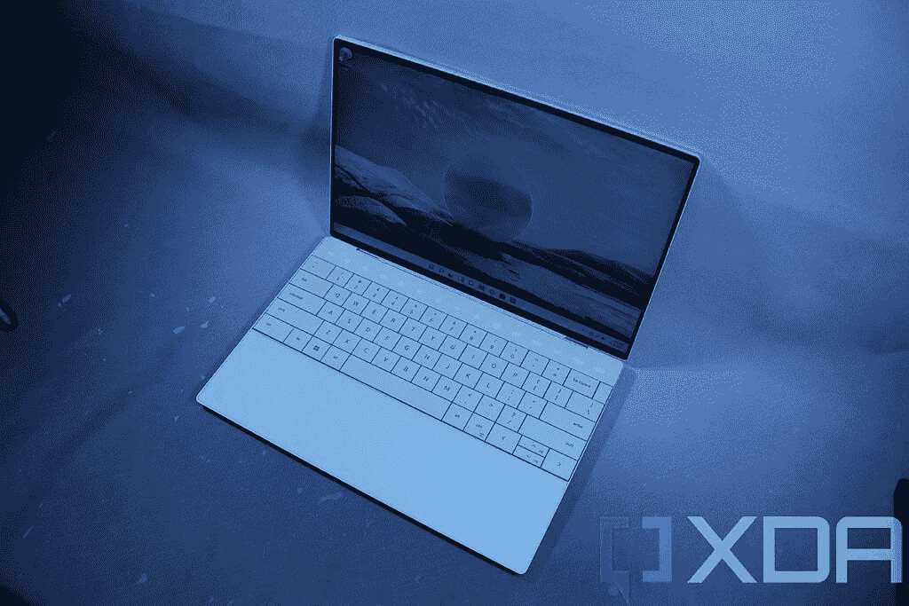
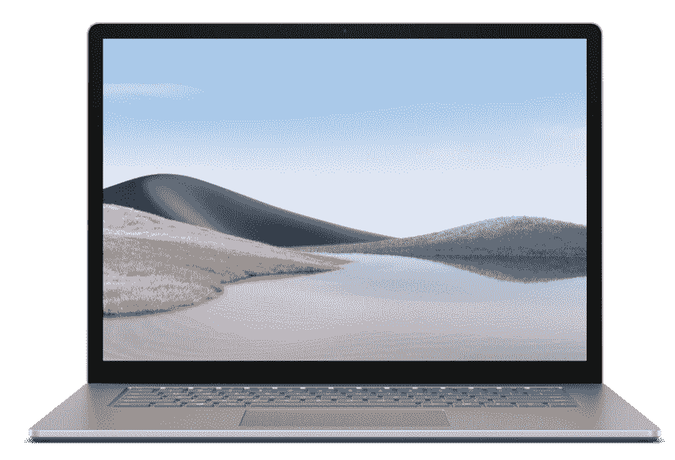

# 戴尔 XPS 13 Plus vs Surface Laptop 4:最好的现代笔记本电脑是什么？

> 原文：<https://www.xda-developers.com/dell-xps-13-plus-vs-surface-laptop-4/>

在 CES 2022 上，戴尔推出了广受欢迎的 XPS 13 笔记本电脑 XPS 13 Plus。Dell XPS 13 Plus 采用了全新的设计，看起来非常现代和未来，是一款有前途的设备，但它与另一款时尚现代的笔记本电脑(如 Surface Laptop 4)相比如何呢？XPS 13 已经是[戴尔最好的笔记本电脑之一](https://www.xda-developers.com/best-dell-laptops/)，Surface Laptop 4 也是[伟大的 Surface PC](https://www.xda-developers.com/best-microsoft-surface-pcs/) ，这是一场有趣的对决。

XPS 13 Plus 马上就有了优势，因为它是最近才发布的，它配备了第 12 代英特尔处理器。正因为如此，它自然会比仍在使用第 11 代处理器的 Surface Laptop 4 更快。除此之外，这些笔记本电脑还有很多共同点，所以让我们来看看你在购买之前应该考虑什么。

**浏览这篇文章:**

## 规范

|  | 

戴尔 XPS 13 Plus (9320)

 | 

Surface Laptop 4

 |
| --- | --- | --- |
| **操作系统** | 

*   Windows 11
*   Ubuntu 20.04(开发者版)

 |  |
| **CPU** | 

*   英特尔酷睿 i5-1240P (28W，12 核，16 线程，最高 4.4 GHz，12MB 高速缓存)
*   英特尔酷睿 i7-1260 处理器(28W，12 核，16 线程，最高 4.7 GHz，18MB 高速缓存)
*   英特尔酷睿 i7-1270P (28W，12 核，16 线程，最高 4.8 GHz，18MB 高速缓存)
*   英特尔酷睿 i7-1280 处理器(28W，14 核，20 线程，最高 4.8 GHz，24MB 高速缓存)

 | 

*   13.5 英寸:15 英寸 15 英寸
    *   英特尔酷睿 i5-1135G7(最高 4.2GHz，4 核，8 线程)
    *   英特尔酷睿 i7-1185G7(最高 4.9GHz，4 核，8 线程)
    *   AMD 锐龙 5 4680U 微软 Surface Edition(最高 4GHz，6 核，12 线程)15 inch
    *   英特尔酷睿 i7-1185G7(最高 4.9GHz，4 核，8 线程)
    *   AMD 锐龙 7 4980U 微软 Surface Edition(最高 4.4GHz，8 核，16 线程)

 |
| **图形** |  | 

*   英特尔 Iris Xe
*   AMD 镭龙显卡

 |
| **显示** | 

*   13.4 英寸 FHD+ (1920 x 1200) InfinityEdge 非触摸，500 尼特，防反光
*   13.4 英寸 FHD+(1920 x 1200)infinity edge touch，500 尼特，防反光
*   13.4 英寸 UHD+(3840 x 2400)infinity edge touch，500 尼特，防反光
*   13.4 英寸 3.5K (3456 x 2160) InfinityEdge 有机发光二极管触摸屏，DisplayHDR 500，400 尼特，100% DCI-P3 色域，防反射，康宁大猩猩玻璃 Victus

 | 

*   13.5 英寸 PixelSense (2256 x 1504)，触摸屏，支持 Surface Pen
*   15 英寸 PixelSense (2496 x 1664)，触摸屏，支持 Surface Pen

 |
| **存储** | 

*   256GB PCIe 第四代固态硬盘
*   512GB PCIe 第四代固态硬盘
*   1TB PCIe 第四代固态硬盘
*   2TB PCIe 第四代固态硬盘

 | 

*   256GB 固态硬盘
*   512GB 固态硬盘
*   1TB 固态硬盘

 |
| **闸板** | 

*   8GB 双通道 DDR5 5200MHz
*   16GB 双通道 DDR5 5200MHz
*   32GB 双通道 DDR5 5200MHz

 | 

*   8GB LPDDR4x
*   16GB LPDDR4x
*   32GB LPDDR4x

 |
| **电池** |  |  |
| **港口** | 

*   2 个 Thunderbolt 4(USB C 型)
    *   含 USB 型至 A 型适配器

 | 

*   1 个 USB Type-C
*   1 个 USB 类型 A
*   表面连接端口
*   3.5 毫米耳机插孔

 |
| **音频** | 

*   四声道立体声扬声器(8W 总输出)

 | 

*   带杜比全景声的 Omnisonic 扬声器(双扬声器)
*   双通道远场录音室话筒

 |
| **摄像机** | 

*   720p 高清 RGB 网络摄像头+红外网络摄像头

 | 

*   720p 高清 RGB 网络摄像头+红外网络摄像头

 |
| **视窗你好** | 

*   红外网络摄像头
*   指纹传感器

 |  |
| **连通性** | 

*   英特尔无线 6E
*   蓝牙 5.2

 | 

*   英特尔无线网络 6
*   蓝牙 5.0

 |
| **颜色** |  | 13.5 英寸:

*   铂金(阿尔坎塔拉)
*   冰蓝色(Alcantara)
*   砂岩(金属
*   哑光黑色(金属)

15 英寸:

*   铂(金属)
*   哑光黑色(金属)

 |
| **尺寸(WxDxH)** | 

*   295.3 × 199.04 × 15.28 毫米(11.63×7.84×0.6 英寸)

 | 

*   13.5 英寸:308 x 223 x 14.5 毫米(12.1 x 8.8 x 0.57 英寸)
*   15 英寸:339.5 x 244 x 14.7 毫米(13.4 x 9.6 x 0.58 英寸)

 |
| **重量** | 

*   起始重量为 1.24 千克(2.73 磅)

 | 

*   13.5 英寸(Alcantara 面料):1.27 千克(2.79 磅)
*   13.5 英寸(金属):1.29 千克(2.84 磅)
*   15 英寸:1.54 千克(3.4 磅)

 |
| **价格** | 起价 1299 美元 | 起价 899 美元 |

很快，你就可以看出这两款笔记本电脑的一些不同之处，但也有一些相似之处。最大的区别是 Surface Laptop 4 有两种尺寸，但这两种型号之间没有太多区别。我们将重点关注 13.5 英寸版本，因为它是 XPS 13 Plus 最直接的竞争对手。

## 性能:戴尔 XPS 13 Plus 配备英特尔 Alder Lake 处理器

正如我们已经提到的，Dell XP 13 Plus 配备了英特尔 Alder Lake 系列中最新、最棒的处理器。这些处理器使用全新的混合架构，在同一封装中混合了高性能内核和高效内核。这导致了更高的内核数量和更高的整体性能，尽管我们还没有测量来比较这两者。XPS 13 Plus 中的处理器也来自新的 P 系列家族，它们有 28 瓦的 TDP，而以前的英特尔型号只有 15 瓦的型号(至少对于 Windows 笔记本电脑来说)。这给了这台笔记本电脑更大的优势。

 <picture></picture> 

Dell XPS 13 Plus

Surface Laptop 4 仍然有高级处理器，它们只是去年的型号。即使在 AMD 机型上，它们的内核总数也更少，因此性能应该会更低。英特尔和 AMD 处理器都有 15W 的额定功率，因此这也给 XPS 13 Plus 带来了性能优势。第 12 代英特尔处理器的基准测试结果，但您可以查看下表，了解 Dell XPS 13 Plus 最终的速度有多快。

|  | 

英特尔酷睿 i7-1280P( [参见测试](https://browser.geekbench.com/v5/cpu/14656079))

 | 

英特尔酷睿 i7-1185G7(平均)

 | 

AMD 锐龙 7 4980U( [参见测试](https://browser.geekbench.com/v5/cpu/14661258))

 | 

英特尔酷睿 i5-1240P( [参见测试](https://browser.geekbench.com/v5/cpu/14662336))

 | 

英特尔酷睿 i5-1135G7(平均)

 | 

AMD 锐龙 5 4680U( [参见测试](https://browser.geekbench.com/v5/cpu/14615850))

 |
| --- | --- | --- | --- | --- | --- | --- |
| Geekbench 5(单核/多核) | 1,417 / 9,991 | 1,396 / 4,837 | 1,164 / 6,191 | 1,205 / 7,676 | 1,240 / 4,164 | 1,045 / 5,432 |

至于图形性能，事情应该不会有太大的不同。英特尔尚未讨论其第 12 代处理器中的 Iris Xe 显卡，因此可以假设它没有发生重大变化。第 11 代和第 12 代处理器都有 96 个执行单元的集成显卡，所以差别应该不大。

 <picture></picture> 

Surface Laptop 4

戴尔 XPS 13 Plus 配有 LPDDR5 内存和 PCIe 4.0 固态硬盘。

第 12 代英特尔处理器的另一个优势是新增了对 LPDDR5 RAM 的支持，它应该比 LPDDR4x 快得多，特别是从长远来看，开发人员开始利用它。戴尔 XPS 13 Plus 还配备了 PCIe 4.0 固态硬盘，速度更快，延迟更低。

至于电池寿命，戴尔 XPS 13 Plus 的电池明显更大，但我们还不知道新的英特尔处理器将如何影响电池寿命。然而，由于具有更高的 28W TDP，它肯定会比 Surface Laptop 4 内部的 15W 处理器更快地消耗电池。

## 显示和声音:两个大屏幕，但戴尔 XPS 13 Plus 更好

在显示屏方面，Surface Laptop 4 和戴尔 XPS 13 Plus 都一定会给你带来出色的体验，尽管这取决于你选择的配置。Surface Laptop 4 提供了全面一致的体验。这是一款 13.5 英寸的显示器，长宽比为 3:2，分辨率为 2256 x 1504。对于这种尺寸的显示器来说，这是非常锐利的，而且它还配有触摸和笔支持。微软的 Surface 设备通常都有很棒的屏幕，所以你在这里会很好。

另一方面，戴尔 XPS 13 Plus 拥有 13.4 英寸显示屏，16:10 的宽高比略宽。然而，也有一些可用的配置。基本型号配备了全高清+ (1920 x 1200)显示屏——对于这个尺寸来说仍然相当清晰——并且不支持触摸。不过，你可以添加触摸支持。最重要的是，你还可以选择两种高端升级产品中的一种:3.5K (3456 x 2160)有机发光二极管显示屏或超高清+ (3840 x 2400) IPS 面板，这两种产品都轻松超越 Surface Laptop 4。当然，你可能需要为这些升级支付一大笔钱，但如果你想要最好的显示体验，XPS 13 Plus 可以满足你。

虽然显示器存在一些差异，但 Surface Laptop 4 和戴尔 XPS 13 Plus 的网络摄像头不相上下。这两款笔记本电脑都有一个 720p 高清摄像头，并且都支持 Windows Hello。在这款机型中，戴尔将红外摄像头与网络摄像头本身分开，这应该会比我们以前的 XPS 笔记本电脑质量更好。Surface Laptop 4 通常也有一个更好的 720p 摄像头，所以它起到了平衡作用。

这两款笔记本电脑都有 720p 高清摄像头和 Windows Hello 支持。

至于声音，戴尔 XPS 13 Plus 取得了又一次令人信服的胜利。它配有四扬声器立体声系统，总输出功率高达 8W，这在这种尺寸的笔记本电脑中并不常见。这会给你一种身临其境的体验。与此同时，Surface Laptop 4 拥有双扬声器设置，扬声器位于键盘下方，直接向你开火。拥有顶级扬声器是 Surface Laptop 4 的一个优势，但你可能仍然会更喜欢 Dell XPS 13 Plus。

## 设计和端口:两款笔记本电脑看起来时尚现代

设计是戴尔 XPS 13 Plus 和 Surface Laptop 4 可能最有共同点的领域。它们看起来非常不同，但它们都是非常现代的笔记本电脑，整体上具有极简主义美学。尽管如此，戴尔 XPS 13 Plus 看起来绝对更具未来感。

首先，它没有触摸板，或者至少你看不到。戴尔已经将触摸板与 XPS 13 Plus 的机箱完全无缝连接，所以你看不到它，也不能点击它。相反，它使用触觉反馈来模拟点击。XPS 13 Plus 的另一个未来元素是功能行，不再有物理键。这样做的一个好处是，笔记本电脑可以改变它所显示的内容，而不是同时看到功能号和媒体控制标签。这样，只要看着按钮，你就知道它会做什么。同时，键盘的其余部分有更大的键，它们之间没有间隔，它延伸到笔记本电脑的边缘，有助于其光滑的外观。

Surface Laptop 4 也有简洁线条和优质设计的极简美学，但它更传统一些。它有一个典型的键盘，每个键之间有一些空间，一个经典的功能行和一个可点击的触摸板。有一点非常不同，Surface Laptop 4 让你可以选择 Alcantara 面料的底座。这是一种优质面料，触感柔软，因此比冰冷的金属表面更舒适、更温暖。公平地说，两者看起来都非常干净和现代，如果你担心你不会习惯 XPS 13 Plus 的隐形触摸板或数字功能键，你可能会更喜欢 Surface Laptop 4。

如果你担心便携性，戴尔 XPS 13 Plus 也更好。虽然显示器的尺寸几乎相同，但 Dell XPS 13 Plus 的宽度和高度都不如 Surface Laptop 4，因此它肯定更容易放在包或背包中。两款笔记本电脑都相对较轻(虽然 XPS 13 Plus 略轻)，但 Surface Laptop 4 更薄。这些差异很小，您更可能注意到宽度和高度，XPS 13 Plus 的便携性明显更好。

戴尔 XPS 13 Plus 只有 Thunderbolt，Surface Laptop 4 根本没有。

这两款笔记本电脑都受到端口设置的限制，但它们的方式不同。戴尔 XPS 13 Plus 只有两个 Thunderbolt 4 端口，并且在包装盒中包括一个 USB Type-C 到 Type-A 适配器。这意味着如果你想连接任何有线外设，你可能需要一个 Thunderbolt 坞站，但至少 Thunderbolt 是一个非常强大的连接。

Surface Laptop 4 涵盖了更多基本功能，内置了一个 USB Type-C 和一个 USB Type-A 端口，以及一个耳机插孔和一个 Surface Connect 端口。然而，你仍然缺少一个典型的显示输出，而且这款笔记本电脑甚至没有 Thunderbolt 4 对对接的支持。你唯一能使用的码头是水面码头，它可能更贵，也更难找到。我们已经看到微软在 Surface Pro 8 和 Laptop Studio 中采用了 Thunderbolt，因此我们怀疑潜在的 Surface Laptop 5 在端口方面与 XPS 13 Plus 更相似。

## 一句话:你应该买 XPS 13 Plus 还是 Surface Laptop 4？

谈到性能和显示质量等可衡量的差异，Dell XPS 13 Plus 显然是两款笔记本电脑中的佼佼者。性能是一个明显的优势，戴尔刚刚推出了 XPS 13 Plus，而 Surface Laptop 4 即将迎来一岁生日。至于显示屏，Surface Laptop 4 仍然会给你带来出色的体验，但如果你愿意付钱，XPS 13 Plus 可以让你获得更高的体验。

话虽如此，Surface Laptop 4 确实有优势。如果你的目标是更便宜的型号，它的显示屏比 XPS 13 Plus 的基本配置更好，15W 处理器可以为你提供比 XPS 13 Plus 中新的 28W 型号更好的电池续航时间。更不用说 Surface Laptop 4 的起始价格要低得多。端口设置也有所不同，总体来说你有更多的端口，尽管不可否认，这两款笔记本电脑都不是特别好。

其他的区别就比较主观了。虽然 Dell XPS 13 Plus 看起来更具未来感，但它可能需要一些时间来适应，或者由于这样或那样的原因，它可能不太适合您。Surface Laptop 4 保持了更传统的风格，因此调整期更短。如果你愿意适应，我们确实认为 XPS 13 Plus 看起来更酷，但这最终取决于你。Surface Laptop 4 还提供了四种不同的颜色，因此与 XPS 13 Plus 相比，您有了更多的选择。

尽管如此，看看微软是否会很快发布 Surface Laptop 5 还是值得的。如果你现在对 Surface Laptop 4 更感兴趣，新型号可能会有重要的升级，使它变得更好，如果你更喜欢戴尔 XPS 13 Plus，Surface Laptop 5 可能足以改变你的想法。如果你已经做出了选择，你可以购买下面的笔记本电脑。否则，请查看我们的[最佳笔记本电脑列表](https://www.xda-developers.com/best-laptops/)，你现在就可以购买，找到更多的选择。

 <picture></picture> 

Surface Laptop 4

##### 微软 Surface Laptop 4

Surface Laptop 4 是一款时尚现代的笔记本电脑，拥有高端规格和出色的显示屏。

 <picture></picture> 

Dell XPS 13 Plus

##### 戴尔 XPS 13 Plus

Dell XPS 13 Plus 是一款功能强大的现代笔记本电脑，配备第 12 代英特尔 P 系列处理器，TDP 为 28 瓦。