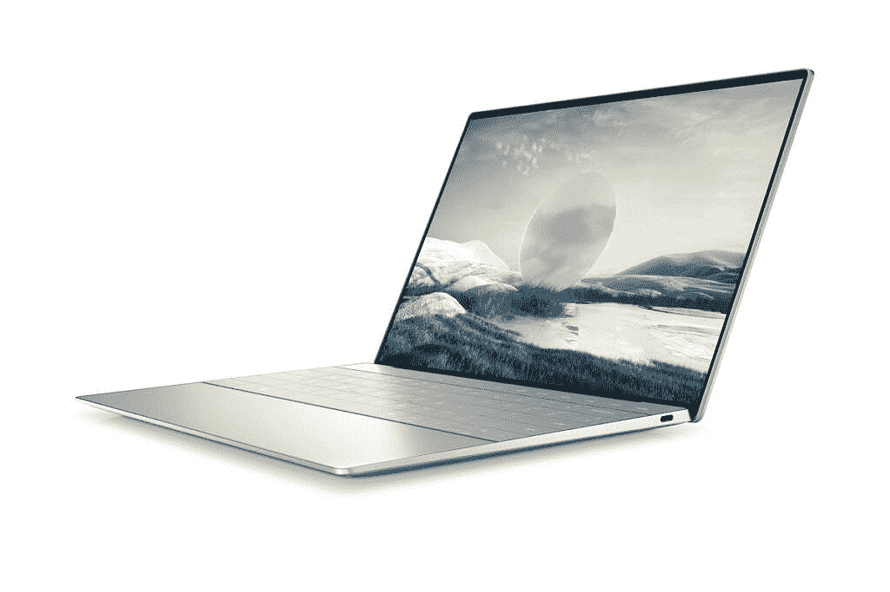
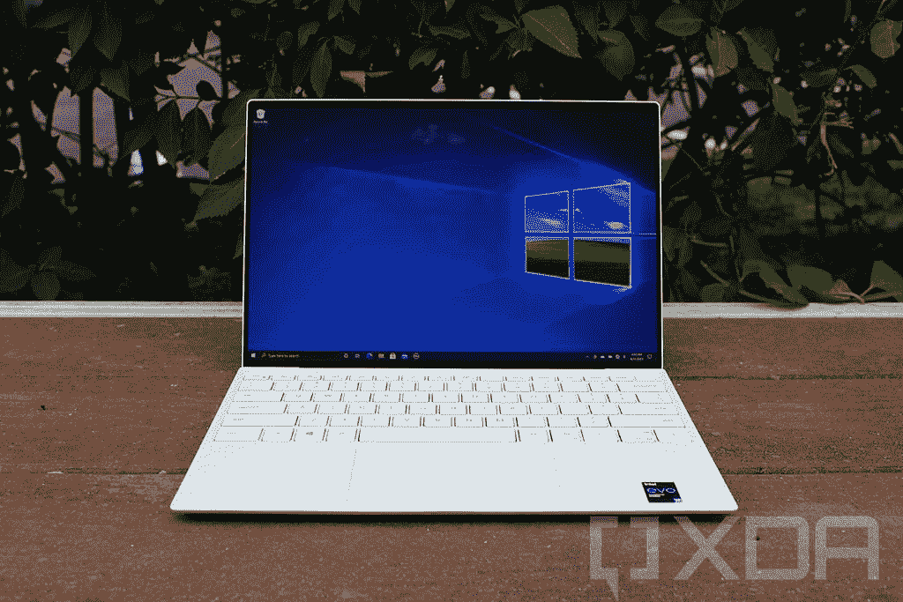

# 戴尔 XPS 13 Plus 对比 XPS 13 (2021):好多少？

> 原文：<https://www.xda-developers.com/dell-xps-13-plus-vs-xps-13-9310/>

在 CES 2022 上，戴尔推出了全新的 XPS 13 Plus，这是 XPS 13 在许多方面的新升级版本。但是考虑到 XPS 13 已经是市面上最好的笔记本电脑之一，这款新的笔记本电脑又有多好呢？我们将新款戴尔 XPS 13 Plus 与当前的 [XPS 13 型号(2021)](https://www.xda-developers.com/dell-xps-13-9310-review/) 进行比较，以了解它的升级程度。

XPS 13 Plus 并不完全是 XPS 13 的继任者，尽管它的尺寸相似，但在设计和功率方面却有很大不同。让我们直接开始比较，从原始规格开始。

## 戴尔 XPS 13 Plus 与 XPS 13 (2021 年):规格

|  | 

戴尔 XPS 13 Plus 9320

 | 

戴尔 XPS 13 9310

 |
| --- | --- | --- |
| **CPU** | 

*   第 12 代英特尔酷睿 i5-1240P (12 核，16 线程，最高 4.4 GHz，12MB 高速缓存)
*   第 12 代英特尔酷睿 i7-1260 处理器(12 核、16 线程、最高 4.7 GHz、18MB 高速缓存)
*   第 12 代英特尔酷睿 i7-1270P (12 核，16 线程，最高 4.8 GHz，18MB 高速缓存)
*   第 12 代英特尔酷睿 i7-1280 处理器(14 核、20 线程、最高 4.8 GHz、24MB 高速缓存)

 | 

*   第 11 代英特尔酷睿 i3-1115G4(双核、四线程、高达 4.1GHz ，6 MB 高速缓存)
*   第 11 代英特尔酷睿 i5-1135G7 (4 核、8 线程、最高 4.2 GHz、8 MB 高速缓存)
*   第 11 代英特尔酷睿 i7-1165G7 (4 核、8 线程、最高 4.7 GHz、12MB 高速缓存)
*   第 11 代英特尔酷睿 i7-1185G7 (4 核、8 线程、最高 4.8GHz、12MB 高速缓存)
*   第 11 代英特尔酷睿 i7-1195G7 (4 核、8 线程、最高 5GHz、12MB 高速缓存)

 |
| **图形** |  |  |
| **尺寸** | 

*   295.3×199.04×15.28 毫米(11.63×7.84×0.6 英寸)
*   起始重量为 1.24 千克(2.73 磅)

 | 

*   295.7×198.7×14.8 毫米(11.64×7.82×0.58 英寸)
*   1.2 千克(2.64 磅)

 |
| **显示** | 

*   13.4 英寸 FHD+ (1920 x 1200) InfinityEdge 非触摸，500 尼特，防反光
*   13.4 英寸 FHD+(1920 x 1200)infinity edge touch，500 尼特，防反光
*   13.4 英寸 UHD+(3840 x 2400)infinity edge touch，500 尼特，防反光
*   13.4 英寸 3.5K (3456 x 2160) InfinityEdge 有机发光二极管触摸屏，DisplayHDR 500，400 尼特，100% DCI-P3 色域，防反射，康宁大猩猩玻璃 Victus

 | 

*   13.4 英寸 FHD+ (1920 x 1200) InfinityEdge 非触摸，500 尼特，防反光
*   13.4 英寸 FHD+(1920 x 1200)infinity edge touch，500 尼特，防反光
*   13.4 英寸 UHD+(3840 x 2400)infinity edge touch，500 尼特，防反光
*   13.4 英寸 3.5K (3456 x 2160) InfinityEdge 有机发光二极管触控，DisplayHDR 500，400 尼特，100% DCI-P3 色域，防反光

 |
| **端口** | 

*   2x Thunderbolt 4，带 USB4 Type-C
    *   含 USB 型至 A 型适配器

 | 

*   2 个 Thunderbolt 4 端口
*   1 个耳机(耳机和麦克风组合)端口

 |
| **存储** | 

*   高达 2TB 的 PCIe 4 NVMe M.2 固态硬盘

 | 

*   高达 2TB M.2 PCIe NVMe 固态硬盘
*   MicroSD 卡扩展

 |
| **闸板** | 

*   最高 32GB LPDDR5 (5200MHz)

 | 

*   最高 32GB LPDDR4x (4267MHz)

 |
| **电池** | 

*   55Wh 锂离子聚合物
*   60W USB Type-C 电源适配器

 | 

*   4 芯 52 瓦时电池
*   45W USB Type-C 电源适配器

 |
| **音频** | 

*   四声道立体声扬声器(8W 总输出)
*   Waves MaxxAudio Pro 和 Waves Nx 3D 音频

 | 

*   立体声扬声器(2.5W x 2 = 4W 峰值)
*   Waves MaxxAudio Pro

 |
| **摄像机** |  |  |
| **Windows Hello** | 

*   红外网络摄像头
*   指纹传感器(在电源按钮中)

 | 

*   红外网络摄像头
*   指纹传感器(在电源按钮中)

 |
| **连通性** | 

*   英特尔黑仔 Wi-Fi 6E 1675 AX211 (2×2)
*   蓝牙 5.2

 | 

*   英特尔黑仔 Wi-Fi 6 AX1650 (2 x 2)
*   蓝牙 5.1

 |
| **颜色** |  | 

*   铂金银配黑色碳纤维掌托
*   霜用北极白玻璃纤维编织掌托

 |
| **价格** |  |  |

只需看一下规格表，一些差异就会变得非常明显，所以让我们直接进入主题。

## 戴尔 XPS 13 Plus 与 XPS 13 (2021):性能

从性能开始，这里有两件大事需要指出。首先，戴尔 XPS 13 Plus 配备了全新的第 12 代英特尔酷睿移动处理器。到目前为止，英特尔的超极本处理器最多有四个内核，但酷睿 i7-1280P 配备了多达 14 个内核，这是一个巨大的进步。这在一定程度上要归功于英特尔的新混合架构，该架构混合了性能核心和高效核心，类似于 ARM 处理器的工作方式。英特尔酷睿 i7-1280P 有六个高性能内核和八个高效内核，所有其他第 12 代处理器也有八个高效内核。

除此之外，戴尔还从 U 系列处理器升级到了新的 P 系列。这些是 28W 处理器，它们不是全新的，但我们过去见过的几次，它们是苹果 MacBook Pro 系列在改用苹果硅之前的专属。现在，Windows PCs 也在使用它们，这使得戴尔 XPS 13 Plus 比 XPS 13 强大得多，尽管我们目前没有具体的数据来比较这些处理器。在图形方面，两者应该相差不远。两者都内置了英特尔 Iris Xe，执行单元的数量也没有变化。

 <picture></picture> 

Dell XPS 13 Plus

这还不是 XPS 13 Plus 更好的原因。随着第 12 代处理器的出现，对 LPDDR5 内存的支持也包括在内，XPS 13 Plus 也有。这种新内存比 DDR4 快得多，因此性能也要好得多。不过，就容量而言，两者最大容量都是 32GB。

最后，在存储方面，两款笔记本电脑的容量相同(高达 2TB)，但 XPS 13 Plus 现在配备了 PCIe 4 固态硬盘，而不是 PCIe 3 型号，因此存储访问速度也应该比以前快得多。毫无疑问，戴尔 XPS 13 Plus 是其前代产品的全面升级。

## 显示和声音:它们看起来几乎一样

XPS 13 Plus 没有太大改进的一个方面是显示屏，但这并不是一件坏事。戴尔 XPS 13 已经有了一个很棒的 13.4 英寸显示屏，并有 16:10 的高纵横比。基本型号从全高清+分辨率开始，不支持触摸，您可以添加。您也可以升级到 3.5K (3456 x 2160)有机发光二极管显示器，100%覆盖 DCI-P3，或者升级到 4K+ (3840 x 2400)液晶显示器，如果您想要最高的分辨率。

 <picture></picture> 

Dell XPS 13 (9310)

所有这些都与新的戴尔 XPS 13 Plus 相同。您可以获得所有相同的选项，并且规格完全相同。唯一的区别是，戴尔表示，OLED 面板现在由康宁大猩猩玻璃 Victus 覆盖，因此在笔记本电脑跌落或撞到什么东西时，你可以获得额外的屏幕保护。否则两个屏幕是一样的。

然而，*与*不同的是音频设置。Dell XPS 13 为 13 英寸超极本配备了坚固的扬声器设置，配有两个 2.5 瓦扬声器，用于立体声。但 XPS 13 Plus 更进一步，它有四个立体声扬声器，总输出功率为 8W，使其更加身临其境，声音更大。这实际上更接近于戴尔 XPS 15，它拥有 Windows 笔记本电脑上最好的扬声器。

这里的网络摄像头也有显著的不同。戴尔 XPS 13 有一个 720p 摄像头，除此之外，它是一个 2.25 毫米的微型摄像头，使边框尽可能小。有了 XPS 13 Plus，你仍然可以获得 720p 相机，但戴尔表示，它专注于提高相机的质量，所以你应该可以获得更好的图像。

## 设计:XPS 13 Plus 拥有全新的外观

戴尔 XPS 13 9310 是目前最酷的笔记本电脑之一，有两种颜色可供选择。基础款外观为铂金银，内部为碳纤维材质的黑色；另一种使用“霜”银外部和编织玻璃纤维复合材料制成的白色内部。这种颜色和材料的区别使 XPS 13 成为最独特的笔记本电脑之一，但在功能上，它是相当标准的。

凭借 XPS 13 Plus，戴尔拥有了全新的设计，其与众不同远远超出了您的预期。首先，就其功能而言，它不是标准的。XPS 13 Plus 配备了一个基于触摸的功能行，取代了传统的物理按钮。这不像苹果的 touch bar 可以根据应用程序显示不同的内容，但他们可以在典型的功能键和媒体控制之间切换，如音量和亮度。它仍然是一个功能行，但所有的按钮现在都是基于触摸的，它们看起来完全与机箱齐平。键盘本身一直推到笔记本电脑的边缘，按键之间没有太多空间，所以它们现在都更大了。

XPS 13 还配备了一个全新的触摸板，这有助于其齐平和干净的设计，你看不到它。这不是一个笑话——触摸板现在是机箱的一部分，肉眼是看不见的。因此，也没有典型的按钮，而是通过触觉反馈来模拟点击，这是微软最近在 Surface Laptop Studio 上做的事情。

戴尔 XPS 13 Plus 仍然有两种颜色型号，但它没有与 XPS 13 相同的双色调外观。有一个铂金(银色)型号和一个石墨(黑色)型号，匹配的键盘使整体美观整洁。我们会说仍然有理由更喜欢 XPS 13 9310 设计，但 XPS 13 Plus 看起来肯定也很棒。

至于便携性，两款笔记本电脑非常接近。XPS 13 Plus 比以往任何时候都更厚更重，同时也更深，但没有那么宽。考虑到更强大的英特尔处理器及其所需的冷却，其中必然存在一些差异。

## 端口和连接性:甚至比以前更少

XPS 13 Plus 相对于 XPS 13 9310 的一个降级是在其端口，这相当令人失望。戴尔 XPS 13 的端口已经相当有限，包括两个 Thunderbolt 4 端口、一个 3.5 毫米耳机插孔和一个 microSD 读卡器。它严重依赖于 [Thunderbolt 坞站](https://www.xda-developers.com/best-thunderbolt-docks/)或 [USB-C 集线器](https://www.xda-developers.com/best-usb-c-hub/)来扩展你的连接，这并不适合所有人。

戴尔 XPS 13 Plus 去掉了耳机插孔和 microSD 读卡器，使坞站或集线器变得更加重要。可以说它更“现代”，因为它假设你可能有无线耳机，但它并不适合每个人。如果你有一个有线外设，你可以在盒子里得到一个 USB Type-C 到 Type-A 适配器，但仅此而已。

由于更新，XPS 13 Plus 还配备了一些更新的无线标准。新的无线模块和蓝牙 5.2 现在支持 Wi-Fi 6E。XPS 13 9310 有 Wi-Fi 6 和蓝牙 5.1，所以这里有一点升级。如果你很好奇，Wi-Fi 6E 增加了对新的 6GHz 频段的支持，这种频段更快，但范围更短。

## 一句话:戴尔 XPS 13 Plus 名副其实吗？

将这款新笔记本电脑命名为 Dell XPS 13 Plus 树立了一些期望，可以说戴尔在一些方面满足了这些期望。这些处理器不仅被大规模升级到新型号，还被升级到更高的 28W 功率，几乎是以前型号的两倍。你还会得到一个全新的设计，看起来格外干净和现代。同时还保留了 XPS 13 9310 出色的显示器选项，因此您在这里确实会获得出色的体验。

但是也有一些值得注意的降级。对于“Plus”机型来说，取消耳机插孔和 microSD 读卡器肯定很奇怪，即使你可以用 USB-C 集线器连接任何东西。另外，不是每个人都会喜欢基于触摸的功能行或无按钮的无缝触摸板。新设计虽然本身很棒，但没有使用与 XPS 13 相同的独特材料。

归根结底，我们仍然有理由选择标准的 XPS 13，但如果您想要最强大的功能和与众不同的外观，XPS 13 Plus 无疑是一款出色的笔记本电脑，您可以在下面购买。如果您更喜欢标准的 XPS 13，也可以选择它。如果您想探索其他选择，您可以随时查看[最佳戴尔笔记本电脑](https://www.xda-developers.com/best-dell-laptops/)。

 <picture></picture> 

Dell XPS 13 Plus

##### 戴尔 XPS 13 Plus

Dell XPS 13 Plus 是一款功能强大的现代笔记本电脑，配备 28W 英特尔处理器。

 <picture></picture> 

Dell XPS 13 (9310)

##### 戴尔 XPS 13 9310

Dell XPS 13 是 2021 年最好的超极本之一，具有紧凑的设计、高端的规格和出色的显示选项可供选择。