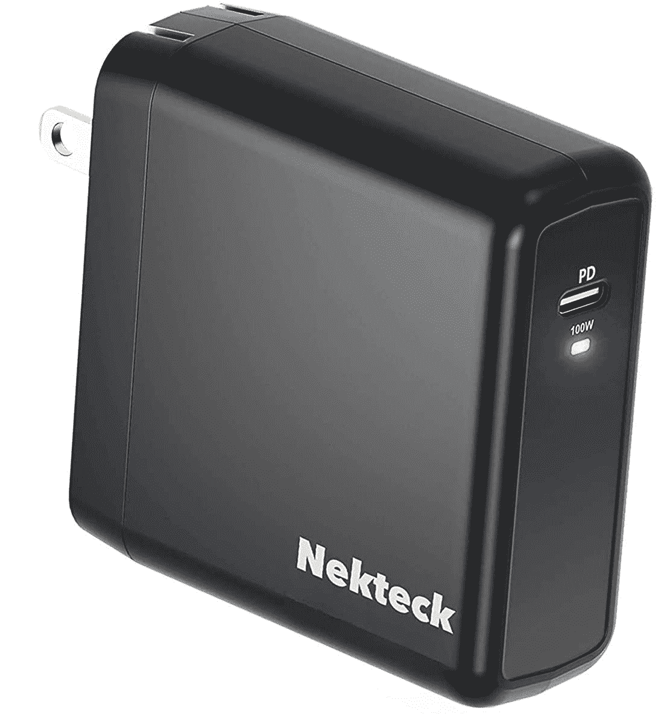
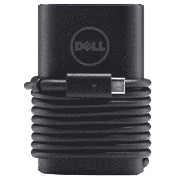
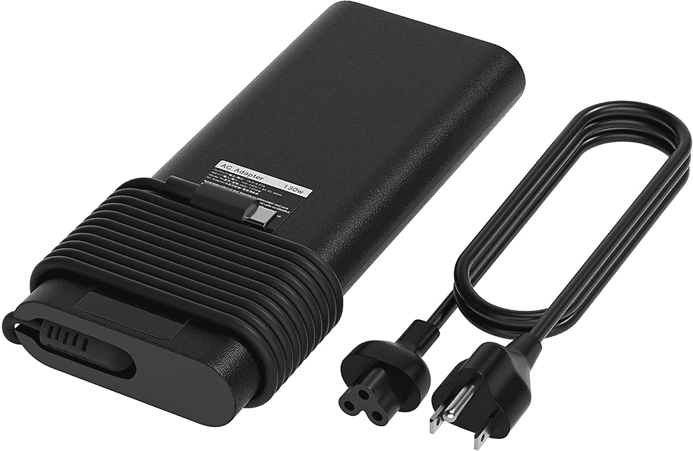
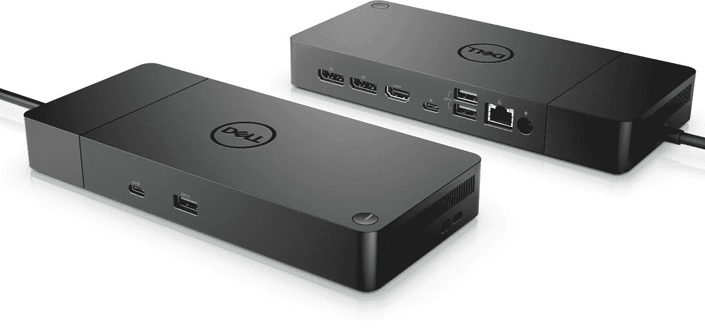

# 2023 年戴尔 XPS 15 和 17 的最佳替代充电器

> 原文：<https://www.xda-developers.com/dell-xps-15-17-replacement-chargers/>

戴尔的 XPS 系列包括一些最高端的笔记本电脑，它们是你今天能买到的 T2 最好的笔记本电脑。它们将高端规格封装在时尚的机箱中，因此您可以真正在任何地方使用它们。[戴尔 XPS 15](https://www.xda-developers.com/dell-xps-15-2022-review/) 和 [XPS 17](https://www.xda-developers.com/dell-xps-17-2022-review/) 尤其令人印象深刻，因为它们在某些情况下封装了 45W CPUs 和独立显卡。然而，尽管笔记本电脑便于携带，随身携带充电器仍然是一件苦差事，尤其是当你最终把它们忘在某个地方的时候。或者，更糟糕的是，你的充电器停止工作，你需要一个新的。为了帮助您，我们为您的 XPS 15 和 XPS 15 收集了最佳替代充电器。

由于 USB Type-C 和[电力传输](https://www.usb.org/usb-charger-pd)标准的出现，近年来在许多情况下，寻找替代充电器变得更加容易。这些充电器可以提供高达 100W 的功率，这对许多超极本来说已经足够了。此外，他们还可以经常给智能手机和其他设备充电。但戴尔 XPS 15 和 17 配有 45W CPUs，其中一些还配有独立显卡。正因为如此，标准的电力传输充电器，甚至[雷电坞](https://www.xda-developers.com/best-thunderbolt-docks/)可能都不够用。您需要找到适合您的 XPS 15 或 17 的特定充电器，这正是我们所做的。以下是你可以得到的一些选择。

 <picture></picture> 

Dell 90W Type-C Adapter

##### 戴尔 90W 超薄电源适配器

我们刚刚说过，您的 XPS 15 或 17 可能需要超过 100 瓦的功率，但如果您有一款没有独立显卡的型号，90 瓦的电源适配器就可以很好地完成工作。走这条路线可以省点钱，也不会影响你的使用。

 <picture></picture> 

Nekteck 100W USB-C Charger

##### Nekteck 100W GaN USB-C 充电器

如果戴尔官方充电器对你来说似乎有点太贵，这款 Nekteck 替代品也可以提供高达 100 瓦的功率。它明显更便宜，并且它使用氮化镓来实现非常紧凑的适配器尺寸。它也可以给你的手机充电。

 <picture></picture> 

Dell 130-Watt Type-C Adapter

##### 戴尔 130 瓦 USB-C 适配器

如果你有一个配备专用 GPU 的 XPS 型号，你将需要一些额外的功能。戴尔有一个官方的 130 瓦电源适配器，您可以作为办公室的替代品或第二个充电器，它可以为更密集的任务供电。

 <picture></picture> 

E EGOWAY 130W USB-C Charger

##### E EGOWAY 130W USB-C 充电器

功率越大往往越贵，官方的戴尔 130W 适配器肯定价格不菲。这种替代品提供了同样的能力，但价格低得多。您可以在不倾家荡产的情况下为您的游戏提供动力。

 <picture></picture> 

Dell WD19S 130W Docking Station

##### 戴尔迅雷坞站 WD19TBS

如果您需要的不仅仅是充电器，戴尔的 WD19S 坞站不仅可以为您的 XPS 15 提供高达 130 瓦的功率，还可以扩展您的连接能力。它有三个 USB 端口，以太网和显示输出，所以没有什么你不能做的。

 <picture></picture> 

Dell Thunderbolt Dock WD19TBS

##### 戴尔迅雷坞站 WD19TBS

这与以前的 dock 非常相似，但它现在增加了 Thunderbolt 连接，这意味着您可以为您的端口获得高达 40Gbps 的带宽。这意味着您可以同时使用双 4K 显示器，或者在同时使用它们时从 USB 端口获得更多带宽。

这些是您可以为您的戴尔 XPS 15 和 17 买到的一些最好的充电器。90W 和 100W 电源适配器更适合没有独立显卡的型号，所以如果你的型号有 Nvidia GPU，它们就不理想。但是，如果您只有集成的英特尔显卡，它们也能正常工作。对于采用独立 GPU 的型号，130W 适配器是最佳选择，因为它们可以在您使用笔记本电脑时为其充电。

此外，扩展坞是扩展办公室设置的绝佳方式，无需额外的扩展坞。它们提供电源和大量连接选项，尤其是 Thunderbolt 型号。它们可能很贵，但 Thunderbolt 坞站本身就相当昂贵，所以可能值得投资。