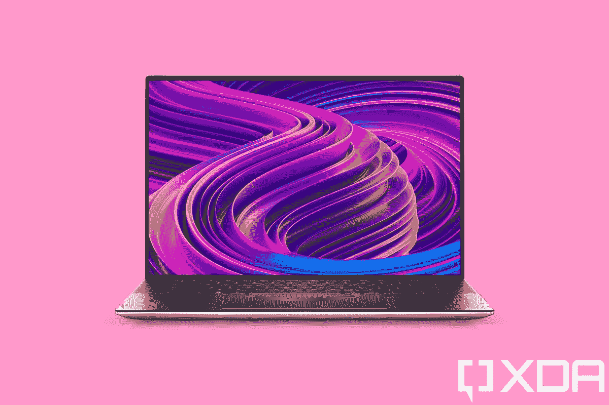

# 戴尔 XPS 15 (2022)回顾:性能和便携性的完美结合

> 原文：<https://www.xda-developers.com/dell-xps-15-2022-review/>

多年来，戴尔的 XPS 15 一直是创造者们的最佳笔记本电脑之一，2022 款也不例外。它将四又三分之一磅的机箱与英特尔第 12 代 45W 处理器和 Nvidia 的 GeForce RTX 3050 Ti 显卡的性能相结合，同时使用 3.5K 有机发光二极管显示屏和强大的四扬声器设置来取悦用户。

它并不完美。戴尔继续优先考虑窄边框而不是高质量的网络摄像头，这是在家工作时代的一个问题。此外，零件的成本正在上升，我们看到设备的价格也在上涨。

今年的型号只是一个规格的提升，具有更快的 CPU 和更快的内存，但某些事情仍然让我感到惊讶。电池续航时间真的很好，这是我从没想到配有 45W CPU 和 RTX 显卡的笔记本电脑会有这样的表现。最终，它只是一个令人愉快的笔记本电脑，我很高兴向您推荐。

 <picture></picture> 

Dell XPS 15 9520

##### 戴尔 XPS 15 9520

戴尔的 XPS 15 将强大的功能和便携性与 RTX 显卡、第 12 代英特尔处理器相结合，并采用不到 5 磅重的封装。

## 戴尔 XPS 15 (2022):价格和可用性

*   戴尔 XPS 15 9520 起价 1449 美元，现已上市
*   它有铂金银或霜白色可供选择

戴尔 XPS 15 9520 于今年春天发布，现在可以购买，起价 1449 美元。基本型号将包括酷睿 i5-12500H、8GB DDR5 内存、256GB 固态硬盘和 FHD+显示屏。它不包括专用图形。

像往常一样，有很多选择。你可以获得高达 64GB 的 RAM 和 2TB 的 SSD，显示器有两种不同的 4K 选项(技术上有机发光二极管的被认为是 3.5K)，其中一个是有机发光二极管，另一个不是。CPU 到酷睿 i9-12900HK，显卡到英伟达 GeForce RTX 3050 Ti。

有两种颜色。一个是白金银，包装黑色碳纤维键盘甲板。这是经典的 XPS 外观。另一个是霜白色编织玻璃纤维键盘甲板。

## 戴尔 XPS 15 (2022):规格

| 

中央处理器

 | 第 12 代英特尔酷睿 i7-12700H (24MB 高速缓存，最高 4.7 GHz，14 个内核) |
| 

国家政治保卫局。参见 OGPU

 | NVIDIA GeForce RTX 3050 Ti 4GB gddr 6(40W) |
| 

显示

 | 15.6 英寸 3.5K (3456 x 2160) InfinityEdge 有机发光二极管触摸显示屏，DisplayHDR 500，400 尼特，100% DCI-P3 色域，100，000:1 对比度，176°宽视角+/-88/88/88/88/88，高达 0.65%的防反光、防污迹 |
| 

身体

 | 344.72 x 230.14 x 18 毫米(13.57 x 9.06 x 0.71 英寸)，1.96 千克(4.31 磅) |
| 

港口

 | 2 个带显示端口和电源传输的 Thunderbolt 4(USB Type-C)1 个 USB 3.2 Gen 2 Type-C(显示端口/电源传输)1 个全尺寸 SD 读卡器 v6.0 1x 个 3.5 毫米耳机/麦克风组合插孔楔形锁插槽 1 个 USB-C 转 USB-A v3.0 和 HDMI v2.0 适配器标配 |
| 

储存；储备

 | 512GB PCIe 4 x4 固态硬盘 |
| 

记忆

 | 4800MHz 的 16GB (2x8GB) DDR5 双通道 |
| 

电池

 | 86 瓦时电池(内置)，130 瓦交流适配器(USB Type-C) |
| 

声音的

 | 使用 Waves MaxxAudio Pro 和 Waves Nx 3D 音频四扬声器设计进行录音室品质调谐，具有 2.5 瓦 x2 低音扬声器和 1.5 瓦 x2 高音扬声器= 8 瓦总峰值输出 3.5 毫米耳机/麦克风组合插孔，具有 Waves Nx 3D 音频和头部跟踪功能，双麦克风阵列经过 Waves MaxxVoice 优化，支持 VoIP Microsoft Cortana 功能 |
| 

输入

 | 触摸显示屏(可选)2 个全尺寸数字阵列麦克风，背光 chiclet 键盘；1.3 毫米旅行玻璃表面精密触摸板电源按钮中的 Windows Hello 指纹识别器和上边框环境光传感器中的高清(720p) Windows Hello 摄像头，用于显示屏背光控制 |
| 

材料

 | 铂金银 CNC 加工铝，黑色碳纤维复合掌托 |
| 

操作系统（Operating System）

 | Windows 11 主页 |
| 

价格

 | $2,253 |

这些是戴尔发给我查看的设备规格。如上所述，基本款起价 1449 美元。

## 设计:没有设计变更

*   它采用熟悉的戴尔 XPS 设计，配有黑色键盘和银色外壳
*   有三个 USB 端口，还包括一个 SD 卡插槽

明确地说，一代又一代发生变化的只有内在的东西。如果您知道 Dell XPS 15 9500 和 9510 型号的外观，您可以放心地跳过这一部分。

戴尔发给我的型号是铂金银，配有黑色碳纤维掌托。这就是我认为的经典 XPS。当整个系列只有一种配色时，这就是它。从那以后，它就扩大了。第二个是带有白色编织玻璃纤维掌托的 Frost，我不得不说，这个非常可爱。第二个选项首次出现在 XPS 13 和 XPS 13 2 合 1 中，但最近出现在 XPS 15 中。XPS 17 只有 XPS 经典外观。

中间印有闪亮的戴尔标志，这是外观最耀眼的部分。两侧是银色的，这种设计实际上是几年前 XPS 15 9500 首次推出的；在此之前，双方匹配黑色键盘甲板。

它有你需要的所有端口，只要它们是 USB Type-C。实际上有三个 USB Type-C 端口，其中两个是 Thunderbolt 4。Thunderbolt 是最通用的端口，支持 40Gbps 的传输速度，并完全支持 USB4。然而，另一端的 USB Type-C 端口是 USB 3.2 Gen 2，因此您可以获得 10Gbps 的传输速度。你可以用这三种中的任何一种给笔记本电脑充电，事实上，有一台像这样使用 USB Type-C 充电的强大机器是很好的。这有点罕见，因为有一段时间，功率传输仅支持高达 100 瓦。

右侧还有一个 3.5 毫米音频插孔和一个全尺寸 SD 卡插槽。如果你是一名摄影师，那么你已经知道这有多重要，你可能已经知道全尺寸的 SD 卡插槽在笔记本电脑中有点罕见。但最终，这是一个创造者机器，所以它有一个。

戴尔 XPS 15 9520 的设计久经考验，是真实的，如果您喜欢它，您可能会想要跳上它。[戴尔 XPS 13](https://www.xda-developers.com/dell-xps-13-2022/) 和 [XPS 13 二合一](https://www.xda-developers.com/dell-xps-13-2-in-1-2022/)今年都进行了重新设计，这意味着更大的型号可能不会太久。

## 展示:有机发光二极管一如既往的甜美

*   屏幕对角线长 15.6 英寸，宽高比为 16:10
*   它在 FHD+，有机发光二极管 3.5K，和非有机发光二极管 4K

正如你对名称中带有“15”的东西的预期，它有一个 15.6 英寸的显示屏，自 XPS 15 9500 问世以来一直是 16:10。有三种选择:1，920x1，200，3，456x2，160 有机发光二极管，3，840x2，400 IPS LCD。戴尔寄给我有机发光二极管模型，这显然是我的最爱。

不过，关于戴尔的[有机发光二极管显示器](https://www.xda-developers.com/best-oled-laptops/)，有一点需要记住，那就是你并不真的需要它们。他们的非有机发光二极管屏幕是如此之好，你甚至不会看到太大的差异。使用有机发光二极管，你会得到真正的黑色，因为像素只有在使用时才会被照亮，而且因为没有背光，这些颜色往往也更有活力。然而，您也可以拥有一个真正伟大的 IPS 液晶屏，可以作为有机发光二极管，这就是戴尔提供的。

戴尔发给我的模型上的有机发光二极管屏幕显然在我的显示测试中得分很高，支持 100% sRGB、94% NTSC、96% Adobe RGB 和 100% P3。这些是你能找到的最好的分数。但是，其他配置也将达到 90 年代。

亮度达到 405.7 尼特，略高于承诺的 400 尼特。正如你所看到的，黑色并没有随着亮度的增加而增加，这是有机发光二极管的一个优点。

我想说的是，戴尔在其 XPS 笔记本电脑上安装了非常棒的显示器。有机发光二极管一如既往地精彩，而 FHD+是为你真的需要额外的电池寿命。

一如既往，戴尔致力于提供最窄的边框，以获得最身临其境的体验。事实上，它已经优先考虑这一点，甚至在几年前，当它从 16:9 的显示屏移动到 16:10 时，砍掉了下巴。不幸的是，这也意味着，由于在家工作的蓬勃发展，当市场上的其他人正在转向更高质量的 1080p 网络摄像头时，仍然有 720p 网络摄像头。

## 键盘:它有一个巨大的触摸板

*   戴尔使用任何 15 英寸 Windows 笔记本电脑上最大的触摸板之一
*   指纹传感器仍然要求您等待电脑启动

如上所述，掌托是黑色碳纤维，键盘是配套的黑色，使用 Chiclet 风格的按键。键盘既舒适又准确，尽管它确实比 ThinkPad X1 Extreme 有所欠缺，因为 ThinkPad 以拥有最好的键盘而闻名。我要说的一件事是，虽然它不那么安静，但我确实更喜欢力的曲线。对我来说，[联想的 ThinkPad](https://www.xda-developers.com/best-thinkpads/)按键深度太长，有时感觉不现代。

我绝对喜欢的一件事是戴尔选择包括的大而旧的触摸板。它大约是 15 英寸笔记本电脑的大小，我看到的唯一一家试图制造大触摸板的 OEM 厂商是苹果公司。在窗户边上看很棒。我会说，大触摸板有时会感觉有点不稳定，我认为在它的位置上有一个触觉触摸板将是一个很好的改变。也许我们会在未来的迭代中看到这一点。与此同时，我绝对会把这个大触摸板当成一个胜利。

键盘两侧是扬声器，戴尔实际上有四个，其中两个在笔记本电脑下面。它总共有两个 2.5 瓦的低音扬声器和两个 1.5 瓦的高音扬声器，带来了出色的音频体验。它们与 Waves MaxxAudio Pro 和 Waves Nx 3D 一起调谐，结合漂亮的有机发光二极管显示器，这是一台用于媒体消费的伟大机器。

戴尔 XPS 15 是完美的创造者 PC

戴尔过去常常谈论这一点，将高质量的显示器、高质量的声音等置于一个名为戴尔影院的保护伞之下。品牌可能不再存在，但质量仍然存在。

## 性能:英特尔第 12 代处理器和 RTX 显卡是成功的组合

*   戴尔 XPS 15 9520 配备英特尔第 12 代 H 系列处理器，以及集成显卡、Nvidia GeForce RTX 3050 或 RTX 3050 Ti
*   除了第 12 代 CPU，另一项升级包括 DDR5 内存

正如我前面提到的，这台机器上的所有升级都是内部的。它现在配备了英特尔的 45W 第 12 代处理器，从而使它能够拥有 DDR5 内存。它还提供集成显卡、RTX 3050 或 RTX 3050 Ti，这些选项存在于它的前身。戴尔发给我的配置包括英特尔酷睿 i7-12700H、Nvidia GeForce RTX 3050 Ti、16GB DDR5 和 512GB 固态硬盘。

我个人认为，戴尔 XPS 15 是创作者的完美机器。它有最好的显示，而且它有恰到好处的内部结构。但实际上并不一定。如果您想要的只是一台更大的笔记本电脑，并且不需要强大的功能，您可以通过集成显卡获得它。但由于它是在这个模型中，我喜欢它。

戴尔 XPS 15 一如既往地保持了其前辈的一贯风格:在他们应该做的事情上做到最好

在我马上要谈到的电池测试中，我用它来工作。那是我平时在网页浏览器写文章，然后用 Slack，OneNote 之类的 app。但我用它做的很多事情包括像 Adobe Lightroom Classic 和 Photoshop 这样的应用程序，这是在电池寿命和电源滑块设置为最佳能效的情况下进行的。我能说的最好的方式是，我不需要在任何时候转动旋钮来获得我需要的性能。

英特尔新的第 12 代 CPU 采用混合架构，有大内核和小内核。大内核或 P 内核处理需要提升性能的任务。对于没有的东西，有 E-core。

最终，戴尔 XPS 15 9520 还是一如既往。它是功能和便携性的完美结合，很可能是最好的笔记本电脑。

对于基准测试，我使用了 PCMark 10、3DMark、VRMark、Cinebench、Geekbench 和 CrossMark。如您所见，我一直在添加更多的基准。

|  | 

戴尔 XPS 15 9520 酷睿 i7-12700H，RTX 3050 Ti

 | 

戴尔 XPS 17 9720 酷睿 i7-12700h RTX 3060

 | 

联想军团 5 Pro 锐龙 7 5800h RTX 3070

 |
| --- | --- | --- | --- |
| 

PCMark 10

 | 6,640 | 6,280 | 6,800 |
| 

3DMark:时间间谍

 | 4,535 | 6,250 | 9,963 |
| 

3DMark:时间间谍极限

 | 2,250 | 2,967 |  |
| 

橙色

 | 4,745 | 8,689 | 12,249 |
| 

VRMark:青色

 | 2,753 | 2,752 | 9,093 |
| 

VRMark:蓝色

 | 1,325 | 1,902 | 3,027 |
| 

Cinebench R23

 | 1,797 / 11,695 | 1,767 / 11,714 | 1,423 / 11,729 |
| 

极客工作台 5

 | 1,774 / 11,580 | 1,753 / 12,992 | 1,475 / 7,377 |
| 

总体交叉标记

 | 1,855 | 1,871 |  |
| 

交叉标记生产率

 | 1,735 | 1,702 |  |
| 

十字线创造力

 | 2,053 | 2,157 |  |
| 

交叉标记响应时间

 | 1,671 | 1,624 |  |

包括在比较中的是最新的戴尔 XPS 17，它的 RTX 3060 图形功能更强大。我很快会有一个评论，尽管说实话，不要期望它看起来和这个有很大的不同。这显然是一个更大更强大的类似产品。

戴尔发给我的型号配有 86 瓦时的电池，这是两个选项中较大的一个。有趣的是，电池寿命相当长。我的最低成绩是 4 小时 55 分钟，最好成绩是 6 小时 6 分钟，平均大约 5 个半小时。再说一次，我确实把电源滑块开在了最佳电源效率上，这是我不常做的事情。但是性能太好了，我都不需要去碰它。的确，这给人留下了深刻的印象。

## 该不该买戴尔 XPS 15 (2022)？

Dell XPS 15 9520 是它的最佳选择，但您应该知道您的使用案例是否符合这一要求。

**您应该购买戴尔 XPS 15 (2022)，如果:**

*   你想要最好的 15 英寸显示器的 creator 机器
*   您想要流媒体电影和电视节目的最佳体验

**在以下情况下，您不应购买戴尔 XPS 15(2022):**

*   您正在寻找一台高效的机器(请选择 XPS 13)
*   您正在寻找高质量的网络摄像头

我认为*不*购买戴尔 XPS 15 的最大原因是，如果你想要一台高效的机器。这就是 U 系列处理器和集成显卡的用途，像戴尔 XPS 13 这样的产品实际上会比 XPS 15 更好地为您服务。当然，还有网络摄像头的问题，这是需要注意的。

 <picture></picture> 

Dell XPS 15 9520

##### 戴尔 XPS 15 9520

戴尔的 XPS 15 将强大的功能和便携性与 RTX 显卡、第 12 代英特尔处理器相结合，并采用不到 5 磅重的封装。