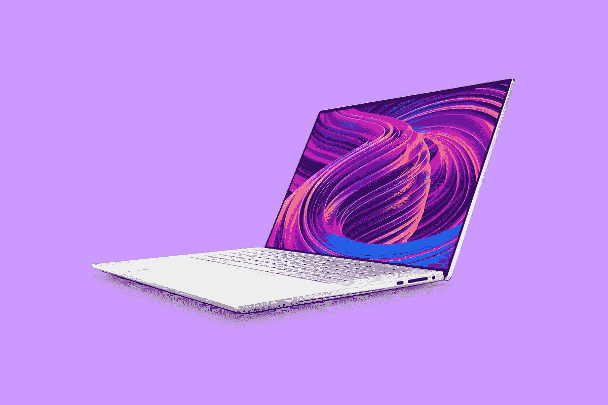

# 戴尔 XPS 15 9510 评测:有机发光二极管、RTX 和所有您喜欢的首字母缩写词

> 原文：<https://www.xda-developers.com/dell-xps-15-9510-review/>

在去年进行了一次大的重新设计之后，戴尔最新的 XPS 笔记本电脑大部分都是 T1 规格的。事实上，XPS 17 9710 正是如此[。有了 Dell XPS 15 9510，就不止这些了。](https://www.xda-developers.com/dell-xps-17-9710-review/)

显然，规格的提升意味着它现在配备了英特尔的第 11 代处理器。有了 GPU，这也意味着它第一次配备了 NVIDIA GeForce RTX 显卡。然而，现在也有一个有机发光二极管触摸屏的选项，这是去年移动到 16:10 时取消的。这是一个坚实的升级。

### 戴尔 XPS 15 9510 规格

| 

中央处理器

 | 第 11 代英特尔酷睿 i7-11800H (24MB 高速缓存，最高 4.6 GHz，8 核) |
| 

制图法

 | NVIDIA GeForce RTX 3050 Ti 4GB gddr 6[45W] |
| 

身体

 | 13.57 x 9.06 x 0.71 英寸(344.72 x 230.14 x 18 毫米)，4.31 磅(1.96 千克) |
| 

显示

 | 15.6 英寸有机发光二极管 3.5K (3456x2160) InfinityEdge 触控防反光 400 尼特显示屏 |
| 

记忆

 | 16GB，8GBx2，DDR4，3200MHz |
| 

储存；储备

 | 512GB M.2 PCIe NVMe 固态硬盘 |
| 

电池

 | 6 芯电池、86 瓦时(集成)、130 瓦 USB Type-C 充电器 |
| 

港口

 | 1 个 USB 3.2 Gen 2 Type-C，带(DisplayPort/PowerDelivery) (1 个)3.5 毫米耳机/麦克风组合插孔(2 个)Thunderbolt 4 (USB Type-C)，带 DisplayPort 和 Power Delivery (1 个)全尺寸 SD 读卡器 v6.0 (1 个)楔形锁插槽 |
| 

键盘

 | 英文键盘，黑色，背光，指纹识别器 |
| 

连通性

 | 黑仔 Wi-Fi 6 AX1650 (2x2)和蓝牙 5.1 |
| 

照相机

 | 720 p 30 fps 高清摄像头双阵列麦克风红外摄像头 |
| 

声音的

 | 立体声低音扬声器 2.5 瓦 x 2 和立体声高音扬声器 1.5 瓦 x 2 = 8 瓦总峰值 |
| 

材料

 | 数控加工铝碳纤维或编织玻璃纤维复合掌托 |
| 

颜色

 | 霜冻外观，北极白色内饰 |
| 

操作系统（Operating System）

 | Windows 10 主页 |
| 

价格

 | $2,400.99 |

## 设计:霜白色和北极白色让戴尔 XPS 15 更加性感

多年来，戴尔的 XPS 系列产品都有着非常相似的外观。通常，它有一个灰银色的外表和黑色碳纤维掌托。有一段时间，侧面也是黑色的，尽管在最新的设计中变成了银色。这是标准的戴尔 XPS 设计；例如，如果戴尔推出某种新型号，这就是它将使用的设计。

[sc name = " pull-quote-right " quote = " Dell XPS 15 是一台漂亮的机器，使用起来令人愉悦。"]不过也有过变种，比如戴尔送我的 XPS 15。这款有一种叫冰霜的颜色，内饰是一种叫北极白的颜色。这种外观已经在 XPS 13 和 XPS 13 二合一设备上提供了一段时间，但它是 XPS 15 的新功能。

拥有冰霜外壳和北极白色内饰的 XPS 15 是一个赢家，很遗憾这没有被认为是该系列的标准。XPS 17 上可没有这种外观。

事实上，Dell XPS 15 是一台漂亮的机器，使用起来令人愉悦。它由整块 CNC 加工的铝制成，新的颜色选择是一个受欢迎的变化。

就像我们去年在 XPS 15 9500 上看到的那样，不再有 USB Type-A。事实上，戴尔、苹果和微软都在他们的高端电脑上放弃了 USB Type-A，转而使用 USB Type-C。在左侧，有两个 Thunderbolt 4 端口，其中任何一个都可以支持双 4K 显示器或一个 8K 显示器。您还可以使用它来连接外部 GPU、获得 40Gbps 数据传输速度的超高速外部存储等等。

在右侧，有一个 3.5 毫米的音频插孔，一个全尺寸的 SD 卡插槽——这在如今的[笔记本电脑](https://www.xda-developers.com/best-laptops/)中很少见——和另一个 USB Type-C 端口。另一方面，右边的 USB Type-C 端口只是 USB 3.2 Gen 2，这意味着它的速度是 10Gbps，而不是 40Gbps。它支持 DisplayPort 和电源传输，因此您仍然可以从任何一侧为显示器供电或为设备充电。

我是这个新设计的忠实粉丝。戴尔 XPS 15 9500 是五年来第一款笔记本电脑，它的重新设计成为了赢家。加上霜外部和北极白色的内部是顶部的樱桃。

它的重量也不算太重，只有 4.31 磅，不过实际上它的起价是 3.99 磅，电池更小。它比 Surface Laptop 4 15 重，但它们是非常不同的机器。我们将在性能部分详细讨论这一点。

## 显示器:Dell XPS 15 拥有 16:10 的有机发光二极管屏幕

屏幕尺寸为 15.6 英寸，但截至去年的戴尔 XPS 15 9500，屏幕尺寸为 16:10，而不是 16:9。这意味着它高了一点。个人感觉 16:10 在 15.6 寸是最甜的地方。由于屏幕更高，因此没有那么宽，我觉得 13 英寸 16:10 笔记本电脑可能会有点窄。这个尺寸感觉很完美。

戴尔不得不为 XPS 15 9500 做出的一个牺牲是[有机发光二极管型号](https://www.xda-developers.com/best-oled-laptops/)。毕竟新生事物的本性就是如此。当时根本没有有机发光二极管选项。现在，有机发光二极管回归了。事实上，戴尔 XPS 15 9510 可能主要是一个规格凸起，但它确实有那些新的配置，如 4K 有机发光二极管显示屏，或新的颜色选项。

根据我的显示测试，它得到了 100%的 sRGB，94%的 NTSC，96%的 Adobe RGB 和 100%的 P3。太棒了。没有比这更好的了。如果您关心色彩准确性和编辑媒体，如照片和视频，这是一个非凡的屏幕。

然而，它与标准的 3，840 x 2，400 LCD 并没有什么不同。这是因为戴尔刚刚在其[戴尔 XPS 笔记本电脑](https://www.xda-developers.com/best-dell-laptops/)上制作了非常棒的显示屏。我记得该公司第一次在 XPS 15 上推出有机发光二极管屏幕。那是在纽约市的一次新闻发布会上，我看到了 4K 有机发光二极管和非有机发光二极管选项并列。虽然我总是喜欢有机发光二极管的精彩表演，但很明显有机发光二极管选项真的没有必要，因为非有机发光二极管版本已经非常好了。

不过它们的价格是一样的，所以由你决定。就我个人而言，我仍然会选择有机发光二极管，但这并不意味着你会做出一个不选择有机发光二极管的错误决定。此外，你需要去有机发光二极管，以便获得霜冻的外观和北极白色的内部。

当然，它有戴尔标志性的 InfinityEdge 显示屏，这意味着它有超窄的边框，可以带来更身临其境的体验。虽然它很美，而且会带来愉快的体验，但必须做出一个妥协。网络摄像头是 720p，公平地说，当这款笔记本电脑被设计出来时，人们并不关心网络摄像头。只是在过去的 18 个月里，网络摄像头才成为这么多人在家工作的一个问题。

## 键盘和触摸板:它由编织玻璃纤维制成

老实说，我称赞设备的外观，但内部是如此之好。黑色内部的那个有一个键盘面板，由碳纤维制成，具有编织而光滑的表面。北极白键盘面板由玻璃纤维编织而成，很有质感。它非常漂亮，摸起来也很舒服。此外，所有配件都是白色的，包括 130W 充电器，这也是一个不错的选择。

[sc name = " pull-quote-left " quote = " Dell XPS 系列是唯一一款真正旨在与 Apple 竞争的产品。"]键盘本身非常坚固，我认为戴尔在过去几年中已经做出了一些改进。电阻感觉刚刚好，灵敏度完美补偿了电阻。我没有发现自己犯错是因为不小心撞到了太敏感的东西或者类似的东西。

就消费类笔记本电脑而言(商务市场是另一个层面)，戴尔 XPS 15 9510 无疑拥有最好的键盘之一。

键盘两侧是立体声扬声器。的确，这个东西配备了双 2.5W 扬声器和双 1.5W 高音扬声器，另外两个位于两侧的底部。Waves MaxxAudio Pro 的音质非常出色，这是戴尔影院的全部功能，包括 CinemaColor、CinemaSound 和 CinemaStream。这一切都是为了创造令人惊叹的流媒体体验，而戴尔完成了这项工作。

键盘上还有一个指纹传感器，这是右上角的键。遗憾的是，当你第一次按下指纹时，戴尔不会像其他 OEM 那样扫描你的指纹。对于 XPS 15，您必须在电脑启动后触摸它。

让我们来谈谈微软的精密触摸板，因为这个东西太大了。我非常喜欢戴尔如何利用键盘面板上所有可用的空间来制作一个漂亮而宽敞的触摸板。这是苹果在 MacBooks 上做的事情，Windows OEMs 厂商不会做这么多。老实说，我发现戴尔 XPS 系列是唯一真正旨在与苹果竞争的产品。

## 性能和电池续航时间:这是第一款采用 RTX 显卡的戴尔 XPS 15

戴尔发给我的型号远远超出了基本型号，但我认为它就是你想要的型号。对于所有笔记本电脑，我倾向于推荐 16GB 内存和 512GB 存储空间，这就是我们这里有的。它还配备了酷睿 i7-11800H 和 NVIDIA GeForce RTX 3050 Ti。其他图形选项有 Iris Xe 集成显卡和 RTX 3050。

如果你正在寻找一台 15 英寸的笔记本电脑，知道你要用它做什么是很重要的。这不是 13 英寸笔记本电脑的情况，因为坦率地说，几乎所有 13 英寸笔记本电脑都使用相同的内部部件 15W U 系列处理器和集成显卡。它们有助于提高生产力。

但是对于 15 英寸的笔记本电脑，有两种完全不同的笔记本电脑。有些笔记本使用与 13 英寸笔记本完全相同的内部结构，只是屏幕更大。这些更薄，更轻，电池寿命更长。此外，还有配备 45W H 系列处理器和专用显卡的产品。这些更厚更重，但它们更有力量。

Dell XPS 15 9510 就属于后一类，从消费类笔记本电脑到游戏电脑再到移动工作站，不一而足。在我看来，XPS 15 是性能和便携性的最佳结合。它显然比使用 U 系列芯片的 Surface Laptop 4 更重，但它更多的是为创意用例而设计的。

在我的测试中，电池续航时间在 5 小时(恰好一次测试)到 5 小时 33 分钟之间。这是在运行 Windows 11 和电池处于推荐设置时发生的。像往常一样，这是在做常规工作的时候。我不得不说，电池寿命超出了我的预期，虽然 86 瓦时是一个相当大的电池。只是像 45W 处理器、专用 GPU 和 4K 有机发光二极管显示器这样的东西都将消耗电池寿命。

对于基准测试，我使用了 PCMark 8、PCMark 10、3DMark、Geekbench 和 Cinebench。

|  | 

戴尔 XPS 15 9510 酷睿 i7-11800H，RTX 3050 Ti

 | 

[戴尔 XPS 17 9710](https://www.xda-developers.com/dell-xps-17-9710-review/) 酷睿 i7-11800H，RTX 3060

 | 

戴尔 XPS 15 9500 酷睿 i7-10875H，GTX 1650 Ti

 | 

[惠普 Pavilion Aero 13](https://www.xda-developers.com/hp-pavilion-aero-13-review/) 锐龙 7 5800U

 |
| --- | --- | --- | --- | --- |
| 

PCMark 8:主页

 | 3,969 | 4,037 | 3,652 | 4,512 |
| 

PCMark 8:创意

 | 5,731 | 6,100 | 4,839 | 4,360 |
| 

PCMark 8:工作

 | 3,571 | 3,564 | 3,322 | 3,977 |
| 

PCMark 10

 | 5,988 | 6,379 | 5,136 | 5,758 |
| 

3DMark:时间间谍

 | 4,801 | 7,158 | 3,742 | 1,212 |
| 

极客工作台

 | 1,538 / 7,514 | 1,561 / 8,775 |  | 1,427 / 5,524 |
| 

电影院长凳

 | 1,491 / 9,399 | 1,515 / 11,652 |  | 1,365 / 7,115 |

在选择比较基准测试分数的设备时，我首先选择相关的电脑，如上一代 XPS 15 和当前一代 XPS 17，但我也会寻找具有类似 PCMark 10 分数的电脑。我有点惊讶地将一款配有 U 系列处理器和集成显卡的主流惠普笔记本电脑添加到列表中，但我们已经在这里了。

## 结论:你应该购买戴尔 XPS 15 9510 吗？

戴尔的 XPS 15 一直是我最喜欢的笔记本电脑之一。我一直认为这是权力和便携性的正确平衡。它提供了 45W H 系列处理器和专用显卡，在这个世界上，如果你想要这些东西，你必须将目光投向游戏笔记本电脑。近年来，像这样的笔记本电脑变得越来越普遍。英伟达推出了工作室计划，更多的原始设备制造商瞄准了那些从游戏笔记本电脑中分离出 PC 产品线的创造者。

尽管外形变得越来越常见，但戴尔 XPS 15 仍保持领先地位。XPS 15 9510 配备了新的英特尔第 11 代 45W 处理器，以及 NVIDIA GeForce RTX 30 系列显卡，使其成为第一款采用 RTX 的 XPS 15。除此之外，它还带来了其他好处，例如有机发光二极管展示的回归以及霜冻和北极白色的内饰。它不仅是一台很棒的电脑，而且很漂亮。

当然，最大的缺点是它仍然有一个 720p 的网络摄像头。不过，这是无法回避的。该产品去年刚刚进行了全面的重新设计，这意味着这项设计还将持续几年。

除此之外，Dell XPS 15 9510 拥有您需要的一切。它能够在您需要时处理更繁重的任务，并且适合您外出时使用。

 <picture></picture> 

Dell XPS 15 9510

##### 戴尔 XPS 15 9510

戴尔的 XPS 15 9510 在一个 4 磅重的包装中融合了功能和便携性，增加了有机发光二极管显示屏和新的配色。