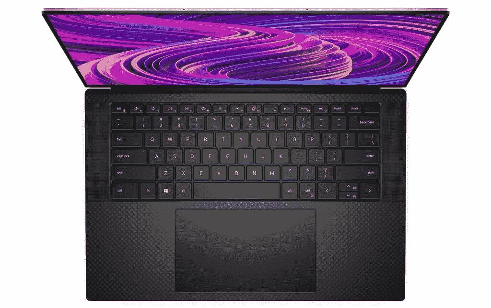
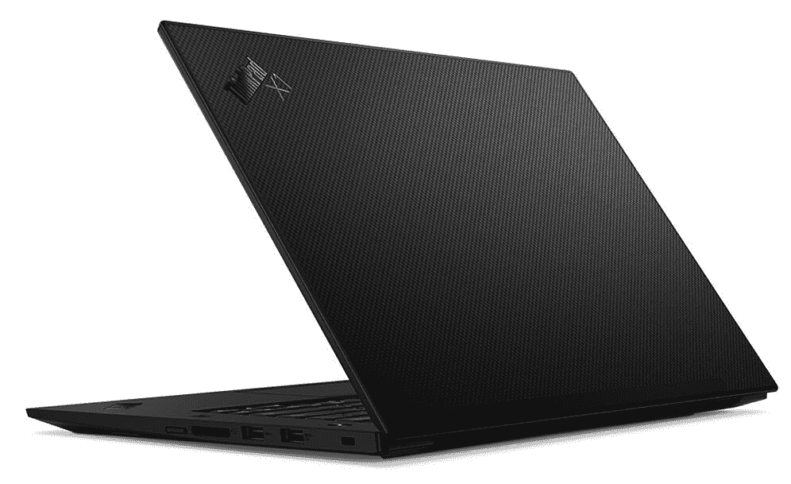
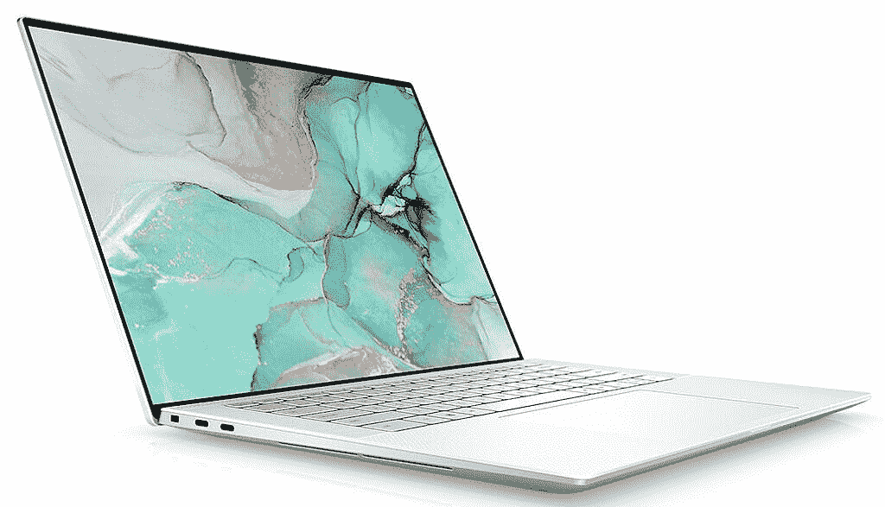
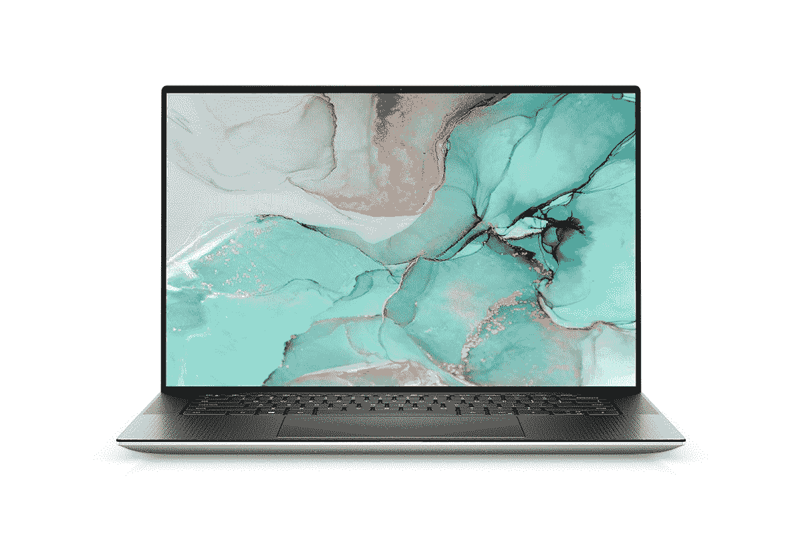

# 戴尔 XPS 15 vs 联想 ThinkPad X1 Extreme:你该选哪个？

> 原文：<https://www.xda-developers.com/dell-xps-15-vs-lenovo-thinkpad-x1-extreme/>

我们经常听说的许多更受欢迎的笔记本电脑都是轻薄的机器，像 T2 戴尔和 T4 联想为喜欢轻薄设备的用户提供了一些很棒的笔记本电脑。但这些公司也为重视性能而非电池寿命或便携性的用户提供了更强大的产品。戴尔 XPS 15 和联想 ThinkPad X1 Extreme 是两款看似强大的笔记本电脑，在本指南中，我们将对它们进行比较，以找出您应该购买哪一款。

这两款笔记本电脑都提供了卓越的体验和经典的设计。与各自公司的阵容相比，他们都不会太突出，但他们比你想象的要强大得多。无论您是需要编辑视频还是想在下班后玩游戏，这两款笔记本电脑都不会出错。

## 戴尔 XPS 15 与联想 ThinkPad X1 Extreme:规格

首先，让我们比较一下这两款笔记本电脑的官方规格，看看它们各自的情况。以联想 ThinkPad X1 Extreme 为例，在撰写本文时，官方规格列表列出了许多无法购买的型号；就像，他们似乎还没有发布。我们将列出联想表示将提供的所有配置，但用星号标出您不能购买的配置。

|  | 

戴尔 XPS 15

 | 

联想 ThinkPad X1 至尊版

 |
| --- | --- | --- |
| **处理器** | 

*   英特尔酷睿 i5-11400H(最高 4.5GHz，6 核)
*   英特尔酷睿 i7-11800H(最高 4.6GHz，8 核)
*   英特尔酷睿 i9-11900H(最高 4.9GHz，8 核)

 | 

*   英特尔酷睿 i7-11800H(最高 4.6GHz，8 核)
*   英特尔酷睿 i7-11850H 博锐处理器(最高 4.8GHz，8 核)
*   英特尔酷睿 i9-11950H 博锐处理器(最高 5GHz，8 核)*

 |
| **图形** | 

*   英特尔 UHD 显卡
*   NVIDIA GeForce RTX 3050 4GB gddr 6(45W)
*   NVIDIA GeForce RTX 3050 Ti 4GB gddr 6(45W)

 | 

*   英特尔 UHD 显卡
*   NVIDIA GeForce RTX 3050 Ti 4GB GDDR6
*   英伟达 GeForce RTX 3060 6GB GDDR6
*   英伟达 GeForce RTX 3070 8GB GDDR6
*   NVIDIA GeForce RTX 3080 16GB GDDR6*

 |
| **闸板** |  | 

*   16GB
    *   双 SODIMM 插槽(最高支持 64GB)

 |
| **存储** |  | 

*   512GB
*   1TB
    *   配有 RTX 3050 Ti 或更低版本的型号:两个 M.2 插槽(总计高达 4TB)
    *   配备 RTX 3060 或更高版本的型号:一个 M.2 插槽(最高 2TB)

 |
| **显示** | 

*   15.6 英寸，全高清+ (1920 x 1200)，InfinityEdge，防眩光，非触摸，500 尼特
*   15.6 英寸有机发光二极管，3.5K (3456 x 2160)，InfinityEdge，防反光，触摸，400 尼特，100% DCI-P3
*   15.6 英寸，超高清+ (3840 x 2400)，InfinityEdge，防眩光，触摸屏，100% Adobe RGB，94% DCI-P3，500 尼特

 | 

*   16 英寸 WQXGA (2560 x 1600) IPS，防眩光，400 尼特
*   16 英寸超高清+ (3840 x 2400) IPS，防眩光，杜比视觉，HDR 400，600 尼特

 |
| **音频** | 

*   四声道立体声扬声器(两个 2W 低音扬声器，两个 1.5 瓦高音扬声器)

 | 

*   双立体声扬声器(2W x 2)

 |
| **网络摄像头** |  |  |
| **生物认证** | 

*   红外照相机
*   指纹读取器

 | 

*   指纹读取器
*   可选:红外摄像头

 |
| **电池** |  |  |
| **港口** | 

*   2 个 Thunderbolt 4(USB C 类)端口
*   一个 USB 3.2 Gen 2 Type-C(电源传输，显示端口)
    *   包含 USB Type-C 至 Type-A 和 HDMI 2.0 适配器
*   SD 读卡器
*   3.5 毫米耳机插孔

 | 

*   2 个 Thunderbolt 4(USB C 类)端口
*   2 个 USB 3.2 第 1 代 A 类端口
*   HDMI 2.1 (2.0 适用于英特尔 UHD 显卡)
*   SD 读卡器
*   3.5 毫米耳机插孔
*   可选:SIM 卡插槽

 |
| **连通性** | 

*   黑仔 Wi-Fi 6 AX1650 (2x2)，蓝牙 5.1

 | 

*   英特尔 Wi-Fi 6 AX210，蓝牙 5.2

 |
| **颜色** | 

*   铂金银外观+黑色碳纤维内饰
*   霜冻外观+北极白内饰

 | 

*   黑色
*   黑色碳纤维盖罩

 |
| **尺寸(WxDxH)** | 13.57 x 9.06 x 0.71 英寸(344.68 x 230.12 x 18.03 毫米) | 14.13 x 9.99 x 0.7 英寸(359.5 x 253.8 x 17.7 毫米) |
| **重量** | 起始重量为 3.99 磅(1.81 千克) | 起始重量为 3.99 磅(1.81 千克) |
| **起始价格** | $1,299.99 | 1，907.40 美元(有所不同，官方起价为 2，149 美元) |

## 性能:为联想 ThinkPad X1 Extreme 提供更多动力

直接进入性能，很明显联想 ThinkPad X1 Extreme 提供了更多的功能。对于 CPU，由于 ThinkPad 没有顶级配置，戴尔 XPS 15 确实拥有更强大的酷睿 i9。然而，这只是在联想推出高端配置之前。

对于 GPU 相关的任务，联想 ThinkPad X1 Extreme 显然更胜一筹。

无论哪种方式，这都不是最大的区别——这将是 GPU，联想在这里取得了巨大的胜利。戴尔 XPS 15 配备了 NVIDIA GeForce RTX 3050 Ti，功率为 45 瓦。联想表示，你可以获得最高配置 GeForce RTX 3080 的 ThinkPad X1 Extreme，尽管这种配置不可用，但这毫无疑问。联想没有透露其 NVIDIA GPUs 的 TDP，但我们可以从 NVIDIA 本身获得指导。该公司表示，用于笔记本电脑的 RTX 3060 起价为 60 瓦，RTX 3070 起价为 80 瓦，这已经是对 XPS 15 的一大飞跃。对于 GPU 相关的任务，联想 ThinkPad X1 Extreme 显然更胜一筹。

不过，戴尔 XPS 15 在开箱即用的存储和 RAM 方面确实胜出。您可以为 XPS 15 配置高达 64GB 的内存和 4TB 的存储空间，而 ThinkPad X1 Extreme 的最大内存和存储空间分别为 16GB 和 1TB。但是，您可以在以后自己升级 RAM 和存储。你可以拥有高达 64GB 的内存，至于存储，你可以获得高达 4TB 的内存——只要你有 NVIDIA GeForce RTX 3050 Ti 或更低的内存。更强大的 GPU 占用更多的空间，所以那些型号只有一个 M.2 插槽，你只能获得 2TB 的存储空间。

 <picture></picture> 

Inside the Lenovo ThinkPad X1 Extreme

至于电池寿命，联想再次拥有更好的配置，所有型号都有 90 瓦时的电池。戴尔为其 Core i5 型号配备了 56 瓦时的电池，但也有 86 瓦时的版本，应该可以提供类似的电池寿命。

## 显示器:戴尔 XPS 15 有一个有机发光二极管选项

再来看显示器，这两款笔记本电脑都做对了一些重要的事情。它们都是 16:10 显示器，并且都为需要的人提供超高清+选项。不过，联想以一个显著的胜利开始，因为它的基本型号有一个 Quad HD+(或 WQXGA)面板，许多人认为这是笔记本电脑显示器的最佳选择，在电池寿命和清晰度之间提供了平衡。戴尔 XPS 15 从全高清+面板开始，然后立即跳到 3.5K。

戴尔 XPS 15 可以配备有机发光二极管显示屏，不仅清晰度惊人，而且色彩鲜艳。

另一方面，3.5K 显示器选项给了戴尔最大的优势。戴尔 XPS 15 可以配备有机发光二极管显示屏，不仅清晰度惊人，而且色彩鲜艳。有机发光二极管面板的每个像素都有独立的照明，从而产生纯黑色和 100，000:1 的高对比度。这款有机发光二极管显示器还覆盖了 100%的 DCI-P3 色域，因此在 Dell XPS 15 上观看内容将会非常精彩。

两家公司都宣称支持超高清+显示器上的 HDR 内容，但联想特别提到了 HDR 400，因此至少有一个切实的认证。戴尔的显示器最大亮度较低，因此 HDR 可能会在 ThinkPad X1 Extreme 上工作得更好。

 <picture></picture> 

Dell XPS 15 with black carbon fiber interior

戴尔还在声音体验方面胜出，提供了 Windows 笔记本电脑上相当罕见的四扬声器设置。Dell XPS 15 有两个高音扬声器和两个低音扬声器，总共有 8W 用于声音输出。与此同时，联想 ThinkPad X1 Extreme 只有两个 2W 低音扬声器。

但是联想在网络摄像头方面取得了另一个胜利，默认情况下是 1080p 传感器。戴尔使用尺寸仅为 2.25 毫米的 720p 摄像头，这允许边框很小，但这意味着[图像质量不是很好](https://www.xda-developers.com/dell-xps-webcam/)。不过，戴尔 XPS 15 开箱后就有红外网络摄像头，而联想 ThinkPad X1 Extreme 则需要额外付费。

## 设计和端口

这一类别是两台笔记本电脑中最平衡的，各有一些明显的优势和劣势。戴尔 XPS 15 和联想 ThinkPad X1 Extreme 都有两个 Thunderbolt 4 端口，并且在这两款笔记本电脑上，它们位于同一侧。Dell XPS 15 有一个额外的 USB Type-C 端口，配有电源传输和 DisplayPort，位于笔记本电脑的另一侧，在如何插入插座或外部显示器方面给您更多的灵活性。

 <picture></picture> 

Lenovo Thinkpad X1 Extreme with carbon fiber weave cover

联想 ThinkPad X1 Extreme 内置了更多端口，有两个 USB Type-A 端口和 HDMI，因此它与键盘、鼠标和显示器等外围设备具有更广泛的兼容性。戴尔 XPS 15 确实包括一个适配器，可以将 USB Type-C 端口转换为 USB Type-A 和 HDMI 端口，但这是一个你必须携带的额外附件，而且你仍然只有一个 Type-A 端口。这两款笔记本电脑还包括一个全尺寸 SD 读卡器和一个耳机插孔，此外，联想 ThinkPad X1 Extreme 有一个专有的充电端口，因为它需要的电量超过了 USB 所能提供的。

ThinkPad X1 Extreme 还可以配置 5G 支持，增加一个 nano-SIM 插槽。这个选项似乎还不能购买，但如果你需要移动连接，这无疑使 ThinkPad X1 Extreme 更加多功能。

联想提供的额外端口是这种更大笔记本电脑的结果。戴尔 XPS 15 和 ThinkPad X1 Extreme 的起始重量相同，但 XPS 15 除了厚度之外，在每个维度上都要小得多。它可以更容易地放入背包或包中，因此更容易携带。相反，联想 ThinkPad X1 Extreme 已经包括酷睿 i7 处理器、更大的电池和四核高清显示屏，起始重量相同，因此您可以获得更高的性能，而不会增加额外的负担。

 <picture></picture> 

Dell XPS 15 in Arctic White

最后，我们来谈谈长相。戴尔 XPS 15 有两种型号，一种具有较暗的“铂银”外观，包括黑色碳纤维键盘面板，另一种具有“霜银”外观和由编织玻璃纤维复合材料制成的“北极白”键盘面板。另一方面，联想 ThinkPad X1 Extreme 只有经典 ThinkPad 设计的黑色，但盖子的顶部可以涂成黑色或采用碳纤维编织表面。

这意味着两款笔记本电脑都可以以自己的方式脱颖而出，尽管 Dell XPS 15 为您提供了更多独特的选择。不过，双方都有一些限制。北极白的戴尔 XPS 15 不配备英特尔酷睿 i5 处理器，它还需要升级到 16GB 的内存和 512GB 的存储空间。你也无法通过这种方式获得超高清+面板(但你可以获得 3.5K 有机发光二极管)。联想更简单一些——配备四核高清+显示屏的机型有一个涂漆的盖子，而配备超高清+面板的机型有碳纤维编织盖子。

## 结果

在经历了所有这些之后，很明显联想 ThinkPad X1 Extreme 有很多显著的优势。它拥有更强大的 GPU，还可能拥有更强大的 CPU。它的基本型号具有更清晰的显示器，超高清+面板支持 HDR 400 和 600 尼特的亮度。它也有更多的端口来连接外设，更好的网络摄像头和更大的电池。增加 5G 连接的能力将使它在旅行中更加有用。

如果您想要最高的性能和灵活性，联想 ThinkPad X1 Extreme 更适合您。

然而，戴尔 XPS 15 确实有一些可取之处。其中最大的是有机发光二极管显示器的选项，它将为您提供充满活力的色彩和纯黑色的奇妙观看体验。由于采用了四扬声器设置，音响系统也更加强大。它也有一个小得多的底盘，设计本身可以说更现代。此外，您可以在两种截然不同的颜色之间进行选择，而 ThinkPad X1 Extreme 只有黑色。

你可能会指出的一点是起步价，但将戴尔 XPS 15 配置为与 ThinkPad X1 Extreme 的基本型号类似，你不会付出太多，而且你的屏幕仍然会更差。

 <picture></picture> 

Lenovo ThinkPad X1 Extreme

与任何事情一样，这最终取决于您的用例。如果您想要最高的性能和灵活性，联想 ThinkPad X1 Extreme 更适合您。如果您重视美学，如果您想通过购买英特尔酷睿 i5 处理器来节省一些资金，或者如果您想要一个具有出色音频体验的梦幻有机发光二极管显示器，Dell XPS 15 可以满足这些需求。这两款都仍然是非常强大的笔记本电脑，除非你有非常苛刻的工作负载，否则你不会真的乞求任何一款都有更高的性能。

如果你已经做出了选择，你可以使用下面的链接购买你喜欢的笔记本电脑。您可以在百思买购买戴尔 XPS 15 的预设配置，或者在戴尔的网站上完全配置您自己的[。联想的产品只能直接从联想购买。](https://www.anrdoezrs.net/links/100122946/type/dlg/sid/UUxdaUeUpU4698/https://www.dell.com/en-us/shop/dell-laptops/new-xps-15-touch-laptop/spd/xps-15-9510-laptop/xn9510cto210s)

 <picture></picture> 

Dell XPS 15

##### 戴尔 XPS 15 有机发光二极管

Dell XPS 15 是一款功能强大的 15 英寸笔记本电脑，配有 3.5K 有机发光二极管触摸屏、英特尔酷睿 i7 处理器和 16GB 内存。

 <picture></picture> 

Lenovo ThinkPad X1 Extreme

##### 联想 ThinkPad X1 至尊版

联想 ThinkPad X1 Extreme 是一款功能强大的 16 英寸笔记本电脑，采用高端英特尔 CPU 和 NVIDIA GeForce RTX 显卡。它可以配备高达 64GB 的内存和 4TB 的存储空间，外加超高清+显示屏。