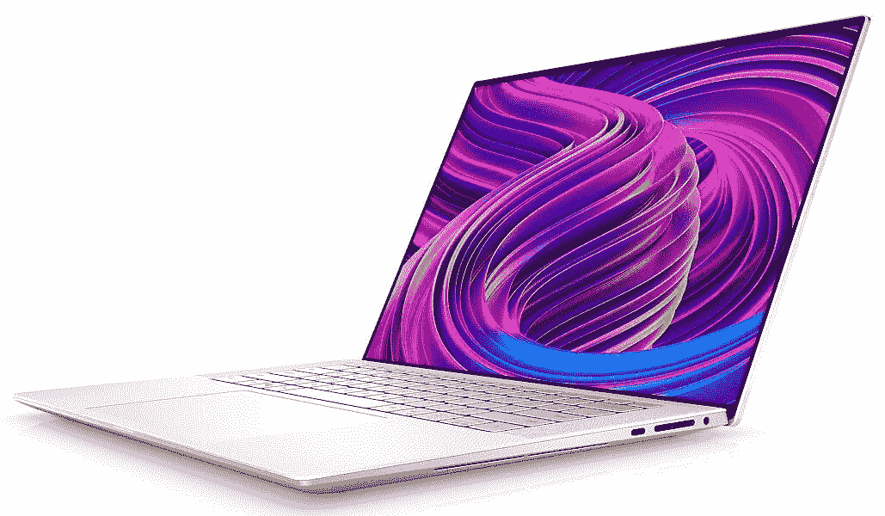

# 戴尔 XPS 15 vs Surface Book 3 15 寸:该买哪个？

> 原文：<https://www.xda-developers.com/dell-xps-15-vs-surface-book-3-15/>

如今，你可以买到很多很棒的笔记本电脑，有时很难找到适合你的。有这么多选择显然很好，因为这意味着你更有可能找到合适的东西，但仍然很难选择。如果你正在寻找一台生产力机器，特别是可以处理视频编辑等任务的机器，你可能会遇到的两个选项是戴尔 XPS 15 和 Surface Book 3。

然而，虽然这些笔记本电脑都足以满足创意专业人士的需求，但它们在许多方面完全不同。选择哪一个取决于你需要笔记本电脑做什么，但总的来说，记住 Surface Book 3 打包了一些旧硬件也很重要。该笔记本电脑是一年前更新的，而 Dell XPS 15 是更新的。此外，还有一些其他的大差异，但我们将在稍后讨论这些差异。

## 戴尔 XPS 15 与 Surface Book 3:规格

和往常一样，我们先简单看一下这两款笔记本电脑的规格表。我们在这里关注的是 15 英寸版本的 Surface Book 3，而不是 13 英寸的型号。

|  | 

戴尔 XPS 15

 | 

Surface Book 3 15 英寸

 |
| --- | --- | --- |
| **处理器** | 

*   英特尔酷睿 i5-11400H(最高 4.5GHz，6 核)
*   英特尔酷睿 i7-11800H(最高 4.8GHz，8 核)
*   英特尔酷睿 i9-11900H(最高 4.9GHz，8 核)

 | 

*   英特尔酷睿 i7-1065G7(最高 3.9GHz，四核)

 |
| **图形** | 

*   英特尔 UHD 显卡
*   NVIDIA GeForce RTX 3050 4GB gddr 6(45W)
*   NVIDIA GeForce RTX 3050 Ti 4GB gddr 6(45W)

 | 

*   英特尔虹膜增强显卡
*   NVIDIA GeForce GTX 1660 Ti 6GB gddr 6(Max-Q)(15 英寸)
*   NVIDIA Quadro RTX 3000 (Max-Q) (15 英寸，仅商用)

 |
| **撞锤** |  |  |
| **存储** |  |  |
| **显示** | 

*   15.6 英寸，全高清+ (1920 x 1200)，InfinityEdge，防眩光，非触摸，500 尼特
*   15.6 英寸，3.5K (3456 x 2160)有机发光二极管，独立边缘，防眩光，触摸，400 尼特，100% DCI-P3
*   15.6 英寸，超高清+ (3840 x 2400)，InfinityEdge，防眩光，触摸屏，100% Adobe RGB，94% DCI-P3，500 尼特

 | 

*   15 英寸 PixelSense (3240 x 2160)，触摸，可拆卸

 |
| **音频** | 

*   四声道立体声扬声器(两个 2.5 瓦低音扬声器，两个 1.5 瓦高音扬声器)

 | 

*   带杜比 Atmos 的立体声扬声器

 |
| **网络摄像头** | 

*   2.25 毫米 720p 高清 30fps 红外摄像头

 | 

*   500 万像素 1080 像素前置网络摄像头(带红外)
*   800 万像素 1080 像素后置网络摄像头，支持自动对焦

 |
| **生物认证** | 

*   Windows Hello 红外摄像机
*   指纹读取器

 |  |
| **电池** | 

*   3 芯 56 瓦时电池
*   6 芯 86 瓦时电池
    *   全高清+显示屏续航时间长达 13 小时 20 分钟
    *   有机发光二极管显示屏续航时间长达 9 小时 13 分钟
    *   超高清显示屏续航时间长达 8 小时 42 分钟

 | 

*   15 英寸:长达 17.5 小时的使用时间(容量不明)

 |
| **港口** | 

*   2 个 Thunderbolt 4(USB C 类)端口
*   一个 USB 3.2 第二代 C 类端口
*   SD 读卡器
*   3.5 毫米耳机插孔
*   包含 USB Type-C 至 Type-A 和 HDMI 2.0 适配器

 | 

*   2 个表面连接端口(一个在底座上，一个在平板电脑上)
*   两个 USB Type-A (3.2 第 2 代/ 10Gbps)
*   一个 USB Type-C (3.2 第 2 代/ 10Gbps)
*   SD 读卡器
*   3.5 毫米耳机插孔

 |
| **连通性** | 

*   黑仔 Wi-Fi 6 AX1650 (2x2)，蓝牙 5.1

 | 

*   Wi-Fi 6 +蓝牙 5.0
*   Xbox 无线内置

 |
| **颜色** | 

*   铂金银外观+黑色内饰
*   霜冻外观+北极白内饰

 |  |
| **尺寸(WxDxH)** | 13.57 x 9.06 x 0.71 英寸(344.72 x 230.14 x 18 毫米) | 

*   13.5 x 9.87 x 0.568 - 0.9 英寸(343 x 251 x 15 - 23 毫米)

 |
| **重量** | 起始于:

*   3.99 磅(1.81 千克)(非触摸式 56 瓦时电池)
*   4.22 磅(1.91 千克)(非触摸式 86 瓦时电池)
*   4.31 磅(1.96 千克)(有机发光二极管，86 瓦时电池)
*   4.42 磅(2.01 千克)(UHD+86 瓦时电池)

 | 

*   4.2 磅(1.91 千克)，带键盘

 |
| **起始价格** | $1,299.99 | $2,299.99 |

## 性能:戴尔 XPS 15 功能强大得多

如果你看着这些规格，认为 Surface Book 3 在这里没有机会——你是对的。我们先来关注一下 CPU，这里有两个大的因素。首先是年龄。正如我们已经提到的，Surface Book 3 最后一次刷新是在 2020 年 5 月，所以它仍然使用英特尔 Ice Lake 处理器，而 XPS 15 现在有了 Tiger Lake。但第二件大事是，戴尔 XPS 15 使用 H 系列处理器，其 TDP 为 45W。Surface Book 3 使用 U 系列处理器，其 TDP 通常在 15W 左右。这为 Dell XPS 15 提供了更强大的处理能力。

这些处理器拥有更多内核和更快的时钟速度，因此看到戴尔 XPS 15 在这里完全占据主导地位也就不足为奇了。看看下面的基准测试分数，它甚至都不接近——我们为 Surface Book 3 选择了一个最好的结果，而不是这里的平均值。

| 

主标题 1

 | 

Surface Book 3(英特尔酷睿 i7-1065G7)

 | 

英特尔酷睿 i5-11400H(平均)

 | 

英特尔酷睿 i7-11800H(平均)

 |
| --- | --- | --- | --- |
| GeekBench 分数(单核/多核) | 1315 / 4554 | 1366 / 5824 | 1493 / 8080 |

这还不是全部，因为 GPU 也完全不同。因为它比较新，戴尔 XPS 15 使用的是 NVIDIA 的 GeForce RTX 3050 或 3050 Ti GPUs，这是今年早些时候发布的。由于年龄较大，Surface Book 3 仍然使用 GeForce GTX 1660 Ti 显卡，因此自然没有那么好。商业用户也可以用 Quadro RTX 3000 GPU 来获得它，但它仍然没有那么快。然而，这很可能是一个将在潜在的 [Surface Book 4](https://www.xda-developers.com/surface-book-4/) 中更新的组件，我们期待很快听到消息。

Surface Book 3 仍然比大多数其他 [Surface 设备](https://www.xda-developers.com/best-microsoft-surface-pcs/)更强大，你仍然可以用它来进行创意工作或游戏。它远不如戴尔 XPS 15 强大。在这里，等待刷新可能是最有意义的。

在内存和存储方面，戴尔也处于领先地位。您可以获得高达 64GB 内存和 4TB 存储的 Dell XPS 15，坦率地说，这远远超出了大多数用户的需求，但这是一个不错的选择。Surface Book 3 仍然很好，但最大限度地利用了 32GB 的内存和 2TB 的固态硬盘。此外，升级组件要困难得多，而且会使 Surface Book 3 的保修失效，因为它不是为打开而设计的。

微软承诺 Surface Book 3 15 英寸的典型设备使用时间长达 17 个半小时。

Surface Book 3 胜出的一个领域是电池续航时间。使用低功耗芯片组也有助于解决这个问题。微软承诺，只要你连接了键盘底座，Surface Book 3 15 英寸的典型设备使用时间可达 17 个半小时。另一方面，Dell XPS 15 承诺长达 13 小时 20 分钟的续航时间，但您不得不满足于没有触摸支持的吸引力小得多的全高清+显示屏。如果你想要更清晰的显示选项，一次充电不到 10 小时。

## 设计:Surface Book 3 拥有可拆卸屏幕

虽然戴尔 XPS 15 和 Surface Book 3 都可以作为传统的笔记本电脑使用，但它们的设计方式完全不同。戴尔 XPS 15 只是一款翻盖式笔记本电脑。你可以增加一个触摸屏，但是显示屏总是被限制在像蛤壳一样打开。有了 Surface Book 3，你可以把屏幕和键盘底座分开，把屏幕当成平板电脑使用。

Surface Book 3 的大部分组件都在显示部分，尽管更大的电池和 NVIDIA GPU 都在键盘底座上。您还可以向后重新安装屏幕，这样您就可以在只使用显示屏的情况下获得额外的电池续航时间或 GPU 性能。这使得 Surface Book 3 更加灵活。

根据你的配置，Surface Book 3 也可能更轻。戴尔 XPS 15 的起始重量确实较轻，但没有独立的 GPU，配备了更小的 56 瓦时电池，并使用无触摸支持的全高清+显示屏。升级内部组件使两款笔记本电脑的起始重量大致相同，但同样，戴尔 XPS 15 没有触摸屏。一旦你给 XPS 15 添加了触摸屏，它总是会比 Surface Book 3 重。不过，这并没有太大的区别，所以你可以轻松地携带任何一个。至于其他尺寸，戴尔 XPS 15 没有 Surface Book 3 那么高或厚，所以它可能更容易放在一些包里。

至于端口，戴尔 XPS 15 可以说更有能力。它有两个 Thunderbolt 4 端口，为您提供 40Gbps 的带宽来连接外围设备和外部显示器。微软继续使用其磁性表面连接端口，该端口的规格并不完全透明。该公司表示，它支持使用 Surface Dock 2 的 Surface Book 3 上 60Hz 的双 4K 显示器，所以你仍然可以获得稳定的带宽。

微软继续使用其磁性表面连接端口，该端口的规格并不完全透明。

至于其他端口，戴尔 XPS 15 有另一个 USB 3.2 Gen 2 Type-C 端口，一个 SD 读卡器和一个耳机插孔，另外它还包括一个适配器，可以将 Type-C 端口转换为 USB Type-A 和 HDMI 2.0。另一方面，Surface Book 3 有一个 USB 3.2 Gen 2 Type-C 端口，两个 USB 3.2 Gen 2 Type-A 端口，以及一个 SD 读卡器和耳机插孔。这里的大问题是缺乏开箱即用的显示器输出，而戴尔至少提供了 HDMI 适配器，以便您可以插入电视或显示器。

这两款笔记本电脑都配备了 Windows Hello 面部识别功能，但戴尔 XPS 15 在电源按钮上还有一个指纹识别器。当你拥有面部识别功能时，指纹识别器会失去一些光彩，但这是一个不错的选择，特别是如果你是那种用胶带盖住网络摄像头的人。

最后，值得指出的是，Surface Book 3 只有一种颜色——铂金色——这是 Surface 设备的标志性颜色。然而，它是非常基本的，并不突出。戴尔 XPS 15 有两个版本:一个具有“铂银”外观和黑色碳纤维内部，另一个具有“霜银”外观和北极白色内部，由编织玻璃纤维复合材料制成。如果您想要看起来更独特的东西，戴尔 XPS 15 绝对是您的不二之选。

## 戴尔 XPS 15 与 Surface Book 3 的对比:显示屏

Surface Book 3 和戴尔 XPS 15 的显示屏都很棒，但在配置方面却有很大不同。首先，Surface Book 3 没有配置选项。你总是会得到一个 15 英寸，3240 x 2160 的可拆卸显示器，带触摸和笔支持。这意味着您将获得全面的出色体验，并且可以说这使得选择更加容易。

另一方面，戴尔 XPS 15 为您提供了三种选择。基本配置是全高清+ (1920 x 1200)面板，不支持触摸，虽然这还不错，但肯定不是最好的。然而，XPS 15 提供了两个绝佳的升级选项。首先，有一个 3.5K (3456 x 2160)的有机发光二极管显示器，看起来会很棒。它甚至比 Surface Book 3 更清晰，成为有机发光二极管意味着你可以获得真正的黑色、鲜艳的颜色和非常高的对比度。

 <picture></picture> 

Dell XPS 15 (Core i9, OLED)

如果有机发光二极管不适合你，还有一个超高清+ (3840 x 2400)面板，它甚至更清晰，但不会有相同水平的对比度。这是两个很棒的选择，也比 Surface Book 3 好一点。但是这两款笔记本电脑都会给你很棒的显示体验。

同样值得指出的是这些屏幕的尺寸和长宽比。两款笔记本电脑的显示屏都比平时高，但 Surface Book 3 是两者中较高的。它的宽高比为 3:2，而 XPS 15 采用的是 16:10。较高的显示器通常非常适合阅读和写作，但您可以选择 3:2 或 16:10。

戴尔 XPS 15 的声音体验也会更好。这款笔记本电脑有一个四扬声器系统，总功率为 8W，因此您可以获得更加身临其境的声音。Surface Book 3 有两个前置扬声器也不错，但不是一个级别的。

最后，我们来谈谈网络摄像头。Surface 设备拥有一些 Windows 笔记本电脑上最好的网络摄像头，Surface Book 3 配备了两个 1080p 摄像头。图片方面，前置摄像头分辨率为 5MP，后置摄像头为 8MP，加上支持自动对焦。另一方面，戴尔 XPS 15 使用一个 2.25 毫米的微型摄像头，这就是为什么它是一款如此紧凑的笔记本电脑。这个相机才 720p，出了名的[不太好](https://www.xda-developers.com/dell-xps-webcam/)。如果你关心网络摄像头的质量，Surface Book 是一个不错的选择。

## 底线

很明显，通过比较这两款笔记本电脑，戴尔 XPS 15 显然更强大，如果您现在需要购买笔记本电脑，我们建议您选择它。它有更好的处理器，更好的显卡，更好的显示屏，更好的音响系统，同样规格的价格更低。这是[戴尔最好的笔记本电脑](https://www.xda-developers.com/best-dell-laptops/)之一，就性能而言，你不会错的。

不过，这并不是说 Surface Book 3 是一款糟糕的笔记本电脑——它只是没有更新换代。它仍然提供更长的电池寿命和出色的性能，此外它还具有作为某种容量的可转换笔记本电脑的多功能性。对于大多数用户来说，Surface Book 3 对于日常使用来说已经足够强大，但我们仍然建议再坚持一段时间。

很明显，通过比较这两款笔记本电脑，戴尔 XPS 15 显然更强大，如果您现在需要购买笔记本电脑，我们建议您选择它。

随着 Windows 11 的到来，以及 Surface Book 4 的传言，微软很可能会在不久的将来推出新设备。在购买之前，你应该等着听听 Surface 设备可能会有什么新东西。如果您等不起，您可以使用下面的链接购买您喜欢的笔记本电脑，或者在[戴尔网站](https://www.anrdoezrs.net/links/100122946/type/dlg/sid/UUxdaUeUpU4651/https://www.dell.com/en-us/shop/dell-laptops/new-xps-15-touch-laptop/spd/xps-15-9510-laptop/xn9510cto220s)上全面配置戴尔 XPS 15。或者看看我们的最佳 Surface 电脑清单，你可能会考虑取代 Surface Book 3。

 <picture></picture> 

Dell XPS 15 (9520)

##### 戴尔 XPS 15

Dell XPS 15 是一款功能强大的笔记本电脑，采用高端规格，如第 11 代 45W 英特尔处理器、NVIDIA RTX 显卡、64GB 内存和 4TB 存储。它还配备了令人惊叹的 3.5K 有机发光二极管显示器选项。

 <picture></picture> 

Microsoft Surface Book 3

##### 微软 Surface Book 3

Surface Book 3 是一款可拆卸的笔记本电脑，具有强大的规格，包括第 10 代英特尔酷睿 i7、专用 NVIDIA 显卡和高达 32GB 的内存。这是一台很棒的日常用机器。