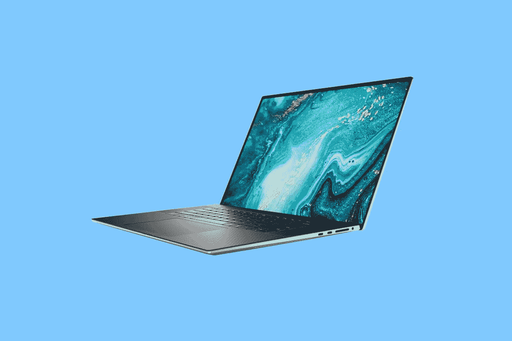

# 戴尔 XPS 17 (2022)回顾:最好的 17 英寸笔记本电脑

> 原文：<https://www.xda-developers.com/dell-xps-17-2022-review/>

如果您在市场上寻找一款 17 英寸的笔记本电脑，请不要再看戴尔 XPS 17，因为再看下去就是浪费时间。这台[笔记本电脑是目前最好的](https://www.xda-developers.com/best-laptops/)。当然，如果你不追求强大的功能——这完全没问题——有其他笔记本电脑更适合你，但如果你计划在大屏幕上进行创造性的工作，这是最好的。

让我们从屏幕开始，因为它在课堂上是最好的，毫无疑问。无论是 sRGB、Adobe RGB、NTSC 还是 P3，我们的测试要么 100%通过，要么*非常接近。这些是我见过的所有显示器中最好的结果，这就是[戴尔 XPS](https://www.xda-developers.com/best-dell-laptops/) 一直以来的出色之处。在 500 尼特以上也很好很明亮。*

性能也非常出色，配备了英特尔新的第 12 代处理器、DDR5 内存和 RTX 3060 显卡。这绝对是一台令人愉快的笔记本电脑。

 <picture></picture> 

Dell XPS 17 9720

##### 戴尔 XPS 17 9720

Dell XPS 17 (2022)配备英特尔第 12 代处理器、高达 UHD+显示屏、DDR5 内存等，是目前最好的 17 英寸笔记本电脑。

**浏览此评论:**

## 戴尔 XPS 17 (2022):定价和可用性

*   戴尔 XPS 17 (2022)现已上市，起价 1749 美元

新的 Dell XPS 15 和 XPS 17 是今年发布的首批 XPS 笔记本电脑，因此现在可以购买。戴尔 XPS 17 的起价为 1749 美元，但这只配备了酷睿 i5-12500H、8GB 内存、512GB 固态硬盘、FHD+显示屏和集成显卡。

我不认为那是你真正想要的。对于这样的机器，你可能需要专用显卡，可以是 Nvidia GeForce RTX 3050 或 3060，你可能需要 UHD+显示选项。毕竟，FHD+在这么大的屏幕上看起来不太好，而且也没有 QHD+选项。戴尔送去审查的设备包括一个酷睿 i7-12700H、一个 RTX 3060、一个 UHD+显示屏、32GB DDR5 内存和一个 1TB 固态硬盘，因此大多数选项都被选中，它的价格为 2988 美元。

它有你想要的任何颜色，只要是铂金银配黑色碳纤维掌托。这是经典的戴尔 XPS 设计，由于 XPS 17 是该公司所有旗舰笔记本电脑中最小众的产品，我们还没有看到像 XPS 13 二合一设备、XPS 13 和 XPS 15 那样增加的颜色。

## 戴尔 XPS 17 (2022):规格

| 

处理器

 | 第 12 代英特尔酷睿 i7-12700H (24MB 高速缓存，最高 4.7 GHz，14 个内核) |
| 

制图法

 | NVIDIA GeForce RTX 3060 6GB gddr 6(60W) |
| 

身体

 | 374.45 x 248.05 x 19.5 毫米(14.74 x 9.76 x 0.77 英寸)，2.42 千克(5.34 磅) |
| 

显示

 | 17 英寸 4K UHD+ (3840x2400) InfinityEdge 触控显示屏；DisplayHDR 400，500 尼特，100% Adobe RGB 最小值+ 94% DCI-P3 典型值，1600:1 对比度，高达 0.65%的防反射、防污损 |
| 

记忆

 | 32GB (2x16GB) DDR5 双通道，4800MHz |
| 

储存；储备

 | 1TB PCIe 4 x4 固态硬盘 |
| 

声音的

 | 使用 Waves MaxxAudio Pro 和 Waves Nx 3D audio 进行录音室品质调谐四扬声器设计，配有 2.5 瓦 x2 低音扬声器和 1.5 瓦 x2 高音扬声器= 8 瓦总峰值输出 3.5 毫米耳机/麦克风组合插孔，配有 Waves Nx 3D 音频和头部跟踪功能使用 Waves MaxxVoice 优化的双麦克风阵列支持 VoIP-支持 Microsoft Cortana |
| 

电池

 | 97 瓦时电池(内置)* *电池内置于笔记本电脑中，不可由客户 130 瓦交流适配器(USB Type-C)更换 |
| 

港口

 | 4 个 Thunderbolt 4 (USB Type-C ),带显示端口和电源供应 1 全尺寸 SD 读卡器 v6.01 3.5mm 毫米耳机/麦克风组合插孔楔形锁插槽 1 USB-C 转 USB-A v3.0 和 HDMI v2.0 适配器标配 |
| 

投入

 | 触摸显示屏(可选)2 个数字阵列麦克风全尺寸背光 chiclet 键盘；1.3 毫米 travelGlass 表面精密触摸板电源按钮中的 Windows Hello 指纹识别器和上挡板中的高清(720p) Windows Hello 摄像头环境光传感器用于显示屏背光控制 |
| 

连通性

 | 黑仔 Wi-Fi 6 1675(ax 211)2 x2+蓝牙 5.2 无线网卡 |
| 

建筑

 | CNC 加工的铂金银铝，碳纤维复合掌托，黑色窄边康宁大猩猩玻璃 6，触摸屏 |
| 

操作系统（Operating System）

 | Windows 10 主页 |
| 

价格

 | $2,988 |

## 设计:经典的戴尔 XPS 外观

*   戴尔 XPS 17 由 CNC 加工铝制成，并有铂金银可选
*   它有四个 Thunderbolt 4 端口，没有 USB Type-A

当戴尔 XPS 17 9700 推出时，它是十年来第一款 17 英寸的 XPS 笔记本电脑。XPS 17 9720 是该产品的第三次迭代，设计没有改变。它采用经典的 XPS 设计，配有铂金银外壳和黑色碳纤维掌托。不像其他型号，这是唯一的颜色。

盖子上印有闪亮的戴尔徽标，侧面是银色的。虽然大多数 17 英寸笔记本电脑都有很多端口，但戴尔和苹果走的是同一条路，都是 USB Type-C。它有四个 Thunderbolt 4 端口，每侧两个。您可以使用它们进行 40Gbps 数据传输、连接 8K 显示器等等。至于 USB 端口，这是你能得到的最好的。

在右侧，还有一个 3.5 毫米音频插孔和一个全尺寸 SD 读卡器。事实上，摄影师、摄像师和其他创意类型的人会为拥有全尺寸的 SD 卡插槽而高兴，因为现在许多笔记本电脑都没有它。

这个模型重 5.34 磅，这显然不是最轻的东西，但它确实很轻。这是一款功能强大的笔记本电脑，配有 17 英寸的屏幕和 97 瓦时的电池。此外，由于屏幕周围的小边框，机箱足够小，可以放在普通大小的袋子中。戴尔总是喜欢使用 15 英寸机箱中的 17 英寸笔记本电脑这样的短语，考虑到笔记本电脑通常已经变得如此之小，这并不严格准确。但如果我们谈论的是 5 年或 10 年前的 15 英寸笔记本电脑，那就更贴切了。换句话说，如果你用 XPS 17 替换七年前的 15 英寸笔记本电脑，机箱可能是相同的大小。

购买大型笔记本电脑时需要考虑一些事情，因为它们适用于不同的使用情形。这一个是针对创作者，可以使用专门的图形，所以用例应该包括照片和/或视频编辑，或类似的东西。如果您的使用情形与超极本相同，但您只是想要更大的屏幕，那么您可以选择更薄更轻的产品，这也可以获得更长的电池寿命。事实上，16 英寸笔记本电脑市场在过去一年左右的时间里因低功率选项而真正火了起来。

## 展示:边框很小，可以放进普通的包里

*   17 英寸的屏幕分辨率为 3，840x2，400，是目前最好的屏幕之一
*   网络摄像头还是 720p

屏幕大而漂亮，分辨率为 3，3,840x2,400，宽高比为 16:10。它的对角线长 17 英寸，所以如果你想要一个大屏幕，这就是你想要的。这也是一个非常好的屏幕。

根据我的测试，它支持 100%的 sRGB、99%的 NTSC、100%的 Adobe RGB 和 98%的 P3。坦白地说，你不能打败它。

戴尔 XPS 17 显示器是笔记本电脑中最好的。

与 XPS 15 不同，戴尔 XPS 17 不提供有机发光二极管选项。原因是因为 17 英寸的有机发光二极管面板现在还不存在。但是，这并没有太大的区别。对于大多数笔记本电脑，有机发光二极管选项是一个很大的升级。但是戴尔 XPS 的屏幕已经很好了，你可以从测试中看到这一点。

亮度达到 542.8 尼特，超过了戴尔承诺的 500 尼特。事实上，500 尼特是一个很好的开始。戴尔 XPS 显示器始终是同类产品中最好的，我认为这款笔记本电脑承诺不足、交付过多是品牌的问题。

正如你所料，网络摄像头仍然在顶部挡板。可惜还是 720p。戴尔在 XPS 系列中优先考虑窄边框，这一点并不避讳。它还配有一个红外摄像头，所以如果指纹传感器不适合你，它可以支持面部识别。

## 键盘:它有一个巨大的触摸板

*   键盘和触摸板都很宽敞，扬声器位于两侧

由于这是一台如此大的笔记本电脑，你可以打赌键盘甲板是漂亮和宽敞的。它拥有与 XPS 15 相同的 Chiclet 风格键盘，确实需要一点时间来适应，部分原因是空间太大了。因为某些原因，我打字的时候一直按 Caps Lock 键，可能是因为我的肌肉记忆只是想更进一步到键盘的边缘。

总的来说，背光键盘不错。它是准确的，这在 Windows 笔记本电脑上总是值得注意的，但我觉得阻力有点大。当我打字时，力曲线感觉有点向后推。尽管如此，就像我说的，这很好，我不会走得更远。

戴尔拒绝在笔记本电脑启动前扫描您的指纹。

电源按钮中有一个指纹传感器，这是键盘上右上角的按钮。我个人认为戴尔的指纹传感器有点没用，因为它是唯一一家当你在 PC 上按下它的电源时不会扫描你的指纹的 OEM 厂商。对于戴尔电脑，您必须等待电脑启动，然后再次触摸按钮。当你第一次按下它时，它不会扫描你的指纹，因为戴尔认为这是一个安全问题，因为你可能会在它启动的时候离开你的电脑，太傻了，不知道它会自动让你登录，因为在那之前你已经启动过几十次了。

这也增加了你必须完成的另一项任务。当你第一次按下指纹传感器扫描你的指纹时，你就无缝登录了。红外传感器和面部识别也是如此。这些都不需要你在电脑启动后做任何事情。有了这个指纹传感器，确实如此。

它还有一个巨大的触摸板。这是我们从苹果公司看到的东西，以及全 USB Type-C 设计，这是一个受欢迎的变化。Windows 笔记本电脑只是没有利用大触摸板的可用空间，很高兴看到戴尔提供了一个又大又宽敞的触摸板。

你会发现键盘两侧是扬声器，XPS 17 包括两个 2.5W 低音扬声器和两个 1.5W 高音扬声器。事实上，像所有 XPS 笔记本电脑一样，这里有一些强大的音频。戴尔过去经常谈论戴尔影院以及其 HDR 显示器和 Waves MaxxAudio Pro 扬声器的组合，以获得令人难以置信的媒体流体验。它现在更关注创作者而不是消费，但这种全方位的沉浸式体验还没有消失。

## 性能:它现在配备了英特尔第 12 代处理器

*   英特尔第 12 代处理器和 DDR5 内存是对其前代产品的关键升级
*   作为一台[创造者 PC](https://www.xda-developers.com/best-creator-laptops/) ，性能非常出色

戴尔 XPS 17 9720 是一个规格凸起，因此这一部分是与其前身 XPS 17 9710 不同的主要部分。它现在配备了英特尔的第 12 代处理器，得益于此，它支持 DDR5 内存，该型号的 DDR 5 内存为 4,800MHz。甚至 GPU 选项也保持不变，这个单元配备了 RTX 3060。事实上，戴尔今年也推出了一款类似的机型，以便于比较。

这台机器的性能太棒了，我喜欢它。从在 Adobe Lightroom Classic 中编辑原始照片到在 Premiere Pro 中编辑视频，我在这里没有其他要求。无论从哪个角度看，使用 Dell XPS 17 9720 都绝对是一种享受，无论您是在看电影还是在制作电影。

无论您是在看电影还是在拍电影，Dell XPS 17 都是绝对的享受。

戴尔发给我的单元中的 CPU 是 Core i7-12700H，它具有英特尔的新混合架构。它实际上总共有 14 个内核，其中 6 个是性能内核，即 P 内核，8 个是效率内核，即 E 内核。只有 P 内核是超线程的，所以总共有 20 个线程。

新架构的要点是更高的能效。这是我们最初在 Arm 处理器上看到的东西，英特尔正在模仿这一想法，使用调度器将需要大量功率的任务导向 P-core，而将其他任务导向 E-core。

|  | 

戴尔 XPS 17Core i7-12700H，RTX 3060

 | 

[戴尔 XPS 17 9710](https://www.xda-developers.com/dell-xps-17-9710-review/) 酷睿 i7-11800H，RTX 3060

 | 

[联想军团 5i Pro](https://www.xda-developers.com/lenovo-legion-5i-pro-2022-review/) 酷睿 i7-12700H，RTX 3070 Ti

 |
| --- | --- | --- | --- |
| 

PCMark 10

 | 6,789 | 6,389 | 7,076 |
| 

3DMark:时间间谍

 | 6,250 | 7,158 | 10,391 |
| 

极客工作台

 | 1,753 / 12,992 | 1,561 / 8,775 | 1,787 / 9,209 |
| 

电影院长凳

 | 1,767 / 11,714 | 1,515 / 11,652 | 1,714 / 9,549 |
| 

VRMark(橙色/青色/蓝色)

 | 8,689 / 2,752 / 1,902 | 9,194 / 2,752 / 2,152 | 13,593 / 9,480 / 3,176 |
| 

交叉标记(总体/生产力/创造力/响应时间)

 | 1,871 / 1,702 / 2,157 / 1,624 |  | 1,817 / 1,738 / 1,943 / 1,702 |

不幸的是，由于强大的内部结构，97 瓦时的电池并没有带来很长的电池寿命。在常规使用中，我发现我的电池续航时间约为 2 小时 40 分钟，而且是在电源滑块设置为平衡、屏幕亮度约为 40%的情况下。需要说明的是，公司倾向于夸大电池寿命，因为声称的电池寿命通常是基于像 MobileMark 或流媒体本地视频这样的基准。我只是在最小功率设置上下功夫，记下耗尽电池需要多长时间，因为这样更真实。

## 该不该买戴尔 XPS 17 (2022)？

戴尔的 XPS 阵容确实倾向于为每个人提供一些东西，但戴尔 XPS 17 9720 肯定不适合每个人。

**您应该购买戴尔 XPS 17 (2022)，如果:**

*   你想要一个高质量的大屏幕
*   您希望 17 英寸笔记本电脑具备强大的性能、45 瓦处理器和专用显卡
*   你专注于创造性的工作，如照片和视频编辑

**在以下情况下，您不应购买戴尔 XPS 17(2022):**

*   您使用电脑是为了提高工作效率，而不是创造性工作
*   你要找的主要是游戏
*   你需要一个高质量的网络摄像头

我非常喜欢戴尔 XPS 17 (2022)。当谈到几乎任何事情时，它都是奇妙的。但是，如果您的工作主要是通过浏览器或 Microsoft Office 完成，您应该选择 XPS 13。它更小，但电池寿命更长，内部结构更适合你的工作流程。事实上，如果您仍然想要大屏幕，但不想要强大功能带来的缺点，您也可以考虑 16 或 17 英寸的笔记本电脑，如戴尔 Inspiron 灵越 16 二合一笔记本电脑。