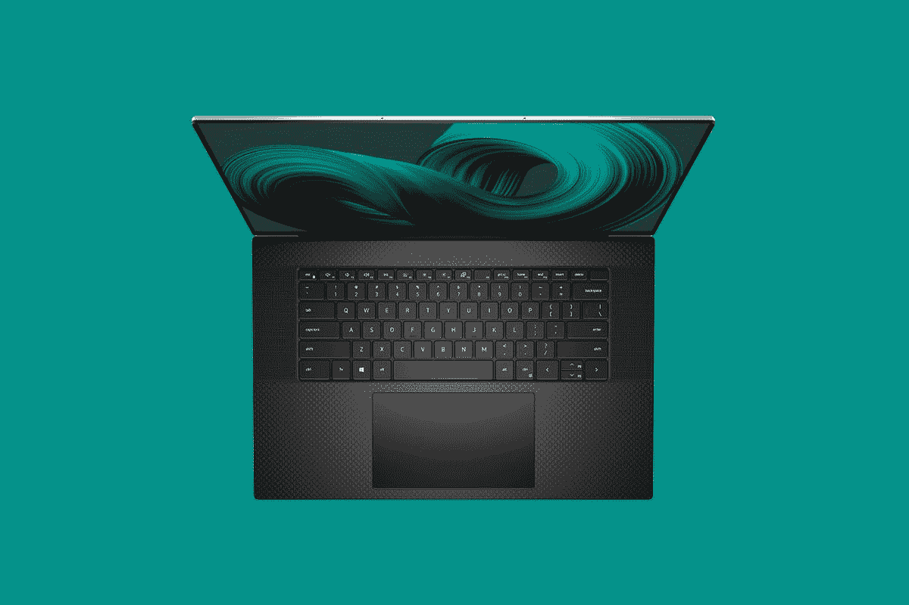

# 戴尔 XPS 17 评测:真正的 MacBook Pro 竞争对手

> 原文：<https://www.xda-developers.com/dell-xps-17-9710-review/>

我对不需要特殊设备的 17 英寸笔记本电脑有一种特殊的感觉。让我们面对它；一切都是为 [15 英寸笔记本电脑](https://www.xda-developers.com/best-15-inch-laptops/)打造的。我无法告诉你我已经审查了多少 17 英寸的设备，我甚至不能把它们放进我的包里。但这正是戴尔 XPS 17 的用武之地。凭借 InfinityEdge 屏幕，它是一台 15 英寸机箱中的 17 英寸笔记本电脑，因此它可以放在您需要的地方。

。bestawarddiv {

浮动:对；

宽度:20%；

边距:0.75em

边距-顶部:0；

}

去年的戴尔 XPS 17 9700 是十年来第一款此类产品。XPS 17 9710 主要采用英特尔 Tiger Lake-H 处理器和 NVIDIA GeForce RTX 30 系列显卡。虽然更大的屏幕带来了更身临其境的体验，但更大的机箱也提供了比我们在 XPS 15 上看到的更多的功能(我也有一个这样的屏幕，这个屏幕的性感故事将在另一天讲述；我要说的就是保持关注)。

但这篇评论的简短版本将再次表明，戴尔凭借 XPS 17 9710 击败了它。

### 戴尔 XPS 17 9710 规格

| 

中央处理器

 | 第 11 代英特尔酷睿 i7-11800H (24MB 高速缓存，最高 4.6 GHz，8 核) |
| 

国家政治保卫局。参见 OGPU

 | NVIDIA GeForce RTX 3060 6GB gddr 6[70W] |
| 

身体

 | 14.74 x 9.76 x 0.77 英寸(374.45 x 248.05 x 19.05 毫米)，5.34 磅(2.42 千克) |
| 

显示

 | 17.0 英寸 UHD+ (3840 x 2400) InfinityEdge 触控防反射 500 尼特显示屏 |
| 

记忆

 | 32GB DDR4 3200MHz，2 个 16GB |
| 

储存；储备

 | 1TB M.2 PCIe NVMe 固态硬盘 |
| 

电池

 | 6 芯电池，97 瓦时(集成)，130 瓦 USB 型充电 |
| 

港口

 | (4) Thunderbolt 4(1)通用音频插孔(1) SD 卡插槽(1)楔形锁插槽 |
| 

网络摄像头

 | 面向用户的摄像头 720p 30 fps 高清 RGBIr 摄像头数字阵列麦克风 |
| 

投入

 | 英文键盘，黑色，背光，指纹识别器 |
| 

材料

 | 铝金属 |
| 

颜色

 | 铂金银外观，黑色内饰 |
| 

操作系统（Operating System）

 | Windows 10 主页 |
| 

价格

 | $2,999.99 |

请注意，基本型号的售价为 1599.99 美元，配有酷睿 i5、8GB 内存、512GB 固态硬盘和 FHD+显示屏。

## 设计:戴尔 XPS 的经典外观

如今，戴尔的一些 XPS 笔记本电脑有了更多的颜色，例如带有编织玻璃纤维键盘的霜白色。然而，戴尔 XPS 17 并非如此。这款产品仍然有该公司称之为铂金银的颜色，并且有黑色碳纤维掌托。这是我们多年来看到的经典戴尔 XPS 设计，我认为它比 XPS 13 和 XPS 15 上的其他选项卖得更好；否则，这将是默认设置。

请注意，当我说经典外观时，我指的是编织而光滑的键盘面板和印有金属戴尔徽标的灰银色盖子。戴尔 XPS 系列实际上在几年前就已经过重新设计，从 XPS 13 开始，XPS 15 的设计与 XPS 17 同时推出。

这种新设计在边缘有更多的金属口音，当然，有更少的端口。事实上，[戴尔的旗舰笔记本电脑](https://www.xda-developers.com/best-dell-laptops/)是唯一没有 USB Type-A 的 [Windows 笔记本电脑](https://www.xda-developers.com/best-laptops/)的完整系列。你能找到的唯一其他地方是在苹果的 MAC 电脑上。事实上，Dell XPS 17 配备了四个 Thunderbolt 4 端口，每侧两个。

这是一件大事，它解决了我对去年 XPS 17 的最大抱怨。戴尔没有使用*全*雷电 3 端口，而是使用基本规格。从技术上来说，雷电 3 有能力做和雷电 4 一样的事情，但基本规格是它的一半。你也没有办法真正知道你得到了什么，这就是为什么它总是我在复习单元上测试的第一件事。

因此，不是在一个屏幕上支持两个 4K 显示器，而是只支持一个，第二个屏幕的分辨率更低。借助 Dell XPS 17 9710，该端口将支持您的 Thunderbolt 坞站的全部功能。

在右侧，还有一个 SD 卡插槽和一个 3.5 毫米音频插孔。SD 卡插槽是全尺寸的，在现代笔记本电脑中很少见，所以这是一个很好的触摸。戴尔在 XPS 15 上也有一个。

总而言之，戴尔 XPS 17 的设计完全符合您的预期，并且与去年的型号完全相同。

## 显示器:Dell XPS 17 配备 16:10 UHD 屏幕

戴尔 XPS 17 上的屏幕是 17 英寸；我知道这听起来显而易见，但实际上 17 英寸的笔记本电脑配备 17.3 英寸的屏幕更常见。但这是一个新的领域。在过去的一两年里，我们已经看到笔记本电脑上 16:10 屏幕的复兴。戴尔重新设计了 XPS 13，加入了新的宽高比，这也包含在重新设计的 XPS 15 和全新的 XPS 17 中。

由于 17 英寸笔记本电脑有些罕见，尤其是在高端市场，这种显示器有些独特。它有 FHD+和 UHD+两种版本，没有像 XPS 13 和 XPS 15 那样的有机发光二极管版本。事实上，市场上没有 17 英寸的有机发光二极管笔记本电脑；这些面板根本不存在。

不过没关系。关于戴尔的有机发光二极管笔记本电脑，我一直注意到的一点是，几乎很难说出它和非有机发光二极管型号之间的区别，因为非有机发光二极管的屏幕太好了。戴尔发给我的 XPS 17 的 UHD+版本，在我的测试中，sRGB、Adobe RGB、NTSC 和 P3 的一切都是 100%或接近 100%。

甚至我测试的许多有机发光二极管显示器也没有得到那么好的结果。我想说这是我见过的最好的成绩，但不可能做得更好了。最好指出，我通常不会看到这么好的分数，即使是在旗舰笔记本电脑上。

[sc name = " pull-quote-left " quote = "戴尔与苹果的 MacBook Pro 竞争的方式很少有原始设备制造商能做到。"]当然，戴尔四面都有窄边框。这就是为什么你可以将如此巨大的屏幕放入一个仍然可以放入包中的机箱中。当然，它提供了身临其境的体验。网络摄像头安装在顶部挡板中。可悲的是，它仍然是 720p，尽管有一个 Windows Hello 的红外摄像头。

疫情和在家工作的人的现状实际上让戴尔处境有些艰难。你可能还记得，几年前，网络摄像头曾经位于显示屏下方。每年，我们都会得到关于新的戴尔 XPS 笔记本电脑的简报，我会问网络摄像头是否被移动过。他们会回答“你多久用一次网络摄像头？”当然，当时的答案是永远不会。

这就是事实。两年前，人们根本不关心网络摄像头。这就是为什么你可以买一台 3000 美元的笔记本电脑和 720p 的网络摄像头，也可以买一部 300 美元的手机和 1080p 60fps 的前置摄像头。对于个人电脑市场来说，这根本不是一个优先考虑的问题，考虑到规划产品需要多长时间，这一点在今天出货的设备中得到了体现。这让戴尔在 XPS 上处于一个艰难的位置，因为现在挡板太小了，你不能在里面放任何好的东西。

如果网络摄像头非常重要，你应该看看戴尔的 Latitude 系列，这些产品今年都有 FHD 网络摄像头。你看，虽然网络摄像头在历史上对消费电脑并不重要，但商业客户一直使用它们。

## 键盘:戴尔 XPS 17 有一个巨大的触摸板

戴尔在与[苹果的 MacBook Pro](https://www.xda-developers.com/macbook-pro-2021/) 的竞争中做得非常出色，很少有原始设备制造商能做到这一点。这不仅仅是因为它有四个 Thunderbolt 端口。它有一个很棒的键盘，还有一个巨大的触摸板。

正如你所料，键盘本身是背光的，这是一个很好的键盘。它很舒服，很精确，空间也很大。它的两侧还配备了双 Waves MaxxAudio Pro 扬声器，XPS 17 包括两个 2W 低音扬声器和两个 2.5 瓦高音扬声器，声音强劲清晰。

不过，我确实喜欢那个巨大的触摸板。我觉得没有足够多的原始设备制造商真正利用键盘甲板上的不动产，戴尔在其 XPS 15 和 XPS 17 上做到了这一点。它只是给你足够的活动空间，是一种更愉快的输入体验。

## 性能:第 11 代英特尔和英伟达 RTX 3060

当你开始进入更大的笔记本电脑时，你真的必须考虑你想要什么，因为它们开始分成不同的类别。如果你正在寻找一款注重工作效率、屏幕更大的超极本，你可能会对 2.98 磅的 LG gram 17 感兴趣。但是考虑到 17 英寸笔记本电脑的机箱更大，这就为更强大的内部部件留出了空间，这就是戴尔 XPS 17 的用武之地。它拥有英特尔第 11 代 45W 处理器和 NVIDIA 最新的 GeForce RTX 3060 显卡。

虽然 gram 等产品侧重于便携性，但戴尔 XPS 17 更注重功耗。如果照片和视频编辑是你的困扰，这是完美的笔记本电脑。CPU 可以高达一个未锁定的核心 i9，RTX 3060 显卡配有 NVIDIA 的工作室驱动程序，专为创意工作而设计。如果你愿意，你也可以切换到游戏就绪驱动，是的，这里有足够的能力玩游戏。

还需要注意的是，新的 CPU 和 GPU 是与去年 XPS 17 的主要区别。去年，它配备了第十代 CPU 和 RTX 2060，成为第一款提供 RTX 显卡的戴尔 XPS。这是当时令人印象深刻的机器，现在甚至更好。

[sc name = " pull-quote-right " quote = "如果照片和视频编辑是您的难题，那么 Dell XPS 17 就是完美的笔记本电脑。"]根据我的经验，电池寿命约为 6 小时，这是在平衡设置和屏幕亮度居中的情况下。这是在工作的时候；我不会通过连续播放数小时的视频来进行电池测试，因为这不是人们实际使用电脑的方式。我像平时一样使用它，并记录电池耗尽的时间。

对于这样一台机器来说，六个小时是相当不错的，这意味着一台笔记本电脑背后有很大的动力，还有漂亮明亮的 4K 显示屏。97WHr 电池有多大有多大，续航有多好。你可以通过让屏幕变暗或调节电源滑块来进一步延长它，但我会将屏幕亮度保持在我可以舒适工作的最低水平。

|  | 

戴尔 XPS 17 9710 酷睿 i7-11800h RTX 3060

 | 

联想 ThinkPad X1 ExtremeCore i7-11800H，RTX 3060

 | 

戴尔 XPS 17 9700 酷睿 i7-10875H，RTX 2060

 | 

[联想军团 Slim 7](https://www.xda-developers.com/lenovo-legion-slim-7-review/) 锐龙 7 5800H，RTX 3070

 |
| --- | --- | --- | --- | --- |
| 

PCMark 8:主页

 | 4,037 | 4,241 | 3,544 | 5,322 |
| 

PCMark 8:创意

 | 6,100 | 6,110 | 5,095 | 6,223 |
| 

PCMark 8:工作

 | 3,564 | 3,919 | 3,221 | 4,504 |
| 

PCMark 10

 | 6,379 | 6,403 | 5,305 | 6,428 |
| 

3DMark:时间间谍

 | 7,158 | 6,781 | 5,582 | 8,316 |
| 

极客工作台

 | 1,561 / 8,775 | 1,520 / 7,371 | 1,303 / 8,265 | 1,446 / 7,335 |
| 

电影院长凳

 | 1,515 / 11,652 | 1,516 / 11,232 |  | 1,415 / 11,833 |
| 

橙色房间

 | 9,194 | 8,563 | 5,582 | 9,012 |
| 

VRMark:青色房间

 | 2,752 | 2,754 | 7,343 | 6,114 |
| 

蓝色房间

 | 2,152 | 2,325 | 2,749 | 1,928 |

正如您所看到的，新的 XPS 17 9710 比去年的戴尔 XPS 17 9700 功能更强大。

## 结论:你应该购买戴尔 XPS 17 9710 吗？

如果您正在寻找功能和便携性的完美结合，戴尔 XPS 17 就是您的不二之选。这款笔记本电脑配有 45W CPUs 和 RTX 30 系列显卡，重量仅 5 磅多一点，非常合适。

但这还不是这个产品的全部。它不仅有一个 UHD+ 17 英寸 16:10 的显示屏，而且在我做的每次校准测试中，它都达到了 100%或接近 100%，这在整个市场上是罕见的。除此之外，Waves MaxxAudio Pro 扬声器的音频质量也非常出色，这是一种全方位的沉浸式愉快体验。戴尔 XPS 17 是一款使用起来感觉很好的笔记本电脑。

当然，最大的缺点是网络摄像头。它不仅是 720p，而且考虑到专为适应狭窄边框而设计的微小传感器，它也不是很好。我几乎为指出这一点感到难过，因为在我们知道网络摄像头突然在消费者笔记本电脑中变得越来越重要的这段时间里，该公司不可能做些别的事情。

我们可能也认为它的价格很低，但我确实认为 Dell XPS 17 9710 物有所值。如果你出去花 2999 美元购买戴尔发给我的确切配置，你可能知道你需要它做什么，你不会后悔。

 <picture></picture> 

Dell XPS 17 9710

##### 戴尔 XPS 17 9710

戴尔 XPS 17 是戴尔 XPS 系列中最强大的，具有 17 英寸 16:10 显示屏、强大的音频等等。