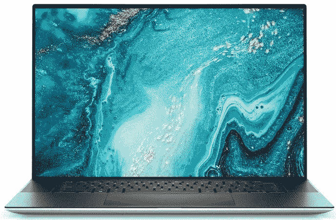

# 戴尔 XPS 17 有哪些颜色选项？

> 原文：<https://www.xda-developers.com/dell-xps-17-colors/>

# 戴尔 XPS 17 有哪些颜色？

XPS 17 是您今天应该购买的最好和推荐的 17 英寸笔记本电脑之一。但是它有什么颜色可供选择呢？

戴尔 XPS 笔记本电脑系列有三种尺寸，XPS 17 是其中最大的一款。它基于相同的设计 DNA 构建，采用最新的第 11 代英特尔 Tiger Lake-H 处理器，包括酷睿 i5-11400H 基本型号，英特尔 UHD 显卡升级到酷睿 i9-11980HK，配有 NVIDIA GeForce RTX 3060 (6GB)显卡。最昂贵的型号为您提供了更强大的 GPU，尽管它不是当今笔记本电脑上最强大的 GPU，但它应该非常适合 1080p 甚至 1440p 分辨率的 4K 视频渲染和游戏。

XPS 17 还提供了总共四个 Thunderbolt 4 端口，这意味着您可以连接一个 [Thunderbolt 坞站](https://www.xda-developers.com/best-thunderbolt-docks/)来扩展您的端口选项。除此之外，还有一个标准的 3.5 毫米耳机/麦克风组合插孔和一个 SD 读卡器。如果你关心内置扬声器，这款笔记本电脑配有四个扬声器系统，总功率为 5W。

## 戴尔 XPS 17 9710:规格

|  | 

戴尔 XPS 17

 |
| --- | --- |
| **CPU** | 

*   英特尔酷睿 i5-11400H (12MB 高速缓存，最高 4.5 GHz，6 核)
*   英特尔酷睿 i7-11800H (24MB 高速缓存，最高 4.6 GHz，8 核)
*   英特尔酷睿 i9-11900H (24MB 高速缓存，最高 4.9 GHz，8 个内核)
*   英特尔酷睿 i9-11980HK (24MB 高速缓存，最高 5.0 GHz，8 个内核)

 |
| **图形** | 

*   英特尔 UHD 显卡
*   NVIDIA GeForce RTX 3050 4GB gddr 6[60W]
*   NVIDIA GeForce RTX 3060 6GB gddr 6[70W]

 |
| **正文** | 

*   374.45×248.05×19.05 毫米(14.74×9.76×0.77 英寸)
*   起始重量:2.21 千克(4.87 磅)

 |
| **显示** | 

*   17 英寸 FHD+ (1920 x 1200) InfinityEdge 非触摸防眩光 500 尼特
*   17 英寸 UHD+ (3840 x 2400) InfinityEdge 触控防反光 500 尼特显示屏

 |
| **端口** | 

*   4x 雷电 4
*   1 个通用音频插孔

 |
| **存储** | 

*   高达 4TB M.2 PCIe NVMe 固态硬盘
*   SD 读卡器

 |
| **闸板** |  |
| **电池** |  |
| **音频** | 

*   立体声低音扬声器 2W x 2 和立体声高音扬声器 2.5W x 2 = 5W 总峰值
*   Waves Nx 3D 音频

 |
| **摄像机** | 

*   720 像素，30fps 网络摄像头
*   用于 Windows Hello 的红外线

 |
| **连通性** | 

*   黑仔 Wi-Fi 6 AX1650 (2 x 2)
*   蓝牙 5.1

 |
| **颜色** | 

*   铂金银配黑色碳纤维掌托

 |
| **价格** |  |

戴尔 XPS 17 目前只有一种颜色可供选择，该公司称之为铂金银。顾名思义，它的外部是银色的，内部是黑色的。键盘面板也是黑色的，带有碳纤维表面，这是 XPS 系列的主要产品。

 <picture></picture> 

Dell XPS 17 9710 (2021)

值得注意的是，戴尔在较小的 XPS 13 上提供了第二种白色选项，现在在 XPS 15 上提供了第二种白色选项，包括全白色的外部和内部。希望 2022 年 XPS 17 的下一次刷新也将包括二次配色。

 <picture></picture> 

Dell XPS 17 9710

##### 戴尔 XPS 17 9710

Dell XPS 17 9710 是一款顶级 17 英寸笔记本电脑，采用最新的第 11 代英特尔 Tiger Lake-H 处理器，最高可配英伟达 RTX 3060 移动 GPU。它提供单一的银色选项。

对 XPS 不感兴趣？查看戴尔的[最佳笔记本电脑选项或我们的 2021 年](https://www.xda-developers.com/best-dell-laptops/)T2 最佳笔记本电脑列表。