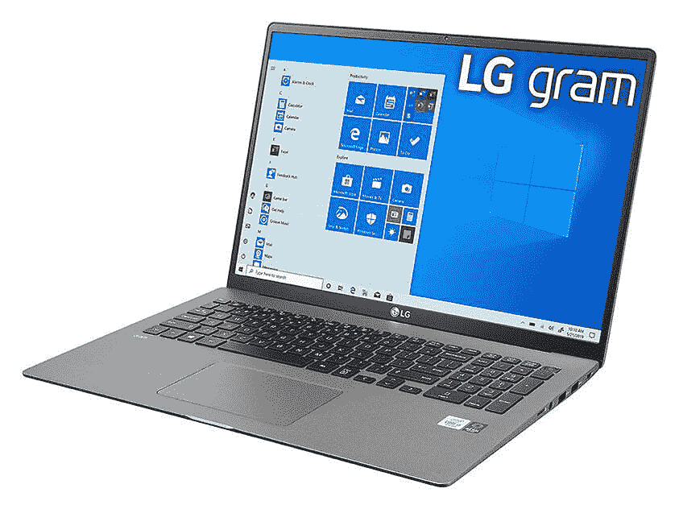
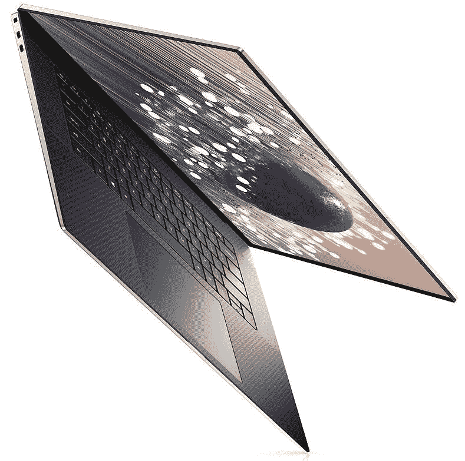
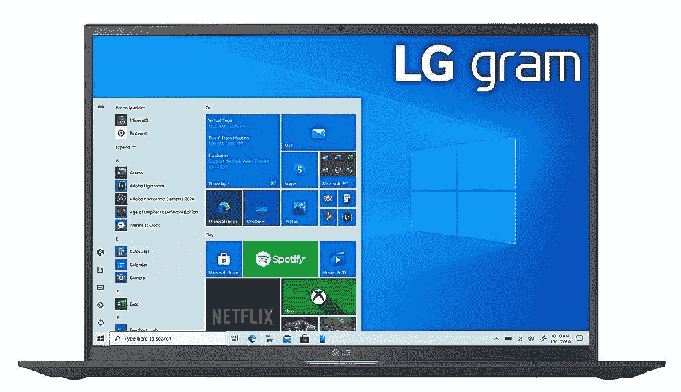
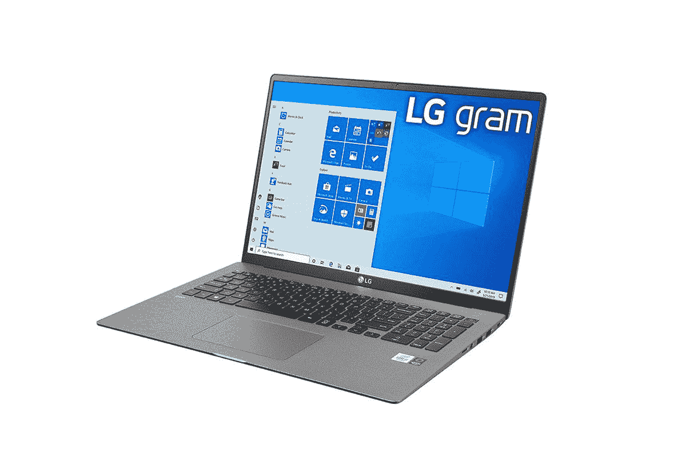

# 戴尔 XPS 17 vs LG gram 17:最好的 17 寸笔记本电脑是什么？

> 原文：<https://www.xda-developers.com/dell-xps-17-vs-lg-gram-17/>

如果你想买一台 17 英寸的笔记本电脑，有两种选择你可能会遇到。戴尔 XPS 17 和 LG gram 17 都是这个尺寸的出色笔记本电脑，但它们也是完全不同的机器。戴尔 XPS 17 是一款非常强大的笔记本电脑，也是[戴尔最好的](https://www.xda-developers.com/best-dell-laptops/)之一。LG gram 17 是你能买到的[最好的轻量级笔记本电脑](https://www.xda-developers.com/best-lightweight-laptops/)之一，但这种低重量是有代价的。

在本指南中，我们将介绍这些差异，以便您做出更明智的决定。但总的来说，这两者之间的决定应该相当简单。这完全取决于您的用例。

## 规范

让我们先来看看每台笔记本电脑的规格。您会马上注意到一些主要的不同，不仅是在功能方面，还有可用的选项。LG gram 17 更加精简，没有太多不同的配置可供选择。

|  | 

戴尔 XPS 17

 | 

LG gram 17

 |
| --- | --- | --- |
| **处理器** | 

*   英特尔酷睿 i5-11400H(最高 4.5GHz，6 核)
*   英特尔酷睿 i7-11800H(最高 4.8GHz，8 核)
*   英特尔酷睿 i9-11900H(最高 4.9GHz，8 核)
*   英特尔酷睿 i9-11980HK(最高 5GHz，8 核)

 | 

*   英特尔酷睿 i7-1165G7(最高 4.7GHz，四核)

 |
| **图形** | 

*   英特尔 UHD 显卡
*   NVIDIA GeForce RTX 3050 4GB gddr 6(60W)
*   NVIDIA GeForce RTX 3060 6GB gddr 6(70W)

 |  |
| **闸板** |  |  |
| **存储** |  |  |
| **显示** | 

*   17 英寸，全高清+ (1920 x 1200)，InfinityEdge，防眩光，非触摸，500 尼特
*   17 英寸，超高清+ (3840 x 2400)，InfinityEdge，防眩光，触摸屏，100% Adobe RGB，94% DCI-P3，500 尼特

 | 

*   17 英寸 WQXGA (2560 x 1600) IPS，非触摸，99% DCI-P3

 |
| **音频** | 

*   四声道立体声扬声器(两个 2W 低音扬声器，两个 2.5 瓦高音扬声器)

 | 

*   双立体声扬声器(1.5W x 2)

 |
| **网络摄像头** | 

*   2.25 毫米 720p 高清 30fps 红外摄像头

 |  |
| **生物认证** | 

*   Windows Hello 红外摄像头+指纹识别器

 | 

*   Windows Hello 指纹识别器

 |
| **电池** |  |  |
| **端口** | 

*   4 个 Thunderbolt 4(USB C 类)端口
*   SD 读卡器
*   3.5 毫米耳机插孔
*   包括 USB Type-C 至 Type-A、USB Type-C 至 HDMI 2.0 适配器

 | 

*   2 个 Thunderbolt 4(USB C 类)端口
*   2 个 USB 3.2 第 1 代 A 类端口
*   HDMI 2.0
*   microSD 读卡器
*   3.5 毫米耳机插孔

 |
| **连通性** | 

*   黑仔 Wi-Fi 6 AX1650 (2x2)，蓝牙 5.1

 | 

*   英特尔 Wi-Fi 6 AX201 +蓝牙 5.1

 |
| **颜色** | 

*   铂金银外观+黑色内饰

 |  |
| **尺寸(WxDxH)** | 14.74 x 9.76 x 0.77 英寸(374.45 x 248.05 x 19.05 毫米) | 14.97 x 10.24 x 0.7 英寸(380.24 x 260.1 x 17.78 毫米) |
| **重量** | 4.87 磅(2.21 千克)(非触控)，5.34 磅(2.42 千克)(触控) | 2.98 磅(1.35 千克) |
| **起始价格** | $1,599.99 | $1,799 |

## 设计:LG gram 17 是疯狂的光

正如我们在开始时所说的，虽然这两款都是 17 英寸的笔记本电脑，但它们在几乎所有其他方面都完全不同。LG gram 品牌几乎完全建立在它有多轻的基础上，在这里也是如此。重量为 2.98 磅，这无疑是你能买到的最轻的 17 英寸笔记本电脑之一。如果你是一名学生，想买一台笔记本电脑来做学校作业，那么这款笔记本电脑将为你带来大屏幕的好处，你可以真正地随身携带到任何地方。

 <picture></picture> 

LG gram 17

相比之下，戴尔 XPS 17 是一台笨重的机器，无触摸屏版本的起始重量为 4.87 磅。如果你加上触摸，那就上升到 5.34 磅；肯定不是无足轻重。有趣的是，戴尔 XPS 17 更加紧凑，这要归功于戴尔尽可能减少挡板的努力。众所周知，这是以网络摄像头的质量为代价的，如果你担心便携性，重量差异在这里要重要得多。

关于端口的话题，这两款笔记本电脑都支持 Thunderbolt 4，但 LG gram 17 多了几个老派的端口，以适应各种用户。你有两个 Thunderbolt 4 端口，两个 USB 3.2 Type-A 端口和 HDMI 2.0。相比之下，戴尔 XPS 17 有四个 Thunderbolt 4 端口，包括 C 型到 A 型适配器和 C 型到 HDMI 适配器。这两款笔记本电脑都有一个 3.5 毫米的耳机插孔，LG gram 17 有一个 microSD 读卡器，而戴尔 XPS 17 有一个全尺寸 SD 读卡器。LG gram 提供了一系列更广泛的连接，对于大多数人来说开箱即用。XPS 17 在插入外围设备时不太方便。

LG gram 提供了一系列更广泛的连接，对于大多数人来说开箱即用。

Dell XPS 17 的优势在于为 Windows Hello 配备了红外摄像头，这使得解锁您的计算机变得轻而易举。两款笔记本电脑都有指纹识别器，LG gram 17 的电源按钮中有指纹识别器。这也很好，因为计算机可以读取你的指纹，并在登录屏幕时自动解锁。尽管如此，面部识别还是稍微好一点。

就整体设计而言，这两款都是传统的翻盖式笔记本电脑，虽然它们都没有做任何疯狂的事情，但戴尔 XPS 17 可能看起来更独特一些。它使用碳纤维作为键盘底座，这使它具有银色外观的双色调外观。LG gram 有黑色或银色两种颜色，这是相当标准的颜色，没有任何特殊的风格。

## 性能:戴尔 XPS 17 性能强劲

与之前的类别相反，与 LG gram 17 相比，戴尔 XPS 17 在性能方面绝对是一个庞然大物。这不是一个没有理由的沉重的笔记本电脑，它从包装 45W 处理器开始，而不是 gram 17 内部的 15W 芯片。更多的功率消耗意味着需要更多的冷却，因此自然地，笔记本电脑内部需要更多的组件。自然，这意味着更高的性能。

不可否认，戴尔 XPS 17 比 gram 17 强大得多。

比较这些处理器的平均 GeekBench 分数，您可以看到即使是戴尔 XPS 17 中的 Core i5 型号也比 LG gram 中的处理器快得多。这在多核结果中尤为明显。

|  | 

英特尔酷睿 i7-1165G7

 | 

英特尔酷睿 i5-11400H

 | 

英特尔酷睿 i7-11800H

 |
| --- | --- | --- | --- |
| 平均 GeekBench 分数(单核/多核) | 1396/4567 | 1403/6028 | 1502/8152 |

这还只是故事的一半，因为您还可以在 Dell XPS 17 上为 70W RTX 3060 添加 NVIDIA GeForce 显卡。这与 LG gram 上集成的英特尔 Iris Xe 显卡相去甚远，尽管公平地说，升级到这些更强大的型号也使戴尔 XPS 17 更加昂贵。同样，您可以为 Dell XPS 17 配置高达 64GB 的内存和 4TB 的固态硬盘存储，这很容易使其成为这两款笔记本电脑中最强大的一款。LG gram 17 配备了 16GB 的内存和 1TB 或 2TB 的存储空间，仅此而已。

 <picture></picture> 

Dell XPS 17

不可否认，戴尔 XPS 17 比 gram 17 强大得多。然而，需要指出的是，XPS 17 的性能对许多人来说也是大材小用。是的，这是一台强大的个人电脑，但它是为创意专业人士和其他高端任务而设计的。如果你选择 RTX 显卡，你也可以把它当作游戏机使用，它可以做得很好。但是，如果你使用笔记本电脑完成学校工作、浏览网页和其他日常任务，LG gram 17 仍然是一款非常高端、速度非常快的 PC。

## 显示器和声音:您可以在 Dell XPS 17 上获得更好的体验

继续讨论这些笔记本电脑的显示体验，这是一个有趣的情况。戴尔 XPS 17 配备了 4K 超高清+ (3840 x 2400)显示屏选项，显然清晰度令人难以置信。然而，升级是昂贵的，在基础价格上增加了 400 美元。基本型号配有全高清+显示屏(1920 x 1200)。与此同时，LG gram 17 位于中间的某个位置，四高清+ (2560 x 1600)面板是唯一的选择。就这种尺寸的显示器的分辨率而言，这可以说是最佳选择。4K 显然更锋利，但你必须权衡价格上涨和对电池寿命的影响。

 <picture></picture> 

LG gram 17

然而，还有更多。Dell XPS 17 的 4K 显示屏覆盖 100%的 Adobe RGB 和 94%的 DCI-P3，这使其成为创意专业人士的理想选择。LG gram 17 只是吹嘘 99%的 DCI-P3 覆盖率，但在 Adobe RGB 色彩空间中可能并不理想。作为戴尔 XPS 17 的额外奖励，4K 型号配备了触摸屏，这通常是使用 PC 的更直观的方式。LG gram 上没有触摸选项。

戴尔 XPS 17 的显示体验也可能会好得多。它采用四扬声器系统，配有两个低音扬声器和两个高音扬声器，用于立体声。最重要的是，这些扬声器就在键盘旁边，面朝上，所以你可以直接听到声音。在 LG gram 上，你可以在笔记本电脑的底部找到一对立体声扬声器，只是声音不够大，也没有身临其境的感觉。

## 底线:动力还是便携性？

最终，根据您的需求，在这两款笔记本电脑之间做出选择应该是相当容易的。你想要一个可以在学校或工作中使用的东西，包括写作、阅读，甚至一些图像和(轻度)视频编辑？LG gram 17 仍然是一款非常强大的笔记本电脑，非常轻便。它的便携性明显更好，而且不会因为重量轻而牺牲电池寿命。对于更主流的用户来说，这是显而易见的选择。

无论您选择哪一款，您都将获得一台可以使用多年的出色电脑，因此无论哪一款都不会出错。

另一方面，如果您想要在一个非常紧凑的产品包中获得绝对最大的功能，尽管有点重，那么戴尔 XPS 17 就是您的选择。根据您的配置，这台笔记本电脑上几乎没有您想做却做不到的事情。在 XPS 17 上，专业视频和图像编辑、3D 创作和游戏都应该轻而易举。这不是你想去哪里都带着的东西，但是如果你需要一辆可以在路上骑的老爷车，那么这就是了。

与其他一些决定不同，这些笔记本电脑之间的妥协非常明显。您可以选择 LG gram 17 作为随身携带的便携式工作或学校计算机，或者选择 Dell XPS 17 作为仍然(相对)便携的工作站。无论您选择哪一款，您都将获得一台可以使用多年的出色电脑，因此无论哪一款都不会出错。如果你已经做出决定，你可以使用下面的链接购买新的笔记本电脑。

 <picture></picture> 

Dell XPS 17

##### 戴尔 XPS 17

Dell XPS 17 是一款功能强大的笔记本电脑，采用高端规格，如第 11 代 45W 英特尔处理器、64GB 内存和 4TB 存储。此外，您可以通过 Nvidia 高达 70W 的 GeForce RTX 3060 获得它。您还可以通过高达 4K 触摸屏显示器获得它。

 <picture></picture> 

LG gram 17

##### LG Gram 17

LG gram 17 是一款令人印象深刻的 17 英寸笔记本电脑，在非常轻便的设计中提供了顶级的规格。它的重量不到 3 磅，超级便携，但仍然能够处理各种日常任务。