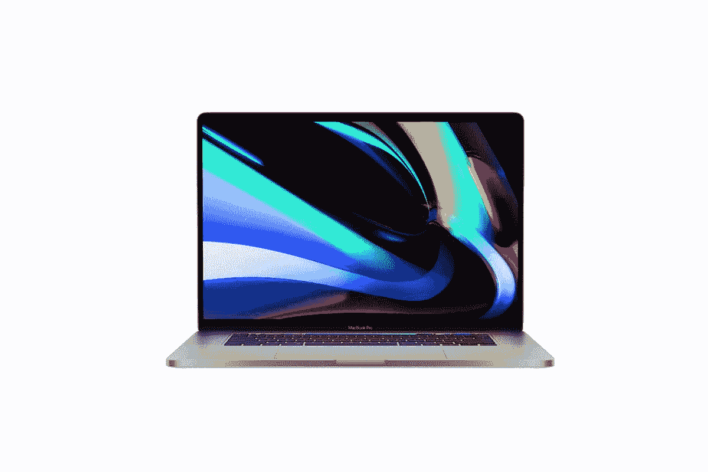

# 戴尔 XPS 17 vs MacBook Pro 16 寸(英特尔):你该拿哪个？

> 原文：<https://www.xda-developers.com/dell-xps-17-vs-macbook-pro-16/>

购买一台新的笔记本电脑总是令人兴奋的，但也可能有点困难。市面上有一些非常棒的笔记本电脑，选择最适合你的并不总是那么简单。当你看到你能买到的最好的笔记本电脑时，你最常看到的两个品牌是[戴尔](https://www.xda-developers.com/best-dell-laptops/)和 [MacBook](https://www.xda-developers.com/best-macs/) 系列。如果你对更大的笔记本电脑特别感兴趣，戴尔 XPS 17 和 MacBook Pro 16 英寸是两个最大的竞争者。

那么这两者之间怎么选择呢？我们是来帮你的。我们将戴尔 XPS 17 与 MacBook Pro 16 英寸进行对比，以便您可以更轻松地决定最适合您的产品。

## 规范

让我们从每台笔记本电脑的技术规格开始。戴尔 XPS 17 和 MacBook Pro 16 英寸都是高性能机器，但有一些很大的区别。

|  | 

戴尔 XPS 17

 | 

MacBook Pro 16 英寸

 |
| --- | --- | --- |
| **操作系统** |  |  |
| **处理器** | 

*   英特尔酷睿 i5-11400H(最高 4.5GHz，6 核)
*   英特尔酷睿 i7-11800H(最高 4.8GHz，8 核)
*   英特尔酷睿 i9-11900H(最高 4.9GHz，8 核)
*   英特尔酷睿 i9-11980HK(最高 5GHz，8 核)

 | 

*   英特尔酷睿 i7-9750H(最高 4.5GHz，6 核)
*   英特尔酷睿 i9-9880H(最高 4.8GHz，8 核)
*   英特尔酷睿 i9-9980HK(最高 5GHz，8 核)

 |
| **图形** | 

*   英特尔 UHD 显卡
*   NVIDIA GeForce RTX 3050 4GB gddr 6(60W)
*   NVIDIA GeForce RTX 3060 6GB gddr 6(70W)

 | 

*   英特尔 UHD 显卡 630
*   AMD 镭龙 Pro 5300M (4GB GDDR6)
*   AMD 镭龙 Pro 5500M (4GB GDDR6)
*   AMD 镭龙 Pro 5500M (8GB GDDR6)
*   AMD 镭龙 Pro 5600M (8GB HBM2)

 |
| **闸板** |  |  |
| **存储** |  |  |
| **显示** | 

*   17 英寸，全高清+ (1920 x 1200)，InfinityEdge，防眩光，500 尼特
*   17 英寸，超高清+ (3840 x 2400)，InfinityEdge，防眩光，触摸屏，100% Adobe RGB，94% DCIP3 500 尼特

 | 

*   16 英寸，视网膜(3072 x 1920) IPS，真彩色，宽彩色(P3)，500 尼特

 |
| **音频** | 

*   四声道立体声扬声器(两个 2W 低音扬声器，两个 2.5 瓦高音扬声器)

 | 

*   六个扬声器，宽立体声，杜比全景声

 |
| **网络摄像头** | 

*   2.25 毫米 720p 高清 30fps 红外摄像头

 |  |
| **生物认证** | 

*   Windows Hello 红外摄像头+指纹识别器

 |  |
| **电池** |  |  |
| **端口** | 

*   4 个 Thunderbolt 4(USB C 类)端口
*   SD 读卡器
*   3.5 毫米耳机插孔
*   包括 USB Type-C 至 Type-A、USB Type-C 至 HDMI 2.0 适配器

 | 

*   4 个雷电 3(USB C 类)端口(40Gbps)
*   3.5 毫米耳机插孔

 |
| **连通性** | 

*   黑仔 Wi-Fi 6 AX1650 (2x2)，蓝牙 5.1

 |  |
| **颜色** | 

*   铂金银外观+黑色内饰

 |  |
| **尺寸(WxDxH)** | 14.74 x 9.76 x 0.77 英寸(374.45 x 248.05 x 19.05 毫米) | 14.09 x 9.68 x 0.64 英寸(357.9 x 245.9 x 16.2 毫米) |
| **重量** | 4.87 磅(2.21 千克)(非触控)，5.34 磅(2.42 千克)(触控) | 4.3 磅(2 千克) |
| **起始价格** | $1599.99 | $2399 |

## 戴尔 XPS 17 与 MacBook Pro 16 英寸:Windows 还是 macOS

尽管规格各不相同，但对许多人来说，最大的决定因素可能是操作系统。这两台机器明显不同，原因很简单，一台运行 Windows，另一台运行 macOS。不过，这是个人喜好的问题，没有谁比谁更好。

macOS 通常被认为更容易被更多用户使用。它在某些方面更简单，所以对于想要简单体验的用户来说，它可能更可取。虽然 macOS 的应用程序通常比 Windows 少得多，但面向创意专业人士的工具通常更青睐苹果的平台。

人们可以举出的最大的例子是 Final Cut Pro，许多视频创作者更喜欢用它进行视频编辑。这个工具是 macOS 的专属(毕竟是苹果开发的)，所以用 macOS 代替是一个潜在的原因。如果你想要一个高质量的免费视频编辑器，macOS 有 iMovie，而 Windows 10 不再包括一个合适的视频编辑工具。

另一方面，正如我们提到的，Windows 10 通常有更多的应用程序。Windows 是最受欢迎的电脑操作系统，所以几乎所有的应用都有 Windows 版本。许多 Windows 应用程序也无法在 macOS 上运行，最典型的例子就是游戏。大多数视频游戏仍然是首先为 Windows 开发的，如果其他操作系统得到支持的话，它们会随后出现。

如果你对游戏感兴趣，Windows 绝对是首选平台。Windows 通常在如何使用电脑方面给用户更多的自由，一些深入的设置更容易访问。

正如我们在开始时所说的，这取决于个人偏好。有些人会更喜欢 macOS 而不是 Windows，有些人会走另一条路。

## 戴尔 XPS 17 与 MacBook Pro 16 英寸:性能

只要浏览一下上面的规格表，你肯定会注意到 MacBook Pro 16 英寸和戴尔 XPS 17 之间的一些差异。自 2019 年以来，苹果一直没有更新 MacBook Pro 16 英寸的硬件，因此戴尔在许多方面都有更新、更强大的硬件。

首先，MacBook Pro 仍然使用英特尔的第九代处理器，这款处理器已经有几年的历史了。这些处理器基于 14 纳米工艺，因此效率较低，而且缺乏英特尔自那时以来开发的其他性能改进。

另一方面，Dell XPS 17 使用最新的第 11 代英特尔酷睿处理器，基于 10 纳米处理器和一些其他改进，如更高的缓存、更好的集成显卡等。我们可以在 GeekBench 上查看基准测试结果，了解这些处理器之间的总体性能比较。将 MacBook Pro 中的英特尔酷睿 i7-9750H 与其更新的同类产品进行比较，差异是巨大的。事实上，即使是英特尔酷睿 i5-11400H 也要快得多:

|  | 

英特尔酷睿 i7-9750H

 | 

英特尔酷睿 i7-11800H

 | 

英特尔酷睿 i5-11400H

 |
| --- | --- | --- | --- |
| 平均 GeekBench 分数(单核/多核) | 1047 / 4901 | 1503 / 8156 | 1405 / 6046 |

MacBook Pro 中的显卡也比较老。AMD 镭龙 Pro 5300M 和 5500M 自 2019 年 MacBook Pro 发布以来就已经存在，但镭龙 Pro 5600M 是在 2020 年 6 月推出的，所以它是最近的。然而，MacBook Pro 上更高端的 GPU 有 8GB 内存，而戴尔 XPS 17 的最大内存为 6GB。另外，镭龙 Pro 5600M 使用 HBM2 内存，比 GDDR6 更快。不过，就处理能力而言，戴尔 XPS 上的 NVIDIA GeForce RTX 30 系列 GPU 总体来说仍然更快。

这两款笔记本电脑提供了相同的内存配置，但如果你想要尽可能多的内部存储，MacBook Pro 确实给了你更大的选择。您可以获得高达 8TB 的固态硬盘存储，而 Dell XPS 17 的最大存储容量为 4TB。无论哪种方式，您都可以得到很好的服务，如果您需要更多空间，您可以随时选择连接外部存储。总体而言，Dell XPS 17 在性能上处于领先地位，但这种情况可能会在未来发生变化。我们预计苹果将很快用新的苹果硅处理器更新 MacBook Pro，这可能会扭转局势。

## 显示器、声音和网络摄像头

如果您正在寻找最佳显示器，这两款笔记本电脑都是不错的选择。然而，戴尔提供的基本配置是全高清+ (1920 x 1200)显示屏，明显不如苹果的产品清晰。当然，Dell XPS 17 的起价要低得多，但是如果您想要类似的体验，您将需要升级到超高清+ (3840 x 2400)选项。将这两个选项相互比较，Dell XPS 17 确实脱颖而出。您将获得分辨率更高的更大屏幕，此外，Dell XPS 17 上的超高清+选项还包括 100%的 Adobe RGB 覆盖率和 94%的 DCI-P3。

苹果还吹嘘其显示器支持宽彩色(P3)，3072 x 1920 的分辨率对于任何人来说都足够清晰，尽管它与戴尔 XPS 17 不在同一水平上。MacBook Pro 和戴尔 XPS 17 都配备了 16:10 的显示屏，但 MacBook 的显示屏略小。最终，无论是一般用途还是创意专业人士，这两款笔记本电脑都是绝佳的选择。戴尔 XPS 17 还有另一个优势，那就是在超高清+机型上支持触控。MacBook Pro 的任何型号都没有触摸屏。

（...)无论是一般用途还是创意专业人士，这两款笔记本电脑都是绝佳的选择。

至于声音，MacBook Pro 16 英寸有一个更强大的声音系统，使用六个立体声扬声器。戴尔 XPS 17 有一个四扬声器系统，声音也相当大，但你在这里可以获得更好的 MacBook Pro 体验。如果显示器对您来说更重要，戴尔 XPS 17 可能是更好的选择，但如果您希望内置扬声器提供最高质量的声音，那么 MacBook Pro 会胜出。

戴尔 XPS 17 明显更差的地方是它的网络摄像头。为了使挡板尽可能小，戴尔创建了一个只有 2.25 毫米大小的网络摄像头，虽然这令人印象深刻，但网络摄像头的质量是出了名的低。这两款笔记本电脑都有一个 720p 分辨率的摄像头，但 MacBook Pro 的效果要好得多。

## 设计和端口:MacBook Pro 更轻更小

当你看到这样的笔记本电脑时，便携性似乎不是问题，但能够更方便地携带笔记本电脑仍然是件好事。MacBook Pro 16 英寸无疑是两款机器中更便携的，重量为 4.3 磅。这并不算轻，但戴尔 XPS 17 甚至更重，为 4.87 磅，而且这是没有触摸屏的型号。如果您选择触摸显示屏(也是 4K)，Dell XPS 17 的起始重量为 5.34 磅，这在便携性方面有很大的不同。MacBook Pro 也只是更小，这无疑得益于更小的显示屏。戴尔 XPS 17 更宽、更高、更厚，但这两款笔记本电脑的厚度仍不到 20 毫米。

在端口方面，这两款笔记本电脑都将 Thunderbolt 作为主要的连接接口。戴尔 XPS 17 支持 Thunderbolt 4，MacBook Pro 支持雷电 3，但这些产品实际上几乎完全相同。Thunderbolt 4 默认有默认带宽，而雷电 3 只支持 40Gbps 作为选项，但这是苹果使用的选项，所以这里没有大的差异。

与众不同的是，戴尔 XPS 17 包括一个全尺寸的 SD 读卡器，因此您不需要适配器来移动相机或手机中的文件。此外，XPS 17 包括两个适配器——USB Type-C 到 Type-A，以及 USB Type-C 到 HDMI。如果你想在 MacBook Pro 上安装这些端口，你必须额外付费。

两款笔记本电脑都有指纹传感器用于生物认证，但戴尔 XPS 17 也有红外摄像头用于面部识别。这使得解锁你的电脑更加方便，因为所有你需要做的就是看看它。另一方面，MacBook Pro 的键盘包括一个触摸条，你可能会认为这是一个好处。默认情况下，Touch Bar 提供与功能键相同的快捷键，但可以定制为在不同的应用程序中具有不同的控制，这是 XPS 17 上的典型功能键无法复制的。

最后，就外观而言，MacBook Pro 有两种颜色可供选择——银色和太空灰——但它们都非常中性，没有那么有趣。戴尔 XPS 17 也有银色的外观，但它使用黑色碳纤维内饰，看起来相当独特。当然，这也归结于偏好，但戴尔 XPS 17 至少在某种程度上脱颖而出。

## 戴尔 XPS 17 与 MacBook Pro 16 英寸:底线

尽管戴尔 XPS 17 比 MacBook Pro 更新得更快，但这两款笔记本电脑仍在一些方面存在冲突。对于许多人来说，决定将归结于操作系统——如果你喜欢 Windows，你可以选择戴尔 XPS 17，但如果你喜欢 macOS，MacBook Pro 是正确的选择。

 <picture></picture> 

Dell XPS 17 9710

得益于更新的硬件，戴尔 XPS 17 在性能方面确实大幅领先。它拥有比 MacBook Pro 更强大的英特尔处理器，戴尔 XPS 17 的 GPU 也更强大。此外，你可以选择更高的分辨率和触摸支持，从而获得更大的屏幕，这是 MacBook Pro 所不具备的。另外，如果您想要连接外部设备，内置的 SD 读卡器和随附的适配器会让您的生活更加轻松。

得益于更新的硬件，戴尔 XPS 17 在性能方面确实大幅领先。

另一方面，MacBook Pro 是一款更便携的笔记本电脑，无论从哪方面来看都更轻更小，但功能仍然相当强大。你还会得到更好的网络摄像头和更好的音响系统，因此媒体消费和视频通话也可能会更好。是的，显示屏可能分辨率较低，但考虑到较小的尺寸，它仍然非常清晰。

这些笔记本电脑各有千秋，选择在很大程度上取决于您的优先考虑。然而，MacBook Pro 很可能很快就会有替代品，所以你可能想推迟看看下一款机型是什么样子的。您可以使用下面的链接购买其中一款笔记本电脑。

 <picture></picture> 

Dell XPS 17

##### 戴尔 XPS 17

Dell XPS 17 是一款功能强大的 Windows 笔记本电脑，采用高端规格，如第 11 代 45W 英特尔处理器、64GB 内存和 4TB 存储。此外，您可以通过 Nvidia 高达 70W 的 GeForce RTX 3060 获得它。您还可以通过高达 4K 触摸屏显示器获得它。

 <picture></picture> 

MacBook Pro 16-inch

##### 苹果 MacBook Pro 16 英寸(2021)

MacBook Pro 16 英寸是一款功能强大的笔记本电脑，采用英特尔第九代酷睿处理器，高达 64GB 的内存和 8TB 的存储空间。考虑到它的规格，它有高分辨率的视网膜显示屏和轻薄的设计。