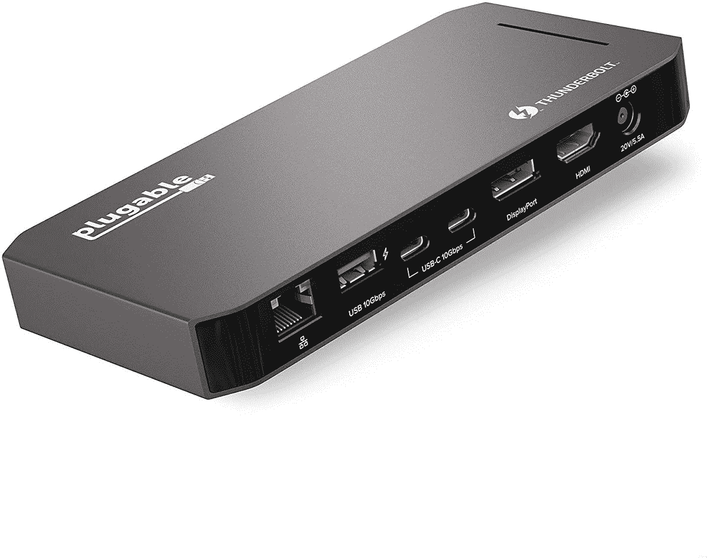
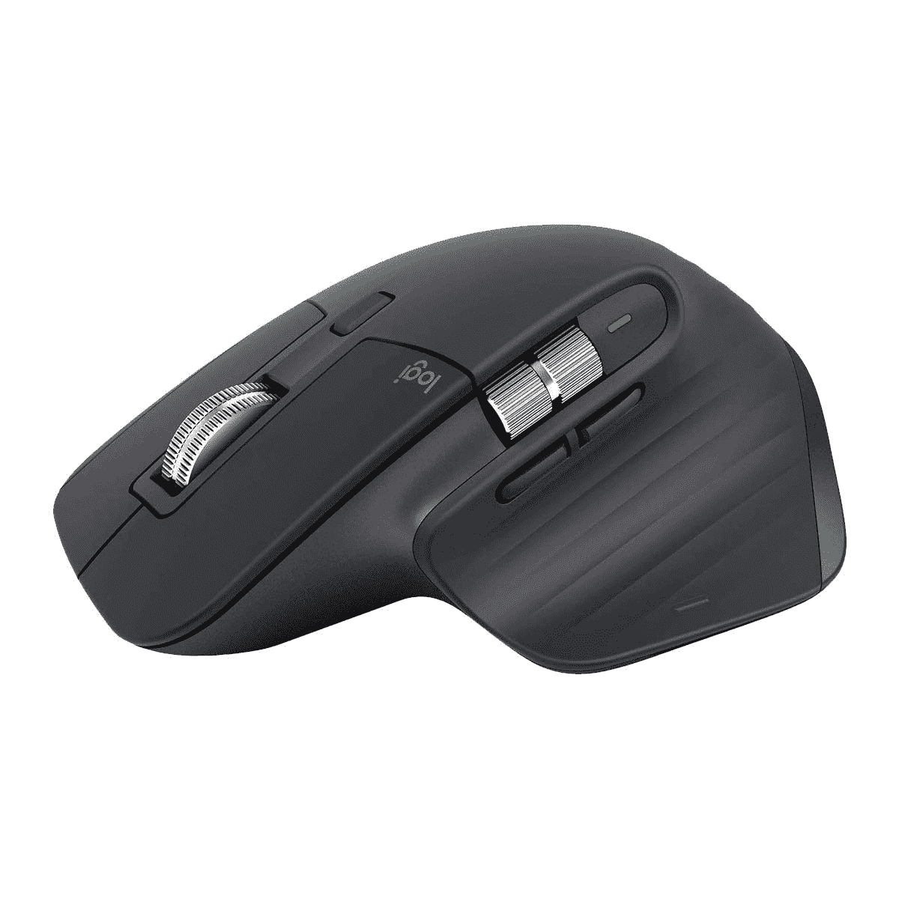
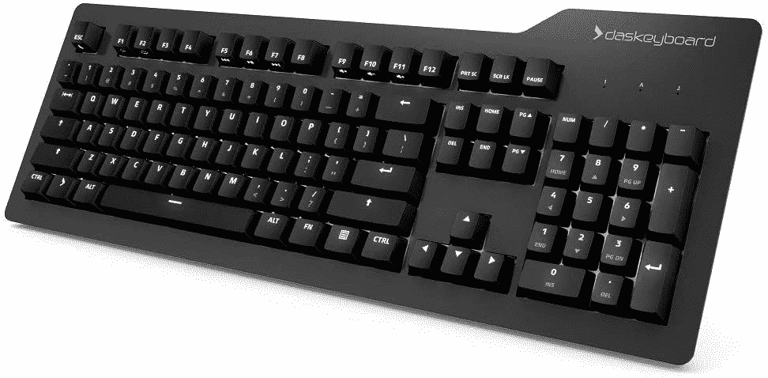

# 想在家使用戴尔 XPS 17 工作吗？这是你需要的

> 原文：<https://www.xda-developers.com/dell-xps-17-work-from-home/>

尽管我们清除了去年出现的最大障碍，但对我们许多人来说，在家工作将变得越来越普遍。但是找到在家工作的合适设置是一个挑战。您不仅需要一台能够完成任务的电脑，还需要许多能够让您的生活更加轻松的附件。就笔记本电脑而言，戴尔 XPS 17 绝对是一款动力强劲的产品，而且在许多方面，它都是一款在家办公的绝佳笔记本电脑。如果您已经购买或正在考虑购买，我们可以帮助您以符合您需求的方式进行设置。

一个好的在家办公环境可以包含许多元素。例如，第二台显示器对于提高工作效率非常有用。如果你正在进行大量的视频通话，一个高质量的网络摄像头可能也是值得的。我们将介绍一些您可能需要的东西，以获得最佳体验。

**浏览本文:**

## 霹雳坞

为了构建您的设置，您可能需要的第一件东西是 Thunderbolt dock。戴尔 XPS 17 主要依靠 Thunderbolt 4 (USB Type-C)进行连接，因此如果您打算使用大量外围设备，坞站将会有所帮助。该笔记本电脑包括一个 USB Type-C 到 Type-A 适配器，加上一个 Type-C 到 HDMI 适配器，以连接外部显示器。但是如果你需要更多，霹雳码头可以增加许多港口。

我们已经收集了您可以为戴尔 XPS 笔记本电脑获得的[最佳坞站](https://www.xda-developers.com/best-docks-dell-xps/)，但是如果我们只能推荐一个，这款可插拔的雷电 3 坞站是更好的选择之一。它包括两个显示器输出、以太网、三个 USB Type-A 端口和两个 USB Type-C 端口。您可以在设置中连接几乎任何您想要的东西。

 <picture></picture> 

Plugable Thunderbolt 3 and USB C Docking Station

##### 可插拔 TBT3-UDC3

为了充分利用您的 Dell XPS 17，这款可插拔坞站总共增加了 11 个端口，您可以使用它们来连接显示器、外围设备和有线互联网，从而尽可能轻松地在家工作。

## 戴尔 XPS 17 的第二个屏幕

如果你在家工作，你可能要考虑的另一件事是第二台显示器。作为一个长期抵制双显示器过渡的人，我不得不说我发现拥有第二块屏幕非常有用。有能力看到更多你正在做的事情可以为生产力创造奇迹。例如，您可以在一个屏幕上参考文档，而在另一个屏幕上书写。事实上，您可以使用拆分视图同时查看多个应用程序。它对视频通话也很有用。如果你不希望一个电话完全打断你的心流，但你仍然想注意，你可以把它扔在第二个屏幕上。

哪种显示器最适合你将取决于你有多少空间，以及其他因素，并且有许多很好的选择。然而，如果你喜欢多任务处理，像三星 34 英寸 S65UA 这样的超宽显示器非常好。这个特殊的单元也是一个四高清模型，更高的分辨率将让你看到更多的内容。此外，它支持 HDR，你可以通过 USB Type-C 电缆连接到显示器，所以你甚至不需要适配器。

 <picture></picture> 

Samsung S65UA

##### 三星 S65UA Ultra WQHD 显示器

有了这样的大显示器，布置办公空间就容易多了。它具有 21:9 的宽高比、WQHD 分辨率、100Hz 刷新率以及从 USB Type-C 端口传输的 90W 功率。很难要求更多。

## 一个好的网络摄像头

现在，像显示器和 Thunderbolt dock 这样的配件可能是你想要的，不管你在家庭办公室使用的是什么笔记本电脑。但是，戴尔 XPS 17 肯定需要一个网络摄像头，至少在您进行大量视频通话的情况下是如此。[戴尔 XPS 笔记本电脑上的网络摄像头是出了名的糟糕](https://www.xda-developers.com/dell-xps-webcam/)，你可能想在视频会议上展现自己最好的一面。

市面上并不缺少网络摄像头的选项，但是如果您想要尽可能高的质量，最近刚刚推出的 Dell UltraSharp 4K 网络摄像头是一个不错的选择。这款相机有一个 4K 索尼 STARVIS 传感器，针对弱光性能进行了优化，另外它支持 HDR，自动对焦和可调视野。它甚至支持 Windows Hello 面部识别，因此您不必依赖笔记本电脑的内置网络摄像头。作为一个额外的功能，它配有一个磁性隐私保护盖，所以当你不使用相机时，你可以很容易地覆盖它。这个价格可能有点贵，所以如果你想要一个更实惠的替代品，你可以随时查看我们的[最佳网络摄像头](https://www.xda-developers.com/best-webcams/)列表。

 <picture></picture> 

Dell UltraSharp 4K webcam

##### 戴尔 UltraSharp 4K 网络摄像头

Dell UltraSharp 提供了当今所有网络摄像头中最佳的图像质量。它支持多达 4K 视频，并使用索尼 STARVIS 传感器，使其适用于非常昏暗的环境以及白天。此外，它还具有智能取景、自动对焦和自动白平衡等功能。

## 整套头戴式耳机

 <picture></picture> 

Xbox Wireless Headset

如果你担心在视频通话中表现最佳，你可能也想考虑一下自己的声音。大多数笔记本电脑都有内置麦克风，但如果你在打电话，它们可能会导致一些回声问题，而且它们不如一个好的耳机好。

有很多好的耳机，但如果你想避免为高质量的体验花费太多，Xbox 无线耳机实际上是一个非常可靠的选择。游戏耳机可能体积庞大，设计有些令人讨厌，但这款 Xbox 机型有着柔和紧凑的外观，仍然提供了许多功能。麦克风具有语音隔离功能，因此没有背景噪音也能清晰地听到您的声音，此外还有自动静音功能，如果您不说话，它会关闭麦克风。您还可以通过旋转耳罩和支持立体声来轻松调节音量。如果你想要更优雅的东西，并且你有更多的预算，[索尼 WF-1000XM4](https://www.amazon.com/Sony-WF-1000XM4-Industry-Canceling-Headphones/dp/B094C4VDJZ?tag=xda-2gvql45-20&ascsubtag=UUxdaUeUpU3920&asc_refurl=https%3A%2F%2Fwww.xda-developers.com%2Fdell-xps-17-work-from-home%2F&asc_campaign=Short-Term) 是非常好的优质耳机。

 <picture></picture> 

Xbox Wireless Headset

##### 微软 Xbox 无线耳机

Xbox 无线耳机是一款功能强大但价格适中的耳机。它具有麦克风自动静音、空间声音和旋转拨号控制等功能，可以调节游戏和聊天音频之间的平衡。它也适用于个人电脑、Xbox 游戏机和手机。

## 老鼠

笔记本电脑被设计成便携式的，这就是为什么它们配有触控板而不是传统的鼠标。但是，如果您正在设置您的戴尔 XPS 17 在家中工作，合适的鼠标可能会更舒适、更高效。与触控板相比，用鼠标移动光标更容易。此外，电脑鼠标可以有额外的按钮，添加快捷方式，以改善您的工作流程。

说到鼠标，罗技的 MX Master 系列是许多人长期以来的最爱，MX Master 3 是最新和最伟大的迭代。这款鼠标采用了符合人体工程学的设计(至少对右手用户而言)，坚固的高级构造带有两个金属滚轮-一个用于食指，一个位于拇指侧边。除了常用的按钮套件，你还有三个可定制的按钮，可持续 70 天的可充电电池，以及跨设备功能等额外功能。这是你现在能买到的最好的鼠标之一，也是在家工作的绝佳选择。

 <picture></picture> 

Logitech MX Master 3

##### 罗技 MX Master 3

罗技 MX Master 3 无疑是你现在能买到的最好的鼠标之一。它有一个高级感金属轮，一个甚至可以在玻璃上工作的高端传感器，以及一个舒适的设计。它通过蓝牙或随附的加密狗无线工作。

## 机械键盘

 <picture></picture> 

Das Keyboard Prime 13

最后，你可能需要的最后一件东西是键盘，这取决于你对打字体验的重视程度。显然，Dell XPS 17 配有键盘，但如果您在家使用它工作，并且打字很重要，那么全尺寸键盘的舒适性对一些人来说几乎是必不可少的。有一样东西你在很多笔记本电脑上找不到，那就是机械键盘，很多用户更喜欢它的舒适性和驱动力。

我们已经收集了你能买到的[最佳机械键盘](https://www.xda-developers.com/best-mechanical-keyboards/)，我们选择了 [Das Keyboard 4 Professional](https://www.amazon.com/Das-Keyboard-Professional-Cherry-Mechanical/dp/B00JG01QTY?tag=xda-2gvql45-20&ascsubtag=UUxdaUeUpU3920&asc_refurl=https%3A%2F%2Fwww.xda-developers.com%2Fdell-xps-17-work-from-home%2F&asc_campaign=Short-Term) 作为我们办公室的最佳选择。然而，如果你想节省一些钱，我们实际上要推荐另一种 Das 型号，Das 键盘 Prime 13。这种型号的设计更简约，在一些媒体控制键上有所欠缺，但它明显更便宜。它仍然使用樱桃 MX 棕色开关，按键是背光的(白色)，所以你可以在昏暗的灯光下很容易看到它们。此外，键盘本身有两个 USB 端口，因此它也可以充当 USB 集线器。

 <picture></picture> 

Das Keyboard Prime 13

##### Das 键盘主要 13

Das Keyboard Prime 13 是一款实用的专业机械键盘。它采用全尺寸设计，配有樱桃色 MX 棕色开关和白色 LED 背光，有助于在黑暗的房间中提高可见度。

这应该涵盖了您想要使用 Dell XPS 17 完成在家办公设置所需的所有附件。当 Dell XPS 17 是一款昂贵的笔记本电脑时，您可能会认为需要所有这些东西是荒谬的，事实上，您可能不需要列表中的所有东西。XPS 17 实际上是一款出色的笔记本电脑，是[戴尔最好的产品之一，](https://www.xda-developers.com/best-dell-laptops/)，对许多人来说，它可能是您需要的全部。但是如果你觉得你的经历中有一部分并不尽如人意，这个列表会给你一些很好的选择来让它变得更好。

如果您还没有，可以通过下面的链接购买戴尔 XPS 17。不喜欢网购？如果你想在购买前亲眼看看，这里有一份你能在百思买找到的最好的笔记本电脑清单。

 <picture></picture> 

Dell XPS 17

##### 戴尔 XPS 17

XPS 17 是 XPS 系列中最强大的产品，在 15 英寸笔记本电脑的机身中配备了 17 英寸的大显示屏。它配备 45 瓦英特尔处理器，最高可配英伟达 70 瓦 GeForce RTX 3060。