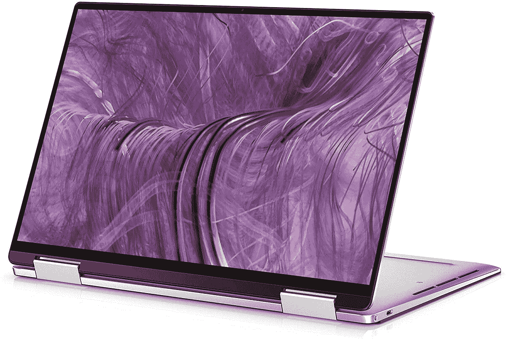

# 戴尔 XPS 9310 是一款出色的 Thunderbolt 4 笔记本电脑，堪称亚马逊的 DOTD

> 原文：<https://www.xda-developers.com/dell-xps-9310-amazon-dotd/>

你现在可能会问，“什么是 Thunderbolt 4 笔记本电脑，我为什么想要它？”。我也是一样，直到我的同事 Kunal Khullar 写了一份关于雷电 3 最好的笔记本电脑以及它们为什么这么棒的清单。基本上，如果你是一个有创造力的专业人士，一台 Thunderbolt 笔记本电脑的数据速度将使你的专业生活变得容易得多。雷电 3 在这方面很棒，但 Thunderbolt 4 是这些数据速度的最新技术，谁不想成为最佳呢？嗯，你通常会支付额外费用，但今天在亚马逊，你可以通过 Thunderbolt 4 升级在我们的雷电 3 笔记本电脑 Dell XPS 9310 上省钱！

这款二合一笔记本电脑目前在亚马逊的售价为 360 美元，这使得 1800 美元的笔记本电脑以 1440 美元的价格更加实惠。这可能看起来还是太贵了，但是这是一台非常强大的*T3 笔记本电脑。凭借英特尔酷睿 i7 第 11 代处理器、32 GB 内存和 512 GB 固态硬盘，您肯定会得到一台能够轻松完成几乎所有任务的笔记本电脑。戴尔 XPS 9310 唯一真正的缺点是它使用英特尔 Iris Xe 显卡，而不是 NVIDIA 卡，但除非你试图在笔记本电脑上玩高端游戏，否则它远远不是一个交易破坏者。*

但是，如果您想要戴尔 XPS 9310，请不要犹豫！由于这是亚马逊的当日交易，你只能在午夜前获得 1440 美元的销售价格，否则该商品将售罄。

 <picture></picture> 

Dell XPS 9310 Thunderbolt 4 laptop

##### 戴尔 XPS 13 9310

凭借 32 GB 的内存、Thunderbolt 4 和 512 GB 的固态硬盘，这是一款强大的笔记本电脑。今天仅售 360 美元！

如果您认为您不需要像戴尔 XPS 9310 那样强大的笔记本电脑，我理解您！我使用笔记本电脑，而不是台式机，所以我不需要像 9310 那样昂贵的东西。相反，看看我们的[最佳笔记本电脑综述](https://www.xda-developers.com/best-laptops/)，决定哪种类型的笔记本电脑最适合你！