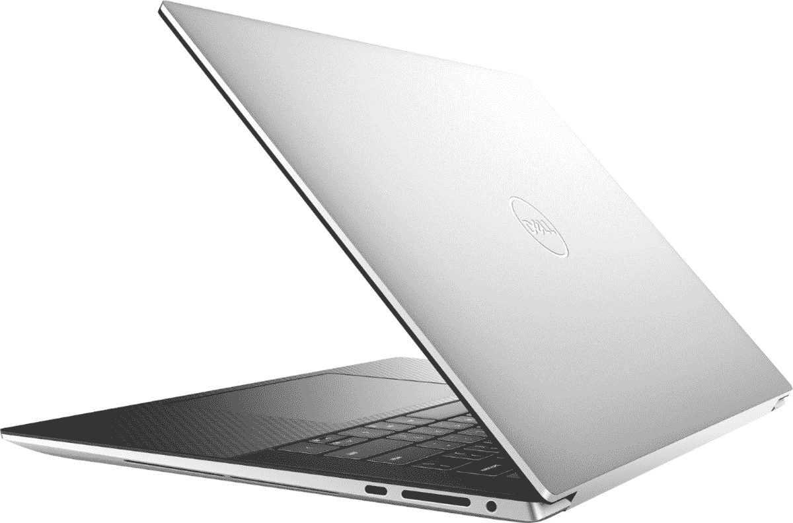

# 戴尔全新的未来派 XPS 13 Plus 今天降价 400 美元

> 原文：<https://www.xda-developers.com/dells-brand-new-futuristic-xps-13-plus-is-400-off-today/>

早在今年年初，戴尔就发布了 [XPS 13 Plus](https://www.xda-developers.com/dell-xps-13-plus/) ，它是 XPS 13 的完全重新设计和现代化版本。首先，它是首批宣布采用英特尔新的 28W P 系列处理器的产品之一，这也是它直到 5 月份才发货的原因之一。但由于 CPU 的选择，它是迄今为止最强大的 13 英寸戴尔 XPS PC。

它还有一个触觉触摸板，由 Aito 的技术驱动。与其他触觉触摸板不同，当你看它时，你甚至不会看到它周围的边框。它与掌托的其余部分完全齐平。很整洁。

另一个明显的变化是，戴尔正在放弃物理功能键，转而使用触摸键。要在 F 键和快捷键之间切换，你可以按住 Fn 键，你会看到发光指示灯发生变化。

虽然戴尔 XPS 13 Plus 有 FHD+ UHD+和有机发光二极管选项，但今天百思买销售的是有机发光二极管选项。这是 400 美元的折扣，这真的令人印象深刻，考虑到这些交易天往往更注重清理最后一代商品，而不是打折全新的产品。这两款打折机型都有酷睿 i7，但你可以花 1，449.99 美元购买 16GB 内存和 512GB 固态硬盘，也可以花 1，699.99 美元购买 32GB 内存和 1TB 固态硬盘。

 <picture></picture> 

Dell XPS 13 Plus

##### 戴尔 XPS 13 Plus

戴尔 XPS 13 Plus 是最强大的 13 英寸 XPS，它具有许多创新的新功能。

这实际上并不是全部。[戴尔 XPS 15](https://www.xda-developers.com/dell-xps-15-2022-review/) 今天降价高达 300 美元，搭载第 12 代英特尔酷睿 i9，3.5K 有机发光二极管显示屏，Nvidia GeForce RTX 3050 Ti 显卡，32GB 内存和 1TB 固态硬盘，售价 2499 美元。如果这不太适合你，还有 FHD+型号便宜 250 美元，包装相同的图形，酷睿 i7 等等。

戴尔 XPS 15 更面向需要 45 瓦 CPU 和专用显卡的创作者。它更适合视频编辑，而 XPS 13 Plus 可能适合照片编辑。不管怎样，它们都是很棒的电脑。

 <picture></picture> 

Dell XPS 15 (9520)

##### 戴尔 XPS 15

戴尔 XPS 15 配备英特尔 45W 处理器和 RTX 显卡，因此在性能上比 XPS 13 Plus 有所提升。