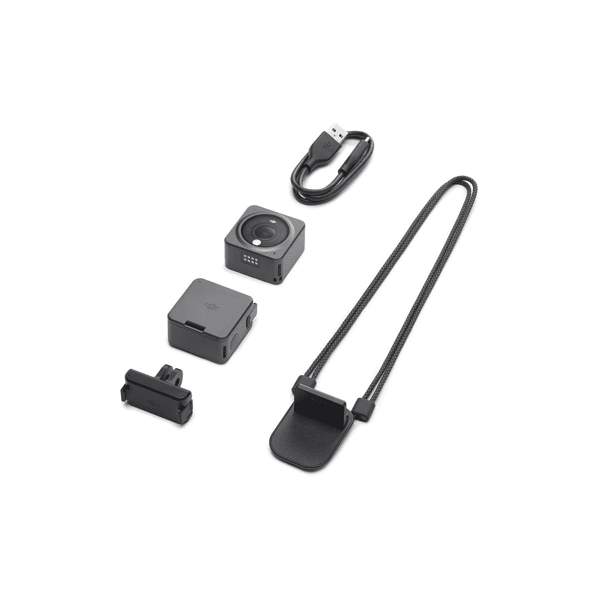

# 《DJI 行动 2》获得了总计 220 美元的巨额折扣

> 原文：<https://www.xda-developers.com/dji-action-2-receives-a-massive-discount-totaling-220/>

# 《DJI 行动 2》获得了总计 220 美元的巨额折扣

正好赶上亚马逊 Prime Day，DJI 行动 2 大打折扣。动作相机 299 美元起，极其便宜。

早在 10 月，DJI 宣布了期待已久的 Osmo 行动的后续行动，即 DJI 行动 2。虽然与它的前身相比，规格在很大程度上有所改进，但对消费者来说，有一点很不和谐，那就是它的全新设计。DJI 行动 2 分为两部分，相机模块和配件模块。附件模块可以是屏幕或电池。虽然这看起来很有利，但也有一些缺点。我们稍后会详细讨论这一点。目前，这款行动相机在亚马逊的黄金日(T1)期间有很大的折扣。

通常情况下，DJI 行动 2 的双屏组合套装零售价为 519 美元。在很大程度上，这个价格在八个月的大部分时间里保持不变。虽然价格有所下降，但这是历史上首次低于 400 美元。亚马逊 Prime Day 的当前价格有很大折扣，这笔交易比行动相机的价格低了 220 美元。也许更好的是，这次促销活动还将包括一个磁性保护套。总而言之，如果你能忍受它的局限性，这是一个很好的交易。

评论者的主要抱怨之一是相机机身仅限于 32GB 的内部存储。当然还有一个用于扩展的 microSD 卡槽，但它位于附件模块上。虽然有些人可以忍受它的缺点，但有些人可能不能。在做这笔交易之前，一定要做好调查。对于合适的人来说，这将是一个绝佳的机会。如果感兴趣，请务必点击下面的链接进行购买。你可能想快点行动，因为交易仅限于亚马逊 Prime Day 的最后一天。

 <picture></picture> 

DJI Action 2

##### DJI 行动 2

DJI 行动 2 采用模块化组件，提高了多功能性