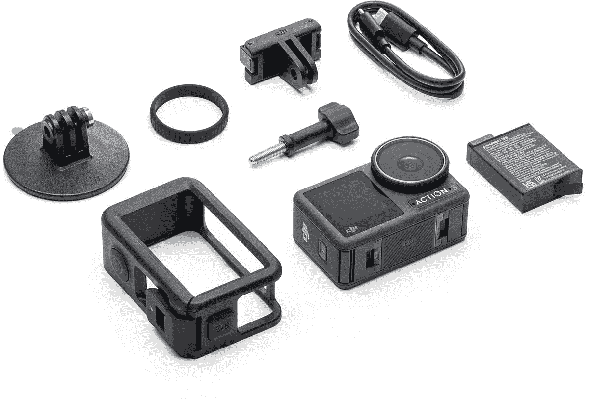

# DJI 宣布 Osmo Action 3，起价 329.99 美元

> 原文：<https://www.xda-developers.com/dji-announces-osmo-action-3/>

DJI 终于宣布了对其最初的动作相机的适当跟进，该相机在 2019 年首次亮相时曾引起轰动。Osmo Action 3 行动相机继承了第一款相机的优秀之处，增加了新功能，最重要的是，价格极具竞争力。

DJI Osmo Action 3 现在采用了一种改进的成像系统，该系统利用了 1/1.7 英寸的传感器，可以每秒 60 帧和 120 帧的速度拍摄 4K。它还有一个改进的热管理系统，允许它以每秒 60 帧的 4K 速度录制，而不会过热和关机。这是一个巨大的细节，因为 GoPro 等其他竞争对手往往会在过热问题上挣扎。它还可以处理极端的深度，在没有额外外壳的情况下可以潜到 16 米。

当然，这款相机将使用 DJI 的 RockSteady 技术，允许用户在旅途中拍摄流畅、稳定的镜头。这款新相机还将配备许多稳定选项，如 HorizonSteady，它可以消除所有角度的相机抖动，甚至不管相机的方向如何，都可以保持水平。如果你不寻求极端的稳定和图像校正，DJI 也提供了一个很好的水平平衡技术，可以校正高达 45 度的镜头中的水平倾斜。

DJI Osmo Action 3 的设计与原版相似，但做了一些急需的改进，如使用 1，770 毫安时的大电池。这种新电池被称为极限电池，允许相机拍摄长达 160 分钟的视频。这种电池还可以应对极端天气，工作温度可以低至零下 20 摄氏度或零下 4 华氏度。由于支持快速充电，电池也可以快速充满，从零到 80%只需 18 分钟，充满电不到一小时。

 <picture></picture> 

DJI Osmo Action 3

##### DJI 奥斯莫行动 3

Osmo Action 3 是来自 DJI 的最新动作相机，以优惠的价格提供了一套令人印象深刻的规格。

随着电池寿命的提高，DJI Osmo Action 3 提供了一个改进的安装系统，这是从 DJI 的另一个动作相机 Action 2 借来的。Osmo Action 3 将有一个安装系统，允许它水平和垂直夹住，利用磁性系统进行快速连接。至于定价，基本型号 Osmo Action 3 的零售价为 329 美元。DJI 还将提供一个配件包，零售价为 439 美元。您现在可以从参与的零售商处购买，也可以直接从 DJI 购买。

* * *

**来源** : [DJI](https://www.dji.com/newsroom/news/dji-unleashes-osmo-action-3-to-capture-moments-beyond-the-edge)