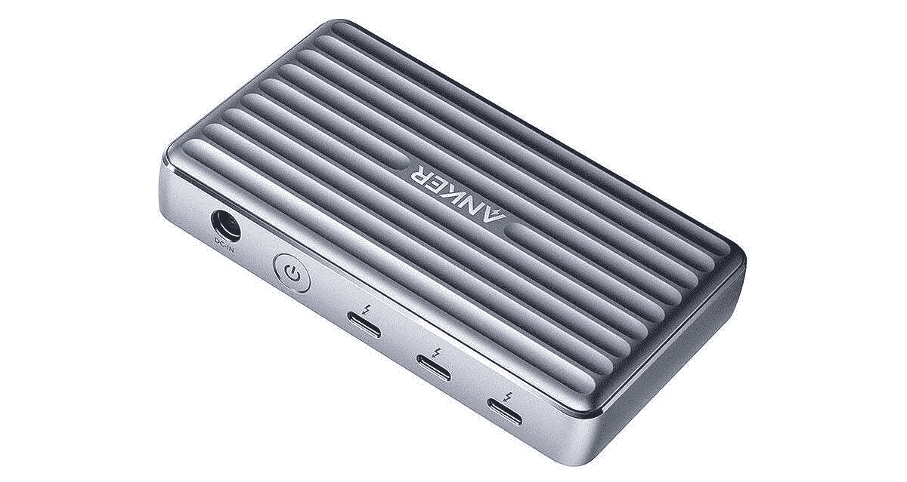

# 宏碁 Swift 3 (2022)笔记本电脑有 Thunderbolt 端口吗？

> 原文：<https://www.xda-developers.com/does-acer-swift-3-2022-have-thunderbolt/>

宏碁广受欢迎的 Swift 5 和 Swift 3 笔记本电脑已经为 2022 年更新了新的硬件。新的 Swift 5 和 Swift 3 笔记本电脑现在都采用了英特尔新的第 12 代 Alder Lake 处理器。尽管宏碁 Swift 3 是一款相对实惠的机型，但它似乎拥有所有基本功能，包括 QHD 或 FHD 触摸屏、FHD 网络摄像头等等。但有一件事很多人都想知道——新的宏碁 Swift 3 有 Thunderbolt 支持吗？

## 宏基 Swift 3 (2022) Thunderbolt 支持

嗯，这个问题的简短答案是——是的，宏碁 Swift 3 (2022)型号有 Thunderbolt 端口。事实上，新刷新的模型有两个，我们认为这是伟大的。与上一代 Swift 3 机型相比，这是一个值得注意的改进，现在更符合更昂贵的 Swift 5 笔记本电脑。这也意味着你不太可能为宏碁 Swift 3 购买 Thunderbolt 坞站。除了 Thunderbolt 端口，Swift 3 也有一套不错的端口。

## 新的 Acer Swift 3 端口

新款 [Acer Swift 3](https://www.xda-developers.com/acer-swift-3-2022) 笔记本电脑配有两个 USB Type-C 端口、两个 USB Type-A 端口、一个 HDMI 2.1 和一个 3.5 毫米音频组合插孔。两个 USB Type-C 端口都是支持 Thunderbolt 4 的 USB 3.2 Gen 2。这些端口也可用于使用 65W 充电器充电。你可以在上图中看到这些带有 Thunderbolt 标志的端口。

至于端口的布局，右侧有两个 USB Type-C 端口，以及 HDMI 2.1 和一个 USB Type-A 端口。另一个 USB Type-A 端口与 3.5 毫米组合插孔一起位于另一侧。宏基 Swift 3 的端口选择与更昂贵的 Swift 5 笔记本电脑不相上下，这很好。宏基 Swift 3 的即将推出的型号只有一个 Thunderbolt 4 端口。新的升级版增加了另一个 USB Type-C Thunderbolt 4 端口。

## 什么是 Thunderbolt 4，宏碁 Swift 3 上需要吗？

如果你不知道，Thunderbolt 4 是由英特尔开发的，它通过 USB Type-C 端口提供高带宽。它对笔记本电脑很有用，因为它允许用户连接一个 Thunderbolt dock。外部坞站允许您向笔记本电脑添加更多端口，并且它只占用机器本身的一个端口。Thunderbolt 4 可以携带显示信号和为设备充电的电源，所以只要你有一个带有必要端口的坞站，你就可以在很多事情上使用 Thunderbolt 4 端口。即使像 Anker PowerExpand 5 合 1 Thunderbolt 4 迷你坞站这样简单紧凑的 Thunderbolt 4 坞站也可以做到:

 <picture></picture> 

Anker PowerExpand 5-in-1 Thunderbolt 4 Mini Dock

##### Anker PowerExpand 5 合 1 雷电 4 迷你坞站

Anker 的一款相当紧凑的 Thunderbolt 4 坞站，可提供高达 85W 的功率输出，最大 15W 的手机充电功率，并支持 8K@30Hz 或双 4K@60Hz 显示屏。

正如我们前面提到的，Acer Swift 3 (2022)配备了相当不错的端口选择，因此没有必要购买外部坞站。如果你认为 Thunderbolt 4 dock 对你来说太贵了，那么你也可以考虑购买不同的 USB-C 适配器。不过，它们的功能和通用性远不如 Thunderbolt 4 坞站。如果你对游戏感兴趣，Thunderbolt 4 也很有用，因为它可以让你将一个[外部 GPU 外壳](https://www.xda-developers.com/best-external-gpus-for-your-laptop/)连接到你的笔记本电脑。这将是一个坚实的补充，因为集成显卡不会像独立 GPU 那样强大。有了它，当你在家时，你可以使用外部 GPU 将你的便携式商务笔记本变成一台出色的游戏机。

## 结束语

如果您有兴趣购买 Acer Swift 3，您可以使用下面的链接，尽管在 Acer 的网站上还有其他配置。否则，你可以考虑看看我们收集的[最好的宏基笔记本电脑](https://www.xda-developers.com/best-acer-laptops/)。或者，你也可以看看我们对[最佳笔记本电脑](https://www.xda-developers.com/best-laptops/)的总结，看看你是否能找到一些其他选择。

 <picture></picture> 

Acer Swift 3

##### 宏碁 Swift 3

Acer Swift 3 采用第 12 代英特尔处理器，最高配有四核高清显示屏和新的全高清网络摄像头。