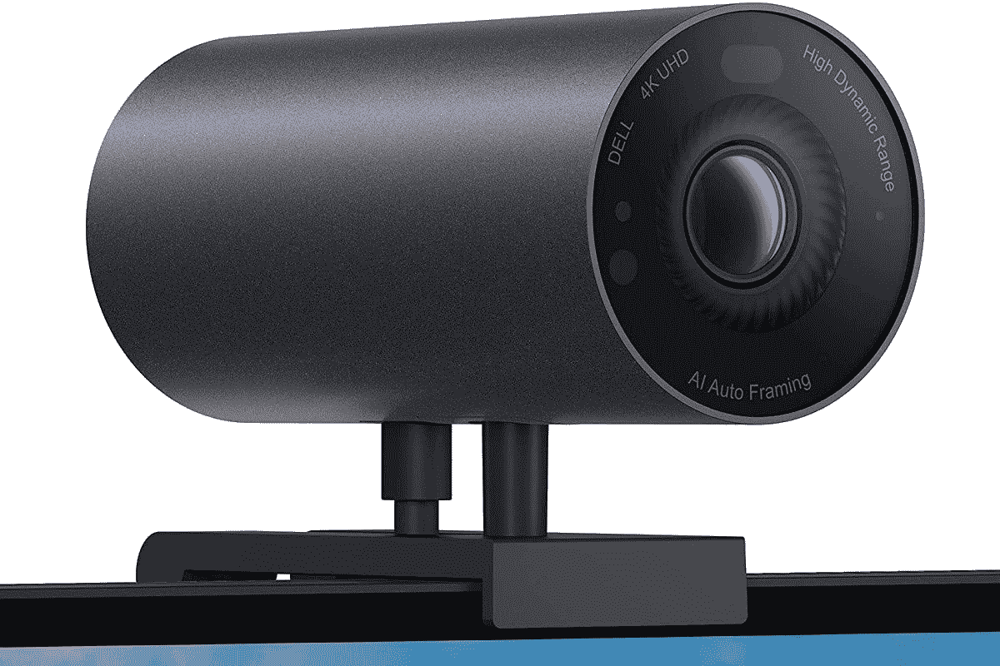

# 戴尔 Latitude 5430 有好的网络摄像头吗？

> 原文：<https://www.xda-developers.com/does-dell-latitude-5430-good-webcam/>

戴尔最近更新了其 Latitude 系列的大部分产品，其中包括 [Latitude 5430](https://www.xda-developers.com/dell-latitude-5430/) -不要与去年的 Latitude 5430 Rugged 混淆。这是戴尔最主流的[商务笔记本电脑](https://www.xda-developers.com/best-business-laptops/)，它提供了广泛的配置选项，包括第 12 代英特尔处理器、高达 64GB 的内存、2TB 的固态硬盘等等。但是，如果您想要良好的网络摄像头体验，戴尔 latitude 5430 能提供这种体验吗？嗯，是的，但是默认不包含。

Dell Latitude 5430 的基本型号仍然配备了 720p 高清摄像头，但如果您想要额外的质量，可以升级到全高清网络摄像头。如果你升级到全高清网络摄像头，你也可以自动获得对 Windows Hello 面部识别的支持，这是非常好的。

## Dell Latitude 5430 上的网络摄像头选项

正如我们提到的，Dell Latitude 5430 在其默认配置中配备了标准高清(720p)网络摄像头。这是 Windows 11 所要求的最低要求，而且在这些日子里，这一点也不美妙。然而，在笔记本电脑上看到这样的网络摄像头还是太常见了。

如果你愿意，你可以升级到带有红外传感器的全高清摄像头，用于 Windows Hello 面部识别。虽然这是可选的升级，但一些网络摄像头配置与特定的显示器选项相关联。例如，如果您想要在 Latitude 5430 上安装触摸屏，默认情况下会包括带红外功能的全高清网络摄像头。

不过，还有第三种选择，它增加了戴尔新的智能隐私功能。这包括旁观者检测功能，这意味着网络摄像头可以看到是否有人站在你身后，然后模糊屏幕，这样就没有人能看到你在做什么。另一个功能叫做“移开视线检测”，当你移开视线时，屏幕会自动变暗。这使得当你分心时，其他人更难看到你的屏幕，但它也可以节省电池，因为当你不看它时，它会使用更少的能量。

## 你需要更好的网络摄像头吗？

如果您选择 Dell latitude 5430 上的全高清网络摄像头，我们认为您可能不需要购买外部摄像头来获得可靠的体验。1080p 网络摄像头应该足以满足您的所有视频通话和会议。然而，如果您仍然想要更高的质量，或者您在购买笔记本电脑时没有想到要获得全高清网络摄像头，您可以单独购买网络摄像头。

戴尔 UltraSharp 4K 网络摄像头是您现在能买到的最好的网络摄像头之一。它有点贵，但具有像 HDR、索尼 STARVIS 4K 传感器、自动取景等功能，它真的是你能得到的最好的东西之一，你可以在下面买到它。如果你想查看更多选项，我们也有一份[最佳网络摄像头](https://www.xda-developers.com/best-webcams/)的列表。

 <picture></picture> 

Dell UltraSharp 4K Webcam

##### 戴尔 UltraSharp 4K 网络摄像头

Dell UltraSharp 4K 网络摄像头是目前市场上最好的网络摄像头之一。它有一个针对弱光优化的 4K 传感器，支持 HDR，甚至内置了 Windows Hello。

* * *

如果您感兴趣，可以通过以下链接查看戴尔 Latitude 5430。它可能不像当今市场上的一些最好的笔记本电脑那样花哨，但这是一款涵盖所有基本功能的设备，非常适合那些只想要可靠耐用的设备的用户。此外，它有各种各样的端口和可修复性，这是商用笔记本电脑所不具备的。

 <picture></picture> 

Dell Latitude 5430

##### 戴尔 Latitude 5430

Dell Latitude 5430 是一款高度可配置的商用笔记本电脑，采用第 12 代英特尔处理器和高端设计。基本型号有一个 720p 的网络摄像头，但你可以将其升级到 1080p 并添加 Windows Hello。