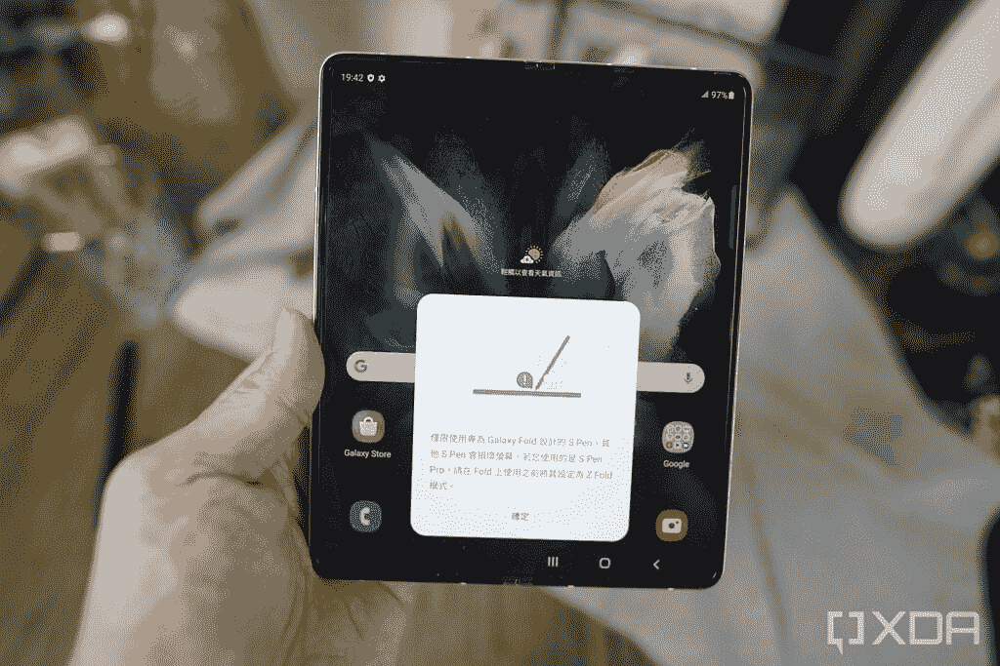

# 三星 Galaxy Z Fold 3 支持 S Pen 吗？

> 原文：<https://www.xda-developers.com/does-galaxy-z-fold-3-support-s-pen/>

三星发布了其最新的可折叠手机系列——Galaxy Z Fold 3 T1 和 T2 Galaxy Z Flip 3 T3，以及一些配件，如新的 T4 Galaxy Watch 4 T5 和 T6 Galaxy Buds 2 T7。当然，可折叠是主要亮点，因为它们本质上取代了三星多年来的强大产品 Galaxy Note 系列。这甚至是有意义的，因为 Galaxy S21 Ultra 仍然是最好的手机之一，推出一款独特的手机，如可折叠手机，将为人们提供更多选择。

\ r \ nht TPS://www . YouTube . com/watch？v=17idEjfuI9M\r\n

然而，Galaxy Note 系列有一个独特的方面，很多人似乎都喜欢它——S Pen，这是一种允许你在设备上做笔记或草图的手写笔。由于 Note 系列现在已经废弃，三星推出了两个额外的配件，如果你想在智能手机上做笔记或涂鸦，你可以使用它们。那就是 S Pen(折叠版)和 [S Pen Pro](https://www.xda-developers.com/samsung-s-pen-pro/) 。

S Pen 和 S Pen Pro 都是在 Galaxy S21 Ultra 发布时宣布的，但只有标准的 S Pen 可供购买。三星表示，S Pen Pro 将于今年晚些时候推出，现在终于见天日了。随着 Galaxy Z Fold 3 的推出，三星还推出了一款专门针对 Fold 3 的特别版标准 S Pen，这款手写笔被称为 S Pen (Fold Edition)。

要回答 Galaxy Z Fold 3 是否支持 S Pen 的问题，那么是的，它确实支持标准的 S Pen (Fold Edition)以及 S Pen Pro。如果你喜欢在手机上做笔记，喜欢涂鸦，或者你是一名从事数字艺术的艺术家，如果你拿起 Galaxy Z Fold 3，S Pen 可能是一个有用的工具。如果你有三星的其他设备，如 Galaxy Tab S7+或 Galaxy Book，购买 S Pen Pro 也将是一个明智的选择，因为它支持多种设备。

如果你想知道与 Galaxy S21 Ultra 一起推出的旧 S Pen，甚至是 Note 系列手机中的旧手写笔是否可以与 Galaxy Z Fold 3 一起使用，那么你会很失望地知道这些旧 S Pen 手写笔无法使用。Galaxy Z Fold 3 支持与那些旧设备不同的 S Pen 输入标准，S Pen Fold Edition 和 S Pen Pro 是 Galaxy Z Fold 3 上官方支持的仅有的两种触控笔。

虽然旧版本的 S Pen 可能适用于 Galaxy Z Fold 3，但 Fold Edition 和 S Pen Pro 上的 S Pen 笔尖专门用于 Galaxy Z Fold 3 的内部显示屏，因为如果施加太多压力，笔尖会缩回。使用旧版本的 S Pen 可能会损坏 Galaxy Z Fold 3 的屏幕，因为笔尖不会缩回，最终可能会刺破显示屏。如果你用的是旧的 S Pen，手机甚至会提醒你。

 <picture></picture> 

A warning saying Note 20's S Pen should not be used on Galaxy Z Fold 3

你可以阅读更多关于 S Pen Pro 的信息，或者如果你对买哪支 S Pen 感到困惑，你可以看看我们的文章[，它详细介绍了不同之处](https://www.xda-developers.com/s-pen-pro-vs-s-pen/)，根据你的具体需求告诉你哪支是最好的。如果你打算购买最新的可折叠手机，我们甚至有一份[最佳 Galaxy Z Fold 3 交易](https://www.xda-developers.com/best-galaxy-z-fold-3-deals/)的汇编，如果你已经购买了一台，你可以看看 Fold 3 的[最佳案例](https://www.xda-developers.com/best-samsung-galaxy-z-fold-3-cases/)以保护可折叠旗舰机。

 <picture></picture> 

S Pen Fold Edition

##### 三星钢笔折叠版

这是 Galaxy Z Fold 3 的标准 S Pen Fold 版。如果您打算将 S Pen 仅与 Z Fold 3 一起使用，请获取此信息。

 <picture></picture> 

Samsung S Pen Pro

##### 三星 S Pen Pro

S Pen Pro 可以让你在 Galaxy Z Fold 3 的大显示屏上做笔记和涂鸦，这使它成为 Galaxy Note 系列的完美替代品。

 <picture></picture> 

Samsung Galaxy Z Fold 3

##### 三星 Galaxy Z Fold 3

Galaxy Z Fold 3 无疑是迄今为止最好的可折叠手机之一。它有一个显示摄像头，并支持 S Pen。