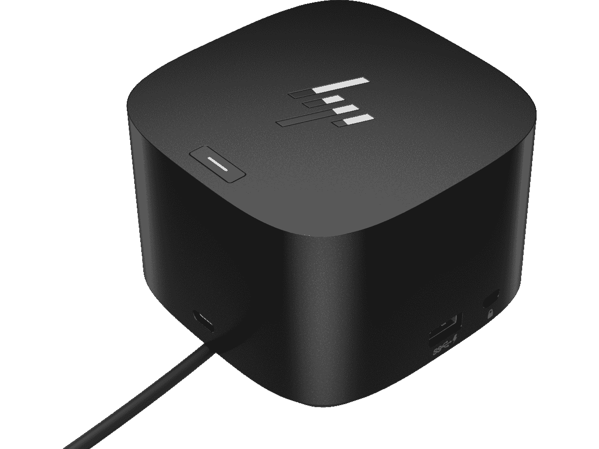

# 惠普 EliteBook 840 G9 有迅雷吗？

> 原文：<https://www.xda-developers.com/does-hp-elitebook-840-g9-have-thunderbolt/>

您可能已经遇到并正在考虑购买 HP EliteBook 840 G9，并且您可能想知道 HP EliteBook 840 G9 是否具有 Thunderbolt 端口。这个问题的答案是肯定的，笔记本电脑确实有 Thunderbolt 端口。事实上，它有 2 个雷电 4 端口，这是最新的技术。除此之外，这款笔记本电脑还有 2 个 USB-A 端口，一个 HDMI 2.0 端口，但我们在这里谈论的是 Thunderbolt。

许多流行的商用和家用笔记本电脑都带有 Thunderbolt 端口。Thunderbolt ports 不再仅仅是[高端笔记本电脑](https://www.xda-developers.com/best-laptops/)的一个功能，许多最好和最常见的笔记本电脑都将搭载该技术。我们现在来帮助解释它是什么，以及为什么它在 2022 年的笔记本电脑中如此有用。

## 什么是 Thunderbolt，它对 HP EliteBook 840 G9 有什么作用？

如果你不熟悉 Thunderbolt(尽管你可能很熟悉),它是英特尔开发的专利技术。Thunderbolt 也使用 USB- Type-C 连接器并由其提供，速度更快，比传统的 USB-A 接口承载更多的带宽。它甚至具有普通 USB-C 端口所不具备的优势。

顺便说一下，在大多数 Windows 笔记本电脑上，你通常会根据 USB-C 端口旁边的闪电标志知道笔记本电脑是 Thunderbolt 还是 USB-C。然而，情况并非总是如此，最好的例子是 MacBooks，它没有端口标签。但一般来说，如果你看到那个螺栓，那么你就知道笔记本电脑有雷电。如果没有，那就只有 USB-C 了。

更重要的是，Thunderbolt 将让你享受 PCIe 信号。这让你可以将外部 GPU 连接到你的笔记本电脑，将其变成一个更强大的机器。这可能非常昂贵，但对一些人来说，这是值得的。我们有一份关于[最佳外部 GPU 附件](https://www.xda-developers.com/best-external-gpus-for-your-laptop/)的指南，以了解更多信息。

为了更具体地说明 Thunderbolt 的其他一些好处，您还可以使用 Thunderbolt 连接坞站、显示器、存储器，甚至视频采集卡。这也是你可以用 USB-C 做的事情，但是有一个重要的注意事项使 Thunderbolt 与众不同。Thunderbolt 的不同之处在于，它最多可以支持两个 60Hz 的 4K 显示器，非常适合多显示器设置。看看我们挑选的 Thunderbolt dock，它可以让你做下面的所有事情。

 <picture></picture> 

HP Thunderbolt Dock 120W G4

##### 惠普 Thunderbolt 坞站 G4

HP Thunderbolt Dock G4 支持您扩展笔记本电脑上的端口

如果您还没有购买 HP EliteBook 840 G9，并且在我们解释了 Thunderbolt 之后，现在确信您的购买，请通过下面的链接查看。正如我们所说，这是 2022 年你能买到的最好的商用笔记本电脑之一。

 <picture></picture> 

HP EliteBook 840 G9

##### 惠普 EliteBook 840 G9

HP EliteBook 840 G9 是一款高端商务笔记本电脑，具有高端规格和简洁的设计，非常适合办公使用。它还支持 5G 或 LTE，因此您可以在任何地方工作