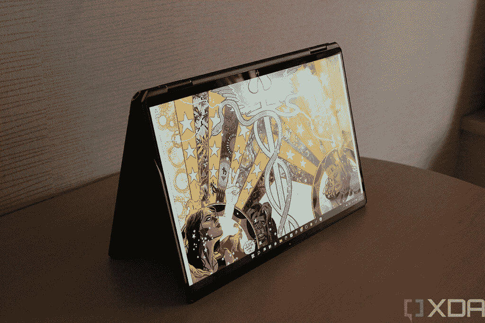

# 惠普 Spectre x360 (2022)的电池续航时间是否很长？

> 原文：<https://www.xda-developers.com/does-hp-spectre-x360-2022-good-battery-life/>

惠普更新了 2022 年的 [Spectre x360 产品线](https://www.xda-developers.com/hp-spectre-x360-2022/)，随之而来的是一些重大变化。13.5 英寸型号采用全新设计、新网络摄像头和升级处理器，而更大的 16 英寸版本则主要关注处理器升级。不过，有一点没有改变，那就是每款车型的电池，这就引出了一个问题:2022 款惠普 Spectre x360 的电池续航时间*有多长？答案有点复杂，但两者都应该给你可靠的结果。*

电池续航时间始终取决于您对笔记本电脑的使用情况，因此很难说每款笔记本电脑的实际续航时间。我们可以这样说:惠普 Spectre x360 13.5 配有 66 瓦时的电池，这对于同尺寸的笔记本电脑来说是相当大的，而 Spectre x360 16 配有 83 瓦时的电池，这也是相当大的。两者都应该会给你带来实实在在的结果，但这取决于几个因素，所以让我们看看。

## 惠普 Spectre x360 (2022)的电池续航时间

如上所述，惠普 Spectre x360 型号的电池相当大，但这并不能说明问题。惠普提供了三种电池续航时间预估:混合使用(基于 MobileMark 2018 基准)、视频播放和无线流媒体。

### Spectre x360 13.5

从较小的 13.5 英寸型号开始，惠普声称 Spectre x360 13.5 的电池续航时间长达 16 小时。对于本地视频播放，时长最长可达 19 小时 30 分钟；对于无线流媒体，时长最长可达 15 小时。

这些测量的问题在于它们总是在非常特定和理想的条件下进行。视频播放测试假定亮度水平为 150 尼特，音频通过耳机播放，以此类推。此外，这些值仅适用于特定的配置，因此根据您获得的配置，会有所不同。例如，如果你升级到 3KKOLED 面板，电池寿命会更短。

也就是说，我们可以看看对之前型号惠普 Spectre x360 14 的评估，了解电池的使用寿命。因为它仍然使用同样的显示器和处理器，结果应该不会太远。对于全高清+显示屏的型号，之前的 Spectre x360 14 被发现可以持续 8 到 12 个小时，这实际上很棒。与此同时，对于 OLED 面板来说，它在 7 个小时左右徘徊，对于如此高分辨率的屏幕来说，这仍然是个好消息。

### Spectre x360 16

至于 Spectre x360 16，惠普的说法稍微低一点——混合使用时间可达 15 小时，本地视频播放时间可达 19 小时，无线流媒体时长可达 12 小时 30 分钟。同样，这将根据您的配置而有所不同，这在此型号中尤为重要。

这是因为 HP Spectre x360 有两种截然不同的处理器配置:一种采用 28W TDP 的英特尔 P 系列处理器，另一种采用 45W TDP 的 H 系列处理器。H 系列处理器会更快地耗尽电池，所以你需要记住这一点。最重要的是，这款笔记本电脑有可选的专用显卡，将使用更多的电力，还有两个显示器选项，超高清+ OLED 面板更耗电。

 <picture></picture> 

HP Spectre x360 16

如果你看一下我们对去年的 Spectre x360 16 的[评测，](https://www.xda-developers.com/hp-spectre-x360-16-review/)你会发现，在现实生活中，它在充电后持续了大约五个小时。这是 OLED 面板和专用显卡，对于这种配置，它实际上是一个坚实的结果。如果您选择不使用专用的英特尔 Arc A370M 显卡，而是坚持使用标准显示器，您将获得更好的效果。但还有另一个因素——去年，这款笔记本电脑使用了 35W 处理器，今年的型号没有这个选项。使用 45W 处理器可能会延长电池寿命。28W 型号应该能让你获得更好的电池寿命，但在撰写本文时还没有这种型号。

* * *

关于 HP Spectre x360 2022 型号的电池续航时间，您需要了解的就是这些。虽然我们还没有机会测试新的模型，但去年的模型应该会给我们一个很好的估计。

如果这已经说服你购买这些笔记本电脑，你可以在下面找到它们。它们本身都是出色的设备，拥有顶级的设计和顶级规格的制造质量。它们可能是你今天能买到的[最好的惠普笔记本电脑](https://www.xda-developers.com/best-hp-laptops/)，但是如果你想看看其他选择，我们也有一份[最好的笔记本电脑](https://www.xda-developers.com/best-laptops/)的列表。

 <picture></picture> 

HP Spectre x360 13.5

##### 惠普 Spectre x360 13.5

2022 HP Spectre x360 13.5 采用 3:2 显示屏、第 12 代英特尔 U 系列处理器和高端设计。它还有一块 66 瓦时的电池，可以支持你一整天，没有任何问题。

 <picture></picture> 

HP Spectre x360 16

##### 惠普 Spectre x360 16 (2022)

HP Spectre x360 配备了 16:10 的大显示屏、第 12 代英特尔处理器和其他强大的规格。这包括一个 83 瓦时的电池，承诺长达 19 小时的电池寿命。