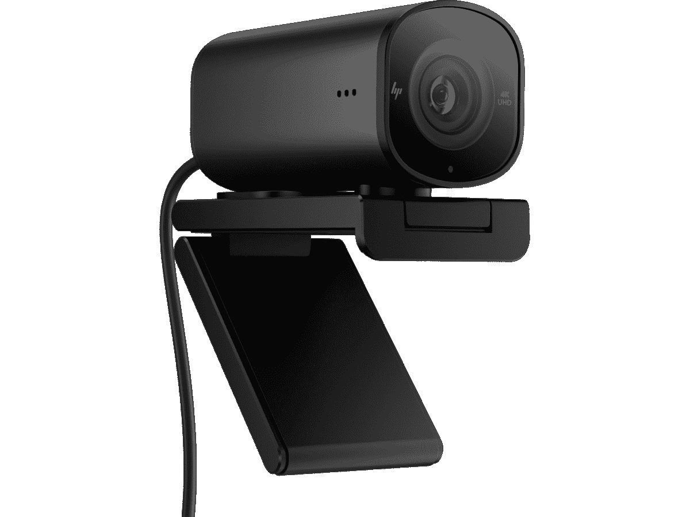

# 联想 ThinkPad X1 Extreme Gen 5 的网络摄像头好吗？

> 原文：<https://www.xda-developers.com/does-lenovo-thinkpad-x1-extreme-gen-5-have-good-webcam/>

购买笔记本电脑有许多因素，从性能到设计和显示屏。但有一个因素在过去几年变得尤为重要，那就是网络摄像头。随着远程和混合工作变得越来越普遍，如果您想在会议和视频通话中保持最佳状态，一个好的网络摄像头非常重要。联想 ThinkPad X1 Extreme Gen 5 是一款如此昂贵的笔记本电脑，你可能会希望它有一个好的网络摄像头，谢天谢地，它确实有。

从一开始，联想 ThinkPad X1 Extreme 就配备了 1080p 网络摄像头，还支持 Windows Hello 面部识别。这应该会让你的通话视频质量非常好，但值得注意的是，这是一个混合传感器。用于 Windows Hello 的常规摄像头和红外摄像头合二为一，这有时会导致图像质量稍差。不过，这是一个全高清网络摄像头，应该比大多数更好。也没有其他选项可用，所以无论您的配置如何，您都会获得非常好的体验。

有更好的网络摄像头的笔记本电脑，但坦率地说，大多数都比不上 ThinkPad X1 Extreme 的性能。网络摄像头通常不是注重性能的笔记本电脑的首选，所以这是一个非常可靠的选择。

## 联想 ThinkPad X1 Extreme 需要更好的网络摄像头吗？

虽然我们会说 ThinkPad X1 Extreme 上的摄像头对大多数人来说已经足够好了。你可能需要更好的东西。如果你经常在光线较暗的环境中或背后有非常明亮的背景，图像质量可能会受到影响，而更好的网络摄像头可以帮助弥补这一点。惠普 965 流媒体网络摄像头是最好的选择之一，这是一款 4K 网络摄像头，配有索尼 STARVIS 传感器，针对弱光进行了优化。

 <picture></picture> 

HP 965 Streaming Webcam

##### 惠普 965 流媒体网络摄像头

HP 965 流媒体网络摄像头具有高分辨率的 800 万像素传感器，支持 4K 视频，并针对弱光场景进行了优化。

还有许多其他伟大的网络摄像头，其中一些可能在技术上更好，但它们可能会变得更加昂贵。例如，我们已经评论了 [Insta360 Link](https://www.xda-developers.com/insta360-link-review/) ，这对于主持人来说是一款很棒的相机，但它价格昂贵，你可能不需要它提供的所有功能。

* * *

这就是联想 ThinkPad X1 Extreme 的网络摄像头的全部情况。同样，默认情况下，您会获得稳定的体验，但您可以购买外部网络摄像头来改善体验。如果你想要一个更好的相机，并且不在乎 ThinkPad X1 Extreme 的高端性能，你可能会在我们的[最佳 1080p 网络摄像头笔记本电脑列表](https://www.xda-developers.com/best-laptops-1080p-webcam/)中找到更好的选择。具体来说，惠普一直在 2022 年推出带有一些出色网络摄像头的笔记本电脑。

否则，您可以使用下面的链接购买联想 ThinkPad X1 Extreme。如果你正在寻找一些不同的东西，你也可以看看[最好的联想 ThinkPad](https://www.xda-developers.com/best-thinkpads/)，或者检查一下[最好的笔记本电脑](https://www.xda-developers.com/best-laptops/)。今天你能买到的许多笔记本电脑都有 1080p 网络摄像头。