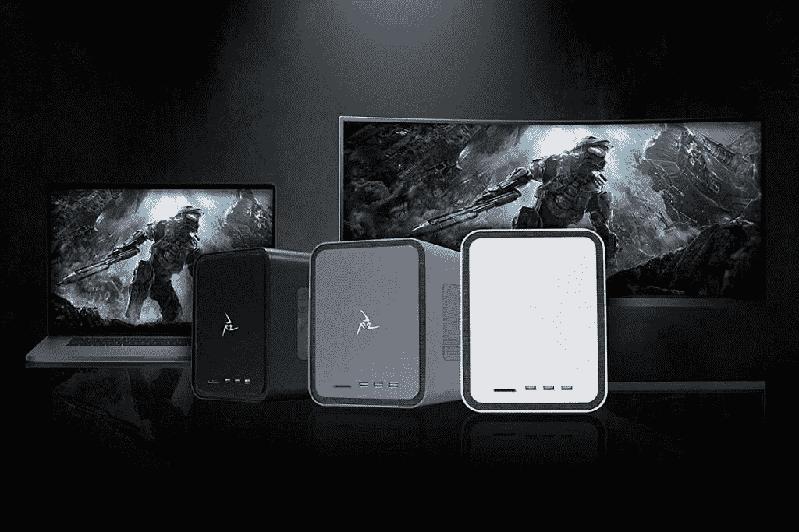

# 联想 ThinkPad X1 Yoga Gen 7 有迅雷吗？

> 原文：<https://www.xda-developers.com/does-lenovo-thinkpad-x1-yoga-gen-7-have-thunderbolt/>

联想的 ThinkPad 系列拥有一些你能买到的最好的商用笔记本电脑。在这一系列产品中，[联想 ThinkPad X1 Yoga Gen 7](https://www.xda-developers.com/lenovo-thinkpad-x1-yoga-gen-7/) 是你能找到的最佳选择之一，尤其是如果你真的想要一辆敞篷车的话。X1 Yoga 的最新版本配备了英特尔第 12 代 P 系列处理器，具有更高的 28W TDP，此外它还具有出色的显示屏、改进的网络摄像头等。而且，如果你是那种依赖 Thunderbolt 连接的用户，是的，联想 ThinkPad X1 Yoga 也支持它。

具体来说，这款敞篷车配有两个 Thunderbolt 4 端口，为您提供了极大扩展笔记本电脑连接的空间。但是如果你不确定为什么你不需要 Thunderbolt，我们可以帮助你。

## Thunderbolt 在 ThinkPad X1 Yoga 上能做什么？

Thunderbolt 是由英特尔开发和维护的连接协议，最新的迭代- Thunderbolt 4 -使用了 USB Type-C 连接器。Thunderbolt 极大地扩展了标准 USB Type-C 的功能，提供高达 40Gbps 的带宽(尽管 USB4 也可以支持这些速度)，包括驱动外部显示器和供电的能力。另外，Thunderbolt 最值得一提的特性之一是 PCIe 信号能力。

PCIe 是主板用来连接计算机内部组件的接口，但通过 Thunderbolt 端口，你可以将这种连接扩展到外部设备——具体来说，就是一个[外部 GPU](https://www.xda-developers.com/best-external-gpus-for-your-laptop/) 。这意味着您可以为轻薄的笔记本电脑(如 ThinkPad X1 Yoga)添加更多的 GPU 功能，因此它可以用于游戏等要求苛刻的任务。

 <picture></picture> 

A Manriz Saturn Pro II external GPU

当然，这还不是全部。由于其非常高的带宽，Thunderbolt 也非常常用于扩展坞或码头。使用 Thunderbolt 的坞站可以为您的笔记本电脑添加多个高速端口，包括 USB、HDMI 或 DisplayPort 输出，甚至更多 Thunderbolt 下游连接。联想 ThinkPad X1 Yoga 已经有稳定的现成端口供应，但使用 Thunderbolt dock，您可以使用一根电缆将多个外围设备连接到您的笔记本电脑。如果您有一个连接笔记本电脑的复杂桌面设置，这是一个理想的选择，因此您不必每次将笔记本电脑放在桌面上时都逐个连接外围设备。

有很多种 Thunderbolt 坞站，它们都能满足不同类型的需求。个人最喜欢的是 Anker 777，它有许多 USB 端口、千兆以太网和两个用于外部显示器的 HDMI 端口。

 <picture></picture> 

Anker 777 Thunderbolt 4 Dock

##### Anker 777 雷电坞站

Anker 777 是一款高级 Thunderbolt 坞站，配有金属机箱和各种外设端口。

当然，这并不是说您的设置一定需要 Thunderbolt。除了 Thunderbolt 之外，联想 ThinkPad X1 Yoga 还有非常稳定的端口供应，包括两个 USB Type-A 端口、HDMI、3.5 毫米耳机插孔和一个可选的 nano-SIM 卡插槽(如果你添加 LTE 或 5G 连接)。很有可能你不需要更多，但如果你需要，Thunderbolt docks 是一个获得更多端口和简化设置的好方法。

* * *

如果你还没有，你可以使用下面的链接购买联想 ThinkPad X1 Yoga Gen 7。这不仅仅是 2022 年最好的商务笔记本电脑之一，它很可能是你现在就能买到的最好的笔记本电脑之一。

 <picture></picture> 

Lenovo ThinkPad X1 Yoga Gen 7

##### 联想 ThinkPad X1 Yoga Gen 7

联想 ThinkPad X1 Yoga Gen 7 是一款功能强大的敞篷电脑，采用第 12 代英特尔处理器，最高可配超高清+有机发光二极管显示屏。它还提供广泛的连接，包括两个用于高速外设的 Thunderbolt 4 端口。