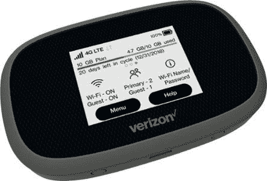

# MacBook Pro 13 (2022)有 5G 吗？

> 原文：<https://www.xda-developers.com/does-macbook-pro-13-2022-have-5g/>

苹果的 MacBook Pro 13 (2022)型号[可预购](https://www.xda-developers.com/preorder-macbook-pro-m2-this-week/)，定于 6 月 24 日发布。尽管拥有[老款 MacBook Pro](https://www.xda-developers.com/macbook-pro-2021/) 的外观，但内部都是新的，利用了苹果最近宣布的 M2 SoC。随着最新的更新，你可能会想知道苹果公司是否终于在其笔记本电脑上添加了 5G 功能？可悲的是，即使在 2022 年，它也没有在其 MacBook Pro 13 (2022)中添加任何形式的蜂窝连接。

## 为什么蜂窝连接很重要？

能够随时随地在线连接是改变游戏规则的。随着蜂窝网络的发展，速度和带宽都有所提高，使得在旅途中使用笔记本电脑或其他高带宽设备变得可行。尤其是现在 [5G 网络](https://www.xda-developers.com/5g/)正变得更加主流，但是，即使你无法接入 5G，4G LTE 仍然绰绰有余。

当然，有大量的公共 Wi-Fi 网络，但当谈到质量和安全时，它真的是一个鱼龙混杂。还有共享连接的问题，导致不太理想的体验。公共 Wi-Fi 上也可能有限制，限制你的浏览行为或下载活动。当使用蜂窝连接时，这是完全相反的体验。这种连接是私有的、安全的，并且没有任何限制。

为了获得良好的手机使用体验，您需要拥有良好的信号。这可能因运营商和地区而异。但是在大多数主要城市，应该有好到大的覆盖面。此外，你可以查看大多数主要运营商的网站，看看你需要的地区是否被覆盖。可悲的是，尽管有蜂窝连接的所有好处，苹果公司从未在其任何一款手机上提供这项技术

[computing products](https://www.xda-developers.com/best-macs/)

。然而，苹果并没有完全忽视这项技术，因为它已经并将继续通过其 iPad 系列支持蜂窝模式。最新的 iPad Pro、iPad Air、iPad Mini 都可以通过 5G 连接互联网。很明显，苹果确实看到了好处，但谁也说不准该公司何时会在其 Mac 电脑上引入这项技术。

## 有哪些替代原生蜂窝连接的方法？

由于 MacBook Pro 13 (2022)本身不提供 5G 或 4G LTE 连接，你必须寻找替代资源来获得该功能。最常见的选择之一是使用你已经拥有的东西——你的智能手机。如果你有一部现代智能手机，不管是 Android 还是 iOS，它都有可能使用自己的蜂窝服务创建一个无线热点。你可以将你的笔记本电脑或其他设备连接到这个网络，这样既快又安全。这可能是最方便的选择，因为你不必购买额外的设备，但也有缺点。

这种方法的主要问题是，与正常使用相比，手机会经历额外的磨损和电池寿命的大幅下降。第二，你可能无法最大限度地利用你的数据，因为大多数手机套餐在与其他设备共享时都有限制。最后一个缺点是速度可能不如使用专用设备。但是，幸运的是，这个问题有一个解决方案。无线蜂窝热点。

 <picture></picture> 

Mobile Cellular Hotspots

##### 简单移动 Moxee 4G 移动热点

移动热点可以在旅途中提供蜂窝互联网服务。

热点是一种专用的蜂窝设备，旨在用作无线集线器。热点通常会提供更长的电池寿命和更高的数据上限，这意味着你可以更长时间、更频繁地使用互联网。这款设备很可能会为设备提供更好的支持，使更多产品连接到这款设备成为可能。连接也将是安全的。主要的缺点是你将不得不购买一个移动热点。令人欣慰的是，有各种各样的设备可供选择，有些低至 19.99 美元。

当您没有本地蜂窝连接时，最后也是最明显的在线连接方式是通过公共 Wi-Fi 网络。这将是一种漫无目的的情况，而且很可能永远不会是一个安全的选择。也就是说，如果你能找到一个提供免费 Wi-Fi 服务的固定地点，那可能是一个不错的选择。很自然，你将无法通过互联网旅行，但你可能不必这样做。如果你选择在公共 Wi-FI 上冲浪，确保你的 Mac 电脑是最新的。您可以通过使用 [VPN](https://www.xda-developers.com/best-vpn/) 来进一步保护自己。

 <picture></picture> 

Apple MacBook Pro M2

##### 苹果 MacBook Pro 13 英寸(2022)

由 M2 SoC 驱动的最新苹果 MacBook Pro 13 (2022)。

没有什么比本地蜂窝连接更好的了，但是尽管提出的解决方案并不理想，但这是目前必须要做的事情。尽管苹果没有在其 Mac 产品线中提供蜂窝技术，但有报道称该公司将在 2024 年的某个时候开始包括蜂窝技术。