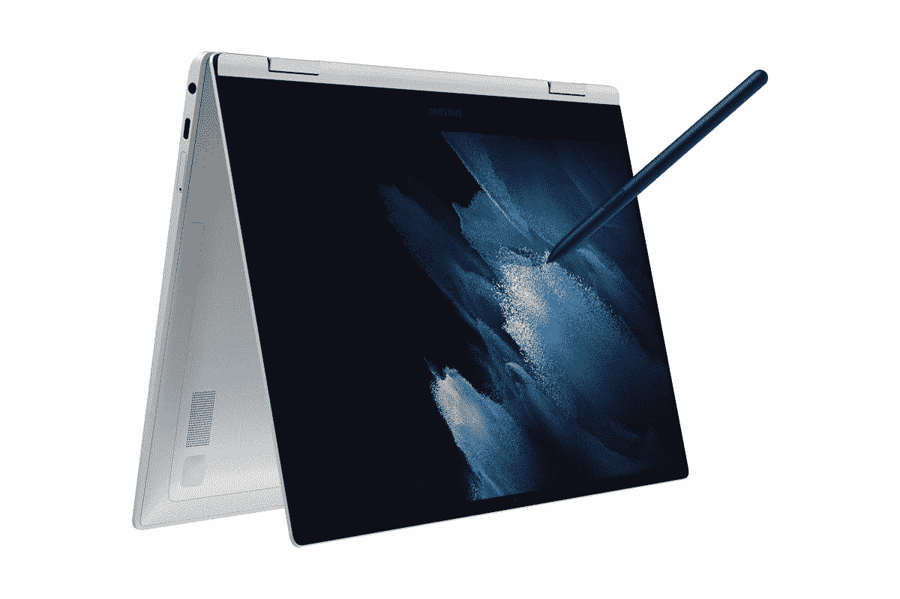

# 三星 Galaxy Book 2 Pro 支持 5G 吗？

> 原文：<https://www.xda-developers.com/does-samsung-galaxy-book-2-pro-5g/>

三星最近宣布了 Windows 笔记本电脑的 Galaxy Book 2 Pro 系列，并进行一些改进，特别是升级到英特尔的第 12 代 P 系列处理器。去年我们是 Galaxy Book Pro 360 5G 的忠实粉丝，但 Galaxy Book Pro 2 也有 5G 支持吗？嗯，是和不是，取决于你在哪里和你想要的尺寸。

根据三星的说法，Galaxy Book Pro 2 具有一些支持 5G 的配置，但仅在 15.6 英寸的型号中，并且仅在某些市场中。不幸的是，这些市场不包括美国。至于 Galaxy Book 2 Pro 360，看起来并不是任何配置都支持 5G。考虑到去年只有 360 型号拥有 5G，这很奇怪，但这次似乎相反。

## 一些 Galaxy Book 型号仍然有 5G

如果你需要一台 5G 连接的笔记本电脑，并且你是三星设备的忠实粉丝，三星仍然有一些选项可供你选择。你仍然可以购买去年的 Galaxy Book Pro 360 5G，正如你在我们的评论中看到的那样，这是一款非常棒的设备。如果你不需要超级优质的规格，还有三星 Galaxy Book Go 5G，这是一款 Arm 供电的笔记本电脑，也支持 5G。它由高通骁龙 8cx Gen 2 驱动，所以它仍然是一个可靠的体验。它们是你今天能买到的[最好的三星笔记本电脑](https://www.xda-developers.com/best-samsung-galaxy-laptops/)。

 <picture></picture> 

Samsung Galaxy Book Pro 360 5G

##### 三星 Galaxy Book Pro 360 5G

三星 Galaxy Book Pro 360 5G 拥有第 11 代英特尔酷睿 i5 处理器和全高清 AMOLED 显示屏，以及优质的轻量级设计。

 <picture></picture> 

Samsung Galaxy Book Go 5G

##### 三星 Galaxy Book Go 5G

三星 Galaxy Book Go 5G 由高通骁龙 8cx Gen 2 驱动，是目前最好的 Windows 笔记本电脑之一。

如果你不需要 5G 速度，三星也有 [Galaxy Book 2 Business](https://www.xda-developers.com/samsung-galaxy-book-2-business/) ，这是一款专门为商业用户打造的机型。这款笔记本电脑支持 LTE...只要你在欧洲。事实上，三星今年似乎没有兴趣为美国消费者提供新的手机功能选项。如果你觉得有价值，你需要坚持去年的模式。

三星当然有可能在今年晚些时候推出 5G 版本的新笔记本电脑，但迄今为止，这还没有被提及。

* * *

如果你还想买没有 5G 的 Galaxy Book 2 Pro，你可以在下面买，不管那是翻盖式还是敞篷式。如果你确实想要一台支持 5G 的笔记本电脑，请查看我们的最佳 5G 笔记本电脑综述。否则，你可以看看[最好的笔记本电脑](https://www.xda-developers.com/best-laptops/)，看看还有什么。

 <picture></picture> 

Samsung Galaxy Book 2 Pro

##### 三星 Galaxy Book 2 Pro

三星 Galaxy Book 2 Pro 是一款非常轻薄的笔记本电脑，但它仍然配备了第 12 代英特尔处理器。

 <picture></picture> 

Samsung Galaxy Book 2 Pro 360

##### 三星 Galaxy Book 2 Pro 360

三星 Galaxy Book 2 Pro 360 是一款非常轻薄的可转换产品，但它仍然配备了强大的第 12 代英特尔处理器和令人惊叹的 AMOLED 显示屏。